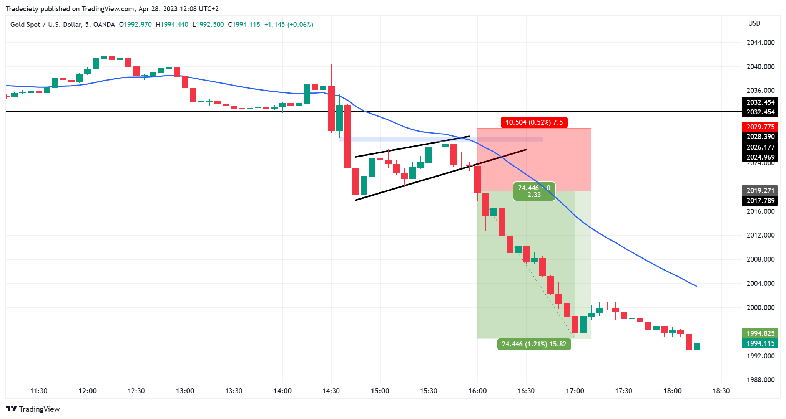

## Table of Contents

## What are forex time frames and why are they important?

Forex time frames are different lengths of time that traders use to look at price charts. They can be as short as a minute or as long as a month. Common time frames include 1-minute, 5-minute, 1-hour, 4-hour, and daily charts. Each time frame shows how prices have moved over that period of time. Traders pick a time frame based on how long they want to keep their trades open. Short time frames are good for quick trades, while longer time frames are better for trades that last days or weeks.

Time frames are important because they help traders see different patterns and trends in the market. A short time frame might show quick ups and downs, while a longer time frame can show bigger trends that last for days or weeks. By looking at different time frames, traders can make better decisions about when to buy or sell. For example, a trader might use a short time frame to find the best time to enter a trade, but a longer time frame to see the overall direction of the market. This way, they can match their trading style and goals with the right time frame.

## How can trading across multiple time frames improve my trading strategy?

Trading across multiple time frames can really help you make better trading choices. When you look at different time frames, you get a fuller picture of what's happening in the market. For example, you might use a longer time frame, like a daily chart, to see the big trends. Then, you can use a shorter time frame, like a 1-hour chart, to find the best time to enter or exit a trade. This way, you can make sure your trades are in line with the bigger trend while also taking advantage of smaller price movements.

Using multiple time frames also helps you manage risk better. By looking at a longer time frame, you can set your stop-loss and take-profit levels more accurately. This means you can protect your money better and aim for bigger profits. Plus, seeing the market from different angles can give you more confidence in your trading decisions. You'll feel more sure about when to trade and when to wait, which can lead to more successful trades over time.

## What are the most common time frames used in forex trading?

In forex trading, the most common time frames are the 1-minute, 5-minute, 15-minute, 1-hour, 4-hour, and daily charts. These time frames help traders see how prices move over different periods. Short time frames like 1-minute and 5-minute charts are good for quick trades that last a few minutes or hours. Traders who like to make fast decisions and take advantage of small price changes often use these.

On the other hand, longer time frames like the 1-hour, 4-hour, and daily charts are used for trades that last longer, from a few hours to several days or even weeks. These time frames help traders see bigger trends and make more informed decisions about when to buy or sell. Many traders use a mix of short and long time frames to get a better understanding of the market and improve their trading strategy.

## How do I identify trends using different time frames?

To identify trends using different time frames, start by looking at a longer time frame like the daily chart. This will show you the big picture of where the market is going. If you see the price going up over several days, that's an uptrend. If it's going down, that's a downtrend. Once you know the big trend, you can use a shorter time frame like the 1-hour chart to find the best times to enter or exit your trades. For example, if the daily chart shows an uptrend, you can look at the 1-hour chart to find times when the price dips a bit before going up again. That could be a good time to buy.

Using multiple time frames helps you see both the big trends and the smaller price movements. Imagine you're looking at a map. The daily chart is like looking at the whole country to see which way the road goes. The 1-hour chart is like zooming in on a smaller part of the map to find the best route. By combining these views, you can make better trading decisions. You'll know if you're going with the big trend and also find the best spots to start your journey.

## What is the best way to synchronize entry and exit points across multiple time frames?

To synchronize entry and exit points across multiple time frames, start by looking at the longest time frame you're using, like the daily chart. This will show you the big trend. If the trend is up, you want to find times to buy. If it's down, you want to find times to sell. Once you know the big trend, move to a shorter time frame, like the 4-hour or 1-hour chart. Look for times when the price on the shorter time frame is moving in the same direction as the big trend. For example, if the daily chart shows an uptrend, wait for the 1-hour chart to show a small dip before it starts going up again. That could be a good time to buy.

After you've entered a trade, use the shorter time frame to watch for signs that it's time to exit. If you're in an uptrend and the price on the 1-hour chart starts to go down a lot, that might be a sign to sell and take your profit. Always keep an eye on the longer time frame to make sure the big trend hasn't changed. If it does change, be ready to exit your trade quickly. By using both long and short time frames, you can make sure your entry and exit points line up with the overall market direction, helping you make better trading decisions.

## How can I use higher time frames to set long-term goals and lower time frames for entry points?

Using higher time frames like the daily or weekly chart helps you see the big picture and set long-term goals. For example, if you see the price going up over many days or weeks, you might decide to aim for a long-term trade that follows this uptrend. By looking at these longer time frames, you can plan your trades to match the overall direction of the market. This way, you're more likely to make money over time because you're going with the flow of the market, not against it.

Once you've set your long-term goals using the higher time frames, you can use lower time frames like the 1-hour or 4-hour chart to find the best times to enter your trades. For instance, if the daily chart shows an uptrend, you can look at the 1-hour chart to find a good entry point, like when the price dips a bit before going up again. This helps you get into the trade at a better price, increasing your chances of making a profit. By combining the big picture from the higher time frames with the detailed view from the lower time frames, you can make smarter trading decisions that align with your long-term goals.

## What are the potential pitfalls of trading across multiple time frames and how can I avoid them?

Trading across multiple time frames can be tricky. One big problem is that it can be hard to keep track of all the different charts. You might get confused about which time frame is showing what, and this can lead to bad decisions. Another pitfall is that you might focus too much on the short time frames and miss the big picture. This can make you miss out on big trends that could make you more money. Also, you might end up trading too much because you see so many signals on the short time frames, which can lead to more losses.

To avoid these problems, start by picking a main time frame that fits your trading style and goals. If you're in it for the long haul, focus on the daily or weekly charts first. Then, use the shorter time frames to fine-tune your entry and exit points. It's also a good idea to keep things simple and not watch too many time frames at once. Stick to two or three that work well together. Lastly, always check back with your main time frame to make sure your trades still line up with the big trend. By staying organized and keeping the big picture in mind, you can make better trading choices and avoid common mistakes.

## How do I manage risk when trading across different time frames?

Managing risk when trading across different time frames starts with understanding the big trend on the longer time frame, like the daily chart. This helps you set your stop-loss and take-profit levels in a way that matches the overall direction of the market. If the daily chart shows an uptrend, you can set your stop-loss below a recent low to protect your money if the trend changes. Your take-profit can be set at a level that makes sense with the big trend, helping you aim for bigger profits while keeping your risk under control.

Using shorter time frames, like the 1-hour chart, can also help you manage risk better. You can use these charts to find the best times to enter and exit your trades, which can reduce your risk of losing money. For example, if you see a good entry point on the 1-hour chart that lines up with the uptrend on the daily chart, you can enter the trade with more confidence. Always keep an eye on both time frames to make sure your trades are still in line with the big trend, and be ready to adjust your stop-loss and take-profit levels if the market changes.

## Can you explain how to use moving averages on multiple time frames to confirm trends?

Using moving averages on multiple time frames can help you see if a trend is strong and likely to keep going. Start by looking at a longer time frame, like the daily chart. On this chart, you can use a longer moving average, like a 50-day or 200-day moving average. If the price is above the moving average and the moving average is going up, that's a sign of a strong uptrend. If the price is below the moving average and it's going down, that's a sign of a strong downtrend. This big picture helps you know the overall direction of the market.

Next, you can use a shorter time frame, like the 1-hour chart, to find the best times to enter or exit your trades. On this chart, use a shorter moving average, like a 20-period or 50-period moving average. If the shorter moving average on the 1-hour chart is also moving in the same direction as the longer moving average on the daily chart, that's a good sign that the trend is still strong. For example, if both the daily and 1-hour moving averages are going up, you can feel more confident about entering a long trade. By using moving averages on both time frames, you can confirm the trend and make better trading decisions.

## What advanced techniques can I use to analyze price action across multiple time frames?

To analyze price action across multiple time frames, you can use a technique called "top-down analysis." Start by looking at the highest time frame, like the weekly or daily chart, to see the big trend. If the price is making higher highs and higher lows, that's an uptrend. If it's making lower highs and lower lows, that's a downtrend. Once you know the big trend, move to a lower time frame, like the 4-hour or 1-hour chart, to find good entry and exit points. Look for patterns like support and resistance levels, or candlestick patterns that line up with the big trend. This way, you can make sure your trades are in the same direction as the overall market.

Another advanced technique is using "confluence" to confirm your trades. Confluence means looking for multiple signs that all point to the same trade. For example, if the daily chart shows an uptrend and the 1-hour chart shows a bullish candlestick pattern at a key support level, that's a strong sign to buy. You can also use indicators like the Relative Strength Index (RSI) or the Moving Average Convergence Divergence (MACD) on both time frames to see if they agree with the price action. If all these things line up, you can feel more confident about your trade. By combining different time frames and looking for confluence, you can make better trading decisions and improve your chances of success.

## How do I adapt my trading strategy to different market conditions using multiple time frames?

To adapt your trading strategy to different market conditions using multiple time frames, start by looking at the big picture on a long time frame like the daily or weekly chart. This helps you see if the market is trending up, down, or moving sideways. If the market is in a strong uptrend, you might want to look for buying opportunities. If it's in a downtrend, selling or shorting could be a better choice. And if the market is moving sideways, you might use strategies that work well in range-bound markets, like buying at support and selling at resistance. By understanding the big trend, you can choose the right trading strategy for the current market conditions.

Once you know the big trend, use a shorter time frame like the 1-hour or 4-hour chart to find the best times to enter and exit your trades. If the market is trending up, look for pullbacks on the shorter time frame where the price dips a bit before going up again. These can be good times to buy. If the market is trending down, look for small rallies where the price goes up a bit before going down again. These can be good times to sell or short. In a sideways market, use the shorter time frame to spot when the price is near the top or bottom of the range. By combining the big picture from the long time frame with the detailed view from the short time frame, you can adapt your trading strategy to fit the current market conditions and make better trading decisions.

## What are some expert tips for optimizing a multi-time frame trading approach?

When using a multi-time frame approach, it's important to focus on the big picture first. Start with the longest time frame, like the daily or weekly chart, to see the overall trend of the market. This helps you decide if you should be looking to buy, sell, or wait. Once you know the big trend, use shorter time frames like the 1-hour or 4-hour chart to find the best times to enter and exit your trades. Look for moments when the shorter time frame's signals line up with the big trend. This way, you can make sure your trades are in the same direction as the market, increasing your chances of success.

Another key tip is to keep things simple and not get overwhelmed by too many charts. Stick to a few key time frames that work well together. For example, you might use the daily chart to see the big trend, the 4-hour chart to find good entry points, and the 1-hour chart to fine-tune your trades. Always check back with your main time frame to make sure the trend hasn't changed. By staying organized and keeping the big picture in mind, you can make better trading decisions and avoid common mistakes. Remember, the goal is to use the different time frames to confirm your trades, not to confuse yourself with too much information.

## References & Further Reading

[1]: Bergstra, J., Bardenet, R., Bengio, Y., & Kégl, B. (2011). ["Algorithms for Hyper-Parameter Optimization."](https://papers.nips.cc/paper/4443-algorithms-for-hyper-parameter-optimization) Advances in Neural Information Processing Systems 24.

[2]: ["Advances in Financial Machine Learning"](https://www.amazon.com/Advances-Financial-Machine-Learning-Marcos/dp/1119482089) by Marcos Lopez de Prado

[3]: ["Evidence-Based Technical Analysis: Applying the Scientific Method and Statistical Inference to Trading Signals"](https://www.amazon.com/Evidence-Based-Technical-Analysis-Scientific-Statistical/dp/0470008741) by David Aronson

[4]: ["Machine Learning for Algorithmic Trading"](https://github.com/stefan-jansen/machine-learning-for-trading) by Stefan Jansen

[5]: ["Quantitative Trading: How to Build Your Own Algorithmic Trading Business"](https://www.amazon.com/Quantitative-Trading-Build-Algorithmic-Business/dp/1119800064) by Ernest P. Chan