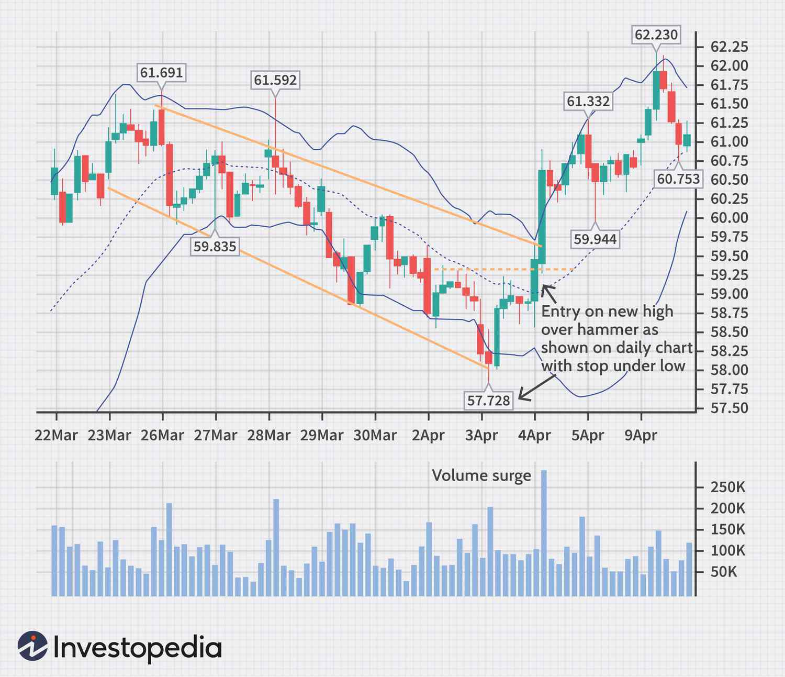

Forex trading, or foreign exchange trading, involves buying and selling currencies on the global market. It has gained considerable popularity due to its accessibility and the potential for significant financial returns. Unlike stock markets that operate for limited hours, the forex market is open 24 hours a day, five days a week, allowing traders from around the world to participate at any time. This constant availability has been a strong driver in attracting a varied group of participants, ranging from large financial institutions to individual traders.

A critical component of successful forex trading is the selection of appropriate time frames. Time frames represent the duration over which data is aggregated into price bars or candlesticks. Traders can analyze markets through various lenses, including short-term, medium-term, and long-term perspectives. Each time frame affects trading decisions and outcomes differently, with shorter time frames typically used for quick trades and longer ones for more extended market predictions.



Algorithmic trading, or algo trading, has become a fundamental part of modern forex strategies. It involves using computer programs to execute trades based on predefined criteria and rules. The primary allure of algorithmic trading lies in its speed, precision, and ability to process vast amounts of data in real time. By removing the emotional component from trading decisions, algorithms can maintain consistency and exploit market opportunities efficiently. These systems can adapt to multiple time frames, providing traders with the flexibility to optimize their strategies based on varying market conditions.

The purpose of this article is to explore how different time frame strategies can be effectively used within the context of algorithmic trading. We will examine the interplay between time frames and algorithmic approaches, showcasing how combining these elements can lead to more robust trading systems.

## Table of Contents

## Understanding Forex Time Frames

Forex trading involves the buying and selling of currency pairs, and time frames play a crucial role in this process by influencing market analysis and trading strategies. A time frame in forex trading refers to the duration for which price movements are analyzed. Traders use different time frames to make decisions based on their trading objectives and risk tolerance.

Time frames in forex are typically categorized into short-term, medium-term, and long-term. Short-term time frames, ranging from one minute to an hour, are often used by traders looking to capitalize on small price movements. These traders, known as scalpers or day traders, focus on minute-by-minute price changes to generate quick profits. An example would be using a 15-minute chart to identify entry and exit points within a single trading session.

Medium-term time frames span from one hour to a few days. Swing traders, who aim to capture price oscillations over several days, commonly use these time frames. They analyze price patterns on hourly or four-hour charts, making decisions based on technical indicators and market sentiment.

Long-term time frames extend from weeks to months, suitable for position traders who seek to capitalize on larger market trends. These traders rely on daily, weekly, or monthly charts and often incorporate [fundamental analysis](/wiki/fundamental-analysis) to inform their strategies. They hold positions for extended periods, allowing them to ride out short-term market fluctuations.

The choice of time frame significantly impacts trading decisions and outcomes. Short-term traders often face increased transaction costs due to frequent trading and the need for rapid decision-making. However, they benefit from the ability to react quickly to market changes, potentially increasing their profitability. Medium-term traders enjoy reduced transaction costs compared to short-term traders, and they can take advantage of both technical patterns and fundamental news events. Long-term traders face lower transaction costs but must be patient and resilient to withstand market [volatility](/wiki/volatility-trading-strategies) over extended periods.

The relationship between time frames and trading styles is evident in how traders approach the market. Day traders, using short-term time frames, focus on technical analysis and rely heavily on price action and chart patterns. Swing traders balance technical and fundamental analysis, using medium-term time frames to exploit market cycles. Position traders, employing long-term time frames, prioritize fundamental analysis to assess economic trends and geopolitical factors influencing currency movements.

Overall, understanding time frames is essential for developing effective [forex](/wiki/forex-system) trading strategies. By aligning time frames with their trading style, traders can enhance their decision-making process and optimize their chances of success in the forex market.

 to Algorithmic Trading in Forex

Algorithmic trading, often referred to as algo trading, involves using computer programs or algorithms to automate the process of trading financial instruments, such as currencies in the forex market. This approach is characterized by its ability to execute trades at high speed and precision, which can be advantageous in the fast-paced world of forex trading.

The primary advantage of using algorithms in forex trading lies in their ability to process vast amounts of data swiftly and make decisions based on pre-set criteria without the need for human intervention. Algorithms can analyze technical indicators and market conditions in real-time, allowing them to execute trades at optimal prices with minimal delay. This capability reduces the likelihood of human error and emotional trading decisions, enhancing the potential for profitable outcomes.

A basic forex trading algorithm comprises several key components:

1. **Data Input**: This component involves collecting and processing data from various sources, including market prices, historical data, news feeds, and economic indicators. The quality and accuracy of the data are crucial for effective algorithmic decision-making.

2. **Signal Generator**: Based on the input data, the signal generator identifies potential trading opportunities by analyzing market trends, patterns, or specified criteria. For example, an algorithm might be designed to generate a buy signal when the 50-day moving average crosses above the 200-day moving average.

3. **Risk Management**: This component involves setting parameters to control potential losses. Algorithms can be programmed to incorporate stop-loss orders, trailing stops, or position-sizing rules to mitigate risk, ensuring that potential losses remain within acceptable limits.

4. **Execution**: Once a trading signal is generated and risk parameters are set, the execution component handles the actual placement of orders. This could involve market orders, limit orders, or other types of orders based on the strategy employed.

Common [algorithmic trading](/wiki/algorithmic-trading) strategies in forex include:

- **Trend Following**: This strategy involves identifying and following market trends. Algorithms are programmed to recognize patterns or signals that suggest the continuation of a trend and execute trades accordingly.

- **Mean Reversion**: This strategy is based on the hypothesis that prices will revert to their mean or average level. Algorithms detect when prices deviate significantly from their historical averages and execute trades that anticipate a return to these mean values.

- **Arbitrage**: Arguably one of the most sought-after strategies, arbitrage takes advantage of price discrepancies between different markets or instruments. Algorithms track these discrepancies and execute trades to profit from the differences.

- **Scalping**: A short-term strategy that focuses on exploiting small price changes. Scalping requires quick execution and frequent trades, making algorithms an ideal tool for this strategy due to their rapid processing capabilities.

In sum, algorithmic trading has transformed the forex markets by enabling traders to capitalize on market opportunities with improved speed and accuracy. By streamlining data analysis, risk management, and trade execution, algo trading offers a sophisticated approach to navigating the complexities of forex trading.

## Combining Time Frames with Algorithmic Strategies

Integrating various time frames into algorithmic trading strategies enhances the robustness and versatility of forex trading algorithms. Different time frames, ranging from short to long, provide diverse perspectives on market movements, enabling traders to capitalize on both micro and macroeconomic trends.

**Benefits of Using Multiple Time Frames**

Utilizing multiple time frames allows traders to craft more nuanced and comprehensive trading strategies. This approach aids in filtering market noise and improving signal reliability. For example, a trader might use a longer time frame to identify the overall trend, while employing shorter time frames to pinpoint optimal entry and [exit](/wiki/exit-strategy) points within that trend. This fusion of perspectives helps in minimizing the chances of false signals and enhances decision-making accuracy.

**Time Frame Convergence and Divergence**

Time frame convergence occurs when different time frames align to provide corroborative signals, thus strengthening the trading decision. For instance, if a bullish pattern appears on both the daily and hourly charts, it reinforces the buy signal. Conversely, time frame divergence happens when signals from different time frames conflict, suggesting caution or the need for further analysis before executing trades.

**Example Strategies Blending Time Frames with Algo Trading**

A popular strategy that effectively blends time frames is the "Multi-Time Frame Moving Average Crossover". In this strategy, a trader might use a long-term moving average (e.g., 200-day) to gauge the primary trend and a short-term moving average (e.g., 50-day) on smaller time frames to find entry points. The algorithm can be structured to initiate buy orders when a shorter-term moving average crosses above the longer-term one, provided the long-term trend is upwards. This strategy can be coded in Python as:

```python
import pandas as pd

def moving_average_crossover(stock_data, short_window, long_window):
    signals = pd.DataFrame(index=stock_data.index)
    signals['price'] = stock_data['Close']
    signals['short_mavg'] = stock_data['Close'].rolling(window=short_window, min_periods=1, center=False).mean()
    signals['long_mavg'] = stock_data['Close'].rolling(window=long_window, min_periods=1, center=False).mean()

    signals['signal'] = 0.0
    signals['signal'][short_window:] = np.where(signals['short_mavg'][short_window:] > signals['long_mavg'][short_window:], 1.0, 0.0)   
    signals['positions'] = signals['signal'].diff()

    return signals
```

In this algorithm, short_window and long_window define the respective moving average periods for shorter and longer time frames. The strategy offers the flexibility to adapt to various market conditions by modifying these parameters.

Another effective strategy is the "Time Frame Confirmation Strategy". This strategy waits for a trend confirmation across multiple time frames before executing trades. For example, an algorithm might require a trend confirmation on both the daily and 4-hour charts before opening a position, thereby reducing the risk of acting on a spurious trend seen in a single time frame.

By blending multiple time frames with algorithmic strategies, traders not only expand their analytical framework but also enhance the robustness and adaptability of their trading systems.

## Short-Term Forex Trading Strategies Using Algorithms

Short-term forex trading strategies are characterized by their focus on quick market entries and exits, with the aim of capitalizing on small price movements. These strategies appeal to algorithmic traders due to their potential for rapid profit generation and the ability to leverage computational power for executing high-frequency trades.

### Popular Short-Term Algo Strategies

**Scalping** is a prevalent strategy in short-term trading, where traders seek to profit from small price gaps created by order flows or spreads. Scalping algorithms are designed to execute numerous trades within a short period, sometimes within seconds or minutes. They capitalize on minute price discrepancies and are sensitive to transaction costs, requiring low latency systems for execution.

**High-Frequency Trading (HFT)** is another strategy that involves executing a large number of orders at extremely fast speeds, often measured in microseconds. HFT algorithms rely on sophisticated technology and infrastructure to execute trades across multiple exchanges simultaneously. They monitor order books and use quant models to predict very short-term price movements, exploiting inefficiencies and market liquidity.

### Role of Data Analysis and Rapid Execution

Effective short-term algorithmic strategies heavily rely on advanced data analysis and rapid execution. Algorithms analyze vast amounts of market data, including price ticks, [volume](/wiki/volume-trading-strategy), and [order book](/wiki/order-book-trading-strategies) dynamics, in real-time to identify and exploit short-lived market opportunities.

Data analysis is often enhanced by using statistical and [machine learning](/wiki/machine-learning) models to predict price movements based on historical patterns. Rapid execution is achieved through co-location services, where traders place their servers close to exchange servers, and the use of technologies like Field Programmable Gate Arrays (FPGA) for speed.

Python, with its extensive libraries such as NumPy and pandas for data manipulation and analysis, is widely used in designing and testing these strategies. Here is a simple illustration of how one might set up a basic [scalping](/wiki/gamma-scalping) strategy using Python:

```python
import pandas as pd

# Load price data
data = pd.read_csv('forex_data.csv')

# Define a simple moving average crossover strategy
short_window = 5
long_window = 20
data['Short_MA'] = data['Close'].rolling(window=short_window).mean()
data['Long_MA'] = data['Close'].rolling(window=long_window).mean()

# Generate trading signals
data['Signal'] = 0
data['Signal'][short_window:] = np.where(data['Short_MA'][short_window:] > data['Long_MA'][short_window:], 1, -1)

# Plot signals
data[['Close', 'Short_MA', 'Long_MA', 'Signal']].plot()

```

### Challenges and Solutions

Implementing short-term forex trading algorithms poses several challenges:

1. **Latency**: Given the high-speed nature of these strategies, even minor delays in execution can significantly impact profitability. To mitigate this, traders use high-speed communication networks and optimize their code for speed.

2. **Transaction Costs**: As these strategies execute a large number of trades, transaction costs can accumulate and erode profits. Solutions include negotiating lower fees with brokers and developing strategies that minimize unnecessary trades.

3. **Market Noise**: Short-term strategies can be susceptible to false signals caused by market noise. Traders address this by enhancing their models with more robust data analysis techniques and incorporating additional filters or conditions for trade execution.

4. **Regulatory and Technological Risks**: The fast-paced nature of HFT strategies exposes traders to regulatory risks and technological failures. It's crucial to have a well-rounded risk management framework and backup systems in place.

In summary, short-term algorithmic trading strategies, such as scalping and [HFT](/wiki/high-frequency-trading-strategies), offer significant profit potential owing to their rapid execution and ability to manage multiple trades. However, they require sophisticated technology and careful consideration of associated challenges to be effective.

## Medium and Long-Term Forex Trading Strategies with Algorithms

Medium and long-term trading strategies in the forex market typically involve holding positions for an extended period, ranging from several days to weeks or even months. These strategies capitalize on significant market trends and macroeconomic factors, allowing traders to benefit from larger price movements while bypassing the noise of short-term market fluctuations.

### Algorithmic Approaches for Medium and Long-Term Strategies

Algorithmic trading can enhance medium and long-term forex strategies by systematically analyzing large datasets and capitalizing on prevailing trends. Algorithms in this context are often built to identify and confirm trends using technical indicators such as moving averages, the Relative Strength Index (RSI), and the MACD (Moving Average Convergence Divergence). These algorithms are designed to analyze market data over longer time frames, filtering out short-term volatility that doesn't impact the overarching trend.

A common algorithmic approach is to set entry and exit points using crossover methods with long-term indicators. For instance, a simple moving average (SMA) crossover strategy might involve entering a buy position when a shorter-term SMA crosses above a longer-term SMA, indicating a potential upward trend.

```python
def sma_crossover(short_sma, long_sma, data):
    data['Short_SMA'] = data['Close'].rolling(window=short_sma).mean()
    data['Long_SMA'] = data['Close'].rolling(window=long_sma).mean()
    data['Signal'] = 0
    data['Signal'][short_sma:] = np.where(data['Short_SMA'][short_sma:] > data['Long_SMA'][short_sma:], 1, 0)
    data['Position'] = data['Signal'].diff()
    return data
```

### Role of Fundamental Analysis with Algorithms

Fundamental analysis plays a crucial role alongside algorithmic trading in medium and long-term strategies. These strategies often require algorithms to incorporate economic indicators, [interest rate](/wiki/interest-rate-trading-strategies) decisions, geopolitical events, and other macroeconomic factors that drive currency movements over extended periods. By integrating quantitative algorithms with qualitative assessments, such as news sentiment analysis, traders can develop more robust strategies that respond to the broader economic landscape.

For example, an algorithm could be programmed to adjust its trading parameters or signals based on key economic releases or shifts in monetary policy. This integration allows the algorithm to align with fundamental economic trends, providing a comprehensive trading framework that assesses both technical and fundamental aspects.

### Importance of Risk Management and Patience

Risk management is vital in medium and long-term algorithmic trading strategies due to the longer duration of holding positions and potential exposure to market changes. Employing strategies like stop-loss and take-profit orders are essential to protect against adverse price movements. Furthermore, algorithms should be equipped with risk management protocols that can adjust exposure based on volatility measures like the Average True Range (ATR).

Patience is another critical attribute in longer-term strategies, as positions may experience temporary adverse movements before reaching the desired outcome. Traders relying on algorithmic strategies must trust in the robustness of the model and avoid making impulsive adjustments based on short-term fluctuations.

Overall, medium and long-term trading strategies in forex benefit significantly from the systematic and disciplined approach provided by algorithmic trading. By leveraging both technical and fundamental analysis, traders can enhance their ability to capture significant market trends while effectively managing risk and maintaining the patience required to succeed in these strategies.

## Backtesting and Optimizing Forex Algo Strategies

Backtesting is a crucial element in forex algorithmic trading as it allows traders to evaluate the performance of a trading strategy using historical data. By simulating trades over past data, traders can identify the strengths and limitations of their algorithms before deploying them in live markets. This process can save time and capital by avoiding the implementation of inefficient or unprofitable strategies.

The process of [backtesting](/wiki/backtesting) involves several steps, starting with data collection. Accurate historical price data is essential for effective backtesting. Platform options for backtesting include MetaTrader 4 (MT4), MetaTrader 5 (MT5), and Python libraries such as Backtrader and Zipline. Once data is gathered, the next step is to define the trading strategy precisely, including entry and exit rules, risk parameters, and position sizing details.

After establishing the strategy, it is coded into a backtesting software, which simulates the strategy on historical data. The results are analyzed for metrics such as the Sharpe ratio, drawdown, winning percentage, and profit [factor](/wiki/factor-investing). This data helps in assessing the potential risk and return profile of the trading strategy.

Optimizing algorithmic strategies for different market conditions and time frames is critical as market dynamics can vary greatly. To do this effectively, strategies can be parameterized with variables that allow flexibility and adaptability to different market environments. Traders employ techniques such as optimization algorithms and walk-forward analysis to fine-tune strategies. For example, a strategy might involve adjusting moving average crossover thresholds based on recent volatility levels.

Best practices for successful backtesting and optimization include:

1. **Using Robust Data**: Ensure the historical data is clean, comprehensive, and free from survivorship bias or look-ahead bias. Accurate data is crucial for making reliable inferences about strategy performance.

2. **Out-of-Sample Testing**: Divide the data into in-sample (for building the model) and out-of-sample (for testing the model) to avoid overfitting strategies to historical data—ensuring they can perform well on unseen data.

3. **Incorporate Transaction Costs**: Simulate realistic trading conditions by including transaction costs, slippage, and order execution delays in the backtesting process.

4. **Stress Testing**: Stress test the strategy under extreme market conditions to ensure robustness. This may involve simulating economic crises or other high-volatility scenarios.

5. **Continuous Monitoring and Adaptation**: Once deployed, algorithms should be continuously monitored, and strategies should be re-evaluated periodically with recent data to keep them effective in dynamic market conditions.

By meticulously backtesting and optimizing strategies, forex traders can increase the probability of achieving consistent profitability and sharpen their competitive edge in the ever-evolving forex market.

## Common Challenges and Solutions in Forex Algo Trading

Forex algorithmic trading, while offering numerous benefits, presents several challenges that traders must address to ensure successful implementation. One of the primary issues is data quality. Reliable and high-quality data are crucial for developing effective algorithms, as inaccurate or incomplete data can lead to flawed analysis and poor trading decisions. Traders must ensure that they source data from reputable providers and frequently validate its accuracy and completeness. Additionally, data preprocessing steps such as cleaning, normalization, and outlier detection are vital to enhance data quality.

Market volatility is another significant challenge in forex algo trading. Exchange rates can experience rapid fluctuations due to geopolitical events, economic announcements, or shifts in market sentiment. Such volatility can introduce noise into trading signals, leading to potentially damaging decisions. To mitigate the effects of volatility, traders can implement volatility-adjusted position sizing or use volatility filters to exclude trades during extreme market conditions.

Market unpredictability also poses a challenge, as unforeseen events can disrupt even the most robust trading models. While it's impossible to predict all market events, traders can incorporate risk management strategies, such as stop-loss orders and dynamic hedging, to protect against large adverse movements. Developing algorithms that adapt to changing market conditions, through techniques such as machine learning, can also help address market unpredictability.

Constant monitoring and adjustment of algorithms are essential to maintain their effectiveness. Market conditions evolve, and an algorithm that performs well today might not be suitable tomorrow. Regular updates, performance reviews, and retraining of models help ensure that algorithms remain aligned with current market dynamics. Traders should establish a feedback loop, using performance metrics, to continuously assess the success of their strategies and make necessary adjustments.

In summary, trading with algorithms in the forex market requires diligent attention to data quality, risk management, volatility, and adaptability. By addressing these challenges with robust strategies, traders can enhance the performance and reliability of their forex trading algorithms.

## Conclusion

Forex trading, one of the most dynamic financial markets, requires traders to continuously refine their strategies to achieve consistent success. A critical component of these strategies is the effective use of time frames, which enables traders to align their trading approaches with their preferred risk tolerance and trading style. Algorithmic trading enhances these strategies by offering speed and precision, thus significantly improving trading outcomes.

The integration of time frames with algorithmic trading strategies provides several advantages. Short-term traders can leverage algorithms to execute rapid trades with accuracy, while long-term traders can use algorithms to process large volumes of data for trend analysis. The synergy between time frames and algorithms allows for a more comprehensive analysis of market movements, ultimately leading to more informed trading decisions.

To stay competitive in the constantly evolving forex market, traders must embrace a mindset of continuous learning and adaptation. The integration of technology into forex trading has opened new avenues for traders, offering tools for backtesting, optimizing strategies, and handling market unpredictability. Maintaining an edge requires not only technical proficiency but also an openness to evolving strategies as the market conditions shift.

In conclusion, the intersection of time frames and algorithms provides a powerful platform for forex traders seeking to optimize their trading strategies. The continued evolution of technology promises further enhancements to trading platforms and methods, underscoring the importance of staying informed and adaptable in this fast-paced market. By leveraging both historical insights and cutting-edge technology, traders can navigate the complexities of forex trading with confidence.

## References & Further Reading

[1]: Bergstra, J., Bardenet, R., Bengio, Y., & Kégl, B. (2011). ["Algorithms for Hyper-Parameter Optimization."](https://papers.nips.cc/paper/4443-algorithms-for-hyper-parameter-optimization) Advances in Neural Information Processing Systems 24.

[2]: ["Advances in Financial Machine Learning"](https://www.amazon.com/Advances-Financial-Machine-Learning-Marcos/dp/1119482089) by Marcos Lopez de Prado

[3]: ["Evidence-Based Technical Analysis: Applying the Scientific Method and Statistical Inference to Trading Signals"](https://www.amazon.com/Evidence-Based-Technical-Analysis-Scientific-Statistical/dp/0470008741) by David Aronson

[4]: ["Machine Learning for Algorithmic Trading"](https://github.com/stefan-jansen/machine-learning-for-trading) by Stefan Jansen

[5]: ["Quantitative Trading: How to Build Your Own Algorithmic Trading Business"](https://www.amazon.com/Quantitative-Trading-Build-Algorithmic-Business/dp/1119800064) by Ernest P. Chan