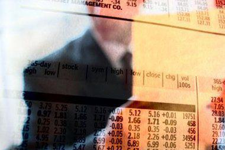

## Table of Contents

## What is trading addiction?

Trading addiction is when someone can't stop trading stocks, cryptocurrencies, or other financial products. It's like being hooked on a game, where the person keeps trading even if they lose money or it hurts their life. They might feel excited when they trade, but it can lead to big problems like losing all their money or having trouble with family and work.

People with trading addiction often think they can always win big, even when they lose a lot. They might spend too much time watching the market and feel anxious if they can't trade. It's important for them to get help, like talking to a counselor or joining a support group, to stop the addiction and start living a healthier life.

## What are the common signs of trading addiction?

Trading addiction can be hard to spot, but there are some common signs. People who are addicted to trading might spend too much time watching the market, even when they should be doing other things like working or spending time with family. They might feel nervous or upset if they can't check their trades all the time. Another sign is that they keep trading even when they lose a lot of money. They might think they can win it all back with just one more trade, even if it's not true.

Another sign is that they might lie about how much they trade or how much money they lose. They might hide their trading from family and friends because they feel ashamed or scared. People with trading addiction often feel a rush or excitement when they trade, but this feeling can make them want to trade more and more, even when it's not good for them. If someone shows these signs, it might be time for them to get help to stop the addiction and live a healthier life.

## How does trading addiction develop?

Trading addiction can start when someone gets really excited about trading stocks, cryptocurrencies, or other financial products. At first, they might feel a big rush of excitement when they make a good trade and see their money grow. This feeling can be like winning a game or getting a prize, and it makes them want to keep trading more and more. They might start spending a lot of time watching the market, checking their trades all the time, and feeling like they can't stop.

Over time, this excitement can turn into a problem. The person might start trading even when they lose money, thinking they can always win it back with just one more trade. They might ignore other important things in their life, like their job or spending time with family and friends. They might feel anxious or upset if they can't trade, and they might even lie about how much they trade or how much money they lose. This is when trading addiction can really take over their life, and they might need help to stop and get back to living a healthier life.

## What are the psychological effects of trading addiction?

Trading addiction can make people feel stressed and anxious all the time. They might worry a lot about their trades and feel scared if they can't check the market. This can lead to feeling tired and not being able to sleep well. They might also feel sad or down because they keep losing money, and this can make them feel hopeless. It's like being on a roller coaster of emotions, where they feel excited when they win but really bad when they lose.

Over time, trading addiction can hurt their relationships with family and friends. They might spend so much time trading that they don't have time for the people they care about. They might lie about their trading because they feel ashamed, which can make them feel lonely and isolated. This can also lead to feeling guilty and having low self-esteem. Getting help, like talking to a counselor or joining a support group, can be important to stop the addiction and start feeling better.

## How does trading addiction impact financial health?

Trading addiction can really hurt someone's financial health. People who are addicted to trading might spend all their money trying to make more, but they often end up losing a lot. They might use money that they need for important things like bills, rent, or food, which can make them go into debt. They might even borrow money or use credit cards to keep trading, thinking they can win it all back, but this just makes their money problems worse.

Over time, trading addiction can lead to big financial problems. The person might lose all their savings and have nothing left. They might have to sell things they own to keep trading, or they might even get into trouble with the law if they do something illegal to get more money. This can make it hard for them to ever get back on their feet financially, and they might need a long time to fix the mess that trading addiction has caused.

## What are the social consequences of trading addiction?

Trading addiction can hurt a person's relationships with family and friends. They might spend so much time trading that they don't have time to hang out with the people they care about. They might miss important events like birthdays or family dinners because they are too busy watching the market. This can make their loved ones feel ignored or unimportant, which can lead to fights and arguments. They might also lie about their trading because they feel ashamed, and this can make it hard for them to trust each other.

Over time, trading addiction can make a person feel lonely and isolated. Their friends and family might get tired of their behavior and stop wanting to be around them. They might feel like they can't talk to anyone about their problems because they are embarrassed. This can make them feel sad and alone, and it can be hard for them to make new friends or rebuild old relationships. Getting help, like talking to a counselor or joining a support group, can be important to stop the addiction and start feeling connected again.

## What treatment options are available for trading addiction?

There are several ways to help someone with trading addiction. One way is to talk to a counselor or therapist who knows about addiction. They can help the person understand why they keep trading and how to stop. The counselor might use something called cognitive-behavioral therapy, which helps change the way the person thinks about trading. They might also join a support group where they can meet other people who have the same problem. Talking to others who understand can make them feel less alone and more hopeful.

Another option is to go to a treatment center that specializes in addiction. These places can offer more intensive help, like staying there for a while to focus on getting better. They might have programs that teach new skills and ways to manage the urge to trade. Some people also find it helpful to take a break from trading completely, like using software that blocks trading websites or apps. This can give them time to focus on other parts of their life and start healing.

It's important for someone with trading addiction to have support from family and friends. They can help by being understanding and encouraging the person to keep trying to get better. Sometimes, medication can help with the anxiety or depression that comes with addiction. The key is to find the right mix of treatments that work for the person, so they can stop trading and start living a healthier, happier life.

## How can one prevent trading addiction?

To prevent trading addiction, it's important to set limits on how much time and money you spend trading. Make a plan before you start trading, deciding how much you can afford to lose and sticking to that amount. It's also good to set specific times for trading and not let it take over your whole day. This helps keep trading fun and not something that controls your life. Talking to friends or family about your trading can also help. They can remind you to take breaks and do other things you enjoy, which keeps trading from becoming too important.

Another way to prevent trading addiction is to learn about the risks of trading. Understanding that you can lose money and that it's not a sure way to get rich can help you stay realistic. It's also helpful to keep trading as just one part of your life, not the main thing. Doing other activities, like sports, hobbies, or spending time with people you care about, can keep you balanced. If you start feeling too excited or upset about trading, it might be a sign to take a step back and get help from a counselor or support group before it turns into an addiction.

## What role does technology play in trading addiction?

Technology makes it really easy to trade all the time, which can lead to trading addiction. With smartphones and trading apps, people can buy and sell stocks or cryptocurrencies anytime, anywhere. This means they might check their trades too much and feel like they need to keep trading even when they should be doing other things. It's like having a casino in your pocket, where you can play whenever you want. This easy access can make it hard for someone to stop trading, even if they know it's not good for them.

On the other hand, technology can also help people manage trading addiction. There are apps and software that can block trading websites or limit how much time you spend trading. These tools can give someone a break from trading and help them focus on other parts of their life. Also, online support groups and therapy sessions can be a big help. People can connect with others who understand what they're going through, and they can get advice and support without leaving their home. So, while technology can make trading addiction worse, it can also be part of the solution.

## How do regulatory frameworks address trading addiction?

Regulatory frameworks try to help with trading addiction by making rules that protect people. They might limit how much someone can trade in a day or set rules about how much money they can put into trading. These rules are there to stop people from losing too much money too quickly. Regulators also make sure that trading platforms tell people about the risks of trading, so everyone knows that it's not a sure way to get rich. This can help people think more carefully before they start trading a lot.

Some countries have special programs to help people with trading addiction. These programs can include ways to get help, like counseling or support groups, and they might be part of the rules for trading platforms. Regulators work with health experts to make sure these programs are good and can really help people. By doing this, they hope to stop trading addiction before it starts and help people who are already struggling to get better.

## What are the long-term effects of trading addiction on mental health?

Trading addiction can really hurt someone's mental health over a long time. People who keep trading even when they lose money might feel very stressed and anxious all the time. They might worry a lot about their trades and feel scared if they can't check the market. This can lead to feeling tired and not being able to sleep well. They might also feel sad or down because they keep losing money, and this can make them feel hopeless. It's like being on a roller coaster of emotions, where they feel excited when they win but really bad when they lose.

Over time, trading addiction can make someone feel lonely and isolated. They might spend so much time trading that they don't have time for friends and family. They might lie about their trading because they feel ashamed, which can make them feel alone. This can also lead to feeling guilty and having low self-esteem. If they keep trading and losing money, they might feel like they can never fix their problems, which can lead to depression. Getting help, like talking to a counselor or joining a support group, can be important to stop the addiction and start feeling better.

## How can families and friends support someone with trading addiction?

Families and friends can help someone with trading addiction by being there for them and showing they care. They can listen without judging and let the person know they are not alone. It's important to encourage them to get help, like talking to a counselor or joining a support group. Families and friends can also help by setting boundaries, like not lending them money for trading or helping them find other things to do instead of trading. This can make the person feel supported and less likely to keep trading.

It's also good for families and friends to learn about trading addiction so they can understand what the person is going through. They can read about it or talk to experts to know how to help better. Sometimes, it can be hard to see someone they love struggle, but staying calm and patient can make a big difference. By showing love and support, families and friends can help the person feel hopeful and work towards getting better.

## References & Further Reading

[1]: Martins, N. (2016). ["Addiction Ontology and the Urgent Need for the Development of Effective Treatment Approaches to Substance Abuse."](https://en.wikipedia.org/wiki/Tisha_Campbell) Healthcare in Low-resource Settings.

[2]: Toneatto, T. (1999). "A cognitive-behavioral model of problem gambling." Journal of Gambling Studies.

[3]: ["Algorithmic Trading and DMA: An Introduction to Direct Access Trading Strategies"](https://www.semanticscholar.org/paper/Algorithmic-trading-%26-DMA-%3A-an-introduction-to-Johnson/aa5de1ab883d5e23b6651faa7c1807586d688e4b) by Barry Johnson

[4]: Rosenthal, R. J. (1992). "Pathological Gambling." Psychiatric Annals.

[5]: Schüll, N. D. (2012). ["Addiction by Design: Machine Gambling in Las Vegas."](https://www.jstor.org/stable/j.ctt12f4d0) Princeton University Press.