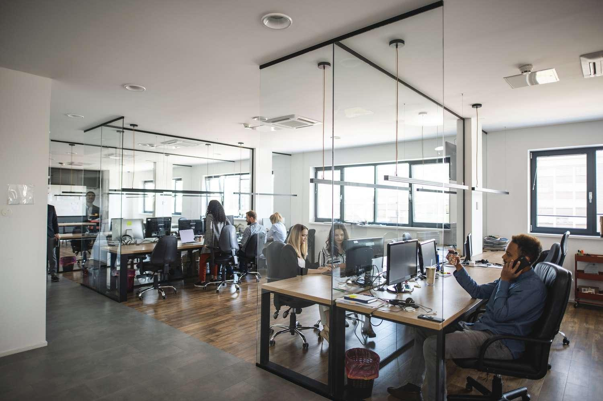

## Table of Contents

## What is a trading arcade?

A trading arcade is a place where many traders come together to buy and sell stocks, commodities, or other financial products. It's like a big room with lots of desks and computers where traders work. They use the arcade's resources, like fast internet and special trading software, to make their trades. The arcade also provides training and support to help traders improve their skills.

Trading arcades are popular because they offer a community of traders who can learn from each other. This can be really helpful for new traders who are just starting out. The arcade might also have rules about how much money traders need to have before they can start trading. This helps keep things safe and organized. Overall, a trading arcade is a great place for traders to work together and grow their skills.

## How does a trading arcade differ from a traditional brokerage?

A trading arcade is different from a traditional brokerage because it's more like a shared workspace for traders. In a trading arcade, many traders come together in one place to trade. They use the arcade's computers and special trading software to buy and sell stocks or other financial products. The arcade also offers training and support to help traders get better at what they do. It's like a community where traders can learn from each other and share tips.

On the other hand, a traditional brokerage is more like a service where you can buy and sell investments. When you use a traditional brokerage, you usually do it on your own, either online or by calling a broker. The brokerage gives you the tools and platform to make trades, but you don't get the same kind of community or shared space that you find in a trading arcade. The main focus of a traditional brokerage is to help you manage your investments, while a trading arcade focuses on helping traders improve their skills and work together.

## What are the basic requirements to join a trading arcade?

To join a trading arcade, you usually need to have some money to start trading. This is called capital, and different arcades might ask for different amounts. Some might need you to have thousands of dollars, while others might let you start with less. You also need to show that you know something about trading. This could mean taking a test or showing that you have traded before.

Once you meet the money and knowledge requirements, you might need to pay a fee to use the arcade's space and tools. This fee can be different for each arcade. After you join, the arcade will give you a place to work, special trading software, and maybe even training to help you get better at trading. It's a good idea to check with each arcade to see what they need and what they offer.

## What types of financial instruments can be traded in a trading arcade?

In a trading arcade, you can trade many different types of financial instruments. The most common ones are stocks, which are shares in a company. You can buy and sell these shares, hoping to make money as their value goes up or down. Another popular instrument is options, which give you the right to buy or sell a stock at a certain price. Futures are also traded in arcades, and they are agreements to buy or sell something at a future date for a price set today.

Besides these, you can also trade commodities like gold, oil, or wheat. These are physical goods that people need every day. In some arcades, you might be able to trade currencies too, like the US dollar or the Euro. This is called forex trading. Each of these instruments has its own risks and rewards, so it's important to learn about them before you start trading.

## How does the commission structure work in trading arcades?

In trading arcades, the commission structure can be different from one place to another. Usually, you have to pay a fee for each trade you make. This fee is called a commission, and it can be a fixed amount or a percentage of the money you are trading. Some arcades might also charge you a monthly fee just for using their space and tools. This monthly fee can help cover the costs of the computers, software, and other resources the arcade provides.

The commission structure is important because it can affect how much money you make from trading. If the commissions are too high, they can eat into your profits. That's why it's a good idea to look at the fees before you join an arcade. Some arcades might have lower fees but offer less support, while others might have higher fees but give you more help and training. It's all about finding the right balance for what you need.

## What are the key benefits of trading in an arcade environment?

Trading in an arcade environment has many benefits. One big advantage is the community. When you trade in an arcade, you are surrounded by other traders who can share their knowledge and experience with you. This can be really helpful, especially if you are new to trading. You can learn from their successes and mistakes, and they can give you tips and advice. This community feeling can make trading less lonely and more fun.

Another benefit is the resources that arcades provide. They usually have fast internet, special trading software, and other tools that can help you make better trades. Many arcades also offer training programs to help you improve your skills. This can be a big help if you want to get better at trading. Plus, the arcade might have rules and support to help you manage your money safely. All these resources can give you a better chance of making money from trading.

## What are the potential risks associated with trading in a trading arcade?

Trading in a trading arcade can be risky. One big risk is losing money. Trading is never a sure thing, and even with the help and resources of an arcade, you can still make bad trades and lose your money. Another risk is getting too caught up in the excitement of trading. When you are in a room full of other traders, it can be easy to get swept up in the moment and make quick decisions without thinking them through. This can lead to mistakes and more losses.

Another risk is depending too much on the arcade's community and resources. While it's great to learn from others, you need to remember that everyone's situation is different. What works for someone else might not work for you. Plus, if the arcade's tools or internet go down, it can mess up your trading. So, it's important to have your own plan and not rely completely on the arcade.

## How does technology and software play a role in trading arcades?

Technology and software are super important in trading arcades. They help traders make quick and smart decisions. The arcades have special computers and fast internet that let traders buy and sell stocks or other things without waiting. They also use special trading software that shows them lots of information about the markets. This software can help traders see what's happening and make better choices about when to buy or sell.

The software in trading arcades can do more than just show information. Some programs can even do trades for you, based on rules you set up. This is called automated trading, and it can save traders a lot of time. The software can also help traders keep track of how much money they are making or losing, so they can make better plans for the future. All this technology makes trading easier and can help traders do better.

## Can you explain the typical daily operations and trading strategies used in trading arcades?

In a trading arcade, the day usually starts early. Traders come in and get ready for the market to open. They check the news and use their special software to see what's happening in the markets. Once the market opens, they start trading. They might buy and sell stocks, options, or other things based on what they see. Some traders like to make quick trades, trying to make money from small changes in prices. Others might hold onto their trades for longer, waiting for bigger changes. Throughout the day, traders keep an eye on their screens, making new trades or closing old ones as needed. They also talk to other traders in the arcade, sharing tips and ideas.

Trading strategies in an arcade can be different for each trader. Some use a strategy called day trading, where they buy and sell things within the same day. They try to make money from small changes in prices. Others might use a strategy called swing trading, where they hold onto their trades for a few days or weeks, hoping for bigger changes. Some traders use automated trading, where they set up rules in their software, and the computer makes trades for them. No matter what strategy they use, traders in an arcade are always learning and trying to get better. They use the resources and community in the arcade to help them make smarter trades.

## How do trading arcades monitor and ensure compliance with trading regulations?

Trading arcades make sure traders follow the rules by keeping a close eye on what they do. They use special software to watch all the trades that happen in the arcade. This software can spot if someone is doing something they shouldn't, like trading too much or trying to cheat. The arcade also has people who check the trades to make sure everything is okay. If they see something wrong, they can stop it and talk to the trader about it.

Besides watching trades, trading arcades also teach traders about the rules. They have training programs to help traders learn what they can and can't do. This helps traders stay out of trouble. The arcade might also have its own rules that traders have to follow. If a trader breaks these rules, they might get a warning or even be asked to leave the arcade. This way, the arcade makes sure everyone is trading fairly and safely.

## What advanced trading techniques are commonly utilized by experienced traders in arcades?

Experienced traders in arcades often use a technique called scalping. This means they make lots of quick trades, trying to make a little bit of money from small changes in prices. They watch the market closely and use special software to help them make these fast trades. Scalping can be risky because it's hard to make money from such small changes, but it can also be rewarding if done right.

Another advanced technique is algo trading, where traders use computer programs to make trades for them. These programs follow rules set by the trader, looking for certain patterns in the market. This can save a lot of time and help traders make decisions without letting their feelings get in the way. Some traders also use a technique called hedging, where they make trades to protect themselves from losing too much money if the market goes the wrong way. This can be a smart way to manage risk, but it takes a lot of skill and knowledge to do it well.

## How do trading arcades adapt to market changes and what future trends might impact their operations?

Trading arcades adapt to market changes by staying up to date with the latest news and using advanced software to analyze market trends. They often hold meetings or training sessions to help traders understand new market conditions and adjust their strategies. For example, if there's a big change in the economy, like a new law or a big event, the arcade might bring in experts to explain how it could affect trading. This helps traders make smarter decisions and stay ahead of the game.

In the future, technology will likely play an even bigger role in trading arcades. More traders might use automated trading systems, where computers make trades based on set rules, making trading faster and more efficient. Also, with more people interested in trading, arcades might see more competition and need to offer better tools and services to attract traders. Another trend could be a focus on sustainable and ethical investing, where traders look for companies that are good for the environment or society. This could change the kinds of trades that happen in arcades and the strategies traders use.

## References & Further Reading

[1]: Bergstra, J., Bardenet, R., Bengio, Y., & Kégl, B. (2011). ["Algorithms for Hyper-Parameter Optimization."](https://dl.acm.org/doi/10.5555/2986459.2986743) Advances in Neural Information Processing Systems 24.

[2]: ["Advances in Financial Machine Learning"](https://www.amazon.com/Advances-Financial-Machine-Learning-Marcos/dp/1119482089) by Marcos Lopez de Prado

[3]: ["Evidence-Based Technical Analysis: Applying the Scientific Method and Statistical Inference to Trading Signals"](https://www.amazon.com/Evidence-Based-Technical-Analysis-Scientific-Statistical/dp/0470008741) by David Aronson

[4]: ["Machine Learning for Algorithmic Trading"](https://github.com/stefan-jansen/machine-learning-for-trading) by Stefan Jansen

[5]: ["Quantitative Trading: How to Build Your Own Algorithmic Trading Business"](https://www.amazon.com/Quantitative-Trading-Build-Algorithmic-Business/dp/1119800064) by Ernest P. Chan