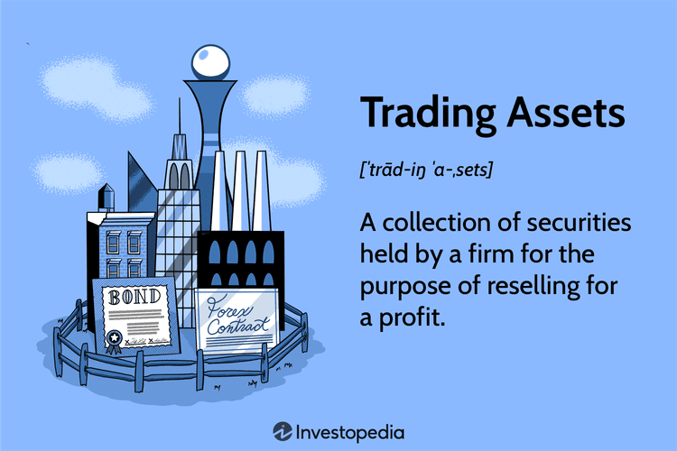

## Table of Contents

## What is trading assets?

Trading assets refers to the buying and selling of various types of financial instruments with the goal of making a profit. These assets can include stocks, bonds, commodities, currencies, and more. People trade assets to take advantage of price movements in the market. For example, if someone believes the price of a stock will go up, they might buy it and then sell it later at a higher price to make a profit.

Trading assets can be done in different ways. Some people trade frequently, trying to make small profits from short-term price changes. This is known as active trading. Others might hold onto their assets for a longer time, hoping for bigger gains over months or years. This is called investing. Both methods have their own risks and rewards, and it's important for traders to understand the market and have a strategy before they start trading.

## What are the different types of assets that can be traded?

There are many different types of assets that people can trade. Some of the most common ones are stocks, which are shares in a company. When you buy a stock, you own a little piece of that company. Another type of asset is bonds, which are like loans you give to a government or a company. They pay you back with interest over time. Commodities are also popular to trade. These are things like gold, oil, or wheat. People trade them because their prices can change a lot.

Another group of assets that can be traded are currencies. This is called [forex](/wiki/forex-system) trading, where you buy one currency and sell another, hoping to make money from the difference in their values. Cryptocurrencies, like Bitcoin, are a newer type of asset that people trade. They are digital and not controlled by any government. Lastly, there are derivatives, which are financial contracts that get their value from something else, like a stock or commodity. Trading these can be riskier but also offer the chance for bigger rewards.

## How does trading assets work?

Trading assets means buying and selling things like stocks, bonds, or gold to make money. When you think the price of an asset will go up, you buy it. Later, if the price does go up, you sell it and keep the difference as profit. If you think the price will go down, you might sell the asset first and buy it back later at a lower price. This is called short selling. Trading happens in places called markets, where lots of people buy and sell assets every day.

To start trading, you need to open an account with a broker, which is a company that helps you buy and sell assets. You put money into your account and use it to buy assets. You can use different tools and charts to help you decide when to buy or sell. Trading can be done in different ways. Some people trade a lot and try to make small profits quickly. Others hold onto their assets for a long time, hoping for bigger gains. Both ways have risks, so it's important to learn about the market and have a plan before you start trading.

## What are the basic principles of asset trading?

Trading assets means buying and selling things like stocks, bonds, or gold to make money. The main idea is to buy an asset when you think its price will go up. If you're right, you can sell it later for more money and keep the difference as profit. If you think the price will go down, you might sell the asset first and buy it back later at a lower price. This is called short selling. Trading happens in markets where lots of people are buying and selling assets all the time.

To start trading, you need to open an account with a broker, which is a company that helps you buy and sell assets. You put money into your account and use it to buy assets. You can use charts and other tools to help you decide when to buy or sell. Some people trade a lot and try to make small profits quickly. Others hold onto their assets for a long time, hoping for bigger gains. Both ways have risks, so it's important to learn about the market and have a plan before you start trading.

## What are some common examples of tradable assets?

Some common examples of tradable assets are stocks, which are pieces of ownership in a company. When you buy a stock, you own a small part of that company. If the company does well, the price of the stock might go up, and you can sell it for a profit. Another example is bonds, which are like loans you give to a government or a company. They pay you back with interest over time. Commodities are also popular to trade. These are things like gold, oil, or wheat. Their prices can change a lot, so people try to buy them when they're cheap and sell them when they're expensive.

Another group of tradable assets are currencies. This is called forex trading, where you buy one currency and sell another, hoping to make money from the difference in their values. Cryptocurrencies, like Bitcoin, are a newer type of asset that people trade. They are digital and not controlled by any government. Lastly, there are derivatives, which are financial contracts that get their value from something else, like a stock or commodity. Trading these can be riskier but also offer the chance for bigger rewards.

## How can beginners start trading assets?

To start trading assets, beginners should first learn about the different types of assets they can trade, like stocks, bonds, commodities, and cryptocurrencies. It's important to understand how each type works and the risks involved. Once you have a basic understanding, the next step is to choose a reputable broker. A broker is a company that helps you buy and sell assets. You'll need to open an account with them, which usually involves filling out some forms and providing personal information. After your account is set up, you can deposit money into it, which you'll use to buy assets.

Once you have money in your account, you can start trading. It's a good idea to start small and not risk too much money at first. You can use tools like charts and market analysis to help you decide when to buy or sell assets. Many brokers offer practice accounts where you can trade with fake money to get a feel for how it works before using real money. Remember, trading can be risky, so it's important to have a plan and not to let emotions drive your decisions. Over time, as you gain more experience, you can start to trade more confidently and potentially increase your profits.

## What are the risks associated with trading assets?

Trading assets can be risky because the prices of things like stocks, bonds, and commodities can go up and down a lot. If you buy an asset and its price goes down, you could lose money. This is called market risk. Another risk is called [liquidity](/wiki/liquidity-risk-premium) risk, which happens when you can't sell your asset quickly enough or at the price you want. Sometimes, the market can be very unpredictable, and big events like economic changes or natural disasters can make prices move in ways that are hard to predict.

Another risk is called leverage risk. This happens when you borrow money to trade, which can make your gains bigger but also your losses. If the market moves against you, you could end up owing more money than you started with. There's also something called counterparty risk, which is the chance that the other person or company you're trading with might not be able to fulfill their part of the deal. All these risks mean that it's important to be careful and do a lot of research before you start trading assets.

## What strategies can be used to manage risk in asset trading?

One way to manage risk in asset trading is by using something called diversification. This means not putting all your money into one type of asset. Instead, you spread it out over different kinds of assets, like stocks, bonds, and commodities. If one asset goes down in price, the others might go up or stay the same, which can help balance out your losses. Another strategy is setting stop-loss orders. This is a tool that automatically sells your asset if its price drops to a certain level. It helps you limit how much money you can lose on a single trade.

Another important strategy is to only risk money that you can afford to lose. This means not using money that you need for important things like bills or rent. It's also a good idea to do a lot of research and understand the market before you start trading. This can help you make better decisions and avoid big mistakes. Lastly, using leverage carefully is key. Leverage lets you borrow money to trade, which can make your gains bigger but also your losses. So, it's important to use it wisely and not take on too much risk.

## How do market conditions affect asset trading?

Market conditions can have a big impact on asset trading. When the economy is doing well, people feel confident and are more likely to buy assets like stocks and bonds. This can make the prices of these assets go up. But if the economy is struggling, people might be scared to invest and sell their assets instead. This can cause prices to go down. Big events like elections, natural disasters, or changes in government policy can also shake up the market and make prices move in unexpected ways.

Understanding market conditions can help traders make better decisions. For example, if you know that a company is about to release a new product that could make them more popular, you might want to buy their stock before the price goes up. On the other hand, if you hear that a company is having money problems, you might want to sell their stock before the price drops. Keeping an eye on economic reports, news, and other information can help you stay on top of market conditions and trade more successfully.

## What advanced techniques can expert traders use to optimize their asset trading?

Expert traders can use a technique called [algorithmic trading](/wiki/algorithmic-trading) to make their trading more efficient. This means using computer programs to buy and sell assets based on set rules and math formulas. These programs can analyze lots of data very quickly and make trades faster than a human could. This can help traders take advantage of small price changes that happen in just a few seconds. But it's important for traders to keep an eye on their algorithms and make sure they are working well, because the market can change in ways that the program might not expect.

Another advanced technique is called hedging. This is a way to protect against losses by making other trades that can balance out the risk. For example, if a trader owns a stock and is worried that its price might go down, they might buy an option that will make money if the stock's price does drop. This way, even if they lose money on the stock, they can make some of it back from the option. Hedging can be complicated, but it's a powerful tool for managing risk and can help traders feel more secure in their trading decisions.

## How can technology and tools enhance asset trading?

Technology and tools can make asset trading easier and better for traders. One way they help is by giving traders a lot of information quickly. For example, trading platforms show real-time prices, charts, and news updates. This helps traders make smart choices about when to buy or sell assets. Also, many platforms have tools that can do math and analysis for you. These tools can look at past prices and predict what might happen next, which can be really helpful for making decisions.

Another way technology helps is by making trading faster and easier. With online trading platforms, you can buy and sell assets from anywhere, even on your phone. This means you don't have to be in a specific place to trade. Also, some tools let you set up automatic trades. For example, you can tell the computer to buy a stock if it reaches a certain price. This can save time and help you take advantage of opportunities even when you're not watching the market. Overall, technology makes trading more efficient and gives traders more control over their investments.

## What are the future trends in asset trading and how might they impact the market?

In the future, more and more people might start using something called blockchain technology for trading assets. Blockchain is like a digital record book that everyone can see but no one can change. It makes trading safer and more clear because it's hard to cheat or make mistakes. Also, more people might start trading digital assets like cryptocurrencies. These are not controlled by any government, and they can be traded quickly and easily online. This could change how the market works and make it easier for people from all over the world to trade with each other.

Another trend might be the use of [artificial intelligence](/wiki/ai-artificial-intelligence) (AI) in trading. AI can look at a lot of information very fast and make smart guesses about what might happen next in the market. This can help traders make better choices and maybe make more money. But it could also make the market move in ways that are hard to predict. Overall, these new technologies could make trading easier and more open to everyone, but they might also bring new challenges and risks that traders will need to learn about and handle carefully.

## What are Algorithmic Trading Strategies?

Algorithmic trading strategies have become integral to modern financial markets, with various models and techniques offering diverse ways to capitalize on market movements.

**Trend-Following Strategies**: These strategies focus on establishing buy or sell positions based on the perceived direction of market prices. A common method used is the moving average, which smooths out price data to identify potential buy or sell signals. For instance, a simple moving average (SMA) strategy might generate a buy signal when a shorter-term SMA crosses above a longer-term SMA, indicating upward momentum. Conversely, a sell signal could occur when it crosses below. The formula for a simple moving average over $n$ days is:

$$

SMA = \frac{\sum_{i=1}^{n} P_i}{n} 
$$

where $P_i$ is the price of the asset at day $i$.

**Arbitrage**: This strategy seeks to exploit price discrepancies of the same asset or related assets in different markets or forms, aiming to lock in risk-free profits. An example would include triangular arbitrage in foreign exchange markets, where disparities in currency exchange rates across three currencies can be used to profit. Arbitrage strategies require rapid execution to capitalize on fleeting opportunities, often relying on sophisticated software to detect and act on price differences instantaneously.

**Mean Reversion**: Mean reversion strategies are founded on the assumption that asset prices will eventually revert to their historical mean or average level. Traders employing this strategy will often sell assets when prices are perceived to be above their mean and buy when prices are below. This can be quantified using statistical methods like standard deviation to assess how far prices are from their average, influencing buy or sell decisions.

**Index Fund Rebalancing and Mathematical Model-Based Approaches**: Index fund rebalancing occurs when index funds adjust their component weightings to reflect changes in the underlying index with which they are aligned. This can lead to predictable buying or selling activity in affected stocks, creating opportunities for algorithmic trading. Mathematical model-based strategies may include quantitative models like regression analysis, machine learning algorithms, or factor models that use statistical methods to predict future price movements based on historical and real-time data.

Incorporating these strategies requires a robust understanding of market mechanics and proficiency with programming and data analysis. Python is often used for these tasks due to its vast array of libraries like NumPy, Pandas, and SciPy which facilitate complex calculations and data manipulations necessary for executing algorithmic trades. Here is a basic Python snippet that calculates a simple moving average:

```python
import pandas as pd

def simple_moving_average(data, window):
    return data.rolling(window=window).mean()

# Example usage:
# prices = pd.Series([your_price_data])
# sma = simple_moving_average(prices, window=20)
```

By leveraging these strategies, algorithmic traders can systematically approach trading with structured, data-informed strategies aiming to maximize profits while managing risks.

## References & Further Reading

[1]: Bergstra, J., Bardenet, R., Bengio, Y., & Kégl, B. (2011). ["Algorithms for Hyper-Parameter Optimization."](https://papers.nips.cc/paper/4443-algorithms-for-hyper-parameter-optimization) Advances in Neural Information Processing Systems 24.

[2]: ["Advances in Financial Machine Learning"](https://www.amazon.com/Advances-Financial-Machine-Learning-Marcos/dp/1119482089) by Marcos Lopez de Prado

[3]: ["Evidence-Based Technical Analysis: Applying the Scientific Method and Statistical Inference to Trading Signals"](https://www.amazon.com/Evidence-Based-Technical-Analysis-Scientific-Statistical/dp/0470008741) by David Aronson

[4]: ["Machine Learning for Algorithmic Trading"](https://github.com/stefan-jansen/machine-learning-for-trading) by Stefan Jansen

[5]: ["Quantitative Trading: How to Build Your Own Algorithmic Trading Business"](https://www.amazon.com/Quantitative-Trading-Build-Algorithmic-Business/dp/1119800064) by Ernest P. Chan