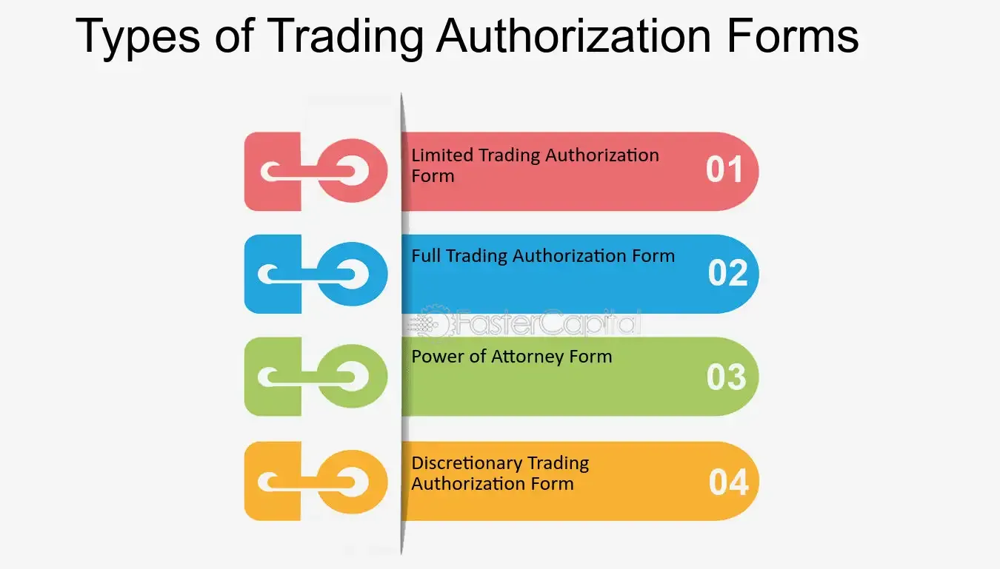

## Table of Contents

## What is trading authorization?

Trading authorization is when someone gives another person or a company the right to buy and sell things like stocks or other investments for them. This is often used by people who don't have the time or knowledge to manage their own investments. They trust someone else, like a financial advisor or a broker, to make decisions about what to buy or sell.

There are different levels of trading authorization. Some allow the authorized person to make trades but need to check back with the owner before doing anything. Others give the authorized person more freedom to make decisions without asking every time. It's important for the person giving the authorization to understand what level of control they are handing over and to trust the person they are giving it to.

## Why is trading authorization important in financial markets?

Trading authorization is important in financial markets because it helps people manage their investments even if they don't have the time or the knowledge to do it themselves. When someone gives trading authorization to a professional, like a financial advisor or a broker, they can trust that person to make smart choices about buying and selling stocks or other investments. This can be really helpful for people who are busy with work or other things and can't keep up with the fast-changing world of finance.

It also makes the financial markets work more smoothly. When professionals are making trades on behalf of many people, they can react quickly to changes in the market. This can lead to more efficient buying and selling, which is good for everyone involved. Plus, having clear rules about trading authorization helps keep things fair and safe, making sure that everyone knows who is allowed to make decisions about someone else's money.

## What are the different types of trading authorizations?

There are a few different types of trading authorizations that people can use. The first type is called limited trading authorization. With this, the person who is given the authorization can make trades, but they have to check with the owner first before doing anything. This is good for people who want some help but still want to have the final say on what happens with their money.

The second type is called full trading authorization. This gives the person a lot more freedom. They can make trades without having to ask the owner every time. This is useful for people who trust their financial advisor or broker a lot and want them to be able to act quickly in the market.

There's also a type called discretionary trading authorization, which is similar to full trading authorization. With this, the person can make trades and also decide on other things like how much to invest in different places. This is for people who really trust their advisor to make all the decisions for them.

## How does one obtain trading authorization?

To get trading authorization, you need to fill out a form from your brokerage firm or financial institution. This form will ask you to say who you want to give the authorization to and what kind of authorization you want to give them. It could be limited, where they need to ask you before making any trades, or full, where they can make trades without asking you every time. You'll need to sign the form to show that you agree to give this person the power to make decisions about your investments.

After you fill out and sign the form, you usually need to send it back to your brokerage firm. They will check the form to make sure everything is correct and that you understand what you are agreeing to. Once they approve it, the person you named will be able to start making trades on your behalf according to the level of authorization you chose. It's important to trust the person you give this power to and to understand the risks involved.

## What are the eligibility criteria for trading authorization?

To get trading authorization, you need to be a client of a brokerage firm or financial institution. This means you have to have an account with them where you keep your money and investments. You also need to choose someone you trust, like a financial advisor or a broker, to give the authorization to. This person should be someone you believe will make good decisions about your money.

When you decide to give trading authorization, you need to fill out a form from your brokerage firm. On this form, you say who you want to give the authorization to and what kind of authorization you want to give them. It could be limited, where they need to ask you before making any trades, or full, where they can make trades without asking you every time. After you fill out and sign the form, you send it back to your brokerage firm. They will check everything to make sure it's correct and that you understand what you're agreeing to. Once they approve it, the person you named can start making trades on your behalf according to the level of authorization you chose.

## What is the process of applying for trading authorization?

To apply for trading authorization, you first need to be a client of a brokerage firm or financial institution. This means you should already have an account with them where you keep your money and investments. Once you have an account, you need to decide who you want to give the trading authorization to. This should be someone you trust, like a financial advisor or a broker, who will make decisions about buying and selling your investments.

After choosing the right person, you need to fill out a form from your brokerage firm. On this form, you will say who you want to give the authorization to and what type of authorization you want to give them. It could be limited, where they need to ask you before making any trades, or full, where they can make trades without asking you every time. Once you fill out and sign the form, you send it back to your brokerage firm. They will review the form to make sure everything is correct and that you understand what you are agreeing to. After they approve it, the person you named can start making trades on your behalf according to the level of authorization you chose.

## How long does it typically take to get trading authorization?

The time it takes to get trading authorization can vary, but it usually doesn't take very long. Once you fill out the form from your brokerage firm and send it back to them, they will check it to make sure everything is correct. This process might take a few days, depending on how busy the firm is and how quickly they can review your form.

After the brokerage firm approves your form, the person you chose can start making trades on your behalf. So, from the time you send in your form to the time you get trading authorization, it might take anywhere from a few days to a week. It's a good idea to ask your brokerage firm if they can give you a better idea of how long it will take in your specific case.

## What are the common challenges faced when seeking trading authorization?

One common challenge when seeking trading authorization is understanding the different types of authorization and choosing the right one. There are limited, full, and discretionary authorizations, and each gives different levels of control to the person you are authorizing. You need to think carefully about how much control you want to give and whether you trust the person you are giving it to. If you pick the wrong type of authorization, it could lead to problems with your investments.

Another challenge is filling out the form correctly. The form from your brokerage firm will ask for specific details about who you are giving the authorization to and what kind of authorization you want. If you make a mistake or leave something out, it can delay the process. You might need to send the form back and forth a few times until everything is right. It's important to read the instructions carefully and double-check your work before sending it in.

Lastly, getting the timing right can be tricky. The review process by the brokerage firm can take a few days to a week, and if they are busy, it might take even longer. You need to plan ahead if you want the person you authorize to start making trades at a specific time. It's a good idea to ask your brokerage firm how long it usually takes so you can set your expectations accordingly.

## How can trading authorization be revoked or suspended?

If you want to stop someone from making trades for you, you can revoke their trading authorization. To do this, you need to tell your brokerage firm that you want to take away the permission you gave. You usually have to fill out another form or send a written request to your brokerage firm. Once they get your request and process it, the person you authorized won't be able to make any more trades on your behalf. It's important to do this as soon as you decide you don't want them to have that power anymore.

Sometimes, a brokerage firm might decide to suspend someone's trading authorization if they think something is wrong. This could happen if they see unusual trading activity or if they think the person with the authorization is not following the rules. If your trading authorization gets suspended, you will be told about it, and you might need to talk to the brokerage firm to sort things out. It's good to keep an eye on your account and talk to your brokerage firm if you have any concerns.

## What are the advanced strategies for managing trading authorizations in a firm?

Managing trading authorizations in a firm can be made easier with some smart strategies. One way is to set up clear rules about who can have trading authorization and what they can do with it. This means making sure everyone knows the different types of authorizations, like limited or full, and when to use them. It's also important to keep good records of who has been given authorization and to check these records often to make sure they are up to date. This helps to avoid mistakes and keeps things running smoothly.

Another good strategy is to use technology to help manage trading authorizations. Many firms use special software that can keep track of who has authorization and what they are doing with it. This software can send alerts if something unusual happens, like if someone is making a lot of trades very quickly. Using technology like this can help the firm catch any problems early and fix them before they get worse. It also makes it easier to keep everything organized and to report on what's happening with trading authorizations.

## How do regulatory changes impact trading authorization processes?

Regulatory changes can really shake things up when it comes to trading authorization processes. When the rules change, firms have to make sure they are following the new rules. This might mean they need to change their forms or the way they check who gets trading authorization. For example, if a new rule says that firms need to do more checks before giving someone trading authorization, it might take longer for people to get approved. This can be frustrating for people who want to start trading quickly, but it's important for keeping things safe and fair.

Sometimes, regulatory changes can also affect what kind of trading authorization people can get. If the rules get stricter, firms might not be able to offer as many options for trading authorization. This could mean that people have to choose a different type of authorization than they wanted, or they might not be able to give someone else the power to trade for them at all. Keeping up with these changes is important for firms so they can help their clients understand what's going on and make the best choices for their investments.

## What are the best practices for maintaining compliance with trading authorization requirements?

To keep up with trading authorization rules, firms need to make sure they know the latest laws and rules. They should check these rules often and update their own rules to match. It's also important to train their staff well so everyone knows what to do. Keeping good records of who has trading authorization and what they are allowed to do is a must. This helps the firm show that they are following the rules if someone asks.

Using technology can also help firms stay compliant. Special software can keep track of trading authorizations and send alerts if something looks wrong. This makes it easier to catch any problems early and fix them. Firms should also talk to their clients clearly about trading authorization, so everyone knows what's going on. By doing these things, firms can make sure they are following the rules and keeping their clients' investments safe.

## References & Further Reading

[1]: Bergstra, J., Bardenet, R., Bengio, Y., & Kégl, B. (2011). ["Algorithms for Hyper-Parameter Optimization."](https://papers.nips.cc/paper/4443-algorithms-for-hyper-parameter-optimization) Advances in Neural Information Processing Systems 24.

[2]: ["Advances in Financial Machine Learning"](https://www.amazon.com/Advances-Financial-Machine-Learning-Marcos/dp/1119482089) by Marcos Lopez de Prado

[3]: ["Evidence-Based Technical Analysis: Applying the Scientific Method and Statistical Inference to Trading Signals"](https://www.amazon.com/Evidence-Based-Technical-Analysis-Scientific-Statistical/dp/0470008741) by David Aronson

[4]: ["Machine Learning for Algorithmic Trading"](https://github.com/stefan-jansen/machine-learning-for-trading) by Stefan Jansen

[5]: ["Quantitative Trading: How to Build Your Own Algorithmic Trading Business"](https://www.amazon.com/Quantitative-Trading-Build-Algorithmic-Business/dp/1119800064) by Ernest P. Chan