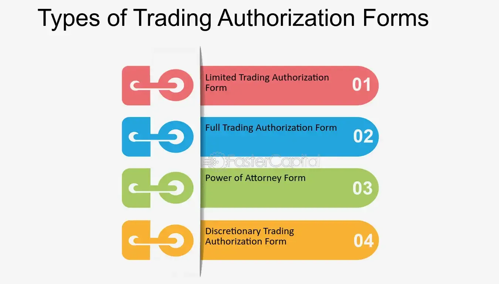

## Table of Contents

## What is trading authorization?

Trading authorization is when someone gives another person or a company the permission to buy and sell things like stocks, bonds, or other investments on their behalf. This is common in financial markets where people might not have the time or expertise to manage their investments themselves. By giving trading authorization, they trust someone else to make decisions about their money.

There are different levels of trading authorization. Some might allow the authorized person to only buy and sell, while others might give them the power to move money around or make other financial decisions. It's important for the person giving the authorization to understand exactly what powers they are granting and to choose someone they trust completely, because this can affect their financial future.

## Why is trading authorization important in financial markets?

Trading authorization is important in financial markets because it lets people who don't have the time or knowledge to manage their investments still participate. They can give someone else, like a financial advisor or a broker, the power to make trades for them. This means they can still try to grow their money without having to watch the markets all the time or learn how everything works.

It also helps big investors and companies manage their money better. They can hire experts to handle their investments, which can be a lot of work. By giving trading authorization, they can focus on other parts of their business or life, knowing that their investments are being looked after by someone who knows what they're doing. This can lead to better decisions and possibly more money in the long run.

## What are the different types of trading authorizations?

Trading authorizations come in different forms, each giving different levels of control to the person or company that's doing the trading. One type is called Limited Trading Authorization. This lets the person trade, but they can't move money around or do other big things with your account. It's good if you just want someone to buy and sell for you, but you want to keep control over the rest of your money.

Another type is Full Trading Authorization, which gives the person a lot more power. They can buy and sell, move money, and sometimes even make other financial decisions for you. This is useful if you really trust the person and want them to handle everything. But it's also riskier because they have more control over your money.

There's also a type called Power of Attorney, which is like Full Trading Authorization but can go even further. With this, the person can do almost anything with your account, including making big decisions that could affect your finances a lot. It's important to be very careful with who you give this kind of authorization to because it's a big responsibility.

## How does one obtain trading authorization?

To get trading authorization, you need to fill out some forms from the place where you keep your money, like a bank or a brokerage firm. These forms will ask you to say who you want to give the power to, what kind of power you want them to have, and sometimes why you're doing it. You'll need to sign these forms to show that you agree, and sometimes the person you're giving the power to might need to sign them too.

Once the forms are filled out and signed, you'll need to send them back to the bank or brokerage firm. They'll check everything to make sure it's all correct and that you really want to do this. After they approve it, the person you chose will be able to start making trades or doing whatever else you've allowed them to do with your money. It's important to keep a copy of these forms for your records, so you know exactly what you agreed to.

## What are the legal requirements for trading authorization?

To get trading authorization, you need to follow some legal rules. These rules can be different depending on where you live and what kind of trading you want to do. Usually, you need to fill out a form from your bank or brokerage firm. This form will ask for your name, the name of the person you want to give the power to, and what kind of power you want them to have. You'll need to sign this form to show that you agree, and sometimes the person you're giving the power to will need to sign it too.

After you fill out and sign the form, you need to send it back to your bank or brokerage firm. They will check everything to make sure it's all correct and that you really want to do this. Once they approve it, the person you chose will be able to start making trades or doing whatever else you've allowed them to do with your money. It's important to know the laws in your area about trading authorization, so you can be sure you're doing everything right and keeping your money safe.

## What are the risks associated with granting trading authorization?

Giving someone trading authorization can be risky. If you give them too much power, they might make bad choices with your money. They could buy and sell things that lose value, or they might not know enough about the market to make good decisions. If you give them full trading authorization or power of attorney, they could even move money around or do other things that could hurt your finances a lot. It's important to really trust the person you're giving this power to because they can affect your money in big ways.

Another risk is that the person you trust might not always stay trustworthy. People can change, or they might get into a situation where they need money and do something wrong. Also, if you don't keep an eye on what they're doing, you might not find out about problems until it's too late. That's why it's good to check in with them and make sure they're doing what you want them to do with your money.

## How can trading authorization be revoked or modified?

If you want to stop or change trading authorization, you need to tell your bank or brokerage firm. You can do this by filling out a new form that says you want to take away the power you gave to someone, or that you want to change what they can do. You'll need to sign this form, and sometimes the person you gave the power to might need to sign it too. Once you send the form back to the bank or brokerage firm, they will check everything and make the changes you asked for.

It's important to keep an eye on what the person you gave trading authorization to is doing. If you see something you don't like, you can act quickly to stop or change the authorization. This helps keep your money safe and makes sure that only the things you want to happen are happening with your investments.

## What are the best practices for managing trading authorization?

When you give someone trading authorization, it's smart to pick someone you trust a lot. Make sure you know exactly what they can do with your money. You might want to start with limited trading authorization, which lets them buy and sell but not move money around. This way, you can see how they do before giving them more power. It's also a good idea to talk to them often about what they're doing with your money, so you can make sure they're making choices you like.

Keep an eye on your account and the trades they're making. If you see something you don't like, you can change or stop the trading authorization by filling out a new form at your bank or brokerage firm. It's important to act fast if you're not happy with what's happening. Also, keep copies of all the forms you sign, so you know what you agreed to and can check back if you need to. By being careful and staying involved, you can help make sure your money is safe and being used the way you want.

## How does trading authorization impact portfolio management?

Trading authorization can really change how your investments are managed. When you give someone else the power to trade for you, they can make decisions that affect what's in your portfolio. If they're good at it, they might be able to buy and sell things at the right times to make more money for you. But if they're not good at it, or if they make choices you don't agree with, your investments might not do as well as you hoped. So, it's important to pick someone you trust and who knows what they're doing.

It also means you don't have to do all the work yourself. Managing a portfolio can take a lot of time and knowledge, so giving someone else trading authorization can free you up to do other things. But you still need to keep an eye on what they're doing. Check in with them often and look at your account to make sure they're making the right choices for your money. If something doesn't feel right, you can always change or take away their trading authorization to keep your portfolio safe.

## What role does technology play in managing trading authorizations?

Technology makes it easier to manage trading authorizations. With online platforms and apps, you can quickly fill out forms to give or take away trading power. You don't have to go to a bank or send papers in the mail. This means you can make changes faster and keep better track of what's happening with your money. Many banks and brokerage firms also have tools that let you see all the trades that are being made in your account, so you can make sure everything is going the way you want.

Technology also helps keep your trading authorizations safe. With secure logins and encryption, it's harder for someone to mess with your account without your permission. Plus, you can set up alerts to let you know if something big happens, like a lot of money being moved or a big trade being made. This way, you can act fast if you see something you don't like. By using technology wisely, you can manage your trading authorizations better and keep your investments safe.

## How do regulatory bodies oversee trading authorization?

Regulatory bodies keep an eye on trading authorization to make sure everything is done right and fairly. They set rules that banks and brokerage firms have to follow when people give others the power to trade for them. These rules say things like what information has to be on the forms, how the forms need to be filled out, and what the person with the power can and can't do. By making these rules, regulatory bodies help stop people from doing bad things with other people's money.

If someone breaks the rules about trading authorization, regulatory bodies can step in. They might do things like fine the bank or brokerage firm, or even take away their right to do business. They can also look into any problems people report and make sure they're fixed. This way, regulatory bodies help keep the financial markets safe and fair for everyone.

## What are the advanced strategies for optimizing trading authorization in large financial institutions?

In large financial institutions, optimizing trading authorization involves setting up clear rules and using technology to keep everything safe and efficient. These institutions often use special software that helps them keep track of who has the power to trade and what they can do. This software can also set limits on how much money someone can move or how many trades they can make in a day. By using this kind of technology, big banks and firms can make sure that only the right people are making trades, and they can catch any problems quickly.

Another important strategy is to train the people who have trading authorization really well. Big financial institutions spend a lot of time teaching their traders about the rules and how to make smart choices with other people's money. They also make sure that everyone knows what they're allowed to do and what they're not. By doing this, they can lower the chance of mistakes or bad behavior. Plus, they often have teams that check on the traders to make sure they're following the rules and doing a good job.

## References & Further Reading

[1]: Bergstra, J., Bardenet, R., Bengio, Y., & Kégl, B. (2011). ["Algorithms for Hyper-Parameter Optimization."](https://dl.acm.org/doi/10.5555/2986459.2986743) Advances in Neural Information Processing Systems 24.

[2]: ["Advances in Financial Machine Learning"](https://www.amazon.com/Advances-Financial-Machine-Learning-Marcos/dp/1119482089) by Marcos Lopez de Prado

[3]: ["Evidence-Based Technical Analysis: Applying the Scientific Method and Statistical Inference to Trading Signals"](https://www.amazon.com/Evidence-Based-Technical-Analysis-Scientific-Statistical/dp/0470008741) by David Aronson

[4]: ["Machine Learning for Algorithmic Trading"](https://github.com/stefan-jansen/machine-learning-for-trading) by Stefan Jansen

[5]: ["Quantitative Trading: How to Build Your Own Algorithmic Trading Business"](https://www.amazon.com/Quantitative-Trading-Build-Algorithmic-Business/dp/1119800064) by Ernest P. Chan