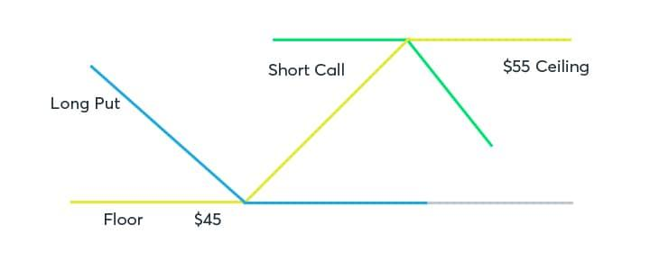

## Table of Contents

## What is a Trading Average Price Option?

A Trading Average Price Option, often called an Asian option, is a type of financial contract where the payoff depends on the average price of the underlying asset over a certain period, rather than its price at a single point in time. This average can be calculated in different ways, like taking the average of daily closing prices over the life of the option. Because it uses an average, this option can be less risky than other options that depend on the price at a specific moment.

These options are useful for investors who want to reduce the impact of short-term price fluctuations. For example, if you are trading commodities like oil, the price can jump around a lot day to day. An Asian option helps smooth out these jumps by using an average price. This makes it a good choice for companies that need to hedge against price changes over time, rather than trying to predict a single future price.

## How does an Average Price Option differ from other types of options?

An Average Price Option, or Asian option, is different from other options because it uses the average price of the underlying asset over time, not just the price at the end. Most other options, like European or American options, only care about the price at a specific time, usually when the option expires. For example, a European option can only be exercised at the end date, while an American option can be exercised anytime before the end date. But both of these look at the price at one moment. The Asian option, on the other hand, looks at the average price over a period, which can be days, weeks, or months.

This difference makes Asian options less risky than other options because they are less affected by sudden big changes in price. If the price of the asset jumps up or down a lot just before the option expires, it won't affect an Asian option as much because it uses an average. This makes Asian options a good choice for people who want to protect against price changes over time, like companies that need to buy or sell a lot of a commodity. Other options might be better if you think you can predict the price at a specific time in the future.

## What are the key features of an Average Price Option?

An Average Price Option, also known as an Asian option, has a few key features that set it apart. The main feature is that it uses the average price of the underlying asset over a certain period of time, not just the price at the end. This period could be the whole time the option is active, or it could be a specific part of that time. The average can be calculated in different ways, like using the average of the daily closing prices. This makes the option less risky because it's not affected as much by big, sudden changes in price.

Another feature of an Average Price Option is that it can be useful for people who want to protect against price changes over time. If you're a company that needs to buy or sell a lot of a commodity, like oil, the price can jump around a lot day to day. An Asian option helps smooth out these jumps by using an average price. This makes it a good choice for hedging, which means protecting against price changes, over a longer period of time. It's different from other options that might be better if you think you can predict the price at a specific time in the future.

## Who typically uses Average Price Options and why?

Average Price Options, also called Asian options, are often used by companies that need to buy or sell large amounts of a product over time. These companies might be in industries like oil, gas, or farming, where the prices of their products can change a lot. By using an Average Price Option, these companies can protect themselves from big price swings. Instead of worrying about the price on one specific day, they can focus on the average price over a period of time, which is usually more stable and easier to predict.

Investors who want to reduce risk also use Average Price Options. These options are less risky than other types of options because they are not affected as much by sudden big changes in price. This makes them a good choice for investors who want to be safer and not take big risks. By using the average price, they can avoid the ups and downs that can happen in the market, and have a more stable investment.

## How is the average price calculated in an Average Price Option?

In an Average Price Option, the average price is calculated by taking the prices of the underlying asset over a certain period and finding their average. This period can be the entire time the option is active, or it can be a specific part of that time. The most common way to do this is to use the daily closing prices of the asset. For example, if the option lasts for 30 days, you would add up the closing prices for each of those 30 days and then divide by 30 to get the average price.

There are different ways to calculate the average, and which one is used can depend on the specific terms of the option. Sometimes, the average is calculated using the prices at the start of each day, or it might use the highest price of the day or the lowest price of the day. The key thing is that the average price used in the option is meant to be a fair representation of the price of the asset over time, rather than just at one moment. This helps make the option less risky because it smooths out the ups and downs that can happen in the market.

## What are the advantages of trading Average Price Options?

Trading Average Price Options has some big advantages. One of the main ones is that they are less risky than other types of options. This is because they use the average price of the asset over time, not just the price at one moment. If the price jumps up or down a lot right before the option ends, it won't affect an Average Price Option as much. This makes them a good choice for people who want to be safer and not take big risks.

Another advantage is that Average Price Options can help companies that need to buy or sell a lot of a product over time. These companies might be in industries like oil, gas, or farming, where prices can change a lot. By using an Average Price Option, these companies can protect themselves from big price swings. Instead of worrying about the price on one specific day, they can focus on the average price over a period of time, which is usually more stable and easier to predict.

## What are the potential risks associated with Average Price Options?

Even though Average Price Options can be less risky than other options, they still come with some risks. One risk is that the average price might not be what you expect. If the price of the asset goes up and down a lot during the time the option is active, the average price could end up being different from what you thought it would be. This means you could end up losing money if the average price is not in your favor.

Another risk is that Average Price Options can be harder to understand and use than other types of options. Because they use an average price over time, you need to think about how the price might change over that whole period, not just at one moment. This can make it harder to predict if the option will be worth something when it ends. If you don't understand how the average is calculated or how the price might change, you could make a mistake and lose money.

## How do market conditions affect the pricing of Average Price Options?

Market conditions can have a big impact on the pricing of Average Price Options. If the market is very up and down, with prices changing a lot, the price of an Average Price Option might go up. This is because the option is less risky than other options, and when the market is unstable, people are willing to pay more for something that is safer. Also, if the average price of the asset over time is expected to be higher, the option will be more expensive because it will be worth more when it ends.

On the other hand, if the market is very stable, with prices not changing much, the price of an Average Price Option might not be as high. This is because the benefit of using an average price is not as big when the market is calm. People might not be willing to pay as much for the option because it doesn't offer as much protection against big price swings. So, the pricing of Average Price Options really depends on how the market is behaving and what people expect the average price of the asset to be over time.

## What strategies can be used when trading Average Price Options?

When trading Average Price Options, one common strategy is to use them for hedging. This means you can use these options to protect against big price changes in the market. If you're a company that needs to buy or sell a lot of a product, like oil, you can use an Average Price Option to make sure you don't lose too much money if the price goes up or down a lot. By focusing on the average price over time, you can avoid the risk of the price jumping around on one specific day.

Another strategy is to use Average Price Options to reduce risk in your investments. Since these options are less affected by sudden big changes in price, they can be a safer choice for investors who don't want to take big risks. You can use them to smooth out the ups and downs in the market, making your investments more stable. This can be especially useful if you think the market will be unstable but you still want to invest in a certain asset.

A third strategy is to use Average Price Options when you expect the average price of an asset to be different from its price at the end of the option period. For example, if you think the price will go up and down a lot but end up higher on average, you can buy an Average Price Option to take advantage of this. This way, you can make money if your prediction about the average price is right, even if the price at the end is not what you expected.

## How can one hedge positions using Average Price Options?

Hedging with Average Price Options means using them to protect against big price changes in the market. If you're a company that needs to buy or sell a lot of a product, like oil, you can use an Average Price Option to make sure you don't lose too much money if the price goes up or down a lot. Instead of worrying about the price on one specific day, you can focus on the average price over time. This makes your position safer because the option smooths out the ups and downs in the market, helping you avoid big losses if the price jumps around.

For example, let's say you're a farmer who needs to sell your crops in a few months. The price of your crops can change a lot day to day, but you want to make sure you get a good price when you sell. You can buy an Average Price Option that uses the average price of your crops over those months. This way, even if the price drops a lot right before you sell, the option will still pay out based on the average price, which might be higher. This helps you hedge your position and protect against sudden price drops.

## What are the tax implications of trading Average Price Options?

When you trade Average Price Options, you need to think about taxes. If you make money from trading these options, you will have to pay taxes on your profits. The tax rate can be different depending on how long you hold the option. If you hold it for less than a year, the profit is usually taxed as ordinary income. If you hold it for more than a year, it might be taxed at a lower rate as a long-term capital gain. It's important to keep good records of when you buy and sell the options so you can figure out your taxes correctly.

Also, the rules can be different depending on where you live. In the United States, for example, the IRS has specific rules about how to report gains and losses from options trading. You might need to fill out special forms when you do your taxes. It's a good idea to talk to a tax professional to make sure you understand all the rules and don't miss anything. They can help you make sure you're paying the right amount of taxes and taking advantage of any tax benefits you might be eligible for.

## How do advanced mathematical models influence the valuation of Average Price Options?

Advanced mathematical models play a big role in figuring out how much Average Price Options are worth. These models use complicated math to predict what the average price of the underlying asset will be over time. They take into account things like how much the price can change, how long the option lasts, and what people expect the price to do in the future. By using these models, traders and investors can get a better idea of what the option is worth right now and what it might be worth later. This helps them decide if they should buy or sell the option.

One popular model for valuing Average Price Options is the Black-Scholes model, but it's been changed a bit to work with averages. This model and others like it help traders understand the risks and rewards of trading these options. They use numbers and formulas to show how different things can affect the price of the option. This makes it easier for people to make smart choices about when to trade and how much to pay for the option. Even though the math can be hard, these models are really helpful for anyone who wants to trade Average Price Options.

## What are Traded Average Price Options (TAPO) and how do they work?

Traded Average Price Options (TAPOs), often referred to as Asian options, are a unique class of options where the payoff depends on the average price of the underlying asset over a certain period, rather than its price at expiry. This type of option was first introduced by Bankers Trust Company in Tokyo during the 1980s, targeting the growing demand for customizable financial products among institutional investors.

The term "Asian options" is derived from the region where they gained initial popularity. The main feature of TAPOs is that they mitigate the risk of market manipulation or temporary price spikes. By using an average price rather than a single point in time, investors are less exposed to the volatility that can affect the value of standard European or American options.

The mechanics of TAPOs are straightforward yet critical to understand. The average price $A$ of the underlying asset over the option's life is calculated and compared to the strike price $K$. The payoff for a call option can be expressed mathematically as:

$$
\max(0, A - K)
$$

whereas the payoff for a put option is:

$$
\max(0, K - A)
$$

This formula indicates that the profit or loss hinges on the difference between the calculated average price and the predetermined strike price. If the average price exceeds the strike price, the call option holder profits; conversely, if the strike price surpasses the average, the put option holder profits.

By averaging prices over time, TAPOs offer a balanced exposure to the underlying asset’s market price fluctuations, thus presenting a more stable risk profile compared to standard options. This stability is especially attractive in the context of markets characterized by sudden movements, providing traders with valuable tools to manage and hedge risks efficiently.

## How do TAPOs work?

Trading Average Price Options (TAPOs), by their nature, are over-the-counter (OTC) derivatives, meaning they are not traded on standard exchanges but instead negotiated directly between two parties. This OTC characteristic offers flexibility in terms of the contract's terms and conditions, allowing investors to tailor options to their specific risk management needs. However, it also implies a lack of standardization, leading to potential [liquidity](/wiki/liquidity-risk-premium) and counterparty risks. This bespoke nature requires investors to conduct thorough due diligence on the counterparties involved to mitigate associated risks.

The process of determining the average price of the underlying asset in TAPOs is a critical aspect. Unlike standard options, where the payoff is determined by the strike price and the asset price at a specific point in time, TAPOs are settled based on the average price of the underlying asset over a predetermined period. Mathematically, this can be expressed as:

$$
\text{Average Price} = \frac{1}{N} \sum_{i=1}^{N} P_i
$$

where $P_i$ represents the observed price of the asset at time $i$, and $N$ is the total number of observation points during the averaging period. This averaging mechanism can lead to reduced volatility in the option's payoff as isolated price spikes or troughs have less influence on the final settlement compared to standard options.

The shorter lifespan and lower premiums associated with TAPOs are key factors that define their unique risk and reward profile for traders. With typically shorter durations than many standard options, TAPOs enable a quicker turnover of contracts, which might appeal to traders seeking to capitalize on specific short-term market movements or conditions. The lower premiums generally associated with TAPOs can make them an attractive, cost-effective hedging tool, reducing the upfront cost for traders and investors. However, in exchange for these lower costs and quicker rotations, traders might need to accept a longer-term horizon for the average-based settlement, potentially dampening the impact of favorable single-day price movements. 

These characteristics create a specific appeal among traders who prefer instruments that provide a balanced exposure with both risk management through averaging and cost-efficiency advantages. However, potential traders must weigh these factors against the inherent complexities and less transparent nature of OTC markets.

## What are the advantages of TAPOs in algo trading?

Traded Average Price Options (TAPOs) are increasingly favored in [algorithmic trading](/wiki/algorithmic-trading) strategies due to their distinctive structural advantages, particularly their ability to manage [volatility](/wiki/volatility-trading-strategies) and cost-effectiveness. Unlike standard options, which are priced based on the asset's price at a specific time, TAPOs use the average price over a predetermined period, reducing the impact of short-term volatility. This characteristic makes them particularly appealing for algorithms designed to profit in markets with high volatility.

The cost-effectiveness of TAPOs arises because they typically have lower premiums than standard options. This is attributed to their reduced risk of significant fluctuations caused by averaging, which leads to a lower implied volatility priced into the option. The reduced premiums allow for a more cost-efficient approach when structuring complex trading algorithms that hinge on small profit margins over numerous transactions.

Incorporating TAPOs into algorithmic models optimizes financial outcomes by smoothing the effects of price fluctuations. Algorithms can exploit the averaging feature of TAPOs to execute strategies with improved precision and stability. For instance, a common approach in algorithmic trading is to leverage statistical [arbitrage](/wiki/arbitrage), where TAPOs help mitigate the risks from price volatility that might otherwise undermine the expected benefits of arbitrage opportunities.

Algorithmic traders often write scripts that calculate the expected payoff of TAPOs, using the formula:

$$
\text{Payoff} = \max(0, \frac{1}{n} \sum_{i=1}^{n} S_i - K)
$$

where $\frac{1}{n} \sum_{i=1}^{n} S_i$ is the average price over $n$ observation points and $K$ is the strike price. Such calculations can be efficiently handled using Python, which allows for rapid backtesting and deployment:

```python
def calculate_payoff(spot_prices, strike_price):
    n = len(spot_prices)
    average_price = sum(spot_prices) / n
    return max(0, average_price - strike_price)

spot_prices = [100, 105, 110, 108]  # Example spot prices
strike_price = 107
payoff = calculate_payoff(spot_prices, strike_price)
print(f"Payoff: {payoff}")
```

The reduction in computational complexity due to the averaging feature allows for more agile and responsive algorithms that are essential in today's fast-paced trading environment. This makes TAPOs an attractive choice for creating robust and flexible trading strategies, allowing traders to capitalize on dynamic market conditions while effectively managing risks and costs.

## What are TAPOs and how do they relate to trading exchanges?

Traded Average Price Options (TAPOs) are present in various major exchanges, notably the London Metal Exchange (LME). The LME provides a platform for trading metals with TAPOs acting as a risk management tool for hedging exposure to price fluctuations. TAPOs on the LME and similar exchanges offer unique structures and terms compared to traditional traded options and futures.

Contract lengths for TAPOs typically align with the delivery periods of the exchanges where they are traded. On the LME, TAPOs commonly have monthly contract lengths. The determination of monthly average settlement prices involves calculating the arithmetic average of daily prices of the underlying asset over a specified period. This calculation can be represented as:

$$
\text{Average Price} = \frac{1}{n} \sum_{i=1}^{n} P_i
$$

where $P_i$ represents the price on day $i$, and $n$ is the number of trading days in the period. This averaging mechanism allows for smoothing out price volatility, making TAPOs an attractive hedging instrument for commodities with significant daily price swings.

Compared to standard options and futures, TAPOs offer distinctive advantages in hedging strategies. Traditional options give the holder the right but not the obligation to buy or sell an underlying asset at a predetermined strike price on or before a specific date. Futures contracts obligate the parties to transact at a later date at a price agreed upon in the present. In contrast, TAPOs operate based on average pricing, which provides more flexible risk management for assets experiencing erratic price behavior.

For instance, in industries dealing with cyclical commodities, TAPOs can help stabilize cash flows and earnings. Unlike outright futures or options, the leverage effect of using an average price ensures companies are not forced to transact at potentially unfavorable prices on a given day, but rather benefit from an averaged outcome over a duration.

In conclusion, TAPOs serve a significant role in trading exchanges, particularly in managing volatility and uncertainty associated with fluctuating commodity prices. Their unique characteristics compared to options and futures make them an effective tool for implementing sophisticated hedging strategies.

## References & Further Reading

[1]: Geman, H. (1990). ["The Importance of Being Asian: 'The Return of the Average - A New Strategy for Asian Options."](https://typeset.io/papers/bessel-processes-asian-options-and-perpetuities-3rl4gn7n5i) The Journal of Derivatives, 3(2), 62-69.

[2]: Hull, J. C. (2015). ["Options, Futures, and Other Derivatives"](https://books.google.com/books/about/Options_Futures_and_Other_Derivatives_Gl.html?id=sdg2EAAAQBAJ) (9th ed.). Pearson.

[3]: Kwok, Y. K. (2018). ["Mathematical Models of Financial Derivatives"](https://link.springer.com/book/10.1007/978-3-540-68688-0) (3rd ed.). Springer.

[4]: Black, F., & Scholes, M. (1973). ["The Pricing of Options and Corporate Liabilities."](https://www.cs.princeton.edu/courses/archive/fall09/cos323/papers/black_scholes73.pdf) Journal of Political Economy, 81(3), 637-654.

[5]: Glasserman, P. (2003). ["Monte Carlo Methods in Financial Engineering."](https://link.springer.com/book/10.1007/978-0-387-21617-1) Springer Series in Operations Research and Financial Engineering.