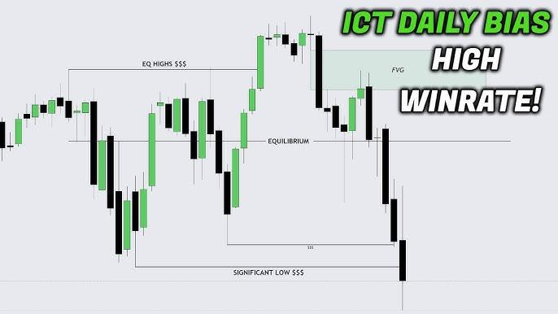

## Table of Contents

## What is trading bias?

Trading bias refers to the tendency of traders to make decisions based on their personal beliefs, emotions, or past experiences rather than on objective analysis of the market. This can lead to mistakes in trading, as these biases can cloud judgment and cause traders to miss out on potential profits or incur unnecessary losses. Common types of trading biases include overconfidence, where traders believe they know more than they actually do, and loss aversion, where the fear of losing money leads to poor decision-making.

For example, a trader might hold onto a losing position longer than they should because they are emotionally attached to it, hoping it will turn around. This is known as the sunk cost fallacy, a type of bias where the trader focuses on past investments rather than current market conditions. To overcome trading biases, it's important for traders to be aware of their own tendencies and to use strategies like setting strict stop-loss orders, keeping a trading journal, and regularly reviewing their performance to make more rational decisions.

## How does trading bias affect decision-making in the stock market?

Trading bias can really mess up how traders make choices in the stock market. When traders let their feelings or past experiences guide them, they might not see the market clearly. For example, if a trader is too sure of themselves, they might take big risks without enough proof that it's a good idea. This overconfidence can lead them to buy or sell stocks at the wrong times, causing them to lose money. Another common problem is when traders are scared to lose money, so they avoid selling a stock even when it's going down. This fear can make them miss chances to cut their losses and move on to better opportunities.

To deal with these biases, traders need to be aware of their own habits and try to make decisions based on facts, not feelings. One way to do this is by setting clear rules for when to buy or sell, like using stop-loss orders to automatically sell a stock if it drops too much. Keeping a trading journal can also help traders see where they might be letting bias affect their choices. By looking back at their trades and thinking about why they made certain decisions, traders can learn to make better choices in the future. This way, they can focus more on what the market is actually doing, instead of what they feel or hope it will do.

## What are the common types of trading biases?

Trading biases are ways that our feelings and thoughts can trick us into making bad choices when trading stocks. One common bias is overconfidence, where traders think they know more than they really do. They might take big risks because they believe they can predict the market, but this often leads to losses. Another bias is loss aversion, where traders are so scared of losing money that they hold onto losing stocks too long, hoping they'll go back up. This fear can make them miss out on better opportunities.

Confirmation bias is also common, where traders only look for information that supports what they already believe. For example, if they think a stock will go up, they might ignore news that suggests it won't. Anchoring bias happens when traders focus too much on the first piece of information they get, like the price they bought a stock at, and it affects all their future decisions. Lastly, the sunk cost fallacy makes traders keep a losing position because they've already put so much money into it, even though it's not a good idea to keep it.

To deal with these biases, traders need to be aware of them and try to make decisions based on facts, not feelings. Setting clear rules for buying and selling, like using stop-loss orders, can help. Keeping a trading journal to look back at past decisions and learn from them is also a good idea. By understanding and managing these biases, traders can make better choices and improve their chances of success in the stock market.

## Can you explain confirmation bias in trading?

Confirmation bias in trading is when traders only pay attention to information that supports what they already believe. For example, if a trader thinks a stock will go up, they might only look at news articles or reports that say the stock will go up. They ignore any information that says the stock might go down. This can be dangerous because it makes traders see only one side of the story, and they might miss important signs that the stock is not a good investment.

To fight confirmation bias, traders need to make sure they look at all the information available, not just the parts that fit with what they think. They should read different opinions and consider the opposite view before making a decision. By doing this, traders can get a fuller picture of the market and make better choices. It's important to be open-minded and willing to change your mind if the evidence shows you're wrong.

## How does overconfidence bias impact traders?

Overconfidence bias makes traders think they know more about the market than they really do. When traders are overconfident, they might take bigger risks because they believe they can predict what will happen next. They might buy or sell stocks without enough proof that it's a good idea. This can lead to big losses because the market doesn't always do what they expect. For example, a trader might think a stock will go up based on a small piece of good news, but they ignore other signs that the stock might go down.

To deal with overconfidence, traders need to be humble and check their decisions with facts. They should look at all the information, not just what they want to see. Setting clear rules for when to buy or sell, like using stop-loss orders, can help keep overconfidence in check. By admitting they don't know everything and being open to learning, traders can make better choices and avoid the big losses that come from thinking they're always right.

## What is loss aversion and how does it influence trading behavior?

Loss aversion is when traders are more scared of losing money than they are excited about making money. This fear can make them hold onto stocks that are losing value, hoping they will go back up. Instead of selling the stock and cutting their losses, they wait too long because they don't want to accept the loss. This can lead to even bigger losses if the stock keeps going down.

To deal with loss aversion, traders need to set clear rules for when to sell a stock, like using stop-loss orders. These orders automatically sell the stock if it drops to a certain price, helping traders avoid big losses. By focusing on the facts and not letting fear guide their decisions, traders can make better choices and protect their money.

## How can anchoring bias affect a trader's strategy?

Anchoring bias can mess up a trader's strategy by making them focus too much on the first piece of information they get. For example, if a trader buys a stock at a certain price, they might keep thinking about that price even when the market changes. They might hold onto the stock hoping it will go back to what they paid for it, even if it's not a good idea anymore. This can stop them from seeing the stock's real value and making smart decisions based on what's happening now.

To deal with anchoring bias, traders need to be aware of it and try to look at the big picture. They should not let the first price they see or the price they bought at affect all their future choices. Instead, they should keep checking the market and be ready to change their mind if the facts show they should. By doing this, traders can make better decisions and avoid sticking to a plan that doesn't work anymore just because of an old anchor.

## What role does the availability heuristic play in trading decisions?

The availability heuristic is when traders make decisions based on the information that's easiest to remember or most recent. For example, if a trader just heard about a big company doing well, they might think all stocks are doing well and decide to buy more. This can be a problem because they might not look at all the facts and could miss important details that show the market is not as good as they think.

To avoid the availability heuristic, traders need to take a step back and look at all the information they can find, not just what's fresh in their mind. They should do their research and not let recent news or easy-to-remember stories guide all their choices. By being more thorough and considering a wider range of data, traders can make better decisions and avoid being tricked by what's most available in their memory.

## How can a trader identify their own biases?

A trader can identify their own biases by keeping a trading journal. In this journal, they write down every trade they make, why they made it, and how they felt at the time. By looking back at their journal, they can see patterns in their decisions. For example, if they often hold onto losing stocks hoping they'll go back up, that might be a sign of loss aversion. If they keep taking big risks without enough proof, that could be overconfidence. Seeing these patterns helps traders understand their biases.

Another way to spot biases is by talking to other traders or a mentor. Sometimes, it's hard to see our own biases, but others can point them out. For example, if a trader always focuses on the first price they see and ignores new information, a friend might notice this and tell them about anchoring bias. By being open to feedback and willing to learn, traders can get a better view of their own habits and work on making better choices.

## What strategies can traders use to mitigate the effects of biases?

To mitigate the effects of biases, traders can start by keeping a trading journal. In this journal, they write down every trade, why they made it, and how they felt at the time. By looking back at their journal, traders can see patterns in their decisions and spot biases like overconfidence or loss aversion. For example, if they often hold onto losing stocks hoping they'll go back up, that's a sign of loss aversion. By being aware of these patterns, traders can work on making better choices based on facts, not feelings.

Another strategy is to set clear rules for buying and selling, like using stop-loss orders. These orders automatically sell a stock if it drops to a certain price, helping traders avoid big losses due to biases like loss aversion or overconfidence. Traders should also seek feedback from other traders or a mentor. Sometimes, it's hard to see our own biases, but others can point them out. By being open to feedback and willing to learn, traders can get a better view of their own habits and improve their trading decisions.

## How do advanced traders use bias awareness to gain a competitive edge?

Advanced traders use their understanding of biases to spot when other traders might be making mistakes. They know that many traders are influenced by biases like overconfidence or loss aversion. For example, if a lot of traders are holding onto a losing stock because they're scared to sell it at a loss, an advanced trader might see this as a chance to sell short. By recognizing these patterns, they can make trades that go against the common biases and take advantage of the mistakes others are making.

Another way advanced traders use bias awareness is by managing their own biases better. They keep a trading journal to track their decisions and look for signs of bias in their own behavior. By being aware of their own tendencies, they can set strict rules like using stop-loss orders to avoid letting emotions guide their choices. This helps them stay focused on the market's actual movements and make more rational decisions, giving them a competitive edge over traders who are less aware of their biases.

## What are the latest research findings on trading biases and their impact on market efficiency?

Recent research on trading biases shows that these biases can really mess up how well the market works. When a lot of traders make choices based on their feelings or past experiences instead of facts, it can make stock prices move in ways that don't make sense. For example, if many traders are overconfident and buy a stock because they think it will go up, the price might go up too much and not match what the company is really worth. This can make the market less efficient because prices don't always show the true value of stocks.

Studies also show that understanding and managing biases can help make the market work better. When traders are aware of their own biases and use tools like stop-loss orders to make more rational choices, it can help keep stock prices more in line with what they should be. Researchers have found that markets with more informed and less biased traders tend to be more efficient. This means that by working on their own biases, traders can help make the whole market fairer and more accurate.

## References & Further Reading

[1]: Dreman, D. N. (1998). ["Contrarian Investment Strategies: The Psychological Edge"](https://www.amazon.com/Contrarian-Investment-Strategies-Psychological-Edge/dp/0743297962). Free Press.

[2]: Kahneman, D. (2011). ["Thinking, Fast and Slow"](https://link.springer.com/article/10.1007/s00362-013-0533-y). Farrar, Straus and Giroux.

[3]: Thaler, R. H. (2015). ["Misbehaving: The Making of Behavioral Economics"](https://link.springer.com/article/10.1007/s11127-015-0276-5). W. W. Norton & Company.

[4]: Tversky, A., & Kahneman, D. (1992). ["Advances in Prospect Theory: Cumulative Representation of Uncertainty."](https://link.springer.com/article/10.1007/BF00122574) Journal of Risk and Uncertainty, 5(4), 297–323.

[5]: Pompian, M. M. (2006). ["Behavioral Finance and Wealth Management"](https://onlinelibrary.wiley.com/doi/book/10.1002/9781119202400). Wiley. 

[6]: Rapp, K. (2009). ["Cognitive Biases in Economic Decisions – Four Essays on the Effects of Algorithm Aversion and Other Cognitive Shortcomings."](https://www.ncbi.nlm.nih.gov/pmc/articles/PMC11260376/). Stockholm University.