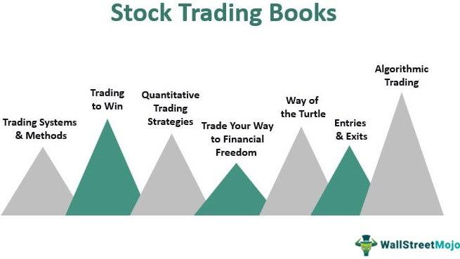

Algorithmic trading, or algo trading, represents a significant advancement within financial markets, gaining considerable traction in recent years. By leveraging computer programs to execute trades based on predefined criteria, algorithmic trading enhances efficiency and decision-making capabilities that are beyond human capacity. This article focuses on key aspects of financial markets investment, particularly emphasizing trading books and algorithmic trading. 

A trading book, typically maintained by banks or brokerage firms, comprises all tradable assets held by the institution. These assets undergo active trading, directly influencing the financial health of the entity. Furthermore, trading books have broader economic ramifications, especially during periods of financial distress, where their losses can escalate instability in financial systems. Thus, understanding the mechanics and implications of a trading book is crucial for investors and financial professionals.



In the context of algo trading, the article highlights influential literature that has shaped its practice and theory. These works provide insights into both foundational and advanced strategies, catering to varying levels of expertise. For novice investors and seasoned traders alike, grasping the intricacies of algorithmic trading and trading books is essential for developing robust investment strategies and maintaining a competitive edge in dynamic financial markets.

## Table of Contents

## Understanding Financial Markets and Trading Books

A trading book, also known as a trading portfolio, is an essential component of banks and brokerage firms, encompassing a diverse array of tradable assets. These assets, which may include stocks, bonds, foreign exchange, commodities, and derivatives, are actively bought and sold to optimize returns and manage risk exposure. The dynamic nature of trading books means they are continuously updated in response to market conditions, with the profitability and stability of an institution significantly influenced by their performance.

Trading books serve a dual purpose within financial institutions. Firstly, they facilitate investment strategies aimed at generating returns. Secondly, they play a critical role in risk management, allowing institutions to hedge against potential losses from adverse price movements in broader market conditions. As a result, the assets within a trading book are subjected to constant reevaluation based on their market value, demanding real-time data analysis and decision-making.

The valuation process of trading book assets follows mark-to-market accounting principles, where assets are priced according to their current market value. This methodology ensures that the trading book reflects an accurate and timely financial position of the firm. It also means that the institution faces exposure to market volatility, where price fluctuations can lead to significant financial gains or, conversely, substantial losses.

During periods of financial crises, trading book losses have proven critical in exacerbating financial instability. The 2008 financial crisis serves as a pertinent example, where complex financial products within trading [books](/wiki/algo-trading-books), exacerbated by a lack of [liquidity](/wiki/liquidity-risk-premium), led to severe systemic failures. The crisis underscored the importance of rigorous risk management and oversight in the handling of trading books to prevent market disruptions.

In recent years, regulatory frameworks have evolved to mitigate the risks associated with trading books. The Basel Accords, for instance, introduced stricter capital requirements and stress testing for trading books to ensure financial institutions maintain sufficient capital buffers against potential losses. These measures aim to stabilize financial markets by enhancing the transparency and robustness of trading book operations.

Understanding the intricacies of trading books provides valuable insights into the operations and challenges faced by financial institutions. As financial markets continue to evolve, the strategic management of trading books remains pivotal in navigating the complexities of modern finance.

## The Rise of Algorithmic Trading

Algorithmic trading involves utilizing sophisticated computer programs that execute trades based on a set of predefined criteria. These criteria, often comprised of mathematical models and algorithms, allow trades to be executed at speeds and frequencies that far surpass human capabilities. At its core, [algorithmic trading](/wiki/algorithmic-trading) relies on precise instructions that can swiftly analyze market data, identify opportunities, and perform transactions without the delay inherent in manual trading.

Prized for its speed and efficiency, algorithmic trading has significantly bolstered market liquidity. High-frequency trading ([HFT](/wiki/high-frequency-trading-strategies)), a subset of algorithmic trading, exemplifies this by executing a large number of orders at extremely fast speeds, often milliseconds or microseconds. The cumulative effect of these rapid transactions contributes to a more liquid market environment, wherein assets can be bought and sold with ease, minimizing price impacts and [volatility](/wiki/volatility-trading-strategies).

Additionally, algorithmic trading brings about more systematic trading methods. By integrating algorithms with robust data analytics, traders can reduce human errors and emotional decision-making, turning trading into a disciplined, strategic process. The use of [backtesting](/wiki/backtesting), a common practice in algorithmic trading where strategies are tested against historical data, ensures that trading decisions are based on empirical evidence rather than speculation. This serves to refine algorithms and optimize strategies before they are deployed in live markets.

As technology advances, algorithmic trading is becoming increasingly accessible to a broader audience. What was once the domain of large financial institutions is now open to individual investors and smaller firms through platforms and tools that demystify the complexities of algorithm development and execution. Programming languages like Python provide accessible means for traders to develop their algorithms. Libraries such as NumPy, pandas, and scikit-learn streamline the handling of data and modeling of trading strategies.

The accessibility of algorithmic trading presents substantial opportunities. Retail investors can leverage readily available data and algorithmic tools to compete in the market. Institutional investors benefit from enhanced precision and efficiency in portfolio management. This democratization of trading technology encourages innovation and competition, fostering a dynamic financial ecosystem that accommodates diverse trading styles and strategies.

In essence, the rise of algorithmic trading marks a transformative era for financial markets, characterized by greater efficiency, increased liquidity, and more structured methods of trading that provide exciting opportunities for both individual and institutional investors.

## Top Books on Algorithmic Trading for 2024

Books provide invaluable knowledge, taking readers from foundational concepts to more complex trading strategies. Among the essential literature for those interested in algorithmic trading for 2024, several works stand out:

**'Quantitative Trading' by Dr. Ernest Chan**: This book serves as an excellent introduction for beginners in algorithmic trading. Dr. Ernest Chan provides a clear explanation of quantitative trading systems, guiding readers through the processes of developing and testing trading strategies. It covers topics such as statistical arbitrage, risk management, and technical analysis. The practical examples and accessible language make it a popular choice for novices. 

**'Algorithmic Trading: Winning Strategies and Their Rationale'**: This book targets those who are new to algorithmic trading. It provides a comprehensive guide to developing and implementing systematic trading strategies. Key topics include market microstructure, execution algorithms, and performance evaluation. The book emphasizes the importance of understanding market dynamics and the rationale behind each trading strategy, offering a solid foundation for beginners.

**'Advances in Financial Machine Learning' by Marcos López de Prado**: This book is designed for advanced practitioners and offers deeper insights into leveraging machine learning techniques in trading. López de Prado introduces groundbreaking methods for constructing and optimizing trading strategies using machine learning. Topics covered include labeling data, backtesting, and feature importance. His rigorous approach and empirical focus provide a solid framework for integrating machine learning into trading systems.

**'Python for Finance' by Yves J. Hilpisch**: Hilpisch's work is crucial for those interested in combining coding with trading strategies. This book explores Python's powerful applications in finance, particularly in algorithmic trading. Readers are guided through essential Python libraries such as NumPy, pandas, and scikit-learn, with practical examples demonstrating how to construct trading strategies and perform financial analytics. The book is well-suited for traders looking to enhance their coding skills and apply them to finance.

These books collectively cover a wide range of topics, from basic concepts to advanced techniques, providing readers with knowledge crucial to navigating and succeeding in algorithmic trading. Whether developing new strategies or optimizing existing ones, the insights offered by these works are indispensable for modern traders.

## Practical Insights and Strategies

Understanding the basic mathematics and statistical foundations of algorithmic strategies is indispensable for achieving success in algorithmic trading. These strategies often involve complex models that can predict market movements and execute trades with precision. A firm grasp of probability, [statistics](/wiki/bayesian-statistics), and mathematical optimization is essential to develop and refine these models effectively.

Python has emerged as a preferred language among algorithmic traders due to its simplicity and the wide array of libraries available for data analysis and backtesting. Libraries such as Pandas and NumPy facilitate data manipulation and numerical analysis, while Matplotlib and Seaborn are excellent for visualizing data. To illustrate the use of Python in backtesting a simple moving average crossover strategy, consider the following code snippet:

```python
import pandas as pd
import numpy as np
import matplotlib.pyplot as plt

# Assuming 'data' is a DataFrame with historical stock prices
data['SMA_20'] = data['Close'].rolling(window=20).mean()
data['SMA_50'] = data['Close'].rolling(window=50).mean()

data['Signal'] = 0
data['Signal'][20:] = np.where(data['SMA_20'][20:] > data['SMA_50'][20:], 1, -1)

data['Position'] = data['Signal'].shift()

# Plotting
plt.figure(figsize=(14,7))
plt.plot(data['Close'], label='Close Price')
plt.plot(data['SMA_20'], label='20-Day SMA', alpha=0.7)
plt.plot(data['SMA_50'], label='50-Day SMA', alpha=0.7)
plt.title('Moving Average Crossover Strategy')
plt.legend()
plt.show()
```

This code calculates 20-day and 50-day simple moving averages (SMA) and uses them to generate buy and sell signals.

A comprehensive understanding of risk management is necessary for effectively controlling potential losses. Risk management in algorithmic trading involves determining the amount of capital to allocate to each trade, as well as setting appropriate stop-loss levels to protect the portfolio from significant drawdowns. Concepts such as the Sharpe Ratio and Value at Risk (VaR) are commonly used to assess and manage risk.

Investing time in learning from leading experts through recommended literature can provide significant benefits, offering insights into successful strategies and common pitfalls. Books like "Quantitative Trading" by Dr. Ernest Chan and "Advances in Financial Machine Learning" by Marcos López de Prado offer expert guidance for navigating the complexities of algorithmic trading.

By focusing on these key areas—mathematics, programming, expert insights, and risk management—traders can develop a strategic edge, enabling them to thrive in the fast-paced and volatile environment of financial markets.

## Conclusion

Embracing algorithmic trading necessitates a combination of financial acumen, coding skills, and strategic insight. The integration of these elements allows traders to exploit market inefficiencies and enhance their trading strategies' effectiveness. Utilizing the right resources, such as the recommended books, can significantly enhance a trader's proficiency in algorithmic trading. Books that focus on quantitative methods, programming, and advanced financial [machine learning](/wiki/machine-learning) not only offer foundational knowledge but also introduce novel concepts and strategies that practitioners can apply directly in live markets.

The progression of algorithmic trading is evident in its increasing presence in global financial markets. This evolution is driven by advancements in technology, increased data availability, and the development of sophisticated algorithms that can execute trades with speed and precision. Traders who proactively engage with the latest developments and equip themselves with a comprehensive understanding stand to gain a marked advantage. This advantage is manifested in the ability to respond swiftly to market opportunities, optimize trade execution, and manage risks effectively.

Algorithmic trading also presents a unique opportunity for traders to merge coding skills with strategic financial insights, thereby creating customizable trading solutions. By mastering programming tools like Python, traders can develop and refine algorithms that suit their specific trading styles and risk appetites. Such personalization of trading strategies allows for more efficient capture of trading opportunities and better adaptation to market changes.

In conclusion, the undeniable evolution of algorithmic trading offers vast opportunities for those willing to invest in their education and skillset. As markets continue to evolve with technological advancements, traders equipped with the right knowledge and tools will maintain a competitive edge, enabling them to thrive in a dynamic financial environment.

## References & Further Reading

[1]: ["Quantitative Trading: How to Build Your Own Algorithmic Trading Business"](https://www.amazon.com/Quantitative-Trading-Build-Algorithmic-Business/dp/1119800064) by Ernest P. Chan

[2]: ["Algorithmic Trading: Winning Strategies and Their Rationale"](https://www.wiley.com/en-us/Algorithmic+Trading%3A+Winning+Strategies+and+Their+Rationale-p-9781118460146) by Ernest P. Chan

[3]: ["Advances in Financial Machine Learning"](https://www.amazon.com/Advances-Financial-Machine-Learning-Marcos/dp/1119482089) by Marcos Lopez de Prado

[4]: ["Python for Finance: Mastering Data-Driven Finance"](https://www.amazon.com/Python-Finance-Mastering-Data-Driven/dp/1492024333) by Yves J. Hilpisch

[5]: ["Machine Learning for Algorithmic Trading: Predictive models to extract signals from market and alternative data for systematic trading strategies with Python"](https://www.amazon.com/Machine-Learning-Algorithmic-Trading-alternative/dp/1839217715) by Stefan Jansen