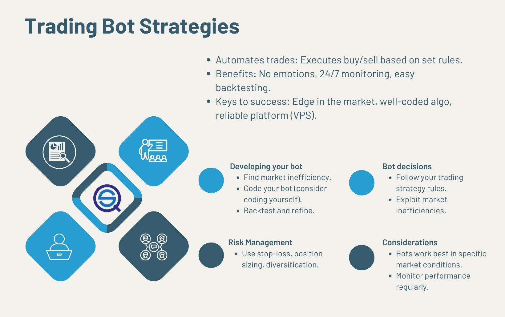

## Table of Contents

## What is a trading bot and why might someone want to use one?

A trading bot is a computer program that buys and sells things like stocks, cryptocurrencies, or other financial assets automatically. It uses rules and math to decide when to trade, without a person having to do it manually. Trading bots can work all the time, even when you're sleeping or busy with other things.

Someone might want to use a trading bot because it can save time and effort. Instead of watching the market all day, a bot can do it for you. It can also help make decisions faster than a human could, which might lead to making more money. Plus, trading bots can stick to a plan without getting emotional, which can sometimes help avoid bad decisions that people might make when they're feeling stressed or excited.

## What are the basic components of a trading bot?

A trading bot is made up of a few important parts that help it work well. The first part is the trading strategy. This is like a set of rules that tells the bot when to buy or sell. The strategy can be simple or very complicated, depending on what the person using the bot wants. Another key part is the data feed. This is where the bot gets information about prices and other important things it needs to make decisions. The bot uses this data to follow its trading strategy.

The second important part of a trading bot is the execution system. This part actually makes the trades happen. It sends orders to buy or sell to the market based on what the strategy says. The execution system needs to be fast and reliable so the bot can trade at the right time. Lastly, there's often a risk management system. This part helps keep the bot from making trades that could lose too much money. It can set limits on how much to trade or when to stop trading if things are going badly.

## How do you choose a programming language for building a trading bot?

When choosing a programming language for building a trading bot, you should think about a few things. First, consider how fast the language is. Trading bots need to make decisions and act quickly, so a language like C++ or Rust might be good because they run fast. But, these languages can be hard to learn and use. On the other hand, languages like Python are easier to learn and have lots of tools and libraries that can help with building trading bots, even if they might not be as fast.

Another thing to think about is the support and community around the language. If many people use the language for trading, you can find more help and examples online. Python, for example, has a big community and lots of libraries like Pandas and NumPy that are great for working with data, which is important for trading bots. Also, think about where you want your bot to work. Some languages are better for certain platforms or have better tools for connecting to trading APIs.

In the end, the choice of language depends on what you need and what you're comfortable with. If you're new to programming, starting with Python might be easier because it's simpler to learn and has a lot of resources. But if you need the bot to be very fast and you're good with harder languages, C++ or Rust might be better. Just make sure the language you pick can do what you need it to do for your trading bot.

## What are the essential steps to develop a basic trading strategy?

To develop a basic trading strategy, you first need to decide what you want to achieve. Do you want to make quick profits, or are you looking to invest for the long term? Once you know your goal, you can start setting rules for when to buy and sell. A simple rule might be to buy when a price goes up by a certain amount and sell when it goes down by another amount. You can also look at other things like how much the price moves around or what other people are doing in the market.

After setting your rules, you need to test them to see if they work. You can use old data to see how your strategy would have done in the past. This is called backtesting. If your strategy makes money in the backtest, that's a good sign, but remember, past results don't always mean future success. You might need to change your rules a bit to make them better. Once you're happy with your strategy, you can start using it for real trading, but always keep an eye on how it's doing and be ready to make changes if needed.

## How can you backtest a trading strategy and why is it important?

Backtesting a trading strategy means you use old data to see how well your strategy would have worked in the past. You can do this by writing a computer program or using special software that lets you feed in historical prices and other market data. The program follows your trading rules to make pretend trades and then shows you how much money you would have made or lost. This helps you see if your strategy is good or if it needs changes before you start using real money.

It's really important to backtest because it gives you a way to check your strategy without risking any money. If your strategy loses money in the backtest, you know it might not be a good idea to use it for real trading. Backtesting can also help you find out if your rules need to be tweaked a bit to work better. But remember, just because a strategy worked well in the past doesn't mean it will work well in the future. Markets change, so you always need to keep watching and adjusting your strategy.

## What are common indicators used in trading bot strategies?

Common indicators used in trading bot strategies include moving averages, which help smooth out price data to see the overall trend. A simple moving average calculates the average price over a set number of periods, while an exponential moving average gives more weight to recent prices. Traders often use two moving averages, a short-term one and a long-term one, to spot when they cross over each other. This crossover can signal when to buy or sell. Another popular indicator is the Relative Strength Index (RSI), which measures how fast prices are changing to see if a stock is overbought or oversold. An RSI above 70 might mean it's time to sell because the price might be too high, while below 30 could mean it's time to buy because the price might be too low.

Other common indicators include the Moving Average Convergence Divergence (MACD), which shows the relationship between two moving averages of a security's price. The MACD line is the difference between a fast and slow exponential moving average, and traders watch for when this line crosses above or below a signal line to decide when to trade. Bollinger Bands are also widely used; they consist of a middle band being a moving average, with upper and lower bands that are standard deviations away from the middle. When prices move outside the bands, it might signal that the price is about to change direction. These indicators help trading bots make decisions based on patterns and trends in the market, making it easier to decide when to buy or sell without human emotion getting in the way.

## How do you integrate risk management into a trading bot strategy?

Integrating risk management into a trading bot strategy is important to protect your money. One way to do this is by setting stop-loss orders. A stop-loss order tells the bot to sell a stock if its price falls to a certain level. This helps limit how much money you can lose on a single trade. Another way is to set a maximum amount of money the bot can use for trading at one time. This is called position sizing. By only using a small part of your total money for each trade, you can avoid losing everything if things go wrong.

You can also use a strategy called diversification. This means the bot trades different kinds of stocks or assets, not just one. If one type of stock goes down, the others might go up, which can balance out your losses. Another important part of risk management is setting a drawdown limit. A drawdown is how much your money goes down from its highest point. If your money goes down by a certain amount, the bot can stop trading until things get better. This helps keep you from losing too much money in a short time. By using these methods, your trading bot can work smarter and safer.

## What are the differences between high-frequency trading and long-term trading bots?

High-frequency trading bots and long-term trading bots are different in how fast they trade and what they aim to do. High-frequency trading bots make lots of trades very quickly, sometimes in just a few seconds. They use small price changes to make small profits many times. These bots need to be very fast and use a lot of computer power to work well. They often trade things like stocks or currencies and try to make money from tiny price movements that happen all the time.

On the other hand, long-term trading bots hold onto their investments for a longer time, like days, weeks, or even months. They look at bigger trends in the market and try to make money from these trends over time. These bots don't need to be as fast as high-frequency bots, but they need good strategies to pick the right times to buy and sell. Long-term trading bots might trade stocks, cryptocurrencies, or other assets, and they aim to make bigger profits from fewer trades.

## How can machine learning be applied to enhance trading bot strategies?

Machine learning can make trading bots smarter by helping them learn from past data and make better trading decisions. Instead of just following set rules, a trading bot with machine learning can find patterns in the market that might be hard for people to see. For example, the bot can use machine learning to predict how prices might change based on what has happened before. This can help the bot decide when to buy or sell to make more money. Machine learning can also help the bot get better over time by learning from its past trades, so it can keep improving its strategy.

Using machine learning in trading bots can also help with managing risk. The bot can learn which kinds of trades are more likely to lose money and avoid those, or it can learn how much money to use for each trade to keep losses small. This means the bot can be safer and smarter about how it trades. Overall, machine learning can make trading bots more flexible and able to handle the ups and downs of the market better than bots that just follow simple rules.

## What are the legal and ethical considerations when operating a trading bot?

When you use a trading bot, you need to think about the rules and what's right and wrong. In many places, there are laws about trading, like rules against insider trading or market manipulation. Insider trading means using secret information to trade, which is not fair. Market manipulation is when someone tries to trick the market to make prices go up or down. If your trading bot does these things, you could get in big trouble. It's important to make sure your bot follows all the laws in the places where you trade.

Also, think about what's fair and honest. Some people might see using a trading bot as cheating because it can trade faster than a person can. It's a good idea to be open about using a bot and not try to hide it. Being honest and fair can help keep trust in the markets. If everyone thinks trading bots are making things unfair, it could hurt the whole system. So, always use your trading bot in a way that is legal and doesn't harm others.

## How do you optimize and fine-tune a trading bot strategy based on performance metrics?

To optimize and fine-tune a trading bot strategy, you need to look at how well it's doing by using performance metrics. These metrics can tell you things like how much money the bot is making, how often it wins or loses, and how much risk it's taking. One important metric is the profit and loss, which shows if the bot is making more money than it's losing. Another is the win rate, which tells you how often the bot's trades are successful. You also need to check the risk-reward ratio to see if the bot is making enough money to be worth the risk. By looking at these numbers, you can see what's working and what's not.

Once you know how the bot is doing, you can start making changes to make it better. If the bot is losing too much money, you might need to adjust the rules for when it buys or sells. Maybe the bot is buying too often or not selling at the right times. You can also change how much money the bot uses for each trade to manage risk better. It's a good idea to test these changes by running the bot again with old data to see if they help. Keep tweaking the strategy until the performance metrics show that the bot is doing better. Remember, it's important to keep watching the bot even after you've made changes, because markets can change, and what works today might not work tomorrow.

## What advanced techniques can be used to handle market volatility and adapt strategies dynamically?

To handle market volatility and adapt strategies dynamically, trading bots can use something called adaptive algorithms. These algorithms change how the bot trades based on what's happening in the market right now. For example, if the market is moving a lot, the bot might trade less often to avoid big losses. Or, if the market is calm, the bot might trade more to take advantage of small price changes. The bot can also use machine learning to learn from the market and adjust its strategy over time. This means the bot can get better at trading as it sees more data and figures out what works best.

Another technique is using multiple strategies at the same time. Instead of sticking to one way of trading, the bot can use different strategies for different situations. For example, one strategy might work well when the market is going up, while another might be better when the market is going down. The bot can switch between these strategies based on what it sees in the market. This way, the bot can be more flexible and handle different kinds of market conditions better. By using these advanced techniques, a trading bot can deal with the ups and downs of the market and keep making smart trades.

## What are Common Crypto Bot Trading Strategies?

Crypto bot trading leverages various strategies to capitalize on market dynamics. Among the most prevalent strategies are scalping, arbitrage, [momentum](/wiki/momentum) trading, and range trading. Each strategy utilizes specific market characteristics and tools to optimize trade execution and results.

**Scalping** is a strategy designed to make small profits from numerous trades. It involves rapid buying and selling within short time frames, often seconds to minutes. The primary goal is to accumulate profits over a significant number of transactions, leveraging minimal price fluctuations. Scalping demands a bot with high-speed execution capabilities and access to real-time market data to track minute price changes effectively.

**Arbitrage** seeks to profit from price discrepancies of the same cryptocurrency across different exchanges. This strategy is especially effective in a fragmented market where prices can vary significantly. For instance, if Bitcoin is priced at $40,000 on Exchange A and $40,050 on Exchange B, a bot can buy on Exchange A and sell on Exchange B, locking in the price difference as profit. The formula for potential profit in a basic arbitrage transaction is:

$$
\text{Profit} = (\text{Price on Exchange B} - \text{Price on Exchange A}) - \text{Transaction Costs}
$$

Implementing an effective arbitrage strategy requires low-latency connections and swift execution to capitalize on transient price differences.

**Momentum Trading** involves the use of indicators such as moving averages, Relative Strength Index (RSI), and MACD to identify and capitalize on emerging trends. The principle behind momentum trading is to enter a trade at the initiation of a trend and exit as it weakens. This strategy requires bots to dynamically adjust to market trends by interpreting indicator signals. Below is an example of implementing a simple momentum trading strategy using a moving average crossover in Python:

```python
import numpy as np
import pandas as pd

def moving_average_crossover_strategy(prices, short_window=50, long_window=200):
    signals = pd.DataFrame(index=prices.index)
    signals['price'] = prices
    # Short-term moving average
    signals['short_mavg'] = prices.rolling(window=short_window, min_periods=1).mean()
    # Long-term moving average
    signals['long_mavg'] = prices.rolling(window=long_window, min_periods=1).mean()
    # Generate trading signals
    signals['signal'] = np.where(signals['short_mavg'] > signals['long_mavg'], 1.0, 0.0)
    signals['positions'] = signals['signal'].diff()

    return signals
```

**Range Trading** is based on identifying price support and resistance levels where prices tend to oscillate. The strategy involves buying at the lower support level and selling at the upper resistance level, effectively trading within a defined price range. Range trading is reliable in stable markets without clear trends. However, it requires bots to adapt if market conditions change and prices break beyond established support or resistance levels. A critical component of this strategy is the identification of support and resistance, which can be enhanced using technical indicators like Bollinger Bands or the Average True Range (ATR).

Each of these strategies necessitates an understanding of market conditions and the ability to configure and adjust the bot parameters accordingly to minimize risks and maximize returns. Whether leveraging minute price differences, market inefficiencies, trends, or stable price ranges, effective implementation and continuous strategy refinement are key to optimizing crypto bot trading endeavors.

## How can one develop a profitable crypto bot strategy?

To construct a profitable crypto bot strategy, it is essential to begin with a foundation grounded in both historical data and comprehensive market analysis. A reliable market edge is the cornerstone of any successful trading strategy. By scrutinizing past market behaviors, traders can identify patterns and trends that may recur, allowing the bot to capitalize on these insights.

Risk management is a critical aspect that must be integrated into any trading strategy to guard against unpredictable market shifts and to maximize profit potential. This involves defining parameters such as position sizes, leverage, and stop-loss orders. Position sizing is crucial; using techniques like the Kelly Criterion can optimize the amount to trade based on edge and variance:

$$
f^* = \frac{bp - q}{b}
$$

Where:
- $f^*$ is the fraction of capital to risk,
- $b$ is the odds received on the wager (i.e., profit if you win),
- $p$ is the probability of winning,
- $q$ is the probability of losing, which is $1-p$.

Leverage should be used judiciously to enhance returns without exposing the portfolio to excessive risk. Stop-loss orders act as a safeguard to limit potential losses by automatically exiting a position when it moves against a trader's predetermined threshold.

A well-devised crypto bot strategy also necessitates constant [backtesting](/wiki/backtesting) and real-time monitoring. Backtesting involves running the chosen strategy on historical data to assess its validity and effectiveness. This process can reveal the strategy's strengths and weaknesses, providing opportunities for refinement. Python libraries such as Backtrader and Zipline can be used efficiently for this purpose:

```python
import backtrader as bt

# Define a simple moving average strategy
class SmaStrategy(bt.Strategy):
    def __init__(self):
        self.sma = bt.indicators.SimpleMovingAverage(self.data.close, period=20)

    def next(self):
        if self.data.close[0] > self.sma[0]:
            self.buy(size=1)
        elif self.data.close[0] < self.sma[0]:
            self.sell(size=1)

# Initialize Cerebro engine
cerebro = bt.Cerebro()
cerebro.addstrategy(SmaStrategy)

# Set data
data = bt.feeds.YahooFinanceData(dataname='BTC-USD', fromdate=datetime(2020,1,1), todate=datetime(2021,1,1))
cerebro.adddata(data)

# Run backtest
cerebro.run()
cerebro.plot()
```

Real-time monitoring is equally important, as the crypto market is highly volatile and subject to rapid changes. Continuous observation and adjustments ensure that the strategy remains aligned with current market conditions and adapts to unforeseen fluctuations.

By focusing on these elements—identifying a market edge, risk management, and continuous testing and monitoring—traders can increase their chances of developing a profitable crypto bot strategy.

## References & Further Reading

[1]: Bergstra, J., Bardenet, R., Bengio, Y., & Kégl, B. (2011). ["Algorithms for Hyper-Parameter Optimization."](https://papers.nips.cc/paper/4443-algorithms-for-hyper-parameter-optimization) Advances in Neural Information Processing Systems 24.

[2]: ["Advances in Financial Machine Learning"](https://www.amazon.com/Advances-Financial-Machine-Learning-Marcos/dp/1119482089) by Marcos Lopez de Prado

[3]: ["Evidence-Based Technical Analysis: Applying the Scientific Method and Statistical Inference to Trading Signals"](https://www.amazon.com/Evidence-Based-Technical-Analysis-Scientific-Statistical/dp/0470008741) by David Aronson

[4]: ["Machine Learning for Algorithmic Trading"](https://github.com/PacktPublishing/Machine-Learning-for-Algorithmic-Trading-Second-Edition) by Stefan Jansen

[5]: ["Quantitative Trading: How to Build Your Own Algorithmic Trading Business"](https://books.google.com/books/about/Quantitative_Trading.html?id=j70yEAAAQBAJ) by Ernest P. Chan