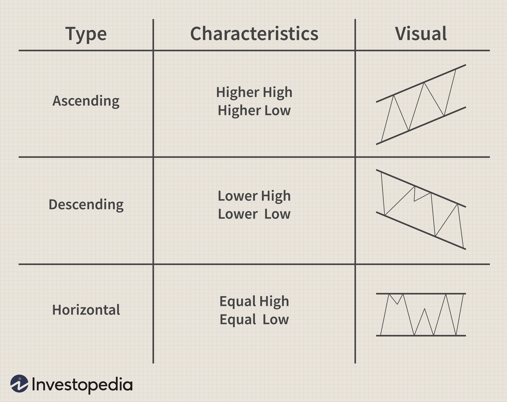

## Table of Contents

## What is a trading channel in technical analysis?

A trading channel in technical analysis is a tool that traders use to understand how a stock or other asset is moving in price over time. It is drawn on a chart and looks like two parallel lines. The top line shows the highest price the asset usually reaches, and the bottom line shows the lowest price. Traders use these lines to guess where the price might go next. If the price touches the top line, it might go down soon. If it touches the bottom line, it might go up.

Channels can be drawn in different ways. Some traders use straight lines to make a channel, which is called a trend channel. This works well when the price is going up or down steadily. Other traders use curved lines to make a channel, which is called a curved channel. This is useful when the price is moving in a more wavy pattern. By watching how the price moves within the channel, traders can make better decisions about when to buy or sell the asset.

## How do you identify a trading channel on a price chart?

To identify a trading channel on a price chart, you need to look at the highs and lows of the price over time. Start by finding at least two major highs and two major lows on the chart. The highs are the points where the price reached its peak before going down again, and the lows are the points where the price hit its bottom before going up again. Once you have these points, draw a straight line connecting the highs and another straight line connecting the lows. These lines should be parallel to each other, creating a channel that the price moves within.

After drawing the lines, check if the price stays mostly within the channel. It's okay if the price occasionally breaks out of the channel, but if it happens too often, you might need to adjust your lines or consider that it's not a valid channel. The channel can be upward, downward, or sideways, depending on the trend of the price. An upward channel means the price is generally increasing, a downward channel means it's generally decreasing, and a sideways channel means the price is staying about the same. By watching how the price behaves within the channel, you can make better guesses about where it might go next.

## What are the different types of trading channels?

There are three main types of trading channels: ascending channels, descending channels, and horizontal channels. An ascending channel is when the price of an asset keeps going up over time. It looks like two upward-sloping lines on a chart, with the price moving between them. A descending channel is the opposite; it shows the price going down over time, with two downward-sloping lines. A horizontal channel means the price stays about the same, moving between two flat lines.

Each type of channel helps traders understand the trend of the price and make decisions about buying or selling. In an ascending channel, traders might buy when the price is near the bottom line and sell when it's near the top line. In a descending channel, they might sell when the price is near the top line and buy when it's near the bottom line. In a horizontal channel, traders can buy at the bottom line and sell at the top line, expecting the price to keep moving back and forth between the two lines.

## How does an ascending channel differ from a descending channel?

An ascending channel shows that the price of an asset is going up over time. It looks like two lines on a chart that are going up at the same angle. The price moves between these two lines, touching the bottom line and then moving up to touch the top line. Traders who see an ascending channel might decide to buy the asset when the price is near the bottom line because they think it will keep going up. They might sell it when the price gets close to the top line, expecting it to go back down a bit before going up again.

A descending channel is the opposite. It shows that the price of an asset is going down over time. On a chart, it looks like two lines that are going down at the same angle. The price moves between these two lines, touching the top line and then moving down to touch the bottom line. Traders who see a descending channel might decide to sell the asset when the price is near the top line because they think it will keep going down. They might buy it when the price gets close to the bottom line, expecting it to go back up a bit before going down again.

## What is a horizontal channel and how is it used in trading?

A horizontal channel is a type of trading channel where the price of an asset stays about the same over time. On a chart, it looks like two flat lines that are parallel to each other. The price moves between these two lines, touching the bottom line and then moving up to touch the top line. This means the price is not going up or down a lot, it's just moving back and forth within a certain range.

Traders use a horizontal channel to make decisions about buying and selling the asset. If they see the price near the bottom line, they might decide to buy it because they think it will go back up to the top line. If the price is near the top line, they might sell it because they think it will go back down to the bottom line. By watching how the price moves within the channel, traders can try to make money by buying low and selling high within the range of the channel.

## What are the key indicators used to confirm trading channels?

To confirm a trading channel, traders often look at several key indicators. One important indicator is the trendline. Traders draw trendlines along the highs and lows of the price to see if they can form a channel. If the price stays between these lines, it suggests that the channel is valid. Another indicator is [volume](/wiki/volume-trading-strategy). If the volume is high when the price hits the top or bottom of the channel, it can confirm that the channel is strong. Low volume at these points might mean the channel is weak and could break soon.

Another useful indicator is the moving average. Traders often use moving averages to see if the price is staying within the channel. If the price is above the moving average when it's near the top of the channel and below it when it's near the bottom, it can help confirm the channel. Lastly, traders also use technical indicators like the Relative Strength Index (RSI) or the Moving Average Convergence Divergence (MACD). These can show if the price is overbought or oversold within the channel, helping traders decide when to buy or sell.

## How can moving averages help in identifying and trading channels?

Moving averages can help traders see if a trading channel is real and working. A moving average is a line on a chart that shows the average price of an asset over a certain time. When traders draw a channel, they can use a moving average to check if the price is moving the right way. If the price is going up and down inside the channel and stays above the moving average near the top of the channel, and below it near the bottom, it can show that the channel is strong. This helps traders feel more sure about buying near the bottom and selling near the top of the channel.

Traders also use moving averages to spot when the channel might break. If the price starts to move outside the channel and crosses the moving average, it could mean the channel is not working anymore. For example, if the price goes below the moving average when it's supposed to be near the top of the channel, it might be time to sell or get out of the trade. By watching the moving average, traders can make better choices about when to buy or sell, and when to trust the channel or look for a new one.

## What role do volume indicators play in validating trading channels?

Volume indicators help traders see if a trading channel is strong or weak. When the price of an asset reaches the top or bottom of the channel, traders look at the volume to see how many people are buying or selling. If the volume is high when the price hits these points, it means a lot of people agree with the price movement. This can make the channel stronger and more reliable. Traders feel more confident about buying near the bottom of the channel and selling near the top when they see high volume.

On the other hand, if the volume is low when the price hits the top or bottom of the channel, it might mean the channel is not as strong. Low volume can show that not many people are interested in the price at those points. This can make traders less sure about the channel and more likely to think it might break soon. By watching the volume, traders can decide if the channel is a good one to use for making trading decisions.

## How do you set entry and exit points within a trading channel?

When trading within a channel, setting entry and [exit](/wiki/exit-strategy) points is important for making money. To set an entry point, look at where the price is in the channel. If you see the price near the bottom line of the channel, that's a good time to buy. The idea is that the price will go back up to the top line. So, you enter the trade by buying when the price is low, hoping it will go up.

For setting an exit point, you want to sell when the price gets close to the top line of the channel. This is because the price might start to go down again after hitting the top. So, you exit the trade by selling when the price is high, before it goes back down. By buying low near the bottom and selling high near the top, you can make a profit from the price moving up and down within the channel.

## What are the common strategies for trading within channels?

When trading within channels, one common strategy is called the range trading strategy. This means buying the asset when its price is near the bottom of the channel and selling it when the price gets close to the top. Traders use this strategy because they think the price will keep moving up and down between the two lines of the channel. They watch the price closely and try to buy low and sell high within the channel. This can be a good way to make money if the channel stays strong and the price keeps moving back and forth.

Another strategy is called the [breakout](/wiki/breakout-trading) strategy. This is used when traders think the price might break out of the channel. If the price goes above the top line of the channel, traders might buy the asset, hoping it will keep going up. If the price goes below the bottom line, traders might sell or even sell short, expecting the price to keep going down. This strategy can be riskier because it's hard to know if the price will really break out or if it will just go back into the channel. But if the breakout happens, it can lead to big profits.

## How can advanced traders use channel breakouts to their advantage?

Advanced traders can use channel breakouts to make big profits by being ready for when the price moves outside the channel. When they see the price getting close to the top or bottom line of the channel, they watch closely for signs that it might break out. If the price goes above the top line, they might buy the asset quickly, hoping it will keep going up. If the price goes below the bottom line, they might sell it or even sell short, expecting it to keep going down. By acting fast when a breakout happens, advanced traders can catch big price moves and make more money.

To use channel breakouts well, advanced traders also look at other signs to make sure the breakout is real. They check the volume to see if a lot of people are trading when the price breaks out. High volume can mean the breakout is strong and more likely to keep going. They also use other tools like moving averages or the Relative Strength Index (RSI) to see if the price is overbought or oversold. By using these extra signs, advanced traders can feel more sure about their trades and make better decisions about when to buy or sell during a breakout.

## What are the risks and limitations of trading with channels, and how can they be mitigated?

Trading with channels can be risky because the price might not always stay inside the channel. Sometimes, the price can break out of the channel and move in a way that traders did not expect. This can lead to losses if traders are not ready for it. Another risk is that channels can be hard to draw right. If the lines are not drawn well, the channel might not show the real movement of the price. This can make traders buy or sell at the wrong times. Also, channels might not work well for all kinds of assets or in all market conditions, so traders need to be careful about when and where they use them.

To lower these risks, traders can use other tools to check if the channel is working well. They can look at the volume to see if a lot of people are trading when the price is at the top or bottom of the channel. High volume can mean the channel is strong. Traders can also use other indicators like moving averages or the Relative Strength Index (RSI) to see if the price is overbought or oversold. By using these extra tools, traders can feel more sure about their trades. It's also a good idea to always have a plan for what to do if the price breaks out of the channel, like setting stop-loss orders to limit losses. By being ready for different things that might happen, traders can trade with channels more safely.

## What is a Trading Channel?

A trading channel is a technical analysis tool used to identify potential buying and selling opportunities within a financial market. It is created by plotting two parallel trendlines on a chart, which represent support and resistance levels. These channels are particularly useful in discerning the trading range within which a security's price is likely to move, providing traders insight into potential price reversals.

The construction of a trading channel begins with defining a trendline that connects a series of highs or lows. The corresponding parallel trendline is then drawn on the opposite side of the price action, thus encapsulating the range within which prices are expected to oscillate. This range forms the boundary of the channel and assists traders in visualizing the [momentum](/wiki/momentum) of the asset.

Types of trading channels include trend channels and envelope channels. Trend channels, such as ascending and descending channels, are characterized by their direction. An ascending channel is identified when both trendlines slope upwards, reflecting a rising market trend. Conversely, descending channels are formed when the trendlines slope downwards, indicating a declining trend. 

Envelope channels, like Bollinger Bands, use a different approach by plotting bands around a moving average using a specified number of standard deviations. This approach allows the bands to contract and expand based on market [volatility](/wiki/volatility-trading-strategies), providing a dynamic view of price action. The formulas used to calculate these bands in Bollinger Bands are as follows:

$$

\text{Upper Band} = \text{MA}(n) + k \times \text{StdDev}(n) 
$$
$$
\text{Lower Band} = \text{MA}(n) - k \times \text{StdDev}(n) 
$$

Where:
- $\text{MA}(n)$ is the moving average over $n$ periods.
- $k$ is the number of standard deviations.
- $\text{StdDev}(n)$ is the standard deviation over $n$ periods.

These trading channels not only assist in recognizing possible price targets but also provide alerts for potential breakouts or breakdowns when price actions breach either boundary, prompting strategic decision-making. By identifying these formations, traders are better equipped to anticipate price fluctuations and make informed trading decisions.

## How can Technical Analysis be integrated with Algo Trading?

Integrating technical analysis with [algorithmic trading](/wiki/algorithmic-trading) provides a significant advantage by enabling more data-driven decisions. This process effectively combines historical price data analysis with automated trading systems to enhance trading precision and efficiency.

Technical indicators, such as Moving Averages (MA) and the Relative Strength Index (RSI), play crucial roles in this integration. Moving Averages are used to smooth price data, creating a constantly updated average price. They help in identifying the direction of current trends over a specific period. For instance, a simple moving average (SMA) can be calculated using the formula:

$$
\text{SMA} = \frac{P_1 + P_2 + ... + P_n}{n}
$$

where $P$ represents the price points over $n$ periods. The flexibility of Moving Averages facilitates algorithms' ability to detect trend directions quickly.

The Relative Strength Index, on the other hand, measures the velocity and change of price movements and helps in identifying potential buy or sell signals. The RSI indicator generates values between 0 and 100 and is typically used to identify overbought or oversold conditions which can trigger trading signals. A common interpretation is:

- RSI above 70 may indicate an overbought condition
- RSI below 30 may indicate an oversold condition

Algorithmic trading platforms offer tools that seamlessly integrate these indicators to facilitate automatic execution of trades based on predefined criteria in real-time. For example, using a Python-based trading strategy could entail setting conditions for when the Moving Average crosses above or below a certain level or when the RSI reaches a specific threshold. Here is a simple Python script that demonstrates basic integration:

```python
import pandas as pd
import talib

# Load historical data
data = pd.read_csv('market_data.csv')

# Calculate Moving Average
data['SMA'] = talib.SMA(data['close'], timeperiod=50)

# Calculate RSI
data['RSI'] = talib.RSI(data['close'], timeperiod=14)

# Define buy/sell signals
buy_signal = (data['close'] > data['SMA']) & (data['RSI'] < 30)
sell_signal = (data['close'] < data['SMA']) & (data['RSI'] > 70)

# Signal actions
data['action'] = 'hold'
data.loc[buy_signal, 'action'] = 'buy'
data.loc[sell_signal, 'action'] = 'sell'
```

This script loads market data, calculates the SMA and RSI, and sets buy or sell actions based on these indicators. By employing such automated tools, traders can efficiently react to market conditions without manual monitoring, reducing response times and removing emotional biases from trading decisions.

Furthermore, algorithmic trading systems are equipped to handle complex strategies involving multiple indicators and timeframes, allowing traders to adapt to diverse market conditions efficiently. These systems often include [backtesting](/wiki/backtesting) capabilities to evaluate the effectiveness of strategies using historical data, optimizing performance before deployment in live markets.

The integration of technical analysis with algorithmic trading not only enhances decision-making but also increases the scalability of strategies due to automation and real-time execution capabilities. This synthesis of analytical techniques with algorithmic precision is a pivotal aspect of modern trading strategies.

## References & Further Reading

[1]: Bergstra, J., Bardenet, R., Bengio, Y., & Kégl, B. (2011). ["Algorithms for Hyper-Parameter Optimization."](https://dl.acm.org/doi/10.5555/2986459.2986743) Advances in Neural Information Processing Systems 24.

[2]: ["Advances in Financial Machine Learning"](https://www.amazon.com/Advances-Financial-Machine-Learning-Marcos/dp/1119482089) by Marcos Lopez de Prado

[3]: ["Evidence-Based Technical Analysis: Applying the Scientific Method and Statistical Inference to Trading Signals"](https://www.amazon.com/Evidence-Based-Technical-Analysis-Scientific-Statistical/dp/0470008741) by David Aronson

[4]: ["Machine Learning for Algorithmic Trading"](https://github.com/stefan-jansen/machine-learning-for-trading) by Stefan Jansen

[5]: ["Quantitative Trading: How to Build Your Own Algorithmic Trading Business"](https://www.amazon.com/Quantitative-Trading-Build-Algorithmic-Business/dp/1119800064) by Ernest P. Chan