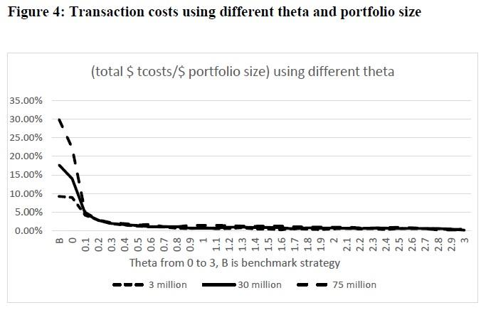

## Table of Contents

## What is trading cost optimization?

Trading cost optimization is about finding ways to buy and sell things, like stocks or goods, at the lowest cost possible. When people or companies trade, they often have to pay fees or other costs. The goal of trading cost optimization is to reduce these costs so that more money can be saved or used for other things. This can be done by choosing the right time to trade, using the best trading platforms, or finding ways to trade in larger amounts which sometimes have lower fees.

One common way to optimize trading costs is through careful planning and using technology. Traders can use special software that helps them see the best times to buy or sell. This software can look at a lot of information quickly and suggest the best actions. Another way is to work with other traders to buy or sell together, which can lower the costs for everyone involved. By doing these things, traders can make their money go further and get better results from their trades.

## Why is trading cost optimization important for investors?

Trading cost optimization is important for investors because it helps them keep more of their money. When investors buy or sell stocks, they often have to pay fees. These fees can add up over time and eat into the profits. By optimizing trading costs, investors can reduce these fees, which means they get to keep more of their earnings. This is especially important for people who trade a lot, because even small savings on each trade can lead to big savings overall.

Another reason trading cost optimization is important is that it can improve the overall performance of an investment portfolio. When investors pay less in trading costs, they can use that money to buy more stocks or other investments. This can help their portfolio grow faster. Plus, by being smart about when and how they trade, investors can avoid some of the risks that come with high trading costs. This makes their investments safer and more likely to succeed in the long run.

## What are the main components of trading costs?

Trading costs are made up of different parts that investors need to think about. One big part is the commission, which is what you pay to the broker or trading platform for making the trade happen. This can change depending on which platform you use and how much you are trading. Another part is the bid-ask spread, which is the difference between the highest price someone is willing to pay for a stock and the lowest price someone is willing to sell it for. This spread can be small or big, and it affects how much you end up paying or getting for your trade.

There are also other costs like fees for things like clearing and settlement, which are the steps needed to finish a trade. Sometimes, there are also taxes or regulatory fees that you have to pay. All these little costs can add up and make a big difference in how much money you keep after trading. That's why it's important for investors to look at all these parts and try to keep them as low as possible.

Lastly, there can be indirect costs like the market impact of your trade. If you trade a lot of a stock at once, it can change the price of that stock, which might not be good for you. This is called slippage, and it's another thing to think about when you're trying to keep your trading costs down. By understanding all these parts of trading costs, investors can make better choices and save more money.

## How can beginners start optimizing their trading costs?

Beginners can start optimizing their trading costs by first choosing a good trading platform. They should look for platforms that have low or no commission fees. Some platforms offer free trades if you meet certain conditions, like having a certain amount of money in your account. It's also a good idea to compare different platforms and see which one has the lowest costs for the kind of trading you want to do. By [picking](/wiki/asset-class-picking) the right platform, beginners can save money right from the start.

Another way beginners can optimize their trading costs is by being smart about when they trade. They should try to trade during times when the market is less busy, because this can help them get a better price. Also, they should think about trading in bigger amounts if they can, because sometimes bigger trades have lower fees. It's important for beginners to learn about the bid-ask spread and try to trade when this spread is small. By doing these things, beginners can keep their trading costs low and keep more of their money.

Lastly, beginners should use tools and resources to help them. There are many free tools online that can help them see the best times to trade and understand the costs involved. They can also read [books](/wiki/algo-trading-books) or watch videos to learn more about trading costs. By taking the time to learn and use these resources, beginners can make better trading decisions and save money on their trades.

## What are the common strategies for reducing trading costs?

One common strategy for reducing trading costs is choosing the right trading platform. Some platforms offer lower or no commission fees, which can save you a lot of money. It's smart to compare different platforms and pick the one that has the lowest costs for the kind of trading you do. Another strategy is to trade during less busy times. When the market is not too busy, you can often get a better price for your trades. This can help you avoid paying too much because of the bid-ask spread.

Another way to reduce trading costs is by trading in larger amounts. Sometimes, if you buy or sell more at once, the fees are lower. This can save you money, but you need to be careful and make sure you can afford to trade in bigger amounts. Using tools and resources can also help. There are many free tools online that can show you the best times to trade and help you understand the costs. By learning and using these tools, you can make better choices and keep your trading costs low.

## How do different types of orders affect trading costs?

Different types of orders can affect trading costs in various ways. One common type of order is a market order, which means you want to buy or sell a stock right away at the current market price. Market orders are quick and easy, but they can be more expensive because you might end up buying at a higher price or selling at a lower price than you expected. This is because the market price can change fast, and you might not get the best deal.

Another type of order is a limit order, where you set a specific price at which you want to buy or sell. Limit orders can help you control costs better because you only trade if the price reaches your limit. This means you might get a better price, but there's a risk that your order won't be filled if the stock price never reaches your limit. By choosing the right type of order, you can manage your trading costs and make sure you're getting the best deal possible.

## What role does market liquidity play in trading cost optimization?

Market [liquidity](/wiki/liquidity-risk-premium) is really important when it comes to keeping trading costs low. It means how easy it is to buy or sell something without changing its price too much. When a market is very liquid, there are a lot of people wanting to buy and sell. This makes it easier for you to trade quickly and at a good price. If you're trying to optimize your trading costs, you want to trade in a liquid market because it helps you avoid paying too much because of the bid-ask spread. The bid-ask spread is the difference between the price someone is willing to buy at and the price someone is willing to sell at. In a liquid market, this spread is usually smaller, so you end up paying less to trade.

On the other hand, if the market is not very liquid, it can be harder to trade without affecting the price. When you try to buy or sell a lot of something in a less liquid market, you might move the price against you. This is called slippage, and it can make your trading costs go up. So, if you want to keep your costs down, it's a good idea to check how liquid the market is before you trade. By choosing to trade in more liquid markets, you can save money and make your trading more efficient.

## How can technology and algorithms help in optimizing trading costs?

Technology and algorithms can really help people save money when they trade. They do this by looking at a lot of information very quickly and figuring out the best times to buy or sell. For example, special software can watch the market all the time and tell you when the price is good for trading. This can help you avoid paying too much because of the bid-ask spread, which is the difference between the price someone wants to buy at and the price someone wants to sell at. By using this technology, you can make sure you're trading at the best possible price and keeping your costs low.

Algorithms also help by planning out trades in a smart way. They can break up big trades into smaller ones and spread them out over time. This can stop the price from moving too much when you trade, which is called slippage. By doing this, you can save money because you're not causing the price to go up or down too much. Plus, algorithms can help you find the best trading platforms and the right times to trade, which can also lower your costs. So, using technology and algorithms can make a big difference in how much you end up paying to trade.

## What are the advanced techniques used by institutional investors for cost optimization?

Institutional investors, like big companies or funds, use some smart ways to keep their trading costs low. One way they do this is by using something called [algorithmic trading](/wiki/algorithmic-trading). This means they use special computer programs to make their trades. These programs can look at a lot of information very quickly and decide the best time to buy or sell. They can also break up big trades into smaller ones and spread them out over time. This helps them avoid moving the market price too much, which can save them a lot of money.

Another technique they use is called dark pools. These are private places where big investors can trade without everyone else seeing what they're doing. This helps them keep their costs down because they can trade big amounts without affecting the market price as much. Institutional investors also work with other big investors to trade together. This can help them get better prices and lower fees. By using these advanced techniques, they can make their money go further and keep more of their profits.

## How does regulatory environment impact trading cost optimization strategies?

The rules and laws that govern trading, called the regulatory environment, can really change how investors try to save money on trading costs. Different countries have different rules about what you can and can't do when you trade. For example, some places might have high fees or taxes on trades, which can make it harder to keep costs low. Also, some rules might limit how you can use certain trading strategies or tools. This means investors have to be careful and make sure they are following all the rules while still trying to save money.

On the other hand, a good regulatory environment can help investors optimize their trading costs. If the rules are clear and fair, it can make trading easier and cheaper. For example, if there are low fees and taxes, and if investors are allowed to use advanced trading tools and strategies, they can save more money. So, the regulatory environment plays a big role in how investors plan their trading and try to keep their costs down.

## What metrics should be used to evaluate the effectiveness of trading cost optimization?

To see if you're doing a good job at keeping your trading costs low, you need to look at some important numbers. One key number is the total trading cost, which includes all the fees, commissions, and other costs you pay when you trade. You should compare this total cost before and after you try to save money. If the total cost goes down, you know your efforts are working. Another number to watch is the bid-ask spread, which is the difference between the price someone wants to buy at and the price someone wants to sell at. If you can keep this spread small, you're doing well at keeping costs low.

Another helpful number is the slippage, which is how much the price moves against you when you trade. If you can keep slippage low, it means you're not losing as much money because of price changes. Also, looking at the turnover ratio, which shows how often you're trading compared to how much you own, can help. A high turnover ratio might mean you're paying more in trading costs than you need to. By keeping an eye on these numbers, you can see if your strategies for saving money on trading are working well.

## What are the future trends in trading cost optimization?

In the future, trading cost optimization is likely to become even more important as technology keeps getting better. More and more people will use smart computer programs, called algorithms, to help them trade at the best times and prices. These programs can look at a lot of information very quickly and make good choices about when to buy or sell. This can help people save money on trading costs because they can avoid paying too much because of the bid-ask spread or slippage. Also, more trading might happen in private places called dark pools, where big investors can trade without moving the market price too much. This can help them keep their costs down.

Another trend we might see is more use of [artificial intelligence](/wiki/ai-artificial-intelligence) (AI) and [machine learning](/wiki/machine-learning). These technologies can learn from past trades and get better at figuring out the best ways to save money. They can help investors find patterns in the market that they might miss otherwise. Plus, as more countries make their trading rules clearer and fairer, it might become easier for people to keep their trading costs low. Overall, the future of trading cost optimization looks like it will be all about using new technology and smart strategies to save as much money as possible on every trade.

## References & Further Reading

[1]: ["Algorithmic Trading: Winning Strategies and Their Rationale"](https://www.amazon.com/Algorithmic-Trading-Winning-Strategies-Rationale/dp/1118460146) by Ernie P. Chan

[2]: Almgren, R., & Chriss, N. (2000). ["Optimal Execution of Portfolio Transactions."](https://smallake.kr/wp-content/uploads/2016/03/optliq.pdf) The Review of Financial Studies, 12(5), 1133-1156.

[3]: Bouchaud, J.-P., Mézard, M., & Potters, M. (2002). ["Statistical Properties of Stock Order Books: Empirical Results and Models."](https://arxiv.org/abs/cond-mat/0203511) Quantitative Finance, 2(4), 251-256.

[4]: Hasbrouck, J., & Saar, G. (2013). ["Low-Latency Trading."](https://papers.ssrn.com/sol3/papers.cfm?abstract_id=1695460) The Review of Financial Studies, 26(9), 2094-2139.

[5]: ["Advances in Financial Machine Learning"](https://www.amazon.com/Advances-Financial-Machine-Learning-Marcos/dp/1119482089) by Marcos Lopez de Prado

[6]: Kissell, R. (2006). ["The Science of Algorithmic Trading and Portfolio Management."](https://www.sciencedirect.com/book/9780124016897/the-science-of-algorithmic-trading-and-portfolio-management) Academic Press.

[7]: Harris, L. (2003). ["Trading and Exchanges: Market Microstructure for Practitioners."](https://books.google.com/books/about/Trading_and_Exchanges.html?id=xNfnCwAAQBAJ) Oxford University Press.