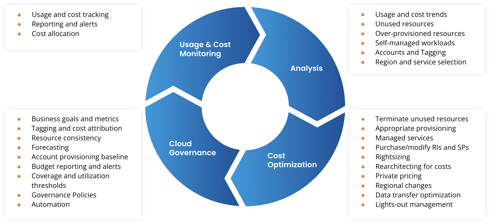

In the fast-paced world of trading, particularly in algorithmic contexts, optimizing trading costs is paramount. The impact of trading costs on profitability is profound, as it directly affects the net returns of any trading strategy. These costs, though sometimes perceived as minor, can accumulate significantly, especially in high-frequency trading environments, which makes managing them essential. 

Algorithmic trading, characterized by its reliance on complex mathematical models and high-speed execution, demands a focus on cost efficiency. In this domain, where trades are executed in fractions of a second, even minor cost reductions can substantially enhance overall strategy performance. For instance, reducing the bid-ask spread by just a fraction of a cent can yield significant savings over time. 

Understanding and managing trading costs is essential for traders looking to maximize profitability in competitive markets. It involves not only recognizing the various types of costs—both explicit, such as commissions, and implicit, such as slippage—but also implementing strategies to mitigate them. Optimizing these costs can provide traders with a competitive edge, particularly as markets become more efficient and margins tighter.

In this article, we explore the intricacies of trading costs and their optimization within the framework of algorithmic trading. The aim is to equip traders with the knowledge and tools necessary to refine their strategies and improve their net returns. By focusing on cost management, traders can ensure sustained competitiveness in increasingly sophisticated financial markets.

## Table of Contents

## Understanding Trading Costs

Trading costs are an integral aspect of executing trades, directly influencing the net returns of trading strategies. These costs are broadly categorized into explicit and implicit costs, each playing a pivotal role in the overall trading expenditure. 

**Explicit Costs** include clearly defined charges such as broker commissions, exchange fees, and regulatory charges. Broker commissions are fees paid to brokers for executing trades on behalf of investors. Exchange fees are levied by exchanges where the securities transactions occur, and regulatory charges are imposed by financial regulatory authorities to maintain market integrity and transparency.

On the other hand, **Implicit Costs** are subtler but equally significant, involving factors like bid-ask spreads, market impact costs, and slippage. The bid-ask spread is the difference between the price a buyer is willing to pay (bid) and the price a seller is willing to accept (ask). Market impact costs arise when large trades affect the price of a security, often resulting in less favorable execution prices for subsequent portions of the order. Slippage occurs when there is a difference between the expected price of a trade and the price at which the trade is executed, commonly due to market [volatility](/wiki/volatility-trading-strategies).

For algorithmic traders, especially those operating within high-frequency trading environments, meticulous monitoring of these costs is crucial. In such fast-paced settings, even minor costs can accumulate rapidly, potentially eroding the profitability of trading strategies. High-frequency traders, therefore, prioritize minimizing both explicit and implicit costs to enhance net returns. This requires a detailed understanding and continual assessment of cost components to optimize trading efficiency effectively.

## Types of Trading Costs

Trading costs are a significant [factor](/wiki/factor-investing) affecting the net returns of trading strategies. They can be categorized as either explicit or implicit costs, each having distinct components that traders must manage to maintain and improve profitability.

Explicit costs are straightforward and include commissions, exchange fees, and regulatory charges. These are direct outlays specified by brokers, exchanges, and regulatory bodies, and they are generally predictable and documented. For instance, brokers typically charge a commission per trade, either as a flat rate or a percentage of the trade's value. Exchange fees are charged by the trading venues and can vary based on the type of security and trading activity. Regulatory charges, imposed by governmental agencies, can include fees associated with specific types of transactions or market activities.

Implicit costs, on the other hand, are less transparent but equally important to consider. They encompass bid-ask spreads, market impact costs, and slippage. The bid-ask spread is the difference between the highest price a buyer is willing to pay and the lowest price a seller is willing to accept. This spread can widen under low [liquidity](/wiki/liquidity-risk-premium) conditions or during volatile market periods, affecting the overall trade cost. Market impact cost arises from the effect of a trader's own order on the market price. Large orders can move the market adversely, increasing the cost of execution. Slippage occurs when there is a difference between the expected price of a trade and the actual price at which it is executed. This can result from delays in order execution, rapid market movements, or insufficient market depth.

Each of these costs requires careful monitoring and management. For instance, understanding historical volatility and [order book](/wiki/order-book-trading-strategies) depth can help minimize slippage and market impact. Additionally, the use of limit orders instead of market orders can also reduce potential costs. Employing algorithms capable of adjusting to prevailing market conditions reduces the impact of both explicit and implicit costs.

For traders, especially those engaged in high-frequency and [algorithmic trading](/wiki/algorithmic-trading), acknowledging and optimizing these costs can substantially impact their strategy's effectiveness. By leveraging both technological solutions and strategic considerations, traders can effectively mitigate these expenses and enhance their overall trading efficiency.

## Strategies for Trading Cost Optimization

Optimizing trading costs is pivotal in maximizing the profitability of algorithmic trading strategies. Selecting the appropriate trading algorithms plays a crucial role in minimizing execution costs. Efficient algorithms are designed to optimize order execution by minimizing slippage and reducing market impact. These algorithms often employ sophisticated techniques, such as [volume](/wiki/volume-trading-strategy)-weighted average price (VWAP) or implementation shortfall strategies, which aim to execute trades at prices close to a benchmark, thereby reducing costs associated with price movements during order execution.

Negotiating better rates with brokers is another vital component of cost optimization. High-frequency traders, in particular, can benefit from lower commission structures due to their high trade volumes. Establishing relationships with brokers who offer competitive pricing for high-frequency trading can result in substantial cost savings. These negotiations may involve discussing commission tiers or obtaining discounts based on trading volume and frequency.

Timing trades effectively is also essential in reducing trading costs. Executing trades during periods of high market liquidity helps minimize bid-ask spreads and market impact costs. High liquidity is often observed during overlapping trading hours of major financial markets or around significant economic news releases. Traders can utilize historical data and market analysis to identify these periods of heightened liquidity, thereby optimizing the timing of their trades to capture more favorable pricing conditions.

By employing these strategies, algorithmic traders can significantly reduce their overall trading costs, thereby enhancing the profitability of their trading strategies. Keeping execution costs low is an ongoing process, requiring continuous assessment of algorithms, broker relationships, and market conditions to sustain competitive advantages in the algorithmic trading domain.

## Utilizing Technology for Cost Optimization

Modern trading heavily relies on technology to optimize costs and enhance the efficiency of trading strategies. Transaction Cost Analysis (TCA) is a fundamental tool used for evaluating the cost-effectiveness of trades. By examining each component that contributes to the overall cost, TCA identifies key drivers and potential areas for reduction. It systematically breaks down costs into explicit and implicit categories, allowing traders to target inefficiencies in their execution processes. These insights enable traders to fine-tune their strategies, ensuring that each trade is conducted at the most advantageous cost structure possible.

Platforms such as PineConnector facilitate the seamless integration of trading strategies across diverse environments. By establishing direct links between trading algorithms and market data sources, these platforms reduce latency, which is crucial in high-frequency trading scenarios. Reduced latency minimizes the time between signal generation and trade execution, thereby lowering the risk of adverse price movements and execution errors. This seamless integration helps in maintaining the intended strategy performance by ensuring that the trades occur as close as possible to the desired conditions.

Smart order routing and advanced trading algorithms are indispensable for minimizing unnecessary costs. Smart order routing algorithms dynamically select the optimal route and venue for executing trades based on current market conditions. These algorithms assess parameters such as liquidity, order size, and market impact to find the most cost-efficient path. By intelligently directing orders, smart routing minimizes the bid-ask spread and reduces the probability of slippage.

Advanced trading algorithms also play a crucial role by automatically adjusting trading decisions in real-time. These algorithms use statistical and [machine learning](/wiki/machine-learning) models to predict market movements and adjust trade executions accordingly. For instance, they can deploy techniques such as slicing orders to avoid impacting the market price significantly. By continuously adapting to the evolving market landscape, these algorithms help maintain a favorable balance between cost and trade execution speed.

In summary, the effective utilization of technology in trading cost optimization involves a combination of thorough cost analysis, seamless platform integration, and strategic application of smart routing and trading algorithms. These technological advancements ensure that traders can execute their strategies with precision and at the lowest possible cost, maintaining their competitive edge in the dynamic trading environment.

## Case Studies and Examples

Institutional traders leverage sophisticated algorithms to optimize order execution and manage market impact, which are critical components of effective trading cost management. By utilizing dynamic algorithms that adjust execution strategies based on real-time market data, institutional traders can significantly reduce the adverse effects of large order sizes on market prices. For instance, Volume Weighted Average Price (VWAP) algorithms allow traders to execute orders incrementally throughout the day, aligning with market volume trends to minimize price distortion and slippage.

High-Frequency Trading ([HFT](/wiki/high-frequency-trading-strategies)) firms place a pronounced emphasis on reducing latency and transaction costs to enhance profitability. These firms invest heavily in cutting-edge technologies to optimize network speeds and reduce delays in trade execution. By minimizing latency, HFT firms can capitalize on fleeting market inefficiencies, executing trades faster than competitors. The use of co-location services, where trading servers are physically located close to exchange servers, is a common strategy to reduce transmission times. Additionally, HFT firms often develop custom, low-latency trading platforms that streamline execution processes, further mitigating transaction costs.

Several real-world examples highlight the significant impact of cost optimization strategies on trading outcomes. For instance, a prominent U.S.-based institutional trading firm implemented a hybrid algorithm that dynamically switched between VWAP and Implementation Shortfall (IS) strategies depending on market conditions. This adaptive approach resulted in a 15% reduction in overall transaction costs compared to their previous static execution strategies. Another case involved an HFT firm that adopted a machine learning model to predict and react to market liquidity changes, which effectively reduced spread costs by 20%, showcasing how technological advancements contribute to trading cost reduction.

These examples underscore the necessity of continuous innovation in trading strategies and technologies to maintain a competitive edge in financial markets. By employing adaptive algorithms, reducing latency, and leveraging data-driven insights, traders can enhance their profitability through effective cost optimization.

## Conclusion

Trading cost optimization is an ongoing process crucial for maintaining competitive edges in algorithmic trading. As trading environments become increasingly competitive, the ability to manage and reduce trading costs stands out as a vital component of a successful trading strategy. Utilizing tools such as Transaction Cost Analysis (TCA) and integrating technology-driven solutions like smart order routing can effectively minimize unnecessary expenses. These strategies help ensure that each transaction contributes positively to the overall profitability by optimizing execution quality and reducing slippage.

Strategically negotiating broker commissions and executing trades during periods of high liquidity are essential practices that further enhance cost efficiency. Through careful planning and application of advanced trading algorithms, traders can significantly diminish the adverse effects of bid-ask spreads and market impact, ultimately improving net returns. 

As financial markets continuously evolve, staying informed about emerging cost management best practices remains vital for sustained trading success. This demands a commitment to ongoing education and adaptation to new technological advances and market conditions. The combination of thoughtful strategy execution, technological support, and continuous learning constitutes a holistic approach to cost optimization, empowering traders to maintain profitability in a dynamic trading landscape.

## References & Further Reading

[1]: ["Algorithmic Trading: Winning Strategies and Their Rationale"](https://www.amazon.com/Algorithmic-Trading-Winning-Strategies-Rationale/dp/1118460146) by Ernie P. Chan

[2]: Almgren, R., & Chriss, N. (2000). ["Optimal Execution of Portfolio Transactions."](https://smallake.kr/wp-content/uploads/2016/03/optliq.pdf) The Review of Financial Studies, 12(5), 1133-1156.

[3]: Bouchaud, J.-P., Mézard, M., & Potters, M. (2002). ["Statistical Properties of Stock Order Books: Empirical Results and Models."](https://arxiv.org/abs/cond-mat/0203511) Quantitative Finance, 2(4), 251-256.

[4]: Hasbrouck, J., & Saar, G. (2013). ["Low-Latency Trading."](https://papers.ssrn.com/sol3/papers.cfm?abstract_id=1695460) The Review of Financial Studies, 26(9), 2094-2139.

[5]: ["Advances in Financial Machine Learning"](https://www.amazon.com/Advances-Financial-Machine-Learning-Marcos/dp/1119482089) by Marcos Lopez de Prado

[6]: Kissell, R. (2006). ["The Science of Algorithmic Trading and Portfolio Management."](https://www.sciencedirect.com/book/9780124016897/the-science-of-algorithmic-trading-and-portfolio-management) Academic Press.

[7]: Harris, L. (2003). ["Trading and Exchanges: Market Microstructure for Practitioners."](https://books.google.com/books/about/Trading_and_Exchanges.html?id=xNfnCwAAQBAJ) Oxford University Press.