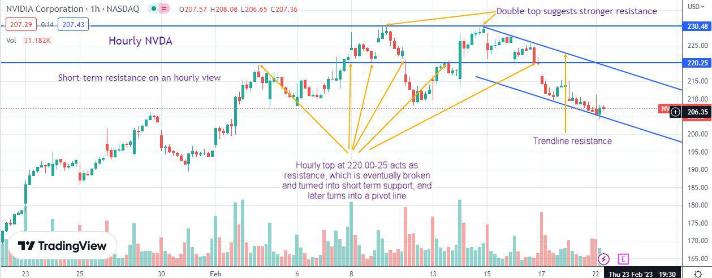

In today's financial markets, the dialogue around innovation and regulation is increasingly central, especially concerning stock exchanges. With technological advances such as algorithmic trading and the introduction of trading curbs, the complexities of market regulation have expanded. Algorithmic trading, which uses computer algorithms to execute trades at incredible speeds, has revolutionized the trading landscape, offering benefits in terms of efficiency and liquidity. However, it also poses risks like market manipulation and unexpected volatility spikes.

Trading curbs, or circuit breakers, are regulatory measures designed to temporarily halt trading during periods of extreme volatility. Their introduction was a direct response to the market crash of 1987, known as Black Monday, to prevent panic-driven sell-offs and allow for information dissemination and rational decision-making among investors.



This article aims to explore these facets of market regulation, focusing on how trading curbs, stock exchange rules, and the growing influence of algorithmic trading interact. A historical perspective will provide insight into how regulatory practices have evolved to manage market volatility effectively. Current practices will be scrutinized to understand their impact on trading dynamics, and future regulatory directions will be considered to navigate the challenges posed by increasingly complex and technologically driven financial markets. Through this exploration, stakeholders can gain a deeper understanding of the evolving regulatory environment critical for maintaining market integrity and stability.

## Table of Contents

## The Role of Market Regulation in Trading

Understanding market regulation is essential for maintaining order and stability in financial markets. Regulatory bodies like the U.S. Securities and Exchange Commission (SEC) play a crucial role in safeguarding investor interests and ensuring that financial markets operate with integrity. These bodies establish and enforce rules aimed at reducing market anomalies, fostering transparency, and providing a level playing field for all participants.

The primary objective of market regulation is to mitigate excessive volatility and deter market manipulation. For instance, regulations require companies to disclose pertinent financial information, enabling investors to make informed decisions and reducing information asymmetry. Additionally, stringent restrictions are placed on trading practices that could otherwise distort market prices or unfairly advantage certain traders. 

Market regulations have evolved significantly over time to address emerging threats and leverage technological advancements. The financial markets are dynamic and complex, necessitating adaptive regulatory frameworks that can respond to new challenges. Historically, regulations have expanded from basic anti-fraud measures to more sophisticated frameworks encompassing electronic trading and cross-border transactions. The implementation of circuit breakers, or trading curbs, is an example of such adaptation. These mechanisms were introduced to prevent market panic during times of severe price fluctuation, hence stabilizing markets during crises.

Furthermore, as the trading landscape becomes increasingly algorithm-driven, regulations now focus on ensuring the resilience and fairness of automated trading systems. This includes measures to prevent flash crashes, where rapid, automated trades lead to significant market disruption. Thus, an ongoing dialogue between regulatory bodies, exchanges, and market participants is crucial for refining these rules, ensuring that they remain relevant as market conditions and technology evolve.

Through continuous adaptation and vigilance, regulatory frameworks strive to balance the dual objectives of encouraging innovation and ensuring market stability, ultimately fostering a secure environment for investors.

## Understanding Trading Curbs

Trading curbs, commonly referred to as circuit breakers, are mechanisms used by stock exchanges to temporarily halt trading on equities during sharp market declines. This regulatory measure is primarily designed to prevent panic-induced selling and maintain orderly market conditions. Trading curbs were first introduced in the wake of the Black Monday crash on October 19, 1987, a day that saw the Dow Jones Industrial Average plummet by over 22%. The introduction of these measures was aimed at providing a cooling-off period during which traders and investors could assess information and make decisions without the pressure of a rapidly declining market.

The design of trading curbs generally involves predefined percentage declines in a major index, such as the S&P 500, to trigger a pause in trading. These pauses are tiered and vary based on the severity of the market's decline:

1. **Level 1 and Level 2 Curbs**: These are triggered by a 7% and 13% decline in the S&P 500, respectively, as compared to the previous day's closing price. Upon reaching these thresholds, trading in all stocks is halted for 15 minutes if the decline occurs before 3:25 PM Eastern Time. If markets reach these levels after this time, trading typically continues without a pause.

2. **Level 3 Curb**: This is enacted when the S&P 500 declines by 20%. At this threshold, trading halts for the remainder of the trading day, regardless of the time it occurs. This provides markets with an extensive period to stabilize and lets stakeholders regroup analytically.

The effectiveness of trading curbs lies in their ability to act as a buffer against excessively volatile movements by allowing investors time to process relevant information. This structured pause can prevent algorithmic and human traders alike from making impulsive decisions that might exacerbate a market downturn.

The trigger levels for trading curbs are recalculated daily, based on the S&P 500 Index's value from the preceding day’s close. This dynamic recalibration ensures that the curbs are relevant to current market conditions, allowing them to respond to both routine fluctuations and more pronounced crises.

## Algorithmic Trading and Its Implications

Algorithmic trading involves the use of computer algorithms to automatically execute trading orders primarily based on pre-set strategies and conditions. These systems leverage mathematical models and statistical analysis to make decisions and place trades at speeds and frequencies that are unachievable by human traders. As these systems can process large volumes of data and execute orders in fractions of a second, [algorithmic trading](/wiki/algorithmic-trading) has become increasingly popular among both institutional and retail investors. 

The rise in popularity of algorithmic trading can be attributed to the potential advantages it offers, such as improved trading efficiency, reduced transaction costs, and the ability to capitalize on market opportunities more quickly than traditional manual trading methods. Furthermore, algorithmic trading can minimize human error by adhering strictly to predefined trading rules.

However, the proliferation of algorithmic trading, particularly in its high-frequency form, has raised several concerns regarding market stability and fairness. One primary concern is the potential for exacerbated market [volatility](/wiki/volatility-trading-strategies). Algorithms may act on similar signals, leading to large, rapid price movements that can destabilize markets. Additionally, the "flash crash" of May 6, 2010, where the Dow Jones Industrial Average dropped approximately 1,000 points within minutes before partially recovering, highlighted the possible negative impact of high-frequency trading algorithms on market dynamics.

Moreover, algorithmic trading creates a competitive advantage for those possessing advanced technology and infrastructure, potentially leading to unequal levels of market access. This disparity raises issues of fairness, as smaller market participants may be unable to compete with larger entities that invest heavily in algorithmic trading technologies.

Regulatory bodies have proposed and continue to implement measures to address these concerns and mitigate the risks associated with high-frequency and algorithmic trading. These regulations aim to safeguard market integrity, protect investors, and ensure a level playing field. Some proposed regulatory measures include:

1. **Registration and Supervision**: Increasing oversight by requiring algorithm developers and users to register with regulatory authorities. This would allow for better monitoring of algorithmic activity and ensure compliance with existing securities laws.

2. **Risk Controls and Testing**: Mandating firms to implement robust risk management systems, such as kill switches to halt trading activities in the event of malfunctioning algorithms. Additionally, firms might be required to perform regular testing and simulation of their algorithms to ensure they function as intended under various market conditions.

3. **Transparency and Reporting**: Increasing transparency by requiring more detailed reporting of algorithmic trading activities, including the logic and parameters used in trading algorithms. This information would be used to analyze and monitor market impacts.

4. **Minimum Resting Times and Order-to-Trade Ratios**: Implementing rules that impose minimum timeframes for which a trade order must remain in the market before it can be canceled, and setting limits on the ratio of orders placed to trades executed to reduce excessive market churn.

By establishing comprehensive regulatory frameworks that address these aspects, regulatory authorities aim to manage the risks posed by algorithmic trading, thereby promoting fairness and stability in financial markets.

## Stock Exchange Rules Governing Algo Trading

Stock exchanges have implemented rigorous rules and frameworks to manage algorithmic trading to maintain market integrity and transparency. Notably, established exchanges such as NASDAQ and the New York Stock Exchange (NYSE) have taken a proactive approach in monitoring and regulating the deployment of trading algorithms, recognizing the need for structured oversight in this fast-evolving domain.

NASDAQ, for instance, has specific conditions under which algorithmic trading systems may operate, including requirements for testing and validation before they can be deployed in actual trading environments. Ensuring that these algorithms perform as intended without triggering undue volatility is paramount. Similarly, the NYSE has set forth guidelines to oversee the technological integrity and operational reliability of algo trading systems.

Brokers and trading platforms play a critical role in ensuring compliance with these regulations. They are required to implement robust risk management procedures and maintain comprehensive records of algorithmic trading activities. This ensures transparency and enables regulatory bodies to audit and assess the impact of these algorithms on the market efficiently.

Key policies relating to algorithmic trading include registration and authorization protocols. These protocols often mandate that developers and providers of algorithmic trading systems register with the exchange, providing detailed documentation about the design and functionality of their algorithms. This registration process ensures that exchanges have oversight of all active trading algorithms and can mitigate potential risks associated with their deployment.

Overall, the regulation of algorithmic trading by stock exchanges aims to foster an orderly and transparent trading environment. By instituting comprehensive rules and requiring registration and validation of trading algorithms, exchanges seek to balance innovation with the need for stable and fair market practices.

## Impact of Trading Curbs on Market Dynamics

Trading curbs, commonly referred to as circuit breakers, are mechanisms designed to temporarily halt trading on an exchange to curb excessive volatility. Their implementation can have a significant impact on market dynamics, both positively and negatively.

One of the primary effects of trading curbs is their calming influence on market volatility. By halting trading, these curbs provide a pause that allows market participants to assimilate information and reassess their positions, potentially reducing the likelihood of panic-driven decisions. This cooling-off period helps prevent knee-jerk reactions that can exacerbate market turmoil.

However, some market participants contend that trading curbs disrupt market equilibrium, arguing that they artificially interfere with the natural price discovery process. When trading is halted, the aggregation of buyers' and sellers' expectations is paused, potentially creating a backlog of orders. Once the curbs are lifted, this can lead to abrupt price movements as deferred orders flood the market, thus creating pent-up trading pressure.

Despite these criticisms, trading curbs are viewed as essential tools for preserving investor confidence during erratic and downward market spirals. Their presence reassures investors that mechanisms are in place to prevent market conditions from deteriorating unchecked. Recognizing the psychological aspect of trading, the assurance provided by such measures can play a critical role in stabilizing market sentiment.

Historical analyses of trading curb activation reveal varied degrees of effectiveness. For instance, during the market crash of 1987, the absence of such mechanisms contributed to uncontrolled declines. After their introduction, events such as the Flash Crash of 2010 have offered insights into both the strengths and limitations of trading curbs in practice. While they have helped mitigate rapid downturns, they have also sparked discussions on improving their design and implementation.

To illustrate, we can model the impact of trading curbs using quantitative simulations. Consider a simple Python snippet that simulates order flow pre- and post-curb activation:

```python
import numpy as np

# Simulating market orders with random walk model
np.random.seed(42)
order_flow = np.cumsum(np.random.normal(0, 1, 1000))

# Applying a trading curb which halts trading when the index falls below a threshold
threshold = -30
curb_index = np.where(order_flow < threshold)[0][0]
order_flow[curb_index:] = order_flow[curb_index]  # stabilizing effect

# Visualize the impact
import matplotlib.pyplot as plt

plt.plot(order_flow)
plt.axhline(y=threshold, color='r', linestyle='--')
plt.title('Simulated Order Flow with Trading Curb')
plt.xlabel('Time')
plt.ylabel('Price Index')
plt.show()
```

This snippet demonstrates how a trading curb halts further losses beyond a set threshold. While idealized, such simulations can help understand dynamics associated with trading curbs.

In summary, while trading curbs play a crucial role in stabilizing markets, they also present challenges by interrupting natural market flows. Continuous evaluation of past instances provides opportunities for refining these mechanisms to better balance the need for market stability with the integrity of organic price discovery processes.

## Future of Market Regulation and Algorithmic Trading

The future landscape of market regulation and algorithmic trading is poised for significant change as it adapts to evolving technologies and the complex dynamics of global markets. The increasing integration of sophisticated algorithms in trading necessitates a reevaluation and tightening of existing regulatory frameworks to address emerging risks effectively while ensuring stability and fairness in financial markets.

Firstly, with the rapid development of technology, regulatory bodies are required to be proactive rather than reactive in their approach to algorithmic trading. As algorithms become more advanced, they can introduce new types of risks, such as flash crashes and systemic disruptions. Future regulations are likely to focus on pre-trade and post-trade transparency, ensuring that algorithmic strategies are not used to manipulate markets or exploit vulnerabilities. Compliance with enhanced risk management protocols and stress-testing of algorithms before deployment might become standard practice.

Secondly, given the interconnected nature of global financial markets, international cooperation between regulatory agencies will be increasingly important. Markets do not operate in isolation, and the failure to manage algorithmic trading risks in one jurisdiction can have cascading effects worldwide. Efforts towards harmonizing regulations across borders will be essential. This could involve formal agreements between countries to share data and intelligence related to market activities, thereby enabling timely and coordinated responses to emerging threats.

Furthermore, continuous dialogue between regulators, exchanges, and market participants will play a vital role in shaping effective regulatory measures for algorithmic trading. Engaging with industry stakeholders helps regulators understand the practical challenges faced by market participants and fosters an environment where rules are both practical and enforceable. This collaborative approach could lead to the development of best practice guidelines, voluntary codes of conduct, and innovative surveillance technologies for monitoring trading activities.

In summary, the future of market regulation in the context of algorithmic trading will hinge on adaptive, cooperative, and inclusive regulatory strategies. Maintaining the delicate balance between encouraging innovation and ensuring market integrity will be crucial for fostering a safe, efficient, and robust trading environment.

## Conclusion

Effective market regulation is integral to maintaining the stability and integrity of financial markets. The implementation of trading curbs and adherence to stock exchange rules are crucial in curbing excessive volatility and ensuring orderly market conditions. Trading curbs, or circuit breakers, act as safeguards by temporarily halting trading during periods of extreme market stress, thereby averting panic and allowing time for information dissemination and rational decision-making.

As algorithmic trading gains prominence, regulatory measures must evolve to address the rapid pace and complexity introduced by such technologies. Algorithms, which execute trades based on predefined criteria, can significantly impact market dynamics due to their speed and [volume](/wiki/volume-trading-strategy) of transactions. Therefore, robust regulatory frameworks are essential to mitigate the risks associated with algorithmic and high-frequency trading, preventing potential manipulative practices that could undermine market fairness.

The interplay between regulation and innovation mandates a balanced approach, ensuring that technological advancements contribute positively to market efficiency rather than disrupting it. Stakeholders, including regulatory bodies, stock exchanges, and market participants, must collaborate to navigate the continuously evolving financial landscape. This ongoing dialogue facilitates an adaptive regulatory environment that recognizes the benefits of innovation while safeguarding market integrity and investor protection. Through these efforts, financial markets can achieve resilience and fairness, fostering confidence among all participants.

## References & Further Reading

[1]: MacKenzie, D. (2018). ["How Algorithms Came to Rule Our World."](https://www.mewatch.sg/season/Algorithms-How-They-Rule-Our-World-32984) The New York Review of Books.

[2]: López de Prado, M. (2018). ["Advances in Financial Machine Learning"](https://www.amazon.com/Advances-Financial-Machine-Learning-Marcos/dp/1119482089). Wiley.

[3]: Kirilenko, A. A., Kyle, A. S., Samadi, M., & Tuzun, T. (2017). ["The Flash Crash: The Impact of High Frequency Trading on an Electronic Market."](https://www.jstor.org/stable/26652722) The Journal of Finance, 72(3), 967-998.

[4]: Johnson, H. (2021). ["Circuit Breakers and Systemic Risk: A Review of the Literature."](https://www.researchgate.net/publication/373010132_Circuit_breakers_in_HVDC_systems_state-of-the-art_review_and_future_trends) Council on Foreign Relations.

[5]: Aronson, D. R. (2006). ["Evidence-Based Technical Analysis: Applying the Scientific Method and Statistical Inference to Trading Signals"](https://www.amazon.com/Evidence-Based-Technical-Analysis-Scientific-Statistical/dp/0470008741). Wiley.

[6]: Jarrow, R., & Protter, P. (2012). ["A Short History of Stochastic Integration and Mathematical Finance: The Early Years, 1880-1970, Part 2."](https://www.oalib.com/research/6821658) Bulletin of the American Mathematical Society, 50(4), 499-518.