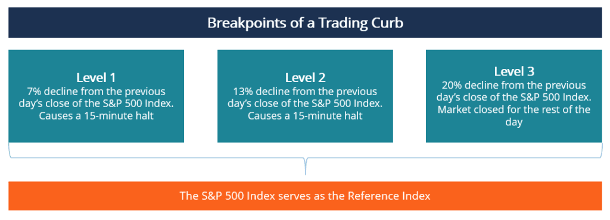

## Table of Contents

## What is a trading curb?

A trading curb, also known as a circuit breaker, is a temporary stop on trading certain stocks or the entire stock market. It is used when prices are changing too quickly, either going up or down. This is done to give everyone a chance to calm down and think more clearly before making more trades.

Trading curbs are put in place by stock exchanges to help prevent panic selling or buying. For example, if a stock's price drops a lot in a short time, a trading curb might stop trading for a while. This gives investors time to look at the situation and make better decisions, instead of just reacting quickly and possibly making bad choices.

## Why are trading curbs implemented?

Trading curbs are put in place to help keep the stock market stable. When prices start changing very quickly, it can make people feel scared or excited, and they might start buying or selling a lot without thinking carefully. This can lead to big problems, like a stock market crash. By stopping trading for a short time, trading curbs give everyone a chance to calm down and think more clearly before they make more trades.

These curbs are important because they help prevent panic. Imagine if everyone started selling their stocks at the same time because they saw prices dropping fast. This could make prices drop even more, causing more panic and more selling. Trading curbs break this cycle by pausing trading, which can help stop a small problem from turning into a big one.

## What are the different levels of trading curbs?

Trading curbs have different levels based on how much the stock market goes up or down in a day. The first level happens if the market goes down by 7%. If this happens, trading stops for 15 minutes. This gives people time to think and calm down before they start trading again. The second level is if the market drops by 13%. If it reaches this point, there's another 15-minute pause in trading. This level is meant to stop things from getting worse quickly.

The third and final level of trading curbs is if the market falls by 20%. At this point, trading stops for the rest of the day. This is a big deal because it means the market has moved a lot, and it's important to stop and think about what's happening. These levels help keep the market stable by giving everyone a chance to take a break and make better decisions.

## How do trading curbs affect the stock market?

Trading curbs help keep the stock market from getting too wild. When the market starts to move a lot, either going up or down quickly, trading curbs can stop trading for a little while. This gives everyone a chance to calm down and think more clearly. If people are selling a lot because they're scared, a trading curb can stop the market from falling even more. It's like hitting the pause button to give everyone a break.

By stopping trading at different levels, trading curbs can prevent a small problem from turning into a big one. For example, if the market goes down by 7%, trading stops for 15 minutes. This can help stop panic selling. If the market keeps falling and reaches a 13% drop, there's another 15-minute pause. If it falls by 20%, trading stops for the whole day. These pauses help keep the market stable and give people time to make better choices.

## Can you explain the history of trading curbs in the United States?

Trading curbs started in the United States after a big stock market crash in 1987. That year, the market dropped a lot in one day, and it scared a lot of people. The government and stock exchanges wanted to make sure this wouldn't happen again, so they came up with trading curbs. The idea was to stop trading for a little while if the market moved too much, to give everyone time to calm down and think.

Over the years, the rules about trading curbs changed a bit. In 2013, the rules were updated to what we use now. The new rules say that if the market goes down by 7%, trading stops for 15 minutes. If it goes down by 13%, there's another 15-minute stop. And if it goes down by 20%, trading stops for the whole day. These rules help keep the market from getting too wild and help prevent panic.

## What are the specific thresholds that trigger different levels of trading curbs?

Trading curbs in the United States have three specific thresholds that trigger different levels of action. The first level is triggered when the stock market drops by 7%. When this happens, trading stops for 15 minutes. This gives everyone a chance to take a break and think about what's happening before they start trading again. The second level kicks in if the market falls by 13%. At this point, there's another 15-minute pause in trading. This level is meant to stop the market from getting too wild and to give people more time to calm down.

The third and final level of trading curbs is triggered if the market drops by 20%. When the market reaches this threshold, trading stops for the rest of the day. This is a big deal because it means the market has moved a lot, and it's important to stop and think about what's going on. These thresholds help keep the market stable by giving everyone a chance to take a break and make better decisions.

## How have trading curb rules evolved over time?

Trading curb rules started in the United States after a big stock market crash in 1987. That year, the market dropped a lot in one day, and it scared a lot of people. The government and stock exchanges wanted to make sure this wouldn't happen again, so they came up with trading curbs. The idea was to stop trading for a little while if the market moved too much, to give everyone time to calm down and think. At first, the rules were different, but they were meant to help keep the market from getting too wild.

Over the years, the rules about trading curbs changed a bit. In 2013, the rules were updated to what we use now. The new rules say that if the market goes down by 7%, trading stops for 15 minutes. If it goes down by 13%, there's another 15-minute stop. And if it goes down by 20%, trading stops for the whole day. These rules help keep the market from getting too wild and help prevent panic. The changes over time show that the rules are always being looked at to make sure they work well to keep the market stable.

## What is the difference between a Level 1, Level 2, and Level 3 trading curb?

Trading curbs in the United States have three levels that help keep the stock market from getting too wild. A Level 1 trading curb happens when the market goes down by 7%. When this happens, trading stops for 15 minutes. This gives everyone a chance to take a break and think about what's happening before they start trading again. The idea is to stop panic and let people make better choices.

A Level 2 trading curb is triggered if the market falls by 13%. At this point, there's another 15-minute pause in trading. This level is meant to stop the market from getting too wild and to give people more time to calm down. It's another chance for everyone to think clearly before making more trades. A Level 3 trading curb is the most serious one. It happens if the market drops by 20%. When this happens, trading stops for the rest of the day. This is a big deal because it means the market has moved a lot, and it's important to stop and think about what's going on. These levels help keep the market stable by giving everyone a chance to take a break and make better decisions.

## How do trading curbs impact trading strategies?

Trading curbs can change how traders make their plans. When the market goes down by 7%, 13%, or 20%, trading stops for a little while. This means traders have to wait before they can buy or sell more. Some traders might use this time to look at their plans again and think about what to do next. They might decide to change their plans based on what's happening in the market.

Other traders might see trading curbs as a chance to get ready for when trading starts again. They might think about what other people will do after the break and plan their next moves based on that. Trading curbs can make traders more careful because they know the market might stop suddenly. This can lead to more thinking and less quick buying or selling.

## What are some notable instances where trading curbs were activated?

One big time when trading curbs were used was during the stock market drop in March 2020. The market was falling a lot because of the COVID-19 virus. People were scared and started selling their stocks. On March 9, 2020, the market went down by 7%, and trading stopped for 15 minutes. This was the first time in a long time that the Level 1 trading curb was used. It helped calm things down a bit, but the market kept falling. A few days later, on March 12 and March 16, the market hit the 7% drop again, and trading curbs were used to stop the panic.

Another time trading curbs were used was in 2011. The market was worried about money problems in Europe, and it started to drop fast. On August 8, 2011, the market went down by 7%, and trading stopped for 15 minutes. This was the first time since 1987 that trading curbs were used. It showed that the rules were still important for keeping the market from getting too wild. These examples show how trading curbs can help stop panic and give people time to think before they make more trades.

## How do global markets handle trading curbs compared to the U.S.?

Different countries have their own ways to handle trading curbs, and they can be a bit different from how the U.S. does it. In the U.S., trading curbs stop trading if the market drops by 7%, 13%, or 20%. Other countries might use different numbers or have other rules. For example, in South Korea, trading curbs stop trading if a stock goes up or down by 30% in a day. This is to stop the market from moving too fast in either direction. Each country makes rules that they think will work best for their market.

Some countries, like China, use trading curbs a lot to keep their market from getting too wild. In China, trading might stop if a stock goes up or down by 10% in a day. They also have rules for the whole market, like stopping trading if the market goes down by 5% or 7%. This is different from the U.S., where trading curbs are only used if the market goes down. Other countries, like Japan, might not use trading curbs as much. They might let the market move more freely but have other ways to keep things stable, like rules about how much stocks can move in a day.

## What are the criticisms and defenses of trading curbs from financial experts?

Some financial experts think trading curbs can cause more problems than they solve. They say that when trading stops, it can make people even more scared. They might think something really bad is happening and start selling their stocks even more when trading starts again. Also, some experts believe that trading curbs can make it hard for traders to do their jobs. They might want to buy or sell stocks to make money or protect their money, but they can't do it when trading is stopped. This can make them lose money or miss out on good chances.

On the other hand, other financial experts think trading curbs are a good thing. They say that trading curbs help stop panic and keep the market from getting too wild. When the market goes down a lot, it can make people feel scared and start selling a lot. Trading curbs give everyone a break and a chance to think more clearly. This can help stop a small problem from turning into a big one. These experts believe that trading curbs help keep the market stable and protect people's money in the long run.

## References & Further Reading

[1]: MacKenzie, D. (2018). ["How Algorithms Came to Rule Our World."](https://www.mewatch.sg/season/Algorithms-How-They-Rule-Our-World-32984) The New York Review of Books.

[2]: López de Prado, M. (2018). ["Advances in Financial Machine Learning"](https://www.amazon.com/Advances-Financial-Machine-Learning-Marcos/dp/1119482089). Wiley.

[3]: Kirilenko, A. A., Kyle, A. S., Samadi, M., & Tuzun, T. (2017). ["The Flash Crash: The Impact of High Frequency Trading on an Electronic Market."](https://www.jstor.org/stable/26652722) The Journal of Finance, 72(3), 967-998.

[4]: Johnson, H. (2021). ["Circuit Breakers and Systemic Risk: A Review of the Literature."](https://www.researchgate.net/publication/373010132_Circuit_breakers_in_HVDC_systems_state-of-the-art_review_and_future_trends) Council on Foreign Relations.

[5]: Aronson, D. R. (2006). ["Evidence-Based Technical Analysis: Applying the Scientific Method and Statistical Inference to Trading Signals"](https://www.amazon.com/Evidence-Based-Technical-Analysis-Scientific-Statistical/dp/0470008741). Wiley.

[6]: Jarrow, R., & Protter, P. (2012). ["A Short History of Stochastic Integration and Mathematical Finance: The Early Years, 1880-1970, Part 2."](https://www.oalib.com/research/6821658) Bulletin of the American Mathematical Society, 50(4), 499-518.