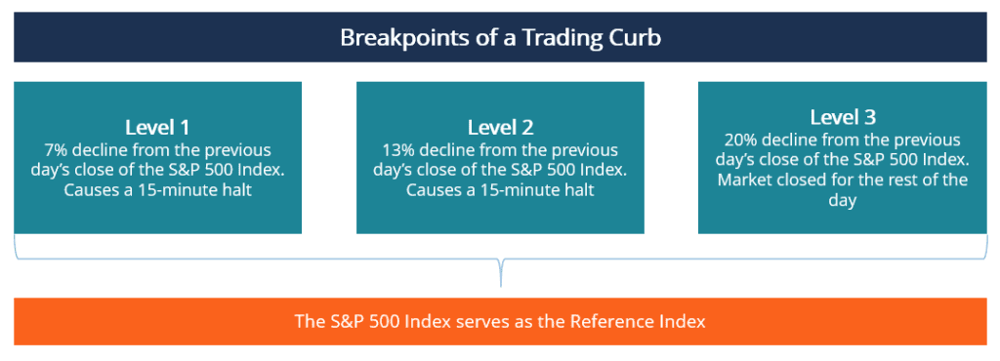

## Table of Contents

## What is a trading curb?

A trading curb, also known as a circuit breaker, is a temporary stop in trading on a stock exchange. It is used to prevent big drops in stock prices from getting worse. When the stock market falls by a certain amount in a short time, trading is paused. This gives everyone a chance to calm down and think before they make more trades.

Trading curbs help keep the market stable. They stop panic selling, which can make prices fall even more. By pausing trading, curbs give investors time to look at the situation and make better choices. This can help avoid big crashes and protect people's investments.

## Why are trading curbs implemented in financial markets?

Trading curbs are put in place to help keep the financial markets stable. When the stock market starts to drop quickly, it can make people panic and sell their stocks in a hurry. This can make the prices fall even more, creating a big problem. By stopping trading for a little while, trading curbs give everyone a chance to take a break and think more clearly. This can stop the panic and help keep the market from crashing.

These curbs are important because they protect investors. When the market is going crazy, it's easy to make quick decisions that you might regret later. Trading curbs give people time to look at the situation and make better choices. This can help keep their investments safe and make the market a fairer place for everyone.

## How do trading curbs affect stock prices?

Trading curbs can help stop stock prices from falling too much. When the market is going down fast, people might start selling their stocks in a panic. This can make prices drop even more. But if trading stops for a while, it gives everyone a chance to calm down. When trading starts again, people might not sell as much, and the prices might not fall as far as they would have without the curbs.

On the other hand, trading curbs can also make stock prices go up a bit when trading starts again. After a pause, people might feel less worried and more ready to buy stocks. This can push prices up a little. But the main goal of trading curbs is not to make prices go up or down, but to keep the market from getting too wild and to protect investors from big losses.

## What are the different types of trading curbs?

There are three main types of trading curbs that stock markets use. The first type is called a "Level 1" curb. This happens when the stock market drops by a certain amount, like 7%, in one day. When this happens, trading stops for a short time, usually 15 minutes. This gives people a chance to calm down and think before they keep trading. The second type is a "Level 2" curb. This is used if the market falls even more, like by 13%, in one day. Trading stops again, but this time it might be for longer.

The third type of trading curb is called a "Level 3" curb. This is the most serious one and happens if the market drops by a big amount, like 20%, in one day. When this happens, trading stops for the rest of the day. This is to stop a big crash from happening. All these curbs are there to help keep the market stable and to stop panic selling that can make prices fall even more.

## Can you explain the circuit breaker rule?

The circuit breaker rule is a way to stop trading on the stock market when prices drop a lot in a short time. It's like a safety switch that turns off trading to stop things from getting worse. When the market goes down by a certain amount, like 7%, trading stops for a little while, usually 15 minutes. This gives everyone a chance to calm down and think before they keep trading.

If the market keeps falling and goes down by even more, like 13%, trading stops again. This time, the break might be longer. If the market drops a lot, like 20%, in one day, trading stops for the rest of the day. This is to stop a big crash from happening. The circuit breaker rule is there to help keep the market stable and to stop panic selling that can make prices fall even more.

## How does a trading curb differ from a trading halt?

A trading curb and a trading halt both stop trading on the stock market, but they work in different ways. A trading curb, or circuit breaker, is used when the whole market drops by a certain amount in a short time. It stops trading for everyone to help calm things down and stop a big crash. The curb might pause trading for 15 minutes or even stop it for the rest of the day, depending on how much the market has fallen.

On the other hand, a trading halt is used for one specific stock or a small group of stocks. It happens when something big happens with that stock, like important news or a big change in the company. A trading halt stops trading for that stock until the news is out and everyone knows what's going on. This helps make sure that everyone has the same information before they start trading again.

So, the main difference is that a trading curb is about the whole market and tries to stop big drops, while a trading halt is about one stock and makes sure everyone has the same information before trading starts again.

## What are the thresholds that trigger a trading curb?

Trading curbs, or circuit breakers, are set to stop trading when the stock market falls a lot in a short time. There are three levels of trading curbs that can be triggered. The first level is called a Level 1 curb, which happens if the market drops by 7% in one day. When this happens, trading stops for 15 minutes to give everyone a break and a chance to think before they keep trading.

The second level is a Level 2 curb, which is used if the market falls even more, by 13%, in one day. At this point, trading stops again, and the break might be longer. The third and most serious level is a Level 3 curb, which is triggered if the market drops by 20% in one day. When this happens, trading stops for the rest of the day to stop a big crash from happening. These curbs help keep the market stable and stop panic selling that can make prices fall even more.

## How do trading curbs impact market volatility?

Trading curbs help lower market [volatility](/wiki/volatility-trading-strategies) by stopping trading when the market drops a lot in a short time. When the market is falling fast, people might start selling their stocks in a panic. This can make prices drop even more and make the market go wild. But if trading stops for a while, it gives everyone a chance to calm down. This can stop the panic and help keep the market from getting too crazy.

When trading starts again after a curb, people might feel less worried and more ready to buy stocks. This can help the market become more stable. The main goal of trading curbs is not to make prices go up or down, but to keep the market from getting too wild and to protect investors from big losses. By pausing trading, curbs give people time to look at the situation and make better choices, which can help lower market volatility.

## What is the historical context behind the introduction of trading curbs?

Trading curbs, also called circuit breakers, were put in place after a big event called the Black Monday crash in 1987. On that day, the stock market dropped a lot, and people were selling their stocks in a panic. This made prices fall even more. The crash showed that the market could get too wild and that something needed to be done to stop it from happening again. So, the idea of trading curbs was born to help keep the market stable.

After the Black Monday crash, people started thinking about ways to stop the market from getting too crazy. They came up with trading curbs to stop trading for a little while when the market was falling fast. This would give everyone a chance to calm down and think before they kept trading. The first trading curbs were put in place in the early 1990s, and they have been used ever since to help protect investors and keep the market from crashing.

## How do trading curbs vary across different global markets?

Trading curbs are used in many countries, but the rules can be different in each place. In the United States, the stock market has three levels of trading curbs. If the market drops by 7%, trading stops for 15 minutes. If it drops by 13%, trading stops again, and if it drops by 20%, trading stops for the rest of the day. In other countries, like South Korea, the rules are a bit different. If the market drops by 10%, trading stops for 20 minutes, and if it drops by 15%, trading stops for the rest of the day.

Even though the rules are different, the main goal of trading curbs is the same everywhere. They are there to stop the market from getting too wild and to give people a chance to calm down and think before they keep trading. This helps keep the market stable and protects investors from big losses. Each country decides its own rules based on what they think will work best for their market.

## What are the criticisms and controversies surrounding trading curbs?

Some people think trading curbs can cause more problems than they solve. They say that when trading stops, it can make people even more worried. When trading starts again, everyone might want to sell their stocks at the same time, making prices drop even more. This is called a "magnet effect," where the market falls even faster after a trading curb. Critics also say that trading curbs might not stop big crashes from happening. They think that the market might keep falling after trading starts again, so the curbs don't really help.

On the other hand, some people believe that trading curbs are good because they stop the market from getting too wild. They say that the curbs give people time to calm down and think before they make more trades. This can help stop panic selling and keep the market stable. But even with these benefits, there is still a lot of talk about whether trading curbs really work or if they just delay the problem. It's a big debate, and different people have different ideas about what's best for the stock market.

## How can traders and investors strategize around trading curbs?

Traders and investors can use trading curbs to their advantage by staying calm and using the time during a trading halt to look at their plans. When trading stops because of a curb, it's a good time to check the news and see what's happening in the market. This can help them decide if they should buy, sell, or do nothing when trading starts again. They can also use this time to talk to other people and get different ideas about what might happen next.

Another way traders and investors can strategize around trading curbs is by being ready for them. They can set up rules for themselves about what to do if a curb happens. For example, they might decide to wait a little while after trading starts again before they make any moves. This can help them avoid making quick choices that they might regret later. By having a plan and sticking to it, they can handle trading curbs better and make smarter choices.

## References & Further Reading

[1]: Brady, N. (1988). ["Report of the Presidential Task Force on Market Mechanisms."](https://babel.hathitrust.org/cgi/pt?id=pur1.32754050114354) U.S. Government Printing Office.

[2]: Securities and Exchange Commission. ["Modification of NYSE Rule 80A."](https://www.sec.gov/rules/sro/nyse/34-52016.pdf) Securities and Exchange Commission, 2005.

[3]: Kyle, A. S. (1988). ["Trading Halts and Price Limits"](https://www.nber.org/papers/w2268). National Bureau of Economic Research Working Paper No. 2268.

[4]: Harris, L. (1998). ["Circuit Breakers and Program Trading Limits: What Have We Learned?"](https://www.researchgate.net/publication/222660042_Circuit_Breakers_and_Program_Trading_Limits_What_Have_We_Learned) Brookings-Wharton Papers on Financial Services, 17–63.

[5]: U.S. Commodity Futures Trading Commission. ["The Role of Circuit Breakers in Trading Markets."](https://www.cftc.gov/PressRoom/PressReleases/pr6397-12) Press Release, 2012.

[6]: U.S. Securities and Exchange Commission (SEC). ["Concept Release on Equity Market Structure."](https://www.sec.gov/rules/concept/2010/34-61358.pdf) 2010.