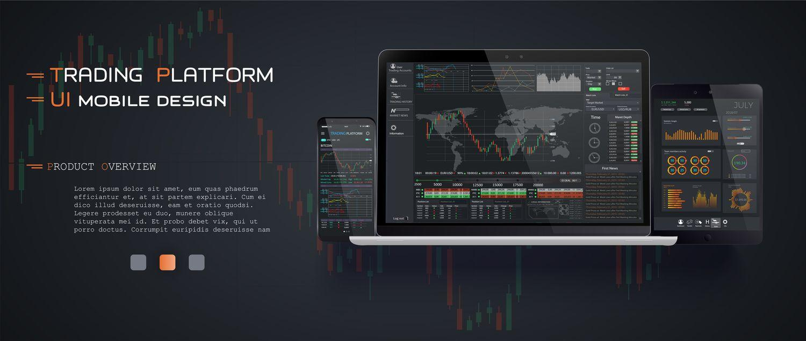

## Table of Contents

## What is a trading demo account?

A trading demo account is a practice account that lets you trade without using real money. It's like a game where you can buy and sell stocks, currencies, or other financial products, but you don't risk losing any actual money. This is really helpful for beginners who want to learn how trading works without worrying about losing their savings.

You can use a demo account to try out different trading strategies and see how they work in real market conditions. It's a safe way to get familiar with trading platforms and tools. Once you feel confident, you can switch to a real account and start trading with actual money. Many trading platforms offer demo accounts for free, so it's a great way to practice before you start trading for real.

## Why should beginners use a trading demo account?

Beginners should use a trading demo account because it's a safe way to learn how to trade without losing real money. When you start trading, there's a lot to learn, like how to read charts, understand market trends, and make good decisions. A demo account lets you practice all of this without any risk. You can make mistakes and learn from them without it costing you anything.

Using a demo account also helps you get comfortable with the trading platform you're using. Each platform has different tools and features, and it can take time to figure out how everything works. By practicing on a demo account, you can try out different strategies and see what works best for you. This way, when you're ready to trade with real money, you'll feel more confident and prepared.

## How can I open a trading demo account?

Opening a trading demo account is easy and usually free. First, you need to find a trading platform that offers a demo account. Many popular platforms like eToro, MetaTrader, and others have this option. Go to their website and look for a button or link that says "Open Demo Account" or something similar. Click on it, and you'll be asked to fill out a simple form with your name, email, and maybe a password. After you submit the form, you'll get an email to confirm your account. Once you confirm, you can log in and start using the demo account right away.

Once you're in the demo account, you'll see that it looks just like a real trading account, but you'll be using virtual money. You can practice buying and selling different assets like stocks, currencies, or commodities. Try out different strategies and see how the market reacts. It's a great way to learn without risking any real money. When you feel ready, you can switch to a real account and start trading with actual money. But take your time and practice as much as you need on the demo account first.

## What are the key features of a trading demo account?

A trading demo account has many important features that help beginners learn how to trade. One key feature is that it uses virtual money, so you can practice buying and selling without losing any real money. This makes it a safe way to try out different trading strategies and see how they work in real market conditions. Another important feature is that it looks and feels just like a real trading account. This means you can get used to the trading platform, its tools, and how everything works before you start trading with actual money.

Another useful feature of a demo account is that it's usually free and easy to set up. You just need to sign up with a trading platform that offers a demo account, fill out a simple form, and you can start practicing right away. Most demo accounts also come with educational resources, like tutorials and guides, to help you learn more about trading. This combination of safety, realism, and educational support makes a demo account a great tool for anyone who wants to learn how to trade without risking their savings.

## Can I use a demo account to practice different trading strategies?

Yes, you can use a demo account to practice different trading strategies. Since a demo account uses virtual money, you can try out buying and selling different things like stocks, currencies, or commodities without losing any real money. This means you can experiment with different strategies to see what works best for you. You can try short-term trading, where you buy and sell quickly, or long-term trading, where you hold onto your investments for a longer time. You can also test out different technical analysis tools to see how they help you make decisions.

Practicing different strategies on a demo account is really helpful because it lets you make mistakes and learn from them without any risk. You can see how the market reacts to your trades and adjust your strategies accordingly. This way, when you're ready to start trading with real money, you'll have a better understanding of what works and what doesn't. Plus, you'll feel more confident because you've already practiced on the demo account.

## How does the functionality of a demo account compare to a live trading account?

A demo account and a live trading account look and work in very similar ways. Both types of accounts let you buy and sell things like stocks, currencies, and commodities. You use the same tools and charts to make decisions. The big difference is that a demo account uses virtual money, so you can't lose or make real money. A live account uses real money, so you can actually gain or lose money based on your trades.

Even though a demo account is very realistic, there are some small differences. For example, the prices you see in a demo account might not be exactly the same as in a live account because of small delays in data. Also, the feelings you have when trading with real money can be different. When it's your own money, you might feel more nervous or excited, which can affect how you trade. But overall, a demo account is a great way to practice and learn before you start using a live account.

## Are there any limitations to using a trading demo account?

There are some limitations to using a trading demo account. One big limitation is that it uses virtual money, so you don't feel the same emotions as when you trade with real money. When it's your own money, you might feel more nervous or excited, and these feelings can change how you make decisions. Another limitation is that the prices and data in a demo account might not be exactly the same as in a live account. There can be small delays or differences that can affect how your trades work.

Also, demo accounts usually have a time limit. Many platforms let you use a demo account for a certain number of days or weeks, and then you have to switch to a live account if you want to keep trading. This means you might not have as much time to practice as you would like. But even with these limitations, a demo account is still a very useful tool for learning how to trade without risking real money.

## How long can I use a trading demo account before it expires?

The time you can use a trading demo account before it expires depends on the trading platform. Some platforms let you use a demo account for 30 days, while others might give you up to 90 days or even longer. It's important to check with the specific platform you're using to know how much time you have to practice.

Even though demo accounts have an expiration date, they are still a great way to learn how to trade without losing real money. You can try different strategies and get used to the trading tools during the time you have. If you need more time to practice, some platforms might let you open a new demo account after your first one expires.

## Can demo account performance be used to predict real trading success?

Demo account performance can give you some ideas about how you might do when you start trading for real, but it's not a perfect way to predict success. When you use a demo account, you're not using real money, so you don't feel the same emotions like stress or excitement that can affect your decisions. Also, the prices and data in a demo account might be a little different from what you see in a live account, which can change how your trades work out.

Even though a demo account can't tell you exactly how you'll do in real trading, it's still very helpful for learning. You can try out different strategies and get used to the trading tools without any risk. But remember, real trading can be different because it involves your own money and real emotions. So, while a demo account is a good practice tool, your success there doesn't guarantee the same results when you start trading with real money.

## What advanced tools are available in trading demo accounts for expert traders?

Trading demo accounts often come with advanced tools that can help expert traders practice and refine their skills. These tools include sophisticated charting software that allows you to analyze market trends in detail. You can use different types of charts like candlestick, bar, and line charts to see how prices move over time. There are also technical indicators like moving averages, RSI (Relative Strength Index), and MACD (Moving Average Convergence Divergence) that help you make better trading decisions by showing you patterns and signals in the market.

Another set of advanced tools in demo accounts includes [backtesting](/wiki/backtesting) features. This means you can test your trading strategies using historical data to see how they would have performed in the past. This is really useful for figuring out what works and what doesn't without risking any real money. Additionally, some demo accounts offer [algorithmic trading](/wiki/algorithmic-trading) tools, which let you automate your trading strategies. This can save you time and help you trade more efficiently. Even though these tools are in a demo environment, they give expert traders a chance to practice and perfect their techniques before using them in a live account.

## How can I transition from a demo account to a live trading account?

Transitioning from a demo account to a live trading account is pretty straightforward. Once you feel confident with your trading skills after practicing on the demo account, you can go to the trading platform's website and look for an option to open a live account. You'll need to fill out a form with your personal details like your name, address, and maybe some financial information. After you submit the form, you might need to verify your identity with documents like a driver's license or passport. Once your account is set up and verified, you can deposit real money into it and start trading for real.

It's important to take your time and not rush into a live account. Make sure you've tried out different strategies and feel comfortable with the trading platform. Remember, trading with real money can feel different because you're risking your own money, so you might feel more nervous or excited. It's a good idea to start small when you first move to a live account. This way, you can get used to the emotions and pressures of real trading without risking too much money right away.

## What are the best practices for maximizing the benefits of a trading demo account?

To get the most out of a trading demo account, it's important to treat it like a real trading experience. Start by setting clear goals for what you want to achieve. Maybe you want to practice a specific trading strategy or get used to the trading platform's tools. Spend time learning how everything works and don't rush. Try out different strategies and see how they work in different market conditions. It's also a good idea to keep a trading journal where you write down what you did, what worked, and what didn't. This will help you learn from your mistakes and improve your skills.

Another key practice is to use the demo account for as long as you can to build confidence. Don't move to a live account until you feel ready. Remember, the demo account is a safe space to make mistakes and learn from them without losing any real money. Take advantage of the educational resources that come with the demo account, like tutorials and guides, to deepen your understanding of trading. By using the demo account effectively, you'll be better prepared when you start trading with real money.

## References & Further Reading

[1]: Bergstra, J., Bardenet, R., Bengio, Y., & Kégl, B. (2011). ["Algorithms for Hyper-Parameter Optimization."](https://papers.nips.cc/paper/4443-algorithms-for-hyper-parameter-optimization) Advances in Neural Information Processing Systems 24.

[2]: ["Advances in Financial Machine Learning"](https://www.amazon.com/Advances-Financial-Machine-Learning-Marcos/dp/1119482089) by Marcos Lopez de Prado

[3]: ["Evidence-Based Technical Analysis: Applying the Scientific Method and Statistical Inference to Trading Signals"](https://www.amazon.com/Evidence-Based-Technical-Analysis-Scientific-Statistical/dp/0470008741) by David Aronson

[4]: ["Machine Learning for Algorithmic Trading"](https://github.com/stefan-jansen/machine-learning-for-trading) by Stefan Jansen

[5]: ["Quantitative Trading: How to Build Your Own Algorithmic Trading Business"](https://www.amazon.com/Quantitative-Trading-Build-Algorithmic-Business/dp/1119800064) by Ernest P. Chan