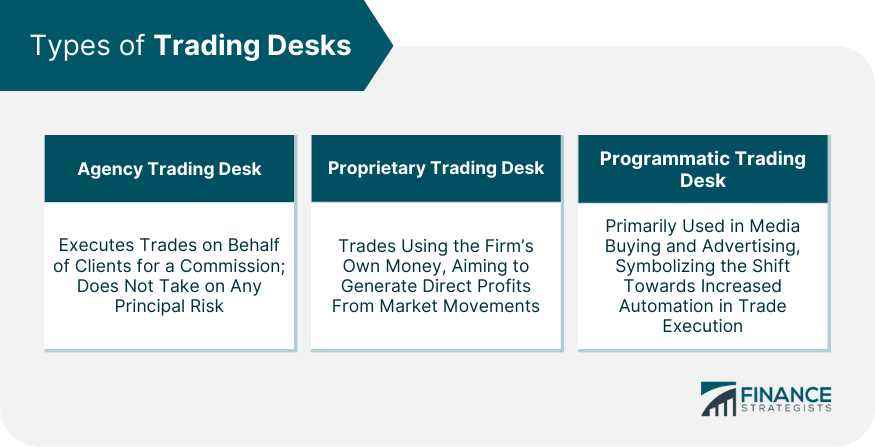

In today’s dynamic financial markets, the landscape for traders and investors is expanding at an unprecedented pace. Financial trading has seen a remarkable transformation, moving beyond traditional methods to embrace cutting-edge technologies and sophisticated strategies. The evolution of this domain is characterized by the involvement of various types of trading desks and the advent of algorithmic trading, commonly known as algo-trading.

Trading desks, integral to financial institutions, provide the necessary infrastructure and expertise for executing trades across diverse asset classes. Meanwhile, algo-trading utilizes computer algorithms to automate trading processes, allowing for high-frequency trading and real-time analysis that are beyond human capabilities. This technological advancement enables traders to execute large volumes of trades with precision and speed, optimizing investment strategies to meet different financial goals.



The significance of understanding these developments is paramount for both institutional and retail investors. Institutional investors typically pursue long-term gains through strategic asset management, while retail investors often focus on short-term profits. The choice of financial instruments—ranging from stocks and bonds to derivatives and cryptocurrencies—depends heavily on the specific risk-reward profile and investment strategy each investor seeks to adopt.

As the financial markets continue to grow more complex and interconnected, the role of trading desks and algorithmic trading is becoming increasingly crucial. Staying informed about these advancements is essential for traders and investors who aim to navigate the fast-paced financial environment effectively. This article will explore these topics further, providing insights into the various types of trading desks, diverse investment types, and the influential impact of algorithmic trading on market operations.

## Table of Contents

## Understanding Financial Trading Investment Types

Financial trading encompasses various investment vehicles, each with unique characteristics and potential returns. Investors often choose from stocks, bonds, exchange-traded funds (ETFs), derivatives, and cryptocurrencies, all of which offer distinct risk-reward profiles.

Stocks represent ownership in a company and offer investors the potential for capital gains and dividends. However, their value is subject to market volatility, reflecting changes in a company's performance and external economic factors. Investors with a higher risk tolerance may find stocks appealing, especially those aiming for growth over the long term.

Bonds, in contrast, are debt instruments issued by corporations or governments. They generally provide a fixed interest income, which is appealing to investors seeking stable, lower-risk returns. The trade-off, however, is limited upside potential compared to stocks. For instance, the safety of a U.S. Treasury bond is considered very high, thus offering lower returns.

Exchange-traded funds (ETFs) are investment funds traded on stock exchanges, akin to stocks. They often track an index or a sector and offer diversification benefits with the flexibility of trading throughout the day. ETFs cater to both risk-averse investors and those seeking diversification without managing individual stocks or bonds.

Derivatives, including options and futures, are financial instruments whose value is derived from underlying assets like stocks, bonds, or commodities. They can be used for hedging purposes or speculative strategies to leverage investment positions. However, derivatives [carry](/wiki/carry-trading) significant risk due to leverage effects and potential price swings of the underlying assets.

Cryptocurrencies, such as Bitcoin and Ethereum, have emerged as a new asset class, characterized by high [volatility](/wiki/volatility-trading-strategies) and speculative potential. They appeal to investors willing to take on risk for substantial returns, although they remain contentious due to regulatory uncertainties and market instability.

Investment strategies differ based on the investor's risk appetite and financial goals. Institutional investors, like pension funds, often favor long-term assets such as bonds and blue-chip stocks to ensure steady returns. On the other hand, retail traders may prefer short-term investments like stocks or cryptocurrencies, seeking to capitalize on market fluctuations for quick profits.

Understanding these investment types and their inherent risk-reward dynamics is crucial for aligning them with the investor's financial objectives and risk tolerance, thereby optimizing portfolio performance.

## What Is a Trading Desk?

A trading desk is a crucial component within financial institutions, acting as the operational hub for executing financial transactions. It comprises a team of specialized professionals, including traders, brokers, and analysts, who are adept at handling various asset classes. The primary function of a trading desk is to facilitate the efficient buying and selling of financial instruments, thereby enhancing market [liquidity](/wiki/liquidity-risk-premium) and operational efficiency.

Trading desks are strategically organized into sections based on different asset classes, such as equities, fixed income, foreign exchange, commodities, and derivatives. This classification allows trading professionals to focus on specific markets and develop expertise in those areas. Traders working at these desks employ various strategies and use sophisticated financial models to analyze market trends, assess risks, and optimize trade execution.

The presence of analysts on the trading desk is critical as they provide real-time data interpretation and market insights, enabling informed trading decisions. Brokers play a pivotal role in executing trades either on behalf of clients or the institution itself, ensuring that transactions comply with regulatory standards and achieve optimal pricing.

The seamless operation of a trading desk is supported by advanced technological infrastructure, including electronic trading platforms and communication networks. These tools enable rapid trade execution and real-time monitoring of market conditions. The integration of technology also allows for the automation of certain trading processes, reducing human error and increasing execution speed.

By providing liquidity and facilitating price discovery, trading desks contribute significantly to the functioning of financial markets. Their role is vital in ensuring efficient market operations, supporting financial stability, and ultimately, catering to the diverse needs of both institutional and individual investors.

## Types of Trading Desks

Trading desks serve as pivotal components within financial institutions, with each desk specializing in a definitive asset class to cater to the specific needs of the market and the institution. This specialization enables a focused approach to the trading and management of various financial instruments, ensuring that each asset class receives expert attention. Here are the primary types of trading desks:

1. **Equity Trading Desks**: These desks are primarily concerned with stock transactions. They facilitate buying, selling, and managing equity securities, which can include common stocks, preferred stocks, and exchange-traded funds (ETFs). Equity traders analyze market trends, economic conditions, and individual stock performance to make informed trading decisions. By providing liquidity to the stock market, equity trading desks play a crucial role in maintaining market stability and efficiency.

2. **Fixed Income Trading Desks**: Specializing in bonds, fixed income trading desks handle government bonds, corporate bonds, municipal bonds, and other debt instruments. These desks focus on interest rate movements and credit risk analysis to optimize bond portfolios. They are integral to managing interest rate risk and generating stable income streams for investors.

3. **Forex Trading Desks**: These desks deal with the trading of currency pairs in the foreign exchange markets. Forex trading desks manage transactions involving various currencies, facilitating international trade and investment. Traders on these desks must be adept at analyzing macroeconomic indicators, geopolitical events, and central bank policies to anticipate currency value fluctuations.

4. **Commodity Trading Desks**: These desks engage in the buying and selling of physical commodities such as metals (gold, silver), energy products (oil, natural gas), and agricultural products (wheat, corn). Commodity traders study supply and demand dynamics, weather conditions, and geopolitical factors affecting commodity prices to make strategic trading decisions.

5. **Derivatives Trading Desks**: Focused on options, swaps, futures, and other derivative instruments, these desks employ complex financial instruments to hedge risk, arbitrage price discrepancies, or speculate on asset price movements. Derivative trading requires a profound understanding of the underlying assets and sophisticated risk management techniques.

Each type of trading desk is supported by specialized traders, brokers, and analysts who are proficient in the nuances of their respective markets. This specialization is critical for effective risk management, strategic trade execution, and generating alpha in highly competitive and dynamic financial markets.

## The Role of Algo Trading

Algorithmic trading, commonly known as algo trading, uses computer algorithms to automate the execution of trading strategies. These algorithms operate at high speeds and are capable of processing vast amounts of data much faster than human traders. This automation plays a critical role in enhancing trading efficiency by executing trades based on pre-set criteria without the constraints of human intervention.

High-frequency trading ([HFT](/wiki/high-frequency-trading-strategies)) is one of the most notable applications of [algorithmic trading](/wiki/algorithmic-trading). HFT involves executing a large number of orders at extremely rapid speeds, often in fractions of a second. This speeds up the trading process, thereby capitalizing on minuscule price discrepancies in markets that could be missed by slower, traditional trading methods. HFT leverages advanced computer programs and infrastructure, enabling traders to exploit short-lived market opportunities and contribute to increased market liquidity.

Algo trading also facilitates real-time market analysis by continually scanning multiple market variables and instantly executing trades based on sophisticated decision-making rules. The algorithms utilize various inputs, including price, [volume](/wiki/volume-trading-strategy), and market conditions, to make optimal trading decisions.

Algorithmic trading strategies are diverse and often tailored to address specific market inefficiencies. Among these strategies, trend-following is one of the simplest yet effective methods. It involves buying assets that have shown an upward price trend and selling those in decline. This strategy assumes that once an asset exhibits a trend, it is likely to continue in that direction. A sample Python code snippet for a simple moving average crossover strategy might look like this:

```python
import pandas as pd

def moving_average_strategy(data, short_window, long_window):
    signals = pd.DataFrame(index=data.index)
    signals['price'] = data['price']
    signals['short_mavg'] = data['price'].rolling(window=short_window, min_periods=1).mean()
    signals['long_mavg'] = data['price'].rolling(window=long_window, min_periods=1).mean()
    signals['signal'] = 0.0
    signals['signal'][short_window:] = np.where(signals['short_mavg'][short_window:] > signals['long_mavg'][short_window:], 1.0, 0.0)
    signals['positions'] = signals['signal'].diff()
    return signals
```

Another widely deployed strategy is mean reversion, based on the idea that prices will revert to their historical average over time. Traders using mean reversion models will seek to profit from these price oscillations by identifying and trading deviation signals from the mean price level.

Statistical [arbitrage](/wiki/arbitrage) exploits price discrepancies among correlated assets, employing quantitative models to predict future price movements and execute trades accordingly. This strategy involves maintaining a market-neutral position, thereby profiting from the statistical mispricing of a security while mitigating exposure to market-wide movements.

Market-making, another strategy, involves placing both buy and sell orders to capture the spread between the bid and ask prices. This provides liquidity and contributes to market stability. Market-making algorithms seek to profit from the bid-ask spread while offering liquidity to the markets.

In summary, algorithmic trading has reshaped the financial trading environment by creating opportunities for traders to automate complex strategies, thus optimizing trade executions, minimizing manual errors, and identifying market inefficiencies efficiently.

## Advantages of Algorithmic Trading

Algorithmic trading, often referred to as algo trading, provides numerous advantages that make it a preferred choice for many traders and financial institutions. One of the primary benefits is speed. Algorithms can execute trades in fraction of a second, much faster than a human trader could perform manually. This rapid execution is crucial in markets where prices can change in milliseconds, allowing traders to capitalize on fleeting opportunities and reducing the impact of adverse price movements.

Precision is another significant advantage of algorithmic trading. Algorithms execute trades with high accuracy, adhering strictly to the predefined criteria set by the traders. By eliminating human intervention, it ensures that trades are executed without errors that can occur due to misinterpretation or oversight. This precision extends to aspects such as the timing of trade execution, quantity, and price, ensuring optimal trade conditions are met consistently.

Emotional bias, often a pitfall for human traders, is completely removed from the trading decision process in algorithmic trading. Emotions like fear and greed can lead to irrational decisions, causing traders to deviate from their strategies. Algo trading removes this psychological element, ensuring that trades are executed based solely on rational criteria and objective data.

Algorithmic trading also enhances portfolio management by allowing the seamless execution of complex trades and strategies. Traders can design algorithms that manage diverse portfolios, implementing strategies that involve multiple asset classes and instruments. This capability facilitates efficient rebalancing and diversification, which are key components of risk management in complex portfolios.

Furthermore, traders can optimize their strategies using [backtesting](/wiki/backtesting) and real-time adjustments. Backtesting involves running an algorithm on historical data to evaluate how it would have performed in the past. This process helps traders refine their strategies, ensuring that they are robust and effective before deploying them in live market conditions. Real-time strategy adjustments permit traders to modify their algorithms in response to current market conditions, thereby enhancing performance and adaptability.

In summary, algorithmic trading offers significant benefits in terms of speed, precision, and emotion-free execution, which collectively contribute to more effective and efficient trading operations. Enhancements in portfolio management and strategic optimization further underscore its value, making it an indispensable tool in modern financial markets.

## Conclusion

The financial trading landscape today is characterized by a vast array of investment opportunities, made increasingly accessible through advancements in trading desk operations and the integration of algorithmic trading technologies. Trading desks, specializing in various asset classes such as equities, fixed income, [forex](/wiki/forex-system), commodities, and derivatives, provide the necessary infrastructure for conducting trades efficiently and effectively. The incorporation of algorithmic trading has further enhanced this landscape by enabling high-frequency trading and real-time market analysis, thereby offering profound insights into market dynamics.

Investors and traders stand to gain significantly by comprehensively understanding the functions and strategies of different trading desks. Equipped with this knowledge, they can tailor their investment approaches to optimize returns and manage risks effectively. The implementation of algorithmic trading strategies presents an opportunity to transcend limitations faced by traditional trading methods, allowing for precise and rapid execution that minimizes human error and emotional interference.

The continuous evolution of technology necessitates that both traders and investors remain informed and adaptable. By keeping abreast of emerging technologies and evolving financial instruments, market participants can maintain a competitive edge. This adaptability is crucial in navigating the fast-paced financial landscape and achieving success. As technology progresses, the potential for leveraging advanced trading strategies to enhance investment portfolios becomes ever more pronounced, offering both challenges and opportunities to those engaged in the art and science of financial trading.

## References & Further Reading

[1]: Barber, B. M., & Odean, T. (2013). ["The Behavior of Individual Investors."](https://faculty.haas.berkeley.edu/odean/Papers%20current%20versions/behavior%20of%20individual%20investors.pdf) In *Handbook of the Economics of Finance*.

[2]: Lopez de Prado, M. (2018). ["Advances in Financial Machine Learning."](https://www.amazon.com/Advances-Financial-Machine-Learning-Marcos/dp/1119482089) Wiley.

[3]: Jansen, S. (2020). ["Machine Learning for Algorithmic Trading."](https://github.com/stefan-jansen/machine-learning-for-trading) Packt Publishing.

[4]: Chan, E. P. (2008). ["Quantitative Trading: How to Build Your Own Algorithmic Trading Business."](https://github.com/egorpe/EPChan-QuantitativeTrading/blob/master/example7_6.m) Wiley.

[5]: Hull, J. C. (2018). ["Options, Futures, and Other Derivatives."](https://www.semanticscholar.org/paper/Options%2C-Futures%2C-and-Other-Derivatives-Hull/89bdee500c8623864fc9eb7a471546aa713acc44) Pearson.

[6]: Gomber, P., Arndt, B., Lutat, M., & Uhle, T. (2011). ["High-Frequency Trading."](https://papers.ssrn.com/sol3/papers.cfm?abstract_id=1858626) *SSRN Electronic Journal*.

[7]: Aronson, D. R. (2006). ["Evidence-Based Technical Analysis: Applying the Scientific Method and Statistical Inference to Trading Signals."](https://www.amazon.com/Evidence-Based-Technical-Analysis-Scientific-Statistical/dp/0470008741) Wiley.

[8]: Narang, R. K. (2009). ["Inside the Black Box: The Simple Truth About Quantitative Trading."](https://onlinelibrary.wiley.com/doi/book/10.1002/9781118267738) Wiley.