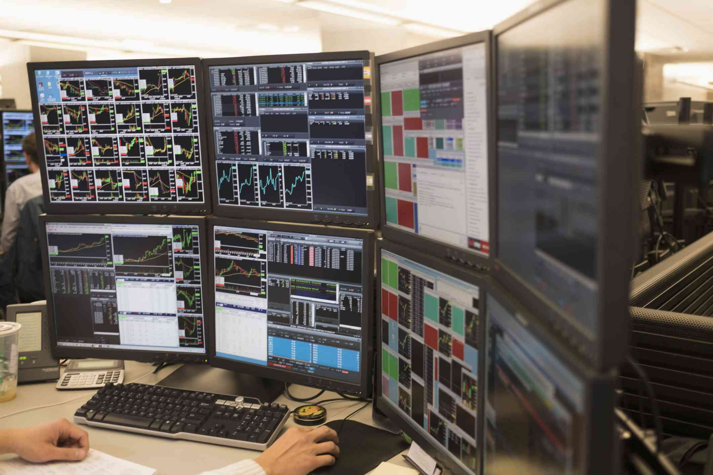

In finance, trading desks are essential components of investment banks, responsible for executing trades and formulating investment strategies. These specialized divisions act as hubs for the buying and selling of various financial instruments, including stocks, bonds, forex, and commodities. Each trading desk focuses on a specific type of asset, enhancing the efficiency of trades and offering liquidity to the markets.

Technological advancements have transformed trading desks, incorporating algorithmic and high-frequency trading that enables decisions to be made at lightning speed. Algorithmic trading, in particular, involves the use of computer algorithms to analyze a myriad of data points in real-time and execute trades in fractions of a second. This evolution allows trading desks to maintain a competitive edge in today's fast-paced financial environment.



This article will explore the different types of trading desks, their importance in investment banking, and the role that algorithmic trading plays in ensuring that these desks remain competitive in the financial sector.

## Table of Contents

## Types of Trading Desks in Investment Banking

Investment banks typically host a variety of trading desks, each with a specific focus to optimize trading activities within different financial markets. The four primary types of trading desks are forex, fixed-income, equities, and commodities trading desks.

Forex trading desks are specialized units that manage currency trades and account for a substantial portion of global financial transactions. Given the massive liquidity and 24-hour nature of the forex market, these desks play a crucial role in ensuring effective currency exchange. Their functions include speculation, arbitrage, and hedging to exploit fluctuations in currency values.

Fixed-income trading desks focus on the buying and selling of debt securities that yield income, such as government and corporate bonds. These desks handle a range of instruments from the traditionally safer U.S. Treasuries to higher-risk junk bonds. By managing [interest rate](/wiki/interest-rate-trading-strategies) risks and credit risks, fixed-income traders facilitate [capital raising](/wiki/hedge-fund-capital-raising) for governments and corporations and provide investors with diversified income opportunities.

Equities trading desks engage in the buying and selling of stocks. They play a fundamental role in providing [liquidity](/wiki/liquidity-risk-premium) to stock markets, enabling the efficient transfer of equity ownership. In addition to stocks, these desks trade in equity derivatives, such as options and futures, allowing investors to hedge or speculate on stock price movements. Moreover, equities traders collaborate closely with research analysts to generate informed trading strategies and capitalize on market trends.

Commodities trading desks handle both hard commodities, like oil and metals, and soft commodities, such as agricultural products. Traders employ strategies like futures and spot trading to hedge against price risks for their clients. By leveraging these instruments, they can manage supply chain risks for businesses and give investors exposure to commodity markets for diversification purposes.

Each type of trading desk utilizes specialized knowledge and expertise in their respective areas to provide liquidity, manage risks, and support the strategic objectives of investment banks.

## The Role of Algorithmic Trading

Algorithmic trading employs sophisticated mathematical models and computational algorithms to conduct trading activities at velocities and efficiencies far surpassing human capabilities. These algorithms are designed to process and analyze a vast array of data points in real time, such as market prices, trade volumes, news, and other financial metrics. By doing so, they can identify optimal trading opportunities and execute trades within microsecond intervals, providing a distinct advantage in the fast-paced financial markets.

A fundamental aspect of [algorithmic trading](/wiki/algorithmic-trading) is the use of various strategies to enhance profitability and minimize risks. One common strategy is [market making](/wiki/market-making), where an algorithm continuously quotes buy and sell prices, providing liquidity to the market and capturing the spread between the two. Another strategy is [arbitrage](/wiki/arbitrage), where the algorithm exploits price differences of similar or related financial instruments across different markets or exchanges. Lastly, [scalping](/wiki/gamma-scalping) involves executing numerous trades over short periods to capture small price changes.

The integration of [artificial intelligence](/wiki/ai-artificial-intelligence) (AI) and [machine learning](/wiki/machine-learning) has further augmented the capabilities of algorithmic trading. These technologies enable trading algorithms to learn and adapt to new market patterns, improving their predictive accuracy and reaction times. For instance, machine learning models can be trained to recognize complex patterns in historical price data, news sentiment, and other indicators, which can be used to forecast price movements or [volatility](/wiki/volatility-trading-strategies).

To illustrate, consider the following simple Python example for a basic algorithmic strategy:

```python
import numpy as np
import pandas as pd

# Generate synthetic price data
price_data = np.random.randn(1000) + 100

# Define a simple moving average strategy
short_window = 40
long_window = 100

signals = pd.DataFrame(index=np.arange(len(price_data)))
signals['price'] = price_data

# Create signals
signals['short_mavg'] = signals['price'].rolling(window=short_window, min_periods=1).mean()
signals['long_mavg'] = signals['price'].rolling(window=long_window, min_periods=1).mean()

signals['signal'] = 0.0
signals['signal'][short_window:] = np.where(signals['short_mavg'][short_window:] > signals['long_mavg'][short_window:], 1.0, 0.0)
signals['positions'] = signals['signal'].diff()

# Output the first few rows of the signals DataFrame
print(signals.head())
```

This example demonstrates a simple moving average crossover strategy, where buy signals are generated when a short-term moving average crosses above a long-term moving average, and sell signals are generated when it crosses below.

The adoption of AI and machine learning in algorithmic trading augments these basic strategies, leading to more sophisticated algorithms capable of executing complex trades with enhanced precision and foresight. As a result, algorithmic trading desks are well-equipped to capitalize on fleeting market opportunities and respond instantaneously to evolving market conditions.

## The Benefits and Challenges of Trading Desks

Trading desks play a crucial role within investment banks, offering significant benefits that enhance market operations. One of the primary advantages of trading desks is their ability to enhance market liquidity. By serving as intermediaries, trading desks facilitate the buying and selling of financial instruments, ensuring that markets remain active and fluid. This increased liquidity benefits all market participants by enabling more efficient trading and reducing transaction costs.

Efficient price discovery is another key benefit provided by trading desks. Through continuous trading activities and the aggregation of vast amounts of market data, trading desks contribute to the determination of asset prices that accurately reflect supply and demand dynamics. This specialization allows traders with expertise in specific financial instruments to make informed decisions, fostering a more accurate and transparent pricing environment.

Trading desks also improve trading performance through specialization. By segregating different asset types—such as fixed income, equities, and commodities—trading desks ensure that each sector is managed by specialists with deep knowledge and expertise. This segmentation allows for tailored trading strategies and compliance with specific market regulations, enhancing the overall performance and integrity of the trading process.

However, the operations of trading desks come with certain challenges, primarily revolving around risk management and compliance. The complex nature of trading desk operations requires robust risk management strategies to mitigate potential losses and adhere to regulatory standards. Regulatory bodies impose rules to ensure that trading activities are conducted fairly and transparently, necessitating stringent compliance measures by trading desks.

As technology continues to advance, trading desks must adapt to evolving trading strategies while maintaining compliance with regulatory requirements. The integration of algorithmic trading, for example, necessitates a balance between speed and accuracy. Trading desks must continuously refine their algorithms to optimize performance and minimize risk, all while adhering to the regulatory framework governing their operations.

In conclusion, trading desks significantly contribute to the efficiency and effectiveness of financial markets by enhancing liquidity, enabling efficient price discovery, and improving trading performance through specialization. Yet, they also face the challenge of navigating a complex regulatory environment and keeping pace with technological advancements. To remain competitive, trading desks must effectively balance these benefits and challenges.

## Future Trends and Developments

The future of trading desks in investment banking is increasingly focused on automation and the implementation of artificial intelligence (AI). These advancements enable trading desks to execute large volumes of trades with enhanced precision and reduced latency. The deployment of AI technologies facilitates the analysis of complex datasets and improves decision-making capabilities, allowing trading desks to swiftly adapt to market fluctuations and emerging trends.

Sustainable and socially responsible trading is becoming a significant determinant for trading strategies, prompting trading desks to incorporate environmental, social, and governance ([ESG](/wiki/esg-investing)) criteria into their operations. This shift is driven by growing investor demand for ethical investment options and regulatory pressures to consider sustainability impacts. Trading desks are now developing new frameworks to assess ESG risks and opportunities, aligning their strategies with broader corporate sustainability goals.

Blockchain technology is another transformative [factor](/wiki/factor-investing), offering potential improvements in transaction transparency, security, and settlement efficiency. The decentralized nature of blockchain can streamline trading operations by reducing counterparty risks and enhancing trust among market participants. However, the integration of [cryptocurrency](/wiki/cryptocurrency) trading introduces volatility and regulatory challenges that trading desks must carefully manage.

In response to these evolving trends, trading desks must adopt innovative solutions and continuously refine their strategies and technologies. This requires sustained investment in technology infrastructure, the development of robust risk management frameworks, and a commitment to compliance with evolving regulatory standards. By staying vigilant and proactive, trading desks can not only address the challenges but also capitalize on the opportunities presented by these emerging developments in the financial marketplace.

## Conclusion

Trading desks are central components of investment banking, significantly driving market activities and influencing the broader financial ecosystem. These entities are not only responsible for executing trades but also play a vital role in shaping investment strategies. Their operations span various asset categories, from equities, fixed income, and [forex](/wiki/forex-system) to commodities, each requiring specialized knowledge and strategic execution.

The ability of trading desks to adapt to technological innovation and regulatory changes is crucial for maintaining a competitive edge. This adaptability ensures their continued relevance in a rapidly evolving financial landscape. By effectively integrating algorithmic trading into their operations, trading desks can execute trades with precision and speed that far surpass human capabilities. These algorithms analyze vast amounts of data in real-time, provide deeper market insights, and enhance decision-making processes.

Looking ahead, trading desks are poised to leverage algorithmic trading and align with emerging trends to continue their pivotal role in shaping the future of finance. Embracing advancements such as artificial intelligence and machine learning will further amplify their capacity to respond to market fluctuations with agility and foresight. Moreover, as the financial sector witnesses the rise of sustainable and socially responsible trading, trading desks must align their strategies accordingly to meet the growing demand for environmental and social governance (ESG) criteria.

In tandem with these technology-driven transformations, trading desks must remain abreast of regulatory changes, ensuring compliance while optimizing operational efficiency. The integration of blockchain technology and engagement with cryptocurrency markets present both challenges and opportunities, necessitating innovative solutions and strategic adaptations. Overall, the continuous evolution of trading desks through technological integration and strategic foresight will ensure their enduring impact on the global financial ecosystem.

## References & Further Reading

[1]: ["Advances in Financial Machine Learning"](https://www.amazon.com/Advances-Financial-Machine-Learning-Marcos/dp/1119482089) by Marcos Lopez de Prado

[2]: ["Evidence-Based Technical Analysis: Applying the Scientific Method and Statistical Inference to Trading Signals"](https://www.amazon.com/Evidence-Based-Technical-Analysis-Scientific-Statistical/dp/0470008741) by David Aronson

[3]: ["Machine Learning for Algorithmic Trading"](https://github.com/stefan-jansen/machine-learning-for-trading) by Stefan Jansen

[4]: ["Quantitative Trading: How to Build Your Own Algorithmic Trading Business"](https://www.amazon.com/Quantitative-Trading-Build-Algorithmic-Business/dp/1119800064) by Ernest P. Chan

[5]: Aldridge, I. (2013). ["High-Frequency Trading: A Practical Guide to Algorithmic Strategies and Trading Systems,"](https://www.amazon.com/High-Frequency-Trading-Practical-Algorithmic-Strategies/dp/1118343506) 2nd Edition. Wiley. 

[6]: Narang, R.K. (2013). ["Inside the Black Box: The Simple Truth About Quantitative Trading."](https://onlinelibrary.wiley.com/doi/book/10.1002/9781118267738) Wiley.