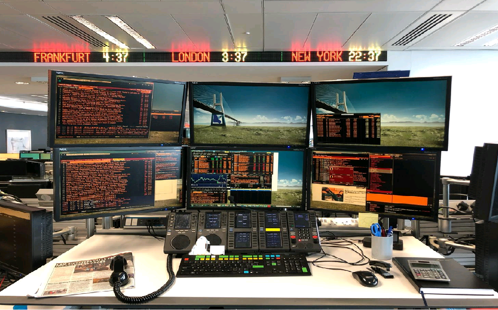

## Table of Contents

## What is a trading desk in investment banking?

A trading desk in investment banking is a place where traders buy and sell financial products like stocks, bonds, and currencies. It's like a busy hub where people work to make money for their bank by trading these products. The traders at the desk use computers and phones to keep track of market prices and make quick decisions on when to buy or sell.

The trading desk is important because it helps the bank make profits and manage risks. Traders need to be smart and quick because the market can change fast. They also need to follow rules and make sure they are trading fairly. The desk might focus on different types of products, like stocks or bonds, and each type needs different skills and knowledge.

## What are the main functions of a trading desk?

A trading desk in investment banking has several key jobs. The main one is to buy and sell financial products like stocks, bonds, and currencies. Traders at the desk watch the market closely and make quick decisions on when to trade. They use computers and phones to keep track of prices and make trades. The goal is to make money for the bank by buying low and selling high, or selling high and buying back low.

Another important job of the trading desk is to manage risk. This means making sure the bank doesn't lose too much money if the market goes down. Traders use different strategies to protect the bank's money. They might use tools like options and futures to hedge against losses. This helps keep the bank safe even when the market is unpredictable.

The trading desk also helps clients. Banks have customers who want to buy or sell financial products, and the trading desk helps them do that. Traders give advice and execute trades for these clients. This service helps the bank build good relationships with customers and earn fees. Overall, the trading desk is a busy place where traders work hard to make profits, manage risks, and help clients.

## How does a trading desk operate on a daily basis?

A trading desk starts its day early, usually before the markets open. Traders come in and check the news and market reports to see what happened overnight. They look at the prices of stocks, bonds, and currencies to plan their trades for the day. Once the markets open, the trading desk gets busy. Traders use computers and phones to buy and sell financial products. They need to be quick and smart because the market can change fast. They also talk to clients to help them with their trades and give them advice.

During the day, the trading desk keeps an eye on the market to manage risks. If the market goes down, traders use strategies to protect the bank's money. They might use tools like options and futures to hedge against losses. The desk also works to make profits by buying low and selling high. Traders need to follow rules and make sure they are trading fairly. At the end of the day, the trading desk reviews its trades and prepares for the next day. They look at what worked and what didn't, and plan how to do better tomorrow.

## What types of financial instruments are traded on a trading desk?

A trading desk deals with many different types of financial instruments. The most common ones are stocks, which are shares in a company that people can buy and sell. Bonds are another big one; these are like loans that investors give to companies or governments, and they get paid back with interest. Currencies are also traded a lot, where traders buy and sell different kinds of money, like dollars and euros, to make profits from changes in their value.

Besides these, trading desks also handle derivatives, which are more complex financial products. Options give traders the right to buy or sell an asset at a set price in the future, while futures are agreements to buy or sell an asset at a future date for a price agreed on today. These instruments help traders manage risk and make money from market movements. Overall, a trading desk works with a wide range of financial products to meet the needs of the bank and its clients.

## What is the role of a trader on a trading desk?

A trader on a trading desk has the important job of buying and selling financial products like stocks, bonds, and currencies. They need to watch the market closely and make quick decisions about when to trade. Traders use computers and phones to keep track of prices and make trades. Their main goal is to make money for the bank by buying low and selling high, or selling high and buying back low. They also need to follow rules and make sure they are trading fairly.

Another big part of a trader's job is managing risk. This means making sure the bank doesn't lose too much money if the market goes down. Traders use different strategies to protect the bank's money. They might use tools like options and futures to hedge against losses. This helps keep the bank safe even when the market is unpredictable. Traders also help clients by giving them advice and executing their trades. This service helps the bank build good relationships with customers and earn fees.

## How do trading desks interact with other departments within an investment bank?

Trading desks work closely with other departments in an investment bank. They often talk to the sales team, who help bring in clients and make sure the trading desk knows what the clients want. The sales team might tell the traders about big orders or special requests from clients, so the traders can plan their trades better. The trading desk also works with the research department, which gives them important information about the market and different financial products. This helps traders make smarter decisions about when to buy and sell.

Another important department that the trading desk interacts with is risk management. This team helps keep the bank safe by watching how much risk the traders are taking. They might tell the traders to slow down if they think the trades are too risky. The trading desk also works with the operations team, who handle the paperwork and make sure all the trades are done correctly. All these departments need to work together to help the trading desk do its job well and make money for the bank.

## What are the key skills required to work on a trading desk?

Working on a trading desk needs people who are quick and good at making choices. Traders have to watch the market all the time and decide fast when to buy or sell things like stocks or bonds. They need to be good with numbers and understand how the market works. Being able to use computers well is important because traders use them to keep track of prices and make trades. They also need to be able to handle stress because the market can change fast and it can be a busy and intense place.

Another important skill is being able to talk well with others. Traders work with the sales team to know what clients want and with the research team to get good information about the market. They also need to work with the risk management team to make sure they are not taking too many risks. Traders need to follow rules and make sure they are trading fairly. Being able to work well with others and communicate clearly helps the trading desk do its job better and make money for the bank.

## How has technology impacted the operations of trading desks?

Technology has changed trading desks a lot. Before, traders had to call each other or use paper to keep track of trades. Now, they use computers and special software to do everything faster and easier. These computers can look at a lot of information at once and help traders make quick decisions. They can also do trades automatically, which saves time and can make more money for the bank. This means traders can focus on bigger decisions and planning instead of doing everything by hand.

Also, technology helps trading desks connect with other parts of the bank and with clients all over the world. Traders can use the internet to talk to the sales team, the research team, and clients in different countries. This helps them get the information they need faster and make better trades. Technology also makes it easier to keep track of risks and follow rules. Special programs can watch what traders are doing and make sure they are not taking too many risks or breaking any laws. Overall, technology has made trading desks more efficient and better at making money.

## What are the differences between various types of trading desks, such as equities and fixed income?

Different types of trading desks focus on different financial products. An equities trading desk deals with stocks, which are shares in companies. Traders on this desk watch stock prices all day and try to buy and sell at the best times to make money for the bank. They need to understand how companies work and what can make their stock prices go up or down. On the other hand, a fixed income trading desk deals with bonds, which are like loans to companies or governments. Traders here need to know about interest rates and how they affect bond prices. They try to make money by buying bonds when they are cheap and selling them when they are more expensive.

Another type of trading desk is the foreign exchange (FX) desk, which trades different currencies. Traders here look at how the value of money changes between countries and try to make money from these changes. They need to understand what makes currencies stronger or weaker, like economic news or government policies. Each type of trading desk needs different skills and knowledge because the financial products they trade are different. But all types of desks need to be quick, smart, and good at managing risks to help the bank make money.

## How do trading desks manage risk and comply with regulatory requirements?

Trading desks manage risk by using different strategies and tools. They watch the market all the time and use computers to help them make quick decisions. If the market goes down, traders might use options or futures to protect the bank's money. These tools help them hedge against losses, which means they can make sure the bank doesn't lose too much money even if things go wrong. Traders also talk to the risk management team, who help them keep an eye on how much risk they are taking. This teamwork helps the trading desk stay safe and make smart choices.

Trading desks also have to follow rules and make sure they are trading fairly. They work with the compliance team, who know all the laws and rules that traders need to follow. The compliance team helps make sure that the trading desk is doing everything right. Special computer programs can also watch what traders are doing and make sure they are not breaking any rules. This helps the trading desk stay out of trouble and keep the bank safe. By managing risk and following rules, trading desks can help the bank make money and stay strong.

## What are the current trends and future predictions for trading desks in investment banking?

Trading desks in investment banking are changing a lot because of new technology. One big trend is using computers to do more trading automatically. These computers can look at a lot of information very fast and make trades without people having to do it. This can help trading desks make more money and do things more quickly. Another trend is using data and special math to make better decisions. Traders are using more information than ever before to understand the market and find good times to buy and sell. This helps them make smarter choices and manage risks better.

In the future, trading desks will probably use even more technology. Computers might do even more trading on their own, and traders will focus more on planning and making big decisions. Trading desks will also need to keep up with new rules and make sure they are trading fairly. As the world changes, trading desks will need to be ready for new kinds of financial products and markets. Overall, technology and data will keep making trading desks better at making money and managing risks, but traders will still need to be smart and quick to keep up with the fast-changing market.

## How do global economic factors influence the strategies employed by trading desks?

Global economic factors have a big impact on what trading desks do. Things like interest rates, inflation, and how different countries' economies are doing can change how traders make their plans. For example, if interest rates go up in one country, it might make their money worth more, so traders might want to buy that currency. Or if a country's economy is doing badly, traders might sell stocks from that country because they think the prices will go down. Traders need to watch these global factors all the time to make smart choices about when to buy and sell.

Trading desks also need to think about big events like elections or new laws in different countries. These events can change how the market works and what people think will happen next. For instance, if a new law makes it harder for companies to make money, traders might sell stocks from those companies. Or if there's a big election coming up, traders might be careful about making big trades until they know who will win. By keeping an eye on these global economic factors, trading desks can make plans that help them make money and manage risks better.

## References & Further Reading

[1]: ["Advances in Financial Machine Learning"](https://www.amazon.com/Advances-Financial-Machine-Learning-Marcos/dp/1119482089) by Marcos Lopez de Prado

[2]: ["Evidence-Based Technical Analysis: Applying the Scientific Method and Statistical Inference to Trading Signals"](https://www.amazon.com/Evidence-Based-Technical-Analysis-Scientific-Statistical/dp/0470008741) by David Aronson

[3]: ["Machine Learning for Algorithmic Trading"](https://github.com/stefan-jansen/machine-learning-for-trading) by Stefan Jansen

[4]: ["Quantitative Trading: How to Build Your Own Algorithmic Trading Business"](https://www.amazon.com/Quantitative-Trading-Build-Algorithmic-Business/dp/1119800064) by Ernest P. Chan

[5]: Aldridge, I. (2013). ["High-Frequency Trading: A Practical Guide to Algorithmic Strategies and Trading Systems,"](https://www.amazon.com/High-Frequency-Trading-Practical-Algorithmic-Strategies/dp/1118343506) 2nd Edition. Wiley. 

[6]: Narang, R.K. (2013). ["Inside the Black Box: The Simple Truth About Quantitative Trading."](https://onlinelibrary.wiley.com/doi/book/10.1002/9781118267738) Wiley.