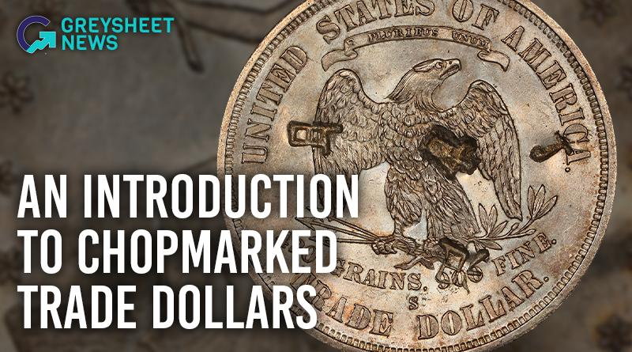

## Table of Contents

## What is trading dollars?

Trading dollars is when you buy and sell the US dollar against other currencies. People do this to make money from changes in the value of the dollar compared to other money. For example, if you think the dollar will get stronger against the euro, you might buy dollars with euros. Later, if the dollar does get stronger, you can sell your dollars back for more euros than you started with.

This kind of trading happens in the foreign exchange market, which is the biggest market in the world. It's open all the time because different countries are in different time zones. Many people and big companies trade dollars every day. They use special platforms and tools to help them decide when to buy and sell. Trading dollars can be risky because the value of money can change quickly, but it can also be a way to make money if you know what you're doing.

## Why do people trade dollars?

People trade dollars because they want to make money from the changes in its value compared to other currencies. If someone thinks the dollar will become stronger against another currency, like the euro, they might buy dollars with their euros. Later, if the dollar does get stronger, they can trade their dollars back for more euros than they started with, making a profit.

Trading dollars is also important for businesses that work in different countries. For example, a company in the United States that sells products to Europe needs euros to pay for things there. If they think the dollar will get weaker, they might buy euros now to avoid paying more later. This helps them manage their money better and protect their business from sudden changes in currency values.

## How does the exchange rate affect dollar trading?

The exchange rate is like a price tag that tells you how many units of one currency you can get for another. When you trade dollars, the exchange rate is super important because it decides if you make money or lose it. If the exchange rate says one dollar can buy more of another currency than before, the dollar got stronger. If you bought dollars when they were weaker and sell them now, you make a profit. But if the dollar gets weaker, and you sell it for less than you paid, you lose money.

People who trade dollars watch the exchange rate all the time. They use it to guess if the dollar will go up or down. If they think the dollar will get stronger, they buy it. If they think it will get weaker, they might sell it or wait to buy it later. The exchange rate can change because of many things, like what's happening in the economy, news, or even what people think might happen. So, understanding the exchange rate helps traders make smart choices about when to buy and sell dollars.

## What are the basic steps to start trading dollars?

To start trading dollars, you first need to choose a broker or a trading platform. A broker is like a helper who lets you buy and sell dollars. You can find many brokers online, but make sure to pick one that is trusted and has good reviews. Once you've chosen a broker, you'll need to open an account with them. This usually means filling out some forms and maybe sending them some documents to prove who you are. After your account is set up, you'll need to put some money into it, which is called making a deposit.

Next, you need to learn how to use the trading platform. The platform is like a tool that shows you the exchange rates and lets you trade dollars. You should practice using it without real money first, maybe with a demo account. This helps you get used to how everything works. Once you feel ready, you can start trading for real. You'll need to decide when to buy and sell dollars based on what you think the exchange rates will do. Remember, trading can be risky, so it's a good idea to start small and learn as you go.

## What are the different methods of trading dollars?

There are a few main ways people trade dollars. One way is called spot trading. This means you buy or sell dollars right away at the current exchange rate. It's like going to a store and buying something at the price you see. Spot trading is good for people who want to quickly take advantage of what's happening with the dollar's value right now. Another way is called forward trading. This is when you agree to buy or sell dollars at a certain price in the future. It's like making a deal today for something you'll get later. Forward trading is useful if you want to protect yourself from big changes in the exchange rate.

Another method is futures trading. Futures are a bit like forward trading, but they're traded on special markets and come in standard sizes. They're good for people who want to bet on where they think the dollar will go in the future. Options trading is another way to trade dollars. With options, you buy the right, but not the obligation, to trade dollars at a certain price before a certain time. It's like buying a ticket that lets you decide later if you want to use it or not. Options can be less risky because you don't have to go through with the trade if it's not in your favor. Each method has its own benefits and risks, so it's important to understand them before you start trading.

## What are the risks involved in trading dollars?

Trading dollars can be risky because the value of money can change a lot and fast. If you buy dollars and they get weaker before you sell them, you lose money. This can happen because of many things, like big news or changes in the economy. Also, trading often means using borrowed money, which is called leverage. This can make your wins bigger, but it also makes your losses bigger. So if things go wrong, you could lose more money than you started with.

Another risk is that the market can be hard to predict. Even people who study it a lot can get it wrong. If you guess wrong about where the dollar is going, you could lose money. Plus, trading platforms and brokers can have problems, like going offline or making mistakes. This can mess up your trades and cost you money. So, it's important to be careful and understand that trading dollars is not a sure way to make money.

## How can one analyze the dollar's value against other currencies?

To analyze the dollar's value against other currencies, you can look at the exchange rate, which is like a price tag that tells you how many units of one currency you can get for a dollar. You can use charts and graphs to see how the exchange rate has changed over time. This helps you spot patterns and trends. For example, if the dollar has been getting stronger against the euro for a while, you might think it will keep going up. But you also need to pay attention to news and events that can change the dollar's value quickly, like reports about the economy or decisions made by governments and central banks.

Another way to analyze the dollar is by using technical analysis. This means looking at past price movements and using special tools to guess where the dollar might go next. Traders use things like moving averages, which smooth out price changes over time, and support and resistance levels, which are like floors and ceilings for the price. On the other hand, [fundamental analysis](/wiki/fundamental-analysis) looks at the bigger picture, like how strong the U.S. economy is compared to other countries. If the U.S. economy is doing well, the dollar might get stronger. By combining both technical and fundamental analysis, you can make better guesses about the dollar's future value.

## What are some common strategies used in dollar trading?

One common strategy for trading dollars is called [trend following](/wiki/trend-following). This means watching the exchange rate to see if the dollar is getting stronger or weaker over time. If the dollar is going up, a trader might buy more dollars, thinking the trend will keep going. If the dollar is going down, they might sell their dollars or wait to buy them later when the price is lower. Trend following can be simple, but it's important to use tools like moving averages to help spot the trends.

Another strategy is called range trading. This is used when the dollar's value stays pretty much the same, moving up and down within a certain range. Traders might buy dollars when they're at the low end of the range and sell them when they're at the high end. This can be a good way to make small profits over and over again, but it's important to watch the range closely because if the dollar suddenly breaks out of it, the strategy might not work anymore.

A third strategy is called [carry](/wiki/carry-trading) trading. This involves borrowing money in a currency with a low [interest rate](/wiki/interest-rate-trading-strategies) and using it to buy dollars, which might have a higher interest rate. The trader earns the difference between the two interest rates, which can add up over time. But carry trading can be risky because if the dollar gets weaker, the trader could lose more money than they make from the interest. So, it's important to keep an eye on both the exchange rate and the interest rates.

## How does global economic news impact dollar trading?

Global economic news can have a big effect on trading dollars. When news comes out about the U.S. economy, like jobs reports or changes in interest rates, it can make the dollar stronger or weaker. For example, if the news says the U.S. economy is doing well, more people might want to buy dollars, making it stronger. But if the news is bad, like if there are a lot of people out of work, the dollar might get weaker because fewer people want to buy it. News from other countries can also impact the dollar. If another country's economy is doing badly, their currency might get weaker compared to the dollar, making the dollar stronger.

Besides U.S. and foreign economic news, other big events can also move the dollar's value. Things like political changes, natural disasters, or even big speeches from leaders can shake up the markets. Traders watch these events closely because they can change how people feel about the dollar. If there's a lot of uncertainty or fear, people might sell dollars and buy safer currencies, making the dollar weaker. On the other hand, if the news makes people feel more confident about the U.S. economy, they might buy more dollars, pushing its value up. So, staying on top of global economic news is really important for anyone trading dollars.

## What are the differences between trading dollars in the spot market versus the futures market?

Trading dollars in the spot market means you buy or sell dollars right away at the current exchange rate. It's like going to a store and buying something at the price you see. Spot trading is good for people who want to quickly take advantage of what's happening with the dollar's value right now. It's used a lot by businesses that need to pay for things in different countries and by traders who want to make money from short-term changes in the exchange rate.

Trading dollars in the futures market is different because you agree to buy or sell dollars at a certain price in the future. It's like making a deal today for something you'll get later. Futures trading is good for people who want to bet on where they think the dollar will go in the future. It's also useful for businesses that want to protect themselves from big changes in the exchange rate. Futures are traded on special markets and come in standard sizes, which can make them a bit more complicated than spot trading.

## How can advanced traders use leverage in dollar trading?

Advanced traders can use leverage to try to make more money when trading dollars. Leverage is like borrowing money to trade with. Instead of using only their own money, traders can borrow more from their broker. This means they can control a bigger amount of dollars with less of their own cash. If the dollar goes up in value, the trader can make a bigger profit because they're trading with more money. But leverage is risky because if the dollar goes down, the losses can be bigger too. So, traders need to be careful and understand how much they could lose before using leverage.

To use leverage wisely, advanced traders need to have a good plan and know how to manage their risks. They might set stop-loss orders, which are like automatic sell orders that kick in if the dollar's value drops too much. This can help limit how much money they lose. Traders also need to keep an eye on how much leverage they're using. Too much leverage can lead to big losses, so it's important to use it in a way that matches their trading strategy and how much risk they're willing to take. By being smart about leverage, advanced traders can try to make more money from trading dollars, but they always need to remember the risks involved.

## What are some advanced technical indicators used specifically for trading dollars?

Advanced traders often use a tool called the Relative Strength Index (RSI) to help them trade dollars. The RSI measures how fast and strong the dollar's price is moving. It gives a number between 0 and 100. If the RSI is over 70, it might mean the dollar is too expensive and could go down soon. If it's under 30, it might mean the dollar is too cheap and could go up. Traders use this to guess when the dollar's price might change direction, helping them decide when to buy or sell.

Another useful tool is the Moving Average Convergence Divergence (MACD). This indicator looks at the difference between two moving averages of the dollar's price. It shows traders when the dollar's trend might be changing. When the MACD line crosses above the signal line, it could mean it's a good time to buy dollars because the price might go up. If the MACD line crosses below the signal line, it might be a good time to sell because the price could go down. By watching these signals, traders can make smarter choices about trading dollars.

## What is Understanding Trading Dollars?

Trading dollars refers to a crucial financial concept representing the breakeven point where an investor or a company recoups the entire amount initially invested, resulting in no net gain or loss. Essentially, it is the state where the total returns from an investment equal the original investment costs. This concept is not only applicable to individual investments but also extends across various financial sectors, including the stock market, forex trading, and business operations.

In the foreign exchange (forex) market, trading dollars signifies a scenario where gains in a trade are equal to the losses incurred. This particular application is vital for maintaining capital stability, especially amidst the inherent [volatility](/wiki/volatility-trading-strategies) of currency markets. For example, a forex trader might deploy strategies that ensure the amount gained from favorable trades offsets any potential losses, thus achieving a breakeven state.

Mathematically, the breakeven point can be expressed as:

$$
\text{Total Returns} = \text{Initial Investment}
$$

This equation highlights the requirement for the total returns from an investment to match the initial outlay for breakeven to occur. Understanding this point is vital for effective risk management and for devising strategies aimed at capital preservation.

In volatile markets, the importance of grasping the notion of trading dollars becomes pronounced. By setting breakeven points, investors can safeguard their capital during periods of market stagnation or uncertainty, ensuring they do not incur net losses. Risk management techniques often incorporate these calculations, helping traders and investors assess when to enter or [exit](/wiki/exit-strategy) positions to maintain financial equilibrium.

Overall, trading dollars represent a fundamental aspect of financial discipline, guiding both strategic decision-making and risk management practices. By thoroughly understanding this concept, traders can make informed decisions that protect their investments over time.

## What are the types of trading dollars?

Trading dollars manifest in various sectors of the financial industry, most notably in [forex](/wiki/forex-system) trading and business development. 

In forex trading, breakeven strategies are employed to manage profits and mitigate losses. Traders place stop-loss orders at strategic points to ensure that any adverse movements in the currency pair do not erase the gains from previous successful trades. The breakeven point, where gains equal losses, is essential for maintaining capital. For example, if a trader buys a currency pair at a certain price, they might set a stop-loss order slightly above the purchase price after the pair has moved favorably. This strategy locks in potential profits and reduces the risk of returning to the initial investment value, often referred to as "trading dollars."

Considering business development, trading dollars represent a position where the revenues match the costs, leading to zero net profit or loss. This situation is critical in financial analysis and budgeting, serving as a baseline for assessing profitability. For instance, if a company’s revenue $R$ is equivalent to its total costs $C$ (fixed costs $FC$ plus variable costs $VC$), the breakeven formula can be expressed as:

$$

R = FC + VC 
$$

Achieving this balance ensures that all costs are covered by revenues, but additional profit generation necessitates either an increase in revenue or a reduction in costs. Understanding these dynamics helps businesses prioritize cost management strategies and revenue enhancement initiatives to move beyond breakeven and achieve profitability.

## What are the types of algorithmic trading strategies?

Algorithmic trading strategies employ various approaches to maximize trading efficiency and profitability. Common strategies include trend trading, range trading, and the [volume](/wiki/volume-trading-strategy)-weighted average price (VWAP) strategy.

**Trend Trading Algorithms**  
Trend trading algorithms are designed to capitalize on market movements by identifying and following price trends. These algorithms analyze historical price data and apply statistical techniques to predict future market direction. A basic principle underlying trend trading is the belief that prices follow a directional [course](/wiki/best-algorithmic-trading-courses), and by identifying this path early, traders can open positions aligned with the trend’s [momentum](/wiki/momentum). The algorithm determines entry and exit points based on parameters such as moving averages, momentum indicators, and price channels. 

Example Python code for a simple moving average crossover strategy, a popular trend trading technique:

```python
import pandas as pd

def moving_average_crossover(prices, short_window=50, long_window=200):
    signals = pd.DataFrame(index=prices.index)
    signals['price'] = prices
    signals['short_mavg'] = prices.rolling(window=short_window, min_periods=1).mean()
    signals['long_mavg'] = prices.rolling(window=long_window, min_periods=1).mean()

    signals['signal'] = 0.0  
    signals['signal'][short_window:] = np.where(signals['short_mavg'][short_window:] > signals['long_mavg'][short_window:], 1.0, 0.0)   
    signals['positions'] = signals['signal'].diff()

    return signals

# Example usage
prices = pd.Series([some_price_data])  # Replace with actual price data
signals = moving_average_crossover(prices)
```

**Range Trading Algorithms**  
Range trading involves recognizing and trading within a defined price range. These algorithms are effective in markets where prices tend to stay within certain levels of support and resistance over a period of time. Range trading algorithms identify these critical levels and execute trades when prices approach these zones. By exploiting the predictability of price fluctuations within a range, they aim to buy at support and sell at resistance. Incorporating stochastic oscillators or relative strength indices can help confirm overbought or oversold conditions.

**Volume-Weighted Average Price (VWAP) Strategy**  
The VWAP strategy is particularly useful for institutions looking to execute large orders without significantly impacting the market price. VWAP is calculated by taking the total dollar amount traded for every transaction (price times number of shares traded) and dividing it by the total shares traded over the given timeframe. By breaking down large orders into smaller, more manageable trades executed at or near the VWAP, traders minimize the market impact and obtain a better average price over the trading period.

Mathematical representation of VWAP:

$$
\text{VWAP} = \frac{\sum_{i=1}^{N} P_i \times Q_i}{\sum_{i=1}^{N} Q_i}
$$

Where $P_i$ is the price of trade $i$, $Q_i$ is the quantity of trade $i$, and $N$ is the total number of trades.

These strategies leverage algorithmic efficiency to optimize trading activities, aiming to either enhance trend-following executions, capitalize on market range patterns, or achieve more favorable pricing through advanced execution techniques.

## References & Further Reading

[1]: ["Currency Trading for Dummies"](https://www.amazon.com/Currency-Trading-Dummies-Business-Personal/dp/1119824729) by Kathleen Brooks and Brian Dolan.

[2]: ["Algorithmic Trading and DMA: An Introduction to Direct Access Trading Strategies"](https://www.amazon.com/Algorithmic-Trading-DMA-introduction-strategies/dp/0956399207) by Barry Johnson.

[3]: ["Foreign Exchange: A Practical Guide to the FX Markets"](https://www.amazon.com/Foreign-Exchange-Practical-Guide-Markets/dp/0471732036) by Tim Weithers.

[4]: ["Algorithmic and High-Frequency Trading"](https://assets.cambridge.org/97811070/91146/frontmatter/9781107091146_frontmatter.pdf) by Álvaro Cartea, Sebastian Jaimungal, and José Penalva.

[5]: ["Inside the Black Box: A Simple Guide to Quantitative and High-Frequency Trading"](https://www.amazon.com/Inside-Black-Box-Quantitative-Frequency/dp/1118362411) by Rishi K. Narang.