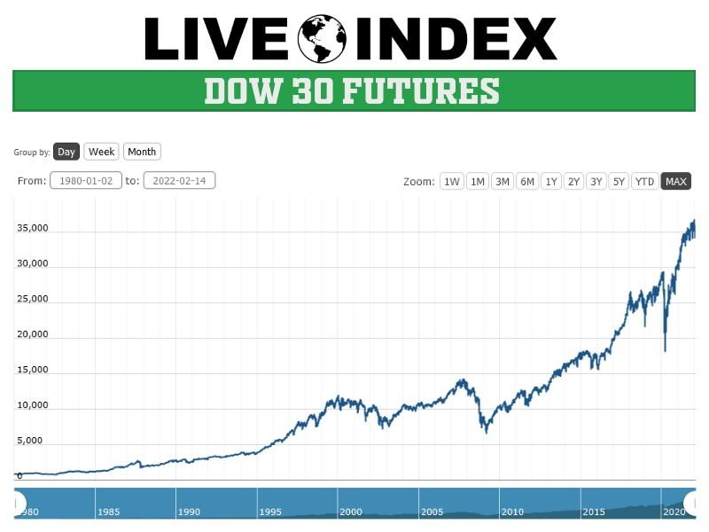

## Table of Contents

## What are Dow Jones Index Futures?

Dow Jones Index Futures are financial contracts that allow investors to bet on the future value of the Dow Jones Industrial Average (DJIA), which is a stock market index that tracks 30 large, publicly-owned companies trading on the New York Stock Exchange and the Nasdaq. These futures contracts are agreements to buy or sell the value of the DJIA at a specific price on a future date. They are used by investors to hedge against potential losses in their stock portfolios or to speculate on the direction of the market.

Trading Dow Jones Index Futures can be a way for investors to gain exposure to the overall performance of the U.S. stock market without having to buy individual stocks. These futures are traded on exchanges like the Chicago Mercantile Exchange (CME) and are available in different contract sizes to suit various investment needs. The value of the futures contract moves in line with the DJIA, so if the index goes up, the value of the futures contract also increases, and vice versa.

## How do Dow Jones Index Futures work?

Dow Jones Index Futures are like bets on where the Dow Jones Industrial Average (DJIA) will be in the future. The DJIA is a number that shows how well 30 big companies in the U.S. are doing. When you buy a futures contract, you agree to buy or sell the value of the DJIA at a certain price on a specific date in the future. If you think the DJIA will go up, you buy a futures contract. If you think it will go down, you sell one.

These futures are traded on big markets like the Chicago Mercantile Exchange. The price of the futures goes up and down with the DJIA. If the DJIA goes up, the futures contract you bought becomes more valuable, and you can sell it for a profit. If the DJIA goes down, the futures contract loses value, and you might lose money. People use these futures to protect their investments or to try to make money by guessing where the market is headed.

## What are the benefits of trading Dow Jones Index Futures?

Trading Dow Jones Index Futures can help you spread your investment risk. Instead of putting all your money into one or a few stocks, you can bet on how a whole group of big companies will do. This can make your investments safer because if one company does badly, the others might still do well, and your futures contract might still be worth something. It's like betting on a team instead of a single player.

Another benefit is that you can use Dow Jones Index Futures to protect other investments you already have. If you own stocks and you're worried they might lose value, you can sell futures contracts. If the stock market goes down, the money you lose on your stocks might be made up by the money you make on the futures. This way, you can sleep better at night knowing you've got a backup plan.

Lastly, trading these futures can be a way to make money if you're good at guessing where the market is going. If you think the market will go up, you can buy futures and sell them later for more money. If you think it will go down, you can sell futures and buy them back cheaper later. It's a way to try to make money without actually buying the stocks themselves.

## What are the risks associated with trading Dow Jones Index Futures?

Trading Dow Jones Index Futures can be risky because the market can be unpredictable. If you guess wrong about where the market is going, you could lose a lot of money. For example, if you buy a futures contract thinking the market will go up, but it goes down instead, the value of your contract will drop, and you might lose more money than you put in. This is called leverage, and it can make your gains bigger, but it can also make your losses bigger.

Another risk is that futures contracts have an expiration date. If you don't close your position before the contract expires, you might have to buy or sell the value of the DJIA at a price that's not good for you. This can lead to big losses if the market has moved against you. Also, trading futures can be stressful because the market can change quickly, and you need to keep a close eye on it to make the right decisions.

Lastly, trading Dow Jones Index Futures requires a good understanding of the market and how futures work. If you're new to trading, you might make mistakes that cost you money. It's important to learn as much as you can and maybe even get advice from someone who knows more about it before you start trading.

## How can someone start trading Dow Jones Index Futures?

To start trading Dow Jones Index Futures, you first need to open an account with a futures broker. This is a company that lets you buy and sell futures contracts. You'll need to fill out some forms and maybe talk to someone at the brokerage to set up your account. Once your account is open, you'll need to put some money into it. This money is called margin, and it's like a deposit that you use to trade futures. The amount of margin you need can change, but it's usually a lot less than the full value of the futures contract.

After you have your account set up and funded, you can start trading. You'll use a trading platform, which is like a computer program or a website where you can see the prices of the futures and make your trades. You can buy a futures contract if you think the Dow Jones Industrial Average will go up, or sell one if you think it will go down. It's important to keep an eye on the market and be ready to make changes to your trades if things don't go the way you expected. Remember, trading futures can be risky, so it's a good idea to learn as much as you can and maybe even talk to someone who knows a lot about it before you start.

## What are the key factors that influence Dow Jones Index Futures prices?

The prices of Dow Jones Index Futures are influenced by many things, but one of the biggest is the overall health of the economy. If people think the economy is doing well, they might buy more stocks, which can make the Dow Jones Industrial Average go up. This, in turn, makes the futures prices go up too. On the other hand, if people are worried about the economy, they might sell their stocks, which can make the Dow Jones go down and the futures prices go down as well. Things like jobs reports, how much stuff people are buying, and what the government is doing with interest rates can all affect how people feel about the economy.

Another important [factor](/wiki/factor-investing) is what's happening in the news. If there's good news about the companies in the Dow Jones, like they're making more money or coming out with new products, the futures prices might go up. Bad news, like a company having problems or a big event happening in the world, can make the futures prices go down. Also, what other investors are doing can influence the prices. If a lot of people are buying or selling futures at the same time, it can push the prices up or down quickly.

## What are the different trading strategies for Dow Jones Index Futures?

One common trading strategy for Dow Jones Index Futures is called [trend following](/wiki/trend-following). This means watching the market to see if the Dow Jones is going up or down over time. If it's going up, you buy futures contracts hoping the price will keep going up so you can sell them later for more money. If it's going down, you sell futures contracts hoping the price will keep going down so you can buy them back later for less money. This strategy works well when the market is moving in a clear direction, but it can be risky if the market suddenly changes [course](/wiki/best-algorithmic-trading-courses).

Another strategy is called hedging. This is when you already own stocks and you want to protect them from losing value if the market goes down. You can sell Dow Jones Index Futures to balance out any losses you might have on your stocks. For example, if the market goes down and your stocks lose money, the futures contracts you sold might gain value, helping to cover your losses. This strategy is good for people who want to be safer with their investments, but it can also limit how much money you can make if the market goes up.

A third strategy is [day trading](/wiki/day-trading-spy), where you buy and sell futures contracts within the same day. You're trying to make small profits from quick changes in the market. This can be exciting because you can see results fast, but it's also very risky. The market can move a lot in a short time, and if you guess wrong, you could lose money quickly. Day trading needs a lot of attention and quick decisions, so it's not for everyone.

## How does leverage affect trading Dow Jones Index Futures?

Leverage in trading Dow Jones Index Futures means you can control a big contract with just a small amount of money. It's like using a lever to lift something heavy with less effort. When you trade futures, you only need to put down a small deposit, called margin, to buy or sell a contract. This lets you make bigger bets than you could if you had to pay the full price upfront. If the market moves in your favor, the gains can be much bigger because you're controlling a larger position with less money.

But leverage can also make things riskier. If the market moves against you, the losses can be bigger too. Since you're using borrowed money to trade, even a small drop in the market can wipe out your deposit quickly. This means you could lose more money than you put in, so it's important to be careful and understand how much risk you're taking on. Leverage can help you make more money, but it can also lead to bigger losses if you're not careful.

## What are the margin requirements for trading Dow Jones Index Futures?

Margin requirements for trading Dow Jones Index Futures are the amount of money you need to put down to open a position. This is like a deposit that shows you're serious about the trade. The exact amount can change, but it's usually a small part of the total value of the futures contract. For example, if a futures contract is worth $100,000, you might only need to put down $5,000 to $10,000 as margin. This lets you control a big contract with less money, which is called leverage.

The margin you need can also change based on how much the market is moving. If the market is very up and down, the exchange might ask for more margin to make sure everyone can cover their trades. This is called a margin call. If you get a margin call, you'll need to add more money to your account quickly, or the broker might close your position to limit their risk. It's important to keep an eye on your margin and be ready to add more money if the market moves against you.

## How do economic reports and global events impact Dow Jones Index Futures?

Economic reports and global events can have a big impact on Dow Jones Index Futures because they can change how people feel about the economy. When good economic reports come out, like more people getting jobs or companies making more money, people might think the economy is doing well. This can make them want to buy more stocks, which can push the Dow Jones Industrial Average up. When the Dow Jones goes up, the futures prices go up too. On the other hand, if bad economic reports come out, like fewer people working or companies losing money, people might worry about the economy. This can make them sell their stocks, which can push the Dow Jones down and make the futures prices go down as well.

Global events can also shake things up. If something big happens in the world, like a war or a natural disaster, it can make people nervous about the future. This nervousness can lead them to sell their stocks, which can make the Dow Jones and the futures prices drop. But if good news comes from around the world, like a new trade deal or a country's economy growing fast, it can make people feel more confident. This confidence can lead them to buy more stocks, pushing the Dow Jones and the futures prices up. So, keeping an eye on the news and understanding how it might affect the economy can help you make better decisions when trading Dow Jones Index Futures.

## What are the tax implications of trading Dow Jones Index Futures?

When you trade Dow Jones Index Futures, you need to know about the taxes you might have to pay. The money you make from trading futures is usually taxed as a 60/40 split. This means 60% of your gains are taxed at the long-term capital gains rate, which is lower, and 40% are taxed at the short-term capital gains rate, which is the same as your regular income tax rate. This can be good for you because it might mean you pay less in taxes than if all your gains were taxed at the higher short-term rate.

You also need to keep good records of all your trades. This includes when you bought and sold the futures, how much you made or lost, and any fees you paid. At the end of the year, you'll get a Form 1099-B from your broker that shows your trading activity. You'll use this to fill out your tax return and figure out how much you owe. It's a good idea to talk to a tax professional to make sure you're doing everything right and taking advantage of all the tax rules that can help you.

## How can advanced technical analysis be applied to trading Dow Jones Index Futures?

Advanced technical analysis can help you make better decisions when trading Dow Jones Index Futures by looking at past price movements to predict what might happen next. One way to do this is by using charts to spot patterns, like when the price goes up and down in a certain way. For example, you might see a "head and shoulders" pattern, which can mean the price is about to go down. Another tool is indicators, like moving averages, which smooth out price changes over time to show you the general direction the market is heading. By combining these patterns and indicators, you can guess when it might be a good time to buy or sell futures contracts.

Another part of advanced technical analysis is using more complex tools like the Relative Strength Index (RSI) or the Moving Average Convergence Divergence (MACD). The RSI can tell you if a stock is overbought or oversold, which means it might be time to sell or buy. The MACD can help you see when the market's [momentum](/wiki/momentum) is changing, which can signal a good time to enter or [exit](/wiki/exit-strategy) a trade. These tools can give you more information to help you make smarter trading decisions. But remember, even with all these tools, the market can still surprise you, so it's important to always be ready for anything.

## References & Further Reading

[1]: CME Group. ["Futures and Options Trading for Risk Management."](https://www.cmegroup.com/) CME Group Education.

[2]: Marcos López de Prado. ["Advances in Financial Machine Learning"](https://www.amazon.com/Advances-Financial-Machine-Learning-Marcos/dp/1119482089). Wiley, 2018.

[3]: David Aronson. ["Evidence-Based Technical Analysis: Applying the Scientific Method and Statistical Inference to Trading Signals"](https://www.amazon.com/Evidence-Based-Technical-Analysis-Scientific-Statistical/dp/0470008741). Wiley, 2006.

[4]: Stefan Jansen. ["Machine Learning for Algorithmic Trading: Predictive models to extract signals from market and alternative data for systematic trading strategies with Python"](https://github.com/stefan-jansen/machine-learning-for-trading). Packt Publishing, 2020.

[5]: Ernest P. Chan. ["Quantitative Trading: How to Build Your Own Algorithmic Trading Business"](https://www.amazon.com/Quantitative-Trading-Build-Algorithmic-Business/dp/0470284889). Wiley, 2008.

[6]: ["The Emergence of AI in Financial Trading"](https://www.sciencedirect.com/science/article/pii/S1319157824001046) Nature, 2019.

[7]: Timothy Masters. ["Testing and Tuning Market Trading Systems: Algorithms in C++ & Technical Analysis"](https://link.springer.com/book/10.1007/978-1-4842-4173-8). Wiley, 2002.