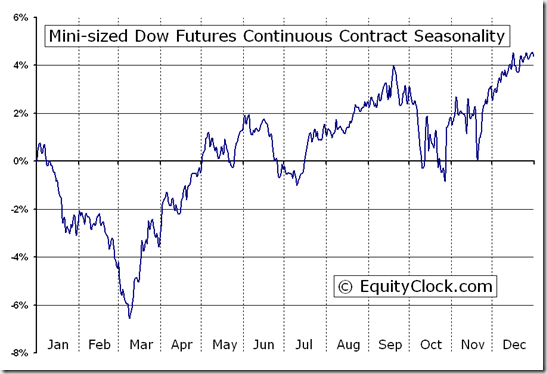

Futures trading is a sophisticated financial mechanism that involves contracts obligating the exchange of an asset at a predetermined future date and price. One crucial facet of this market is trading futures on indices such as the Dow Jones Industrial Average (DJIA). DJIA futures provide investors with a unique opportunity to speculate on the direction of one of the world's most renowned stock market indices. The Dow Jones serves as a significant benchmark of the American stock market's health, often reflecting broader economic trends due to its incorporation of 30 large, publicly-owned companies based in the United States. These companies span diverse sectors, making the index a balanced indicator of market performance.

The advancement of algorithmic trading has revolutionized the handling of financial transactions. Algorithmic trading utilizes computer programs to execute trades based on pre-defined criteria and mathematical models. This method enhances speed and accuracy, offering advantages such as reduced transaction costs and the ability to test complex strategies. In the context of futures trading, algorithms facilitate the assessment and execution of multiple trades across various markets simultaneously. The advent of high-frequency trading (HFT), a subset of algorithmic trading, leverages this capacity to execute orders in fractions of a second, increasing the fluidity and efficiency of financial markets.



The relevance of algorithmic trading cannot be overstated in modern financial markets. It has transformed the traditional trading landscape by replacing manual trade execution with automated systems capable of processing vast quantities of market data. Traders and institutional investors alike benefit from this technology through increased access to liquidity, enhanced risk management tools, and the ability to capitalize on market opportunities as they arise. As financial markets continue to evolve, those engaging in futures trading, including DJIA futures, must adapt to the growing prominence of algorithmic strategies to maintain competitiveness.

## Table of Contents

## Understanding Futures Trading

Futures contracts are standardized agreements to buy or sell a specific quantity of a particular asset at a predetermined price on a specified future date. These agreements are traded on futures exchanges and are legally binding. The standardization of futures contracts facilitates liquidity and market activity by ensuring that all contracts for the same type of asset share the same terms, except for the price and expiration date. This standardization allows traders to easily buy and sell contracts without negotiating the detailed terms of each transaction.

Futures contracts often fall into two categories based on their settlement method: physical delivery and cash-settled. Physical delivery entails the actual delivery of the underlying asset upon contract expiration. This is common in commodities trading, where the buyer might receive shipments of goods like corn or oil. In contrast, cash-settled futures, like the Dow Jones Industrial Average (DJIA) futures, do not involve the delivery of physical goods. Instead, these contracts are settled by paying the difference between the contract price and the market price at expiration. For example, if a trader holds a Dow futures contract that is settled at a higher price compared to the agreed contract price, the trader earns the price difference in cash, and vice versa.

Leverage is a fundamental aspect of futures trading, allowing traders to control large positions with a relatively small amount of capital, known as margin. This is achieved by paying a fraction of the total contract value upfront, known as the initial margin. Leverage magnifies both potential gains and potential losses, which means small price movements in the underlying asset can lead to significant changes in the trader's profit or loss. Calculating the impact of leverage involves understanding the margin requirements set by exchanges and brokers, which vary depending on the volatility and liquidity of the underlying asset. Proper risk management strategies are crucial due to the amplified financial risks associated with leveraged trading.

## Trading the Dow Jones with Futures

DJIA futures contracts, often referred to as Dow Jones Index futures, provide a mechanism for investors and traders to speculate on the overall direction of the stock market, as represented by the Dow Jones Industrial Average (DJIA). These futures contracts are a derivative instrument that reflects expectations of the future values of the DJIA, allowing participants to take positions on whether the index will rise or fall.

Futures contracts are standardized agreements to buy or sell the underlying index at a specific price on a future date, and their prices fluctuate based on the perceived value of the DJIA. This feature makes them attractive for those looking to hedge their portfolios against market movements or to capitalize on anticipated price changes in the broader economy.

### Contract Sizes: E-mini and Micro E-mini Dow Jones Futures

Two notable types of Dow Jones futures contracts that cater to different trading preferences and capital requirements are the E-mini Dow Jones futures (`YM`) and the Micro E-mini Dow Jones futures (`MYM`). These vary primarily in their contract size and tick value:

- **E-mini Dow Jones Futures (`YM`)**: This contract represents a smaller version of the standard Dow Jones futures and is popular among individual traders due to its accessible size. Each tick (the smallest price movement) in the E-mini contract represents a movement of $5, which is less than the larger standard futures contract. The E-mini facilitates trading with smaller margin requirements compared to standard contracts, making it attractive for those with limited capital.

- **Micro E-mini Dow Jones Futures (`MYM`)**: Introduced to further enhance accessibility, the Micro E-mini contracts are even smaller in size, allowing traders to enter the market with significantly lower financial commitments. The tick value for Micro E-mini futures is $0.50, making it an ideal choice for traders who wish to engage with minimal risk exposure or for those experimenting with new trading strategies.

### Trading Volumes and Liquidity

Trading volumes and [liquidity](/wiki/liquidity-risk-premium) are critical factors that influence the efficiency and attractiveness of futures markets. High trading [volume](/wiki/volume-trading-strategy) often translates to greater liquidity, which is essential for the quick execution of trades with minimal price impact. DJIA futures benefit from substantial trading volumes, particularly those of the E-mini and Micro E-mini contracts, as these are widely favored by both institutional and retail traders.

The consistent liquidity in these futures markets ensures tight bid-ask spreads, reducing transaction costs and enabling traders to enter and [exit](/wiki/exit-strategy) positions with ease. This liquidity is crucial for executing large trades without affecting the market price significantly, thereby maintaining a stable trading environment.

In conclusion, DJIA futures contracts, through E-mini and Micro E-mini variants, provide versatile tools for market participants to speculate on or hedge against fluctuations in the Dow Jones Industrial Average. With their varying contract sizes and robust liquidity, they remain a pivotal part of modern trading strategies, appealing to a diverse range of traders and investors.

## Algorithmic Trading Strategies

Algorithmic trading, often called algo trading, involves using computer programs to execute trades at speeds and frequencies beyond human capability. The advantages of [algorithmic trading](/wiki/algorithmic-trading) lie in its speed, precision, and the ability to analyze vast datasets to make trading decisions. By automating the trading process, algorithms can execute orders in milliseconds, significantly reducing the impact of human emotion and error.

**Popular Algorithmic Strategies**

1. **Market Making**: Market making algorithms continuously provide buy and sell quotes to earn the spread. These algorithms are essential for maintaining liquidity in the market. A market-making algorithm typically evaluates the current market conditions and continuously adjusts its bid and ask prices to capture the bid-ask spread. The goal is to trade frequently and earn consistent small profits.

   Python Code Example for a Basic Market-Making Algorithm:
   ```python
   class MarketMaker:
       def __init__(self, symbol, bid, ask, spread):
           self.symbol = symbol
           self.bid = bid
           self.ask = ask
           self.spread = spread

       def update_quotes(self, new_price):
           self.bid = new_price - (self.spread / 2)
           self.ask = new_price + (self.spread / 2)
           return self.bid, self.ask

   # Usage
   mm = MarketMaker("DOW_FUTURE", 30000, 30010, 10)
   print(mm.update_quotes(30005))
   ```

2. **Arbitrage**: Arbitrage algorithms exploit price differences of the same asset in different markets or forms. The classic example is when a futures contract is priced differently from the underlying asset, allowing traders to profit by buying low and selling high. Algorithms are especially suited for arbitrage due to their ability to quickly identify and exploit fleeting price discrepancies.

3. **Trend Following**: This strategy involves identifying and following market trends. Trend following algorithms analyze historical data to determine the direction of the market and make trades based on the strength and duration of the trend. These algorithms often utilize moving averages, momentum indicators, and other technical analysis tools to make decisions.

   Simple Moving Average (SMA) Strategy Example:
   ```python
   import numpy as np

   def simple_moving_average(prices, window):
       sma = np.convolve(prices, np.ones(window), 'valid') / window
       return sma

   # Prices of a futures contract
   prices = [100, 102, 104, 103, 108, 110]
   print(simple_moving_average(prices, window=3))
   ```

**Backtesting and Strategy Refinement**

Backtesting is the process of testing a trading strategy using historical data to evaluate its effectiveness. This step is crucial to ensure that a strategy is viable before deploying it in live markets. By simulating trades through historical data, traders can refine their strategies, optimize parameters, and eliminate unprofitable elements. Continuous refinement through [backtesting](/wiki/backtesting) allows algorithmic traders to adapt to changing market conditions and improve profitability.

In summary, algorithmic trading's advantages of speed and precision manifest through strategies like [market making](/wiki/market-making), [arbitrage](/wiki/arbitrage), and [trend following](/wiki/trend-following). The success of these strategies heavily relies on rigorous backtesting and iterative refinement, providing algorithmic traders with a systematic and disciplined approach to trading futures.

## Setting Up for Futures Trading

To begin trading futures, a trader must open a futures trading account. This process involves selecting a broker that meets specific needs and preferences. Several key factors should be considered when choosing a broker for futures trading:

1. **Platform Features**: It is essential to assess the trading platform's capabilities provided by the broker. A robust trading platform should offer advanced charting tools, customizable dashboards, real-time data feeds, and efficient order execution. Platforms that support algorithmic trading should provide capabilities for developing, testing, and deploying trading algorithms. Some popular platforms, such as MetaTrader and NinjaTrader, are often favored for their comprehensive features and user-friendly interfaces.

2. **Fees and Commissions**: Understanding the cost structure is crucial as it directly affects profitability. Brokers may charge various fees, including commissions per trade, platform fees, data feed costs, and inactivity charges. It's important to compare these fees and ensure they align with the trader's budget and trading frequency. Lower fees and competitive commissions contribute to improved net returns.

3. **Customer Service**: Reliable customer support is vital for addressing any technical issues or account-related queries. A broker with excellent customer service provides timely assistance through multiple channels, such as phone, email, and live chat, enhancing the overall trading experience.

Setting up a futures trading account typically involves completing an application process, verifying identity, and funding the account. Some brokers might require additional information regarding the trader's experience and financial status.

Selecting a trading platform capable of executing algorithmic trades is essential for those intending to employ algorithmic trading strategies. A robust platform should support Application Programming Interfaces (APIs) for seamless integration with custom trading algorithms. APIs allow traders to automate transactions based on predefined strategies, access real-time market data, and execute trades automatically, without manual intervention. Popular APIs used for algorithmic trading include [Interactive Brokers](/wiki/interactive-brokers-api) API and Alpaca API, which provide comprehensive documentation and community support for developing trading solutions.

Here is a simple example of using the Interactive Brokers API with Python to place a futures order:

```python
from ibapi.client import EClient
from ibapi.wrapper import EWrapper
from ibapi.contract import Contract
from ibapi.order import Order

class TradingApp(EWrapper, EClient):
    def __init__(self):
        EClient.__init__(self, self)

    def nextValidId(self, orderId):
        # Define futures contract
        contract = Contract()
        contract.symbol = "YM"
        contract.secType = "FUT"
        contract.exchange = "CME"
        contract.currency = "USD"
        contract.lastTradeDateOrContractMonth = "202312"

        # Create a market order
        order = Order()
        order.action = "BUY"
        order.orderType = "MKT"
        order.totalQuantity = 1

        # Place order
        self.placeOrder(orderId, contract, order)

app = TradingApp()
app.connect("127.0.0.1", 7496, clientId=1)
app.run()
```

This example initializes a connection to the Interactive Brokers client gateway, defines a futures contract, and places a market order. It highlights the necessity of a platform with API support for executing algorithmic trades effectively. Choosing the right broker and platform significantly enhances the trader's ability to implement and manage algorithmic trading strategies efficiently.

## Leveraging Technology in Futures Trading

In the trading of futures, especially those linked to the Dow Jones Index, technology plays a critical role. Trading software and application programming interfaces (APIs) are fundamental tools in executing algorithmic trades. These platforms offer traders the ability to automate trading strategies, ensuring they can react swiftly to market changes. They provide features to program trading criteria, execute orders automatically, and monitor performance in real-time, which are essential for maintaining a competitive edge in high-frequency trading environments.

Artificial intelligence (AI) and [machine learning](/wiki/machine-learning) (ML) are transformative technologies in refining trading algorithms. AI models can analyze vast datasets to identify patterns that human traders might miss, and machine learning algorithms can constantly evolve by learning from new data. This capability makes it possible to optimize trading strategies dynamically, adjust to market conditions, and forecast future movements with greater accuracy. For instance, sentiment analysis powered by AI can interpret news trends and social media signals, influencing markets and providing traders with actionable insights.

Real-time data feeds and analytics are indispensable in making informed trading decisions. Accurate and up-to-the-second data allows traders to track price movements, volumes, and market trends as they occur. This immediacy is crucial in a market where conditions can change rapidly and a delay could result in significant financial losses. Advanced analytics tools process this data to generate meaningful insights, enabling traders to backtest strategies and make evidence-based decisions. Real-time analytics also ensure that automated trading systems are functioning as intended and correctly adjusting to unfolding market scenarios.

By integrating these technologies, traders can enhance their decision-making processes, improve the precision of their trades, and potentially achieve better investment outcomes in the futures market. These advancements not only amplify the efficiency of trading operations but also democratize access to sophisticated trading strategies, enabling even individual traders to harness the powers of algorithmic trading.

## Risk Management in Futures Trading

Futures trading presents substantial risks, particularly due to the leverage involved. Leverage allows traders to control a large contract value with a relatively small amount of capital, amplifying both potential gains and losses. For instance, a trader using leverage might control a futures contract worth $100,000 with a margin deposit of just $5,000, implying a leverage ratio of 20:1. While this can lead to significant profits, it also means that a relatively small price movement can result in substantial losses, potentially exceeding the initial margin deposit.

To manage these risks, traders employ several strategies. One common approach is the use of stop-loss orders, which automatically sell a position when it reaches a predetermined price, limiting potential losses. For example, if a trader purchases a futures contract at $50 and sets a stop-loss at $45, the position will be sold if the price drops to $45, capping the loss at $5 per contract.

Diversification is another effective strategy. By spreading investments across various contracts or asset classes, traders can mitigate the impact of a single adverse price movement. The goal of diversification is to create a portfolio with uncorrelated assets, thereby reducing overall risk. This approach is grounded in the principle that while some assets may experience declines, others may perform well, thus balancing the overall performance of the portfolio.

Maintaining adequate margin is critical in futures trading. Margin refers to the funds traders must deposit to open and maintain a position. It acts as a security deposit to cover potential losses. If the market moves against a position, the broker may issue a margin call, requiring the trader to deposit additional funds to keep the position open. Therefore, traders should maintain sufficient margin to avoid margin calls and potential liquidation of their positions. Understanding margin requirements, which vary between brokers and contracts, is essential for effective risk management. Keeping a margin cushion, or excess margin, helps mitigate the risk of forced liquidation during market [volatility](/wiki/volatility-trading-strategies).

Here's a simple Python snippet to calculate the maximum leverage a trader can use based on their available capital and the margin requirement of a futures contract:

```python
def max_leverage(available_capital, margin_per_contract):
    return available_capital / margin_per_contract

available_capital = 10000  # Example: $10,000
margin_per_contract = 500  # Example: $500 margin per contract

leverage = max_leverage(available_capital, margin_per_contract)
print(f"Maximum Leverage: {leverage}")
```

By carefully managing leverage, utilizing stop-loss orders, diversifying investments, and maintaining adequate margin, traders can navigate the inherent risks of futures trading more effectively and safeguard their capital against unexpected market fluctuations.

## The Future of Algorithmic Futures Trading

The future of algorithmic futures trading is poised for significant transformation as technology continues to advance. Emerging trends indicate a shift towards more sophisticated algorithms, enhanced data analysis, and the integration of cutting-edge technologies like [artificial intelligence](/wiki/ai-artificial-intelligence) (AI) and machine learning (ML).

Emerging Trends in Algorithmic Trading Technology
-------------------------------------------------
One of the primary trends anticipated in algorithmic futures trading is the incorporation of AI and ML to develop more dynamic and adaptive trading strategies. These technologies enable algorithms to learn from vast amounts of historical and real-time data, improving their decision-making processes. An example of this is the use of [reinforcement learning](/wiki/reinforcement-learning), a subset of machine learning, where algorithms iteratively learn by simulating numerous market scenarios to optimize trade execution strategies.

The use of quantum computing also holds promise in this field. Quantum computers can process information exponentially faster than classical computers, allowing for more complex computations and real-time data processing. This capability could transform risk management and pricing models, providing traders with a competitive edge.

Impact of Regulatory Changes
----------------------------
Regulatory developments will likely play a crucial role in shaping the future of algorithmic trading. As algorithms become more autonomous and influential in financial markets, regulators are expected to increase oversight to ensure market stability and prevent unfair trading practices. One aspect of regulatory focus may be the transparency of algorithmic operations, requiring firms to disclose their trading algorithms' workings and decision-making processes.

Moreover, regulations aimed at preventing market manipulation and ensuring fair access to market data are expected to evolve. These regulations may also address concerns around high-frequency trading, where unfair advantages might be gained through faster access to market information, thereby leveling the playing field for all market participants.

Potential for Increased Automation and AI in Futures Markets
------------------------------------------------------------
The integration of automation and AI in futures markets will likely lead to increased efficiency and accuracy in trade execution. Automated trading systems can execute orders at optimal times based on predefined criteria, reducing the potential for human error. Python, with its extensive libraries such as NumPy and pandas, can be used to develop and test these systems. A simple example of an algorithm that traders might use is a moving average crossover strategy, implemented as follows:

```python
import pandas as pd

def moving_average_crossover(strategy_data, short_window=40, long_window=100):
    """
    Calculate moving average crossover strategy.

    Parameters:
    - strategy_data: pd.DataFrame with 'Close' prices.
    - short_window: int
    - long_window: int

    Returns:
    - signals: pd.DataFrame
    """
    signals = pd.DataFrame(index=strategy_data.index)
    signals['signal'] = 0.0

    signals['short_mavg'] = strategy_data['Close'].rolling(window=short_window, min_periods=1).mean()
    signals['long_mavg'] = strategy_data['Close'].rolling(window=long_window, min_periods=1).mean()

    signals['signal'][short_window:] = np.where(signals['short_mavg'][short_window:] > signals['long_mavg'][short_window:], 1.0, 0.0)

    signals['positions'] = signals['signal'].diff()

    return signals
```

By leveraging machine learning, traders can adjust their algorithms based on patterns detected in the market data, leading to more proactive and effective trading strategies.

As automation increases, the role of human oversight will evolve, focusing more on the development, monitoring, and ethical considerations of trading algorithms. This shift ensures that while machines handle the complexities of trading, humans maintain control over strategic decisions and risk management.

In summary, the future of algorithmic futures trading is set to be marked by rapid technological advancements. Traders who adapt and integrate these technologies into their practices will likely find themselves at the forefront of market opportunities. However, this evolution will need to be balanced with regulatory compliance to maintain market integrity.

## Conclusion

In this article, we explored the multifaceted concepts of futures trading, with a particular focus on the Dow Jones Index futures and the significant role of algorithmic trading in modern financial markets. We began by understanding futures contracts as agreements to buy or sell assets at a predetermined future date, highlighting the nature of cash-settled contracts like those associated with the Dow Jones Industrial Average (DJIA). The importance of leverage in amplifying both potential returns and risks was also underscored. Through the use of DJIA futures, traders can speculate on market directions using varying contract sizes such as E-mini and Micro E-mini contracts, benefitting from high trading volumes and liquidity.

We also examined the significance of algorithmic trading, which allows for precise, rapid trading activities through strategies like market making, arbitrage, and trend following. Backtesting and continuous refinement of trading algorithms are crucial in this domain to enhance effectiveness and efficiency. As traders set up their futures accounts, choosing the right broker and platform is essential, as these choices can significantly impact success in executing algorithmic trades.

Additionally, leveraging technology, including advanced trading software, APIs, and the integration of artificial intelligence, has revolutionized how trades are executed and refined in real time. Risk management remains a cornerstone, where implementing strategies such as stop-loss orders, diversification, and maintaining adequate margins are emphasized to safeguard against the heightened risks in futures markets.

Looking ahead, the future of trading is poised for further transformation with advances in automation and AI, amidst evolving regulatory landscapes. These trends suggest a continuous evolution of algorithmic strategies and practices.

Readers are encouraged to persist in educating themselves on the nuances of futures trading and algorithmic strategies to remain competitive and informed. As technology continually reshapes trading paradigms, exploring its latest advancements will be crucial for those involved in this dynamic financial environment.

## FAQs

### FAQs

**What are Dow Jones futures and how can I start trading them with limited experience?**

Dow Jones futures are financial derivatives that allow traders to speculate on the future value of the Dow Jones Industrial Average (DJIA). These contracts are agreements to buy or sell the index at a set point in the future. For newcomers, starting with these futures can seem daunting due to their complexity and inherent risks. However, the following steps can help simplify the process:

1. **Education**: Familiarize yourself with the basics of futures trading, including understanding what futures contracts are and how leverage operates. Numerous online courses, books, and free resources can provide foundational knowledge. Websites like the CME Group (CME Group, 2023) offer educational content specific to futures trading.

2. **Simulated Trading**: Use a demo or paper trading account offered by many brokers to practice trading without risking real money. This allows you to get accustomed to the trading platform and develop strategies.

3. **Start Small**: Begin with smaller contract sizes such as Micro E-mini futures, which require less capital and can help minimize risk while learning.

4. **Choose a Reputable Broker**: Select a broker with strong educational support and customer service. Review their platforms, fees, and features to ensure they meet your needs as a beginner.

5. **Consult Experts**: Consider seeking advice from financial advisors or joining forums and trading communities to gain insights and tips from experienced traders.

**How can I learn algorithmic trading and what tools are available?**

Algorithmic trading involves using computer programs to automate trading based on predefined criteria. Here are steps and tools to get started:

1. **Learn Programming**: Proficiency in programming languages like Python is crucial, as it allows you to develop and backtest algorithms. Online platforms like Coursera, Udemy, and Codecademy offer courses tailored for beginners.

2. **Understand Financial Markets**: A strong grasp of market mechanics and trading strategies is essential. Resources like Investopedia and financial news websites can be helpful.

3. **Use Algorithmic Trading Platforms**: Platforms such as QuantConnect, MetaTrader, and Alpaca provide environments to develop and test trading algorithms. Many of these platforms offer free plans, extensive libraries, and community forums.

4. **Backtesting and Strategy Development**: Utilize historical data to backtest your strategies and refine them. Libraries such as pandas and NumPy in Python can facilitate this process.

5. **Continuous Learning**: Stay informed about advancements in technology and algorithmic strategies. Participate in webinars, workshops, and conferences.

By utilizing these approaches and resources, novice traders can gradually build the skills needed to engage in algorithmic trading effectively.

## References & Further Reading

[1]: CME Group. ["Futures and Options Trading for Risk Management."](https://www.cmegroup.com/) CME Group Education.

[2]: Marcos López de Prado. ["Advances in Financial Machine Learning"](https://www.amazon.com/Advances-Financial-Machine-Learning-Marcos/dp/1119482089). Wiley, 2018.

[3]: David Aronson. ["Evidence-Based Technical Analysis: Applying the Scientific Method and Statistical Inference to Trading Signals"](https://www.amazon.com/Evidence-Based-Technical-Analysis-Scientific-Statistical/dp/0470008741). Wiley, 2006.

[4]: Stefan Jansen. ["Machine Learning for Algorithmic Trading: Predictive models to extract signals from market and alternative data for systematic trading strategies with Python"](https://github.com/stefan-jansen/machine-learning-for-trading). Packt Publishing, 2020.

[5]: Ernest P. Chan. ["Quantitative Trading: How to Build Your Own Algorithmic Trading Business"](https://www.amazon.com/Quantitative-Trading-Build-Algorithmic-Business/dp/0470284889). Wiley, 2008.

[6]: ["The Emergence of AI in Financial Trading"](https://www.sciencedirect.com/science/article/pii/S1319157824001046) Nature, 2019.

[7]: Timothy Masters. ["Testing and Tuning Market Trading Systems: Algorithms in C++ & Technical Analysis"](https://link.springer.com/book/10.1007/978-1-4842-4173-8). Wiley, 2002.