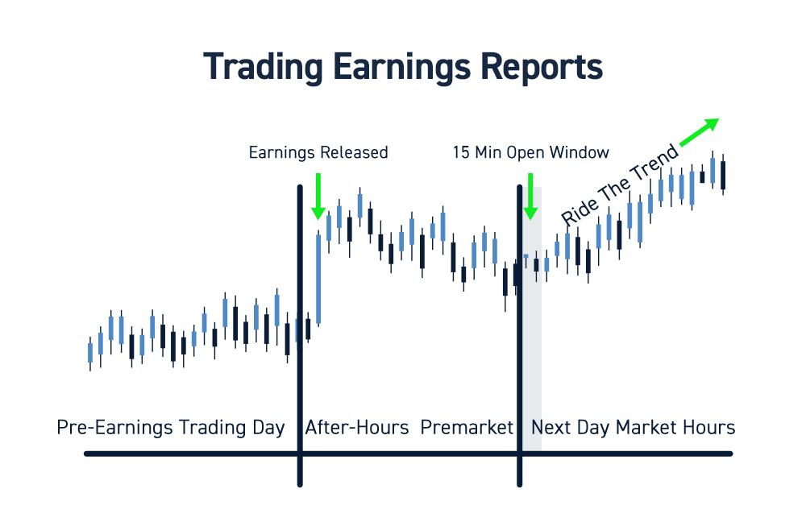

## Table of Contents

## What is earnings trading?

Earnings trading is when people buy and sell stocks around the time a company reports its earnings. Earnings are how much money a company made or lost in a certain period, usually a quarter or a year. Traders try to guess if the earnings will be good or bad and make trades based on their guesses. If they think the earnings will be better than expected, they might buy the stock hoping its price will go up. If they think the earnings will be worse than expected, they might sell the stock or even bet against it, hoping its price will go down.

This kind of trading can be risky because earnings reports can be unpredictable. Even if a company does well, if people were expecting even better results, the stock price might still drop. On the other hand, if a company does poorly but not as badly as expected, the stock price might go up. Because of this, earnings trading often leads to big price swings right after the earnings are announced. Traders need to be ready for these ups and downs and should be careful with how much money they put into these trades.

## Why is earnings season important for traders?

Earnings season is important for traders because it's the time when companies tell everyone how much money they made or lost. This happens every three months, and it can really shake up the stock market. Traders watch closely because the earnings reports can make stock prices go up or down a lot. If a company does better than people thought, its stock price might jump up. But if the company does worse than expected, the stock price could drop.

Because of these big changes, earnings season is a busy and exciting time for traders. They try to guess what the earnings will be and make trades based on those guesses. This can be risky, but it also gives traders a chance to make money if they guess right. Earnings season is like a big event in the trading world, and many traders plan their moves around it.

## How can one identify stocks likely to move after earnings?

To identify stocks that might move a lot after earnings, traders often look at a few things. One thing they check is how the stock has moved in the past after earnings. If a stock has had big jumps or drops after past earnings, it might do the same again. Another thing they look at is what people are expecting from the company's earnings. If everyone thinks the company will do really well or really badly, the stock could move a lot if the actual earnings are different from what people thought.

Traders also pay attention to what the company says before the earnings come out. If the company gives hints that things are going better or worse than expected, that can be a clue. And sometimes, traders use special tools or numbers, like the "implied volatility" of options, to guess how much a stock might move. This number shows how much people think the stock will change after earnings, and a high number can mean a big move is coming. By looking at all these things, traders try to pick stocks that will have big price changes after earnings.

## What are the risks associated with trading earnings?

Trading earnings can be risky because the stock market can act in unexpected ways. When a company reports its earnings, the stock price can jump up or drop down a lot. Even if a company does well, if people were expecting it to do even better, the stock price might still go down. This can be surprising and can lead to losing money if you're not ready for it. Also, earnings reports can be hard to predict, so even if you think you know what will happen, you might be wrong.

Another risk is that many other traders are trying to do the same thing. They're all trying to guess what the earnings will be and make trades based on those guesses. This can make the stock price move even more wildly. If everyone decides to buy or sell at the same time, it can cause big swings in the stock price. This can make it hard to make money, and it can also make you lose money quickly if you're not careful. So, it's important to be ready for these ups and downs and not to risk too much money on one trade.

## What strategies can beginners use to trade earnings safely?

For beginners, one safe way to trade earnings is to start small. Instead of putting a lot of money into one stock, try trading with a small amount. This way, if the stock moves in a way you didn't expect, you won't lose too much money. Another good idea is to use stop-loss orders. These are orders that automatically sell your stock if it drops to a certain price. This can help you limit how much you might lose if the stock goes down after the earnings report.

It's also smart to do a lot of research before trading. Look at what the company has said in the past and what people are expecting from the next earnings report. This can give you a better idea of what might happen. And remember, it's okay to not trade every earnings report. If you're not sure about a company's earnings, it's better to wait and watch what happens instead of jumping into a trade you're not confident about. This way, you can learn from what happens and make better choices next time.

## How do options play a role in earnings trading?

Options can be a big part of earnings trading because they let traders bet on how much a stock's price might move after the earnings report. An option gives you the right to buy or sell a stock at a certain price, but you don't have to do it if you don't want to. This can be useful during earnings season because the price of a stock can change a lot. Traders can use options to make money if the stock goes up or down, without having to own the stock itself.

One way to use options in earnings trading is to buy options that will be worth more if the stock moves a lot, no matter which way it goes. This is called a "straddle" or "strangle." If the stock jumps up or drops down after the earnings, the options can make money. But if the stock doesn't move much, the options might not be worth anything. So, using options can be risky, but it also gives traders more ways to try to make money during the big price swings of earnings season.

## What is an earnings surprise and how can it impact stock prices?

An earnings surprise happens when a company's earnings are different from what people expected. If a company makes more money than people thought it would, that's a positive earnings surprise. If it makes less money than expected, it's a negative earnings surprise. These surprises can shake up the stock market because they show that what people thought about the company was wrong.

When there's an earnings surprise, the stock price can move a lot. If the surprise is good, the stock price might jump up because people get excited and want to buy the stock. But if the surprise is bad, the stock price might drop because people get worried and want to sell the stock. These big moves can happen fast, so traders need to be ready for them and think carefully about how they want to trade around earnings surprises.

## How can advanced traders use implied volatility to their advantage during earnings?

Advanced traders can use implied volatility to their advantage during earnings by looking at how much the market thinks a stock's price will change. Implied volatility is a number that shows how much people expect a stock to move. Before earnings, this number often goes up because everyone knows the stock might jump around a lot. Traders can use this information to pick stocks that might have big price moves. They might buy options on these stocks because options can become more valuable if the stock moves a lot.

One way to use implied volatility is to sell options before earnings. If the implied volatility is high, the options might be expensive. After the earnings come out, the implied volatility often goes down, even if the stock price moves a lot. If traders sell options before earnings and buy them back after, they can make money from the drop in implied volatility. This is called a volatility crush. But it's risky because if the stock moves more than expected, the options could lose a lot of value. So, advanced traders need to be careful and know what they're doing when they use implied volatility to trade earnings.

## What are the key financial metrics to look at before an earnings release?

Before a company's earnings come out, it's good to look at a few key numbers to get an idea of how the company is doing. One important number is the earnings per share (EPS), which shows how much money the company made for each share of its stock. Traders often compare the expected EPS to what the company actually reports. If the actual EPS is higher than expected, it's usually good news for the stock price. Another number to check is the revenue, which is how much money the company brought in. If revenue is growing, it can be a sign that the company is doing well.

It's also helpful to look at the company's guidance, which is what the company says about its future. If the company gives a positive outlook, it might mean good things for the stock price. And don't forget about the price-to-earnings (P/E) ratio, which shows how much people are willing to pay for the company's earnings. A high P/E ratio can mean people think the company will do well in the future, but it also means the stock might be expensive. By looking at these numbers, traders can get a better idea of what might happen when the earnings report comes out.

## How does one manage risk when trading around earnings announcements?

Managing risk when trading around earnings announcements is important because the stock market can be very unpredictable during these times. One way to manage risk is to use stop-loss orders. These orders automatically sell your stock if it drops to a certain price, which can help limit how much money you might lose if the stock goes down after the earnings report. Another way is to not put all your money into one stock. Instead, spread your money across different stocks or even different types of investments. This way, if one stock does badly, you won't lose everything.

It's also smart to do a lot of research before trading. Look at what the company has said in the past and what people are expecting from the next earnings report. This can give you a better idea of what might happen. And remember, it's okay to not trade every earnings report. If you're not sure about a company's earnings, it's better to wait and watch what happens instead of jumping into a trade you're not confident about. This way, you can learn from what happens and make better choices next time.

## What are some common mistakes traders make during earnings season?

One common mistake traders make during earnings season is getting too excited and putting too much money into one stock. They see a chance to make a lot of money quickly and forget about the risks. But if the stock doesn't move the way they thought it would, they can lose a lot. It's better to start small and not risk too much money on one trade.

Another mistake is not doing enough research. Traders might hear about a company and jump into a trade without really knowing what the company does or what people are expecting from its earnings. This can lead to bad guesses about what will happen, and the stock might move in a way they didn't expect. Taking the time to look at the company's past earnings, what they've said about their future, and what other people are saying can help make better trading choices.

## How can algorithmic trading be utilized for earnings trades?

Algorithmic trading can be a big help during earnings season. Traders can use computer programs to make trades based on certain rules or numbers. These programs can look at a lot of information very quickly and make trades without people having to do it by hand. For example, an algorithm might be set up to buy a stock if the earnings are better than expected or sell it if they're worse. This can be useful because the stock market can move very fast after an earnings report, and it's hard for people to keep up with all the changes.

Using algorithms can also help traders manage risk better. The programs can be set to use stop-loss orders automatically, which means they can sell a stock if it drops to a certain price. This can help limit how much money a trader might lose if the stock goes down after the earnings report. But it's important to remember that even with algorithms, trading during earnings season can be risky. The programs are only as good as the rules they're given, so traders need to be careful and make sure their algorithms are set up in a smart way.

## What is the key to understanding earnings reports?

Earnings reports serve as critical financial documents released by publicly traded companies, offering insights into their financial performance over a specific period, typically quarterly. These reports are integral in assessing a company's health and guiding investment decisions, as they provide a comprehensive overview of financial trends and business activities.

Key components of [earning](/wiki/earning-announcement)s reports include:

1. **Revenue**: This represents the total amount of money generated from the sale of goods or services before any expenses are deducted. It is a pivotal indicator as it reflects the company's ability to generate sales and maintain business operations. Investors often compare current revenue figures against past periods to assess growth trends.

2. **Net Income**: Also known as the bottom line, net income is calculated as total revenue minus total expenses, taxes, and costs. It provides a clearer picture of a company's profitability during the report period. The formula for net income can be expressed as:

$$
\text{Net Income} = \text{Total Revenue} - \text{Total Expenses}
$$

   A positive net income suggests a profitable company, whereas a negative figure could indicate financial challenges.

3. **Earnings Per Share (EPS)**: EPS is a popularly used metric that measures the portion of a company's profit allocated to each outstanding share of common stock, providing insights into the company's profitability on a per-share basis. It's calculated using the formula:

$$
\text{EPS} = \frac{\text{Net Income} - \text{Dividends on Preferred Stock}}{\text{Average Outstanding Shares}}
$$

   High EPS values often lead to favorable investor sentiment and stock appreciation, indicating strong financial health.

Earnings reports significantly influence investor sentiment and market movements. A report exceeding market expectations can lead to increased buying activity and a rise in stock prices, while a disappointing report may trigger sell-offs. The anticipation surrounding earnings announcements often results in heightened market [volatility](/wiki/volatility-trading-strategies) as traders adjust their positions based on the new information. Understanding these financial documents is crucial, as they drive major investment decisions and market dynamics.

## How can earnings data be integrated into algorithmic trading strategies?

Integrating earnings data into [algorithmic trading](/wiki/algorithmic-trading) strategies is crucial for optimizing trade outcomes and enhancing profitability. Earnings reports provide timely and accurate information that can be leveraged to create precise trading signals and adjust existing strategies. The importance of this data lies in its ability to reflect a company's financial health, influencing stock prices significantly. When processed efficiently, earnings data can offer predictive insights, enabling traders to capitalize on stock movements effectively.

Earnings data can trigger trading signals through predefined strategies. For instance, a strategy may involve setting buy signals if a company's reported earnings exceed analyst expectations by a certain percentage. Conversely, sell signals could be triggered if earnings fall below forecasts. The quantitative nature of such data lends itself well to algorithmic parsing, allowing traders to react within milliseconds of the data release.

Consider the use of a simple algorithm, which computes the percentage surprise based on the earnings announced versus expectations:

$$
\text{Earnings Surprise} = \left( \frac{\text{Reported EPS} - \text{Expected EPS}}{\text{Expected EPS}} \right) \times 100
$$

This metric could serve as a condition in trade algorithms to execute buy/sell orders based on the calculated surprise value exceeding predefined thresholds.

Machine learning (ML) and [artificial intelligence](/wiki/ai-artificial-intelligence) (AI) play a pivotal role in the analysis and prediction of earnings outcomes. By using historical earnings data, [machine learning](/wiki/machine-learning) models can be trained to predict future earnings with greater accuracy. These models can recognize patterns and trends that human traders might overlook. For example, a [neural network](/wiki/neural-network) could be employed to parse various [factor](/wiki/factor-investing)s including past earnings, market sentiment, and macroeconomic data, to predict future earnings surprises.

Moreover, the application of natural language processing (NLP) can enhance the analysis by interpreting text from earnings reports or conference calls, extracting sentiment, and detecting subtle indicators of company performance.

Python's machine learning libraries such as scikit-learn or TensorFlow can be employed to build these models. Here's an example of how one might set up a basic ML model for predicting earnings surprises:

```python
from sklearn.model_selection import train_test_split
from sklearn.ensemble import RandomForestRegressor
from sklearn.metrics import mean_squared_error

# Assume X contains features like past earnings, analyst forecasts, etc.
# and y contains the future earnings.

X_train, X_test, y_train, y_test = train_test_split(X, y, test_size=0.2, random_state=42)

model = RandomForestRegressor(n_estimators=100, random_state=42)

# Train the model
model.fit(X_train, y_train)

# Predict and evaluate
y_pred = model.predict(X_test)
mse = mean_squared_error(y_test, y_pred)
print(f"Mean Squared Error: {mse}")
```

In integrating earnings data into algo trading, the timely acquisition of accurate data cannot be overemphasized. This requires robust data pipelines that ensure real-time access to data and reliable processing frameworks that support rapid decision-making. As markets evolve and technology advances, the ability to harness and integrate such financial data using state-of-the-art algorithms will remain a core competency for successful trading operations.

## References & Further Reading

[1]: Bergstra, J., Bardenet, R., Bengio, Y., & Kégl, B. (2011). ["Algorithms for Hyper-Parameter Optimization."](https://papers.nips.cc/paper_files/paper/2011/hash/86e8f7ab32cfd12577bc2619bc635690-Abstract.html) Advances in Neural Information Processing Systems 24.

[2]: ["Advances in Financial Machine Learning"](https://www.amazon.com/Advances-Financial-Machine-Learning-Marcos/dp/1119482089) by Marcos Lopez de Prado

[3]: ["Evidence-Based Technical Analysis: Applying the Scientific Method and Statistical Inference to Trading Signals"](https://www.wiley.com/en-gb/Evidence+Based+Technical+Analysis:+Applying+the+Scientific+Method+and+Statistical+Inference+to+Trading+Signals-p-9780470008744) by David Aronson

[4]: ["Machine Learning for Algorithmic Trading"](https://www.amazon.com/Machine-Learning-Algorithmic-Trading-intelligence/dp/9918608013) by Stefan Jansen

[5]: ["Quantitative Trading: How to Build Your Own Algorithmic Trading Business"](https://www.amazon.com/Quantitative-Trading-Build-Algorithmic-Business/dp/0470284889) by Ernest P. Chan