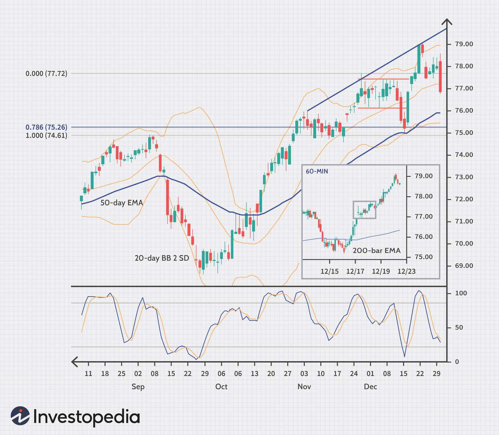

The world of trading is vast and multifaceted, offering numerous opportunities for investors aiming to maximize their returns. Success in trading often hinges on developing a trading edge, which is a strategy that provides a consistent advantage over the market. Such an edge is crucial for traders seeking to achieve superior performance compared to their peers and the broader market. 

With advancements in technology, algorithmic trading has emerged as a popular method of gaining this edge. Unlike traditional trading, which relies heavily on human intuition and experience, algorithmic trading utilizes complex mathematical models, computer algorithms, and pre-defined rules to execute trades automatically. This approach allows for greater speed, precision, and the capacity to process large volumes of data, factors that are increasingly important in a fast-paced trading environment.



This article examines various trading edge investment strategies, focusing on both traditional and algorithmic techniques. By understanding these strategies, traders can better position themselves to identify profitable patterns and manage risks effectively. Additionally, the article will explore how individuals can create and maintain their own trading edge, adapting to the ever-evolving landscape of financial markets. Through continuous learning and application of innovative strategies, traders can enhance their ability to generate consistent returns in a competitive marketplace.

## Table of Contents

## Understanding Trading Edge

A trading edge is a concept that fundamentally represents a strategic advantage one trader has over others within the marketplace. At its core, this advantage is about possessing unique insights or techniques that enable the trader to consistently outperform the market. The importance of a trading edge cannot be overstated, as it often delineates the line between persistent success and frequent losses.

To develop a trading edge, a thorough comprehension of market dynamics and data analysis is essential. This involves recognizing and deciphering patterns that can lead to profitable opportunities. Markets are complex systems where countless factors interact, influencing prices and trends. A successful trader, therefore, must have the ability to sift through this vast ocean of information to identify actionable insights.

Many traders, especially novices, might not fully appreciate the importance of having a trading edge. This lack of awareness can result in taking uncalculated risks and potentially facing substantial losses. A trading edge provides the necessary framework for focusing on promising opportunities. By honing in on the most viable trades, traders can effectively filter out less beneficial prospects, conserving time and resources while maximizing potential returns.

In practical terms, a trading edge might manifest in various forms. It could be a proprietary algorithm that predicts price movements with higher accuracy, an exclusive dataset that offers insights not available to other traders, or a psychological edge derived from emotional discipline and patience. Whatever the form, the fundamental idea is to enhance the probability of success by leveraging one's unique strengths.

For instance, a mathematical model or a piece of code could be used to automate and refine this process. Here is a simple Python example of how one might begin to quantify a trading edge using historical price data:

```python
import numpy as np
import pandas as pd

# Assume we have a DataFrame 'data' with historical prices
# Calculate moving averages as a potential edge indicator
data['MA_50'] = data['Close'].rolling(window=50).mean()
data['MA_200'] = data['Close'].rolling(window=200).mean()

# Define a simple strategy: go long when the 50-day MA crosses above the 200-day MA
data['Signal'] = np.where(data['MA_50'] > data['MA_200'], 1, 0)

# Calculate potential returns
data['Returns'] = data['Close'].pct_change()
data['Strategy_Returns'] = data['Returns'] * data['Signal'].shift(1)

# The trading edge can be evaluated by comparing 'Strategy_Returns' to 'Returns'
edge = data['Strategy_Returns'].mean() - data['Returns'].mean()
print(f"Trading Edge: {edge:.4f}")
```

In this example, moving averages are employed as a basic measure to spot potential market trends, contributing to a rudimentary trading edge. However, real-world applications would require more sophisticated models, leveraging [machine learning](/wiki/machine-learning) algorithms or advanced statistical techniques to optimize trading decisions.

Ultimately, creating and maintaining a trading edge demands continuous learning and adaptation to new market conditions, ensuring that the strategies employed remain effective and competitive.

## Types of Trading Strategies

Trading strategies are essential for identifying and exploiting opportunities in the financial markets. Among the most recognized strategies are [breakout](/wiki/breakout-trading) trading, mean reversion, and [trend following](/wiki/trend-following), each offering distinct methodologies for traders to develop a trading edge.

Breakout trading is predicated on the idea that when a security moves outside a predefined range, significant price action is likely to occur. Traders identify key levels of support and resistance and place trades when the price breaks through these levels. For instance, if a stock breaches a resistance level with substantial [volume](/wiki/volume-trading-strategy), it is expected to continue moving in that direction, allowing traders to capitalize on the [momentum](/wiki/momentum). The key here is timing and the ability to discern false breakouts from genuine signals, which may involve confirming breakouts with additional indicators or volume analysis.

Mean reversion strategies are based on the principle that asset prices tend to revert to their historical average over time. Traders employing this strategy identify deviations from the norm, buying when prices are below the average and selling when above. This involves statistical tools and models to define what constitutes a deviation and an average, such as Bollinger Bands or moving averages. Mathematically, a simple moving average (SMA) can be calculated as:

$$
\text{SMA}_n = \frac{1}{n} \sum_{i=0}^{n-1} P_{t-i}
$$

where $P_{t-i}$ is the price at time $t-i$ and $n$ is the number of periods considered.

Trend following strategies exploit market momentum by seeking to enter long positions in assets exhibiting an upward trajectory and short positions in those trending downwards. This strategy does not attempt to forecast price levels but instead reacts to market movements, often utilizing technical indicators like moving averages or the Moving Average Convergence Divergence (MACD) to identify trend directions. Python code to identify a simple crossover strategy could look like this:

```python
import pandas as pd

# Assume 'data' is a pandas DataFrame with price data
data['SMA_short'] = data['close'].rolling(window=20).mean()
data['SMA_long'] = data['close'].rolling(window=50).mean()

# Signal generation
data['Signal'] = 0.0
data['Signal'][20:] = np.where(data['SMA_short'][20:] > data['SMA_long'][20:], 1.0, 0.0)
data['Position'] = data['Signal'].diff()
```

Each of these strategies comes with its own set of characteristics, aligning with different market conditions and trader profiles. Breakout strategies may suit markets with high [volatility](/wiki/volatility-trading-strategies), mean reversion is favored in stable, range-bound markets, and trend following can be particularly effective in trending markets, offering diverse opportunities for traders to enhance their trading edge.

## Algorithmic Trading Strategies

Algorithmic trading utilizes mathematical models and pre-set rules to automate the execution of trades, providing traders with enhanced speed and precision compared to manual trading. This section explores some common [algorithmic trading](/wiki/algorithmic-trading) strategies that have proven effective in various market conditions.

One prominent strategy is [arbitrage](/wiki/arbitrage), which involves exploiting price discrepancies between different markets to achieve profit. For instance, if a stock is trading at different prices on two separate exchanges, an algorithm can be programmed to simultaneously buy the stock at the lower price and sell it at the higher price, locking in the price difference as profit. This requires sophisticated systems capable of processing vast amounts of data quickly, as such opportunities are typically short-lived.

Statistical arbitrage, on the other hand, leverages complex quantitative models to identify and capitalize on perceived inefficiencies in the market. This strategy often involves the use of statistical methods to predict the expected mean and variance of price movements. By identifying deviations from these predictions, traders can execute trades that are statistically expected to yield positive returns over time. A popular approach to implementing [statistical arbitrage](/wiki/statistical-arbitrage) is pairs trading, where correlated securities are traded based on their relative price movements.

Market-making is another essential algorithmic trading strategy. It plays a crucial role in providing [liquidity](/wiki/liquidity-risk-premium) to the financial markets by consistently quoting bid and ask prices for a range of securities. Market makers profit from the bid-ask spread, which is the difference between the buying and selling price they offer. The use of algorithms allows market makers to adjust their prices dynamically in response to market conditions, thereby managing their inventory risk while optimizing profitability.

These algorithmic strategies illustrate how the application of technology and quantitative methods can significantly enhance trading performance. By leveraging the precision and speed of algorithms, traders can exploit various market opportunities that might be too fast or complex for human traders to handle alone.

## Benefits and Challenges of Algo Trading

Algorithmic trading, also known as algo trading, offers significant benefits that have transformed contemporary financial markets. One of the primary advantages is its ability to eliminate emotional biases that often plague human traders. By executing trades based on predefined criteria, algorithmic systems maintain consistency and rationality, reducing the negative effects of impulsive decisions.

Another advantage of algorithmic trading lies in its capacity for fast and efficient trade execution. Algorithms can process vast amounts of data within milliseconds, allowing traders to capitalize on fleeting market opportunities that would be impractical for manual trading. This speed can lead to better price fills and reduced transaction costs, maximizing potential profits.

However, algorithmic trading is not without its challenges. One such challenge is the risk of overfitting, which occurs when trading strategies are excessively tailored to historical data. This results in strategies that appear profitable in backtests but fail to perform in live markets. Overfitting can be mitigated by using techniques like cross-validation and out-of-sample testing to ensure robustness.

Market conditions are inherently dynamic, and strategies that succeed under one regime may falter as conditions evolve. For this reason, continuous monitoring and adaptation are crucial. Traders must remain vigilant, regularly updating and optimizing their algorithms to align with shifting market dynamics.

Liquidity is another area of concern. While algorithmic trading can provide liquidity to the markets, it is also dependent on it. In times of market stress, liquidity can dry up, leading to increased volatility and slippage. This can adversely impact the execution of trades, resulting in unexpected losses.

Technological issues also pose risks to algorithmic trading. System outages, network delays, and bugs can disrupt trading operations, potentially causing significant financial losses. To mitigate such risks, robust infrastructure and rigorous testing protocols are imperative. Ensuring that backup systems and fail-safes are in place can help maintain stability and continuity in trading activities.

In conclusion, while algorithmic trading offers numerous benefits such as eliminating emotional influences and providing consistent execution, it also presents challenges that must be proactively managed. By understanding and addressing these challenges, traders can harness the full potential of algorithmic systems to enhance their trading edge.

## Creating Your Own Trading Edge

Developing a personal trading edge requires a comprehensive understanding of both individual strengths and specific trading preferences. Traders should begin this process by utilizing foundational strategies, which can provide a firm basis for decision-making. Enhancing these strategies with custom rules and unique insights allows traders to tailor their approach to better fit their personal style and the unique conditions of the market they are engaging with.

A continuous study of market movements is essential for traders aiming to hone their trading edge. Markets are constantly changing due to a myriad of factors, including economic data releases, geopolitical events, and shifts in investor sentiment. By maintaining a vigilant eye on these changes, traders can better anticipate potential market movements and adjust their strategies accordingly. This continuous analysis can lead to valuable insights gained from past trades, helping traders refine their approach and adapt to new and evolving market conditions.

Incorporating cross-verification techniques is another critical component in the development of a personal trading edge. Relying solely on a single strategy or indicator can expose traders to significant risks, particularly if that strategy becomes less effective due to changing market dynamics. By employing multiple indicators and analysis methods, traders can confirm signals and increase the robustness of their trading decisions. For example, a moving average crossover signal might be complemented by a momentum indicator such as the Relative Strength Index (RSI), providing more reliable trade signals.

Here is a simple Python example demonstrating the use of moving averages and RSI for strategy cross-verification:

```python
import pandas as pd
import ta

# Load your market data into a DataFrame
data = pd.read_csv('market_data.csv')

# Calculate moving averages
data['SMA_50'] = data['Close'].rolling(window=50).mean()
data['SMA_200'] = data['Close'].rolling(window=200).mean()

# Calculate RSI
data['RSI'] = ta.momentum.rsi(data['Close'], window=14)

# Create signals
data['Signal'] = 0
data.loc[(data['SMA_50'] > data['SMA_200']) & (data['RSI'] < 70), 'Signal'] = 1  # Buy signal
data.loc[(data['SMA_50'] < data['SMA_200']) & (data['RSI'] > 30), 'Signal'] = -1  # Sell signal

# View first few rows to see the signals
print(data.head())
```

In this example, buy signals are generated when the short-term moving average (SMA_50) crosses above the long-term moving average (SMA_200) and the RSI is below 70, indicating potential upward momentum without the market being overbought. Conversely, sell signals are created when the short-term moving average crosses below the long-term average and the RSI is above 30, suggesting potential downward movement without the market being oversold.

By starting with foundational strategies and continuously refining them with study, insights, and cross-verification techniques, traders can effectively create and maintain a personal trading edge, allowing them to capitalize on promising opportunities while navigating a competitive and ever-changing market environment.

## The Future of Trading Strategies

The trading landscape is constantly advancing, influenced by rapid technological progress and the burgeoning availability of data. With the advent of machine learning (ML) and [artificial intelligence](/wiki/ai-artificial-intelligence) (AI), traders have tools that can process vast amounts of information with remarkable speed and accuracy. These technologies facilitate the development of advanced trading strategies, whereby algorithms can analyze historical data, identify complex patterns, and predict future movements.

Machine learning algorithms, particularly those employing techniques like supervised learning and [reinforcement learning](/wiki/reinforcement-learning), can be fine-tuned to discover and exploit short-lived market inefficiencies. For instance, by using features like moving averages, relative strength indices, and other technical indicators, an ML model can learn to classify different market scenarios and suggest appropriate trading actions.

Furthermore, AI-driven data analytics can incorporate sentiment analysis from news articles, social media, and other sources of market-related content. By processing natural language data, these systems can assess public mood and predict market trends with improved accuracy. This capability is amplified by the increased availability of high-frequency data, enabling traders to make informed decisions in real-time.

In the evolving trading environment, strategies that worked well in the past might not be as effective due to increasing market efficiency. Effective strategies will need to be adaptive, continually refined through [backtesting](/wiki/backtesting) against new data and adjusted to changing market conditions. The integration of AI can automate this process, allowing for the constant evolution of trading strategies to maintain a competitive edge.

To illustrate, consider a basic implementation of a machine learning model that predicts stock price movement:

```python
import numpy as np
import pandas as pd
from sklearn.model_selection import train_test_split
from sklearn.ensemble import RandomForestClassifier
from sklearn.metrics import accuracy_score

# Load and prepare data
data = pd.read_csv('historical_stock_data.csv')
features = data[['feature1', 'feature2', 'feature3']]
labels = data['price_movement']

# Split data into training and test sets
X_train, X_test, y_train, y_test = train_test_split(features, labels, test_size=0.2, random_state=42)

# Train Random Forest model
model = RandomForestClassifier(n_estimators=100, random_state=42)
model.fit(X_train, y_train)

# Evaluate the model
y_pred = model.predict(X_test)
accuracy = accuracy_score(y_test, y_pred)
print(f'Model Accuracy: {accuracy:.2f}')
```

Such models exemplify how traders can leverage data science to navigate the complexities of the financial markets. The future of trading strategies will demand not just the use of advanced technologies but also the creative application of new scientific methods to uncover latent market opportunities. As technology continues to transform the trading landscape, traders willing to embrace these innovations will be best positioned to develop and sustain a strategic edge.

## Conclusion

Finding and maintaining a trading edge is crucial for long-term success in the market. By effectively leveraging both traditional and algorithmic trading strategies, traders can substantially enhance their chances of achieving consistent and sustainable profits. Traditional strategies, such as breakout trading, mean reversion, and trend following, provide a solid foundation by exploiting basic market dynamics. These strategies rely on a trader's deep understanding of market behavior, pattern recognition, and strategic planning. Algorithmic trading, on the other hand, introduces precision, speed, and the ability to manage large data sets, allowing traders to capitalize on fleeting opportunities with minimal human intervention. 

Incorporating algorithmic trading into a trader's arsenal involves the use of sophisticated mathematical models and predefined rules, increasing the potential for consistent execution and reduced emotional biases in decision-making. Strategies like arbitrage and market-making highlight the advantages of algorithmic trading, as they utilize computational power to exploit market inefficiencies and provide liquidity. However, successful implementation requires thorough backtesting, robust technological infrastructure, and a keen awareness of market changes to mitigate the risks associated with overfitting or technological failures.

Continuous learning and adaptability are paramount in staying ahead in a competitive and ever-evolving market environment. Traders must be vigilant in observing market trends, honing their strategies through critical reflection on past trades, and embracing advancements such as machine learning and artificial intelligence to further refine their trading edge. This commitment to perpetual growth and adaptation ensures that traders can maintain a competitive advantage, effectively respond to emerging market conditions, and continue to thrive in the dynamic world of trading.

## References & Further Reading

[1]: Bergstra, J., Bardenet, R., Bengio, Y., & Kégl, B. (2011). ["Algorithms for Hyper-Parameter Optimization."](https://papers.nips.cc/paper/4443-algorithms-for-hyper-parameter-optimization) Advances in Neural Information Processing Systems 24.

[2]: ["Advances in Financial Machine Learning"](https://www.amazon.com/Advances-Financial-Machine-Learning-Marcos/dp/1119482089) by Marcos Lopez de Prado

[3]: ["Evidence-Based Technical Analysis: Applying the Scientific Method and Statistical Inference to Trading Signals"](https://www.amazon.com/Evidence-Based-Technical-Analysis-Scientific-Statistical/dp/0470008741) by David Aronson

[4]: ["Machine Learning for Algorithmic Trading"](https://github.com/PacktPublishing/Machine-Learning-for-Algorithmic-Trading-Second-Edition) by Stefan Jansen

[5]: ["Quantitative Trading: How to Build Your Own Algorithmic Trading Business"](https://books.google.com/books/about/Quantitative_Trading.html?id=j70yEAAAQBAJ) by Ernest P. Chan