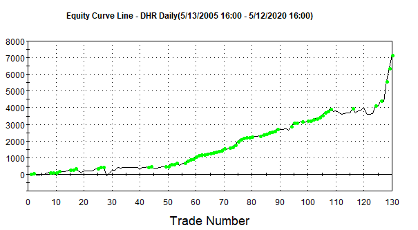

In the world of trading, the concept of a 'trading edge' is crucial for success. A trading edge refers to any strategy, set-up, or insight that gives a trader a consistent probability advantage over other market participants. This advantage can manifest as higher win rates, superior risk-reward ratios, or more precise entry and exit points. To be effective, a trading edge must be clear, quantifiable, and systematic, allowing traders to exploit market inefficiencies repeatedly.

Algorithmic trading, often abbreviated as algo trading, leverages this edge through automated processes. By utilizing computer programs and algorithms, traders can execute strategies with high precision and speed that would be impossible to achieve manually. This automation minimizes human errors caused by emotions and fatigue, enabling consistent adherence to the trading plan.



This article explores what a trading edge in algo trading entails and how it can be developed. It aims to dissect the nature of trading edges, differentiating them from broader trading strategies. It will also provide a detailed look into how traders can harness sophisticated technology to identify, test, and maintain these edges. Modern trading platforms and programming environments offer powerful tools for backtesting and analysis, allowing traders to refine their strategies with historical data before applying them in live markets.

Understanding how these tools and methodologies work is key to sustaining success in the highly competitive world of trading. As market dynamics evolve, traders must continuously adapt and optimize their approaches to hold onto their edges. This article will cover the process of identifying and maintaining a trading edge, discussing both the potential benefits and inherent challenges. Through systematic analysis and continual improvement, traders can strive to craft and sustain their own effective trading edges, keeping them a step ahead in the market landscape.

## Table of Contents

## Understanding the Trading Edge

A trading edge is a concept central to successful trading practices, representing any strategy, observation, or method that provides a trader with a favorable advantage over others in the market. This advantage can stem from various insights or anomalies in market behaviors that are not widely recognized or easy to exploit.

In algorithmic trading, this edge is often precisely defined and automated, which allows for the consistent application of strategies. The automation provided by algo trading ensures that trading signals derived from these edges are executed with speed and accuracy, minimizing human error and emotion. One of the key benefits of a quantified edge is its potential for scalability and backtesting, where past market data is used to test the potential performance of a strategy.

Distinguishing trading edges from trading strategies is crucial in [algorithmic trading](/wiki/algorithmic-trading). While a trading strategy refers to a comprehensive plan that might include a combination of financial instruments, risk management techniques, and execution methods, a trading edge is a specific element within a strategy that leads to profitability. Think of a strategy as the overall battle plan, while the edge is a specific tactic or advantage within that plan. For example, an algorithmic trader might employ a broad strategy based on [momentum](/wiki/momentum), but the trading edge could be a unique means of detecting momentum shifts earlier than competitors.

Furthermore, a trading edge in algorithmic trading isn't static. It requires ongoing refinement because what constitutes an edge today might become common knowledge tomorrow, reducing its effectiveness. This ever-changing nature emphasizes the importance of research, innovation, and adaptation in maintaining a competitive advantage in the market. The ability to differentiate a trading edge from the overall strategy not only aids in refining these elements but also enhances risk management as traders can pinpoint which aspects of their approach contribute most to their success.

## Examples of Trading Edges in Algo Trading

Trading edges in algorithmic trading are essential for gaining an advantage in the markets. They can range from statistical patterns to observable market behavior anomalies. Two prevalent examples of trading edges are mean reversion and momentum strategies.

**Mean Reversion**

A mean reversion trading strategy is based on the assumption that asset prices tend to revert to their historical mean over time. This approach exploits short-term price extremes by anticipating a correction towards the average value. The mean reversion concept can be applied using several models and techniques, such as Bollinger Bands, moving averages, and the Ornstein-Uhlenbeck process.

In practice, one could implement a mean reversion strategy with the following Python pseudocode:

```python
import pandas as pd
import numpy as np

def calculate_moving_average(data, window):
    return data.rolling(window=window).mean()

def generate_signals(data, short_window, long_window):
    short_mavg = calculate_moving_average(data, short_window)
    long_mavg = calculate_moving_average(data, long_window)

    signals = pd.Series(index=data.index)
    signals[(data < short_mavg) & (data > long_mavg)] = 1  # Buy signal
    signals[(data > short_mavg) & (data < long_mavg)] = -1  # Sell signal

    return signals

price_data = pd.Series([...])  # Replace with actual price data
signals = generate_signals(price_data, short_window=20, long_window=100)
```

**Momentum Trading**

Momentum strategies, on the other hand, capitalize on the continued direction of a market price trend. Traders identifying momentum believe that an asset whose price is rising will continue to rise, and conversely for declining prices. Momentum can be quantified using indicators such as the Relative Strength Index (RSI) or moving average convergence divergence (MACD).

Momentum trading is often seen as contrary to mean reversion because it builds on the premise that trends can persist regardless of mean values. Here's a structured methodology for implementing a basic momentum strategy:

1. Calculate the return over a specific period.
2. Establish buy/sell thresholds based on historical performance.
3. Execute trades when assets surpass these thresholds.

A simple momentum strategy could be implemented as follows:

```python
def calculate_momentum(data, window):
    return data / data.shift(window) - 1

def momentum_signals(data, window, threshold):
    momentum = calculate_momentum(data, window)

    signals = pd.Series(index=data.index)
    signals[momentum > threshold] = 1  # Buy signal
    signals[momentum < -threshold] = -1  # Sell signal

    return signals

momentum_signals = momentum_signals(price_data, window=14, threshold=0.05)
```

**Implications in Trading**

Both mean reversion and momentum strategies have far-reaching implications in trading. Mean reversion offers opportunities in [volatility](/wiki/volatility-trading-strategies) and overbought/oversold market conditions, while momentum strategies thrive during trending markets. Implementing these strategies requires robust [backtesting](/wiki/backtesting) and an understanding of the market dynamics. Adapting these strategies to changing market conditions is crucial; hence, continuous performance evaluation is necessary to ensure sustained profitability. Moreover, a sound risk management plan should accompany these strategies to mitigate potential losses during market shifts or anomalies.

## Developing a Trading Edge

To identify a trading edge, traders often rely on extensive backtesting and thorough analysis of historical data. This process involves simulating a trading strategy over a historical period to evaluate its effectiveness, risk, and performance. By understanding how a strategy would have performed in the past, traders can gain confidence about its potential future performance.

Tools such as TradeStation and Amibroker are instrumental in simplifying this backtesting process. These platforms offer robust capabilities for running simulations, customizing strategies, and analyzing outcomes. For example, using Python with a library like Backtrader, one can set up an extensive backtesting environment. Here’s a basic example of using Python for backtesting:

```python
import backtrader as bt

class MyStrategy(bt.Strategy):
    def __init__(self):
        self.sma = bt.indicators.SimpleMovingAverage(self.data.close, period=15)

    def next(self):
        if self.data.close[0] > self.sma:
            self.buy()
        elif self.data.close[0] < self.sma:
            self.sell()

cerebro = bt.Cerebro()
data = bt.feeds.YahooFinanceData(dataname='AAPL', fromdate=datetime(2020, 1, 1), todate=datetime(2021, 1, 1))
cerebro.adddata(data)
cerebro.addstrategy(MyStrategy)
cerebro.run()
cerebro.plot()
```

In this code snippet, a simple moving average strategy is applied to Apple Inc. stock data to identify buying and selling points based on historical price movements. The result of this backtest can reveal potential edges by showing profitable patterns.

Beyond technical analysis and backtesting, developing a trading edge also involves qualitative approaches. Brainstorming and collaborating with other traders can provide fresh perspectives and insights that might not be evident through data alone. Engaging with trading communities and forums can expose traders to diverse strategies and opinion exchanges, fostering innovative ideas.

Market walkthroughs, where traders systematically review and analyze historical price charts, can further deepen understanding of intricacies in market movements. This hands-on experience is beneficial in identifying patterns or anomalies that a purely data-driven approach might miss.

Networking with peers, attending trading seminars, or participating in webinars are ways to stay updated on the latest trends and strategies in the trading world. Sharing strategies and feedback within a community cultivates an environment where trading edges can evolve.

In conclusion, the path to developing a trading edge is multi-faceted, combining robust quantitative analysis with collaborative and qualitative insights. By leveraging technology and embracing continuous learning and exchange of ideas, traders can position themselves better to discover and maintain a competitive advantage in the markets.

## Challenges and Sustainability

In algorithmic trading, one of the major challenges traders face is the potential for trading edges to diminish over time. This degradation can occur for various reasons, primarily due to changes in market structures or because the edge is "arbitraged" away by other market participants. As more traders discover and exploit a particular edge, its effectiveness can decline, reducing potential profitability.

To address this challenge, it's essential for traders to build a diversified portfolio comprising multiple trading edges. Diversification allows traders to mitigate risk by not relying solely on a single edge or strategy. By having multiple edges, traders can balance the performance across their portfolio, ensuring that the decline of any one edge does not significantly impact overall profitability.

### Lifecycle of a Trading Edge

The lifecycle of a trading edge typically begins with discovery and development. Traders usually identify potential edges through rigorous analysis, backtesting, and validation against historical data. If an edge proves to be robust, it can be implemented in real-time trading scenarios.

However, once deployed, the edge enters the phase where it is subject to market dynamics and external factors. During this phase, close monitoring is crucial as market conditions can evolve rapidly. The realization that an edge is losing its efficacy often requires recalibration of the strategy or even a complete overhaul.

To prepare for the decline of a trading edge, traders can engage in continuous research and development to identify new opportunities. This process involves staying informed about market trends, maintaining a keen understanding of economic indicators, and leveraging advances in computational techniques.

### Preparing for the Decline

Preparation for the potential decline of a trading edge entails several strategic approaches:

1. **Regular Monitoring and Analysis**: Traders should implement continuous monitoring systems to assess the performance of their edges regularly. This involves statistical analysis to detect any significant deviations from expected performance metrics.

2. **Adapting Strategies**: Flexibility is key in algorithmic trading. Traders must be ready to adapt their strategies based on the feedback and analysis. This could mean tweaking parameters or incorporating new data sources.

3. **Leveraging Technology**: The use of advanced technologies and platforms can aid in fast adaptation. Machine learning algorithms, for instance, can help in quickly recalibrating strategies by recognizing new patterns as they emerge.

4. **Collaboration and Networking**: Engaging with other traders and participating in trading forums can provide valuable insights into emerging trends or potential changes in market structure that could impact existing edges.

5. **Diversification and Risk Management**: As a hedging mechanism, maintaining a diverse set of strategies can reduce reliance on any single edge. Effective risk management practices should be in place to protect against potential losses from declining edges.

By understanding the challenges associated with the lifecycle of trading edges and preparing for their eventual decline, traders can enhance their resilience and sustain long-term profitability in the competitive field of algorithmic trading. This proactive mindset not only secures current trading operations but also lays the groundwork for discovering and developing new edges in evolving markets.

## FAQs on Trading Edges in Algo Trading

How long a trading edge lasts and how many edges are needed are common questions in algo trading. The duration of a trading edge is variable and depends largely on market conditions, technological advancements, and the actions of other market participants. An edge may last several months or years but could also be eroded quickly if it becomes widely recognized and exploited. Thus, monitoring the performance of a trading edge and adapting strategies as necessary is vital for sustained profitability.

Regarding the number of edges needed, having multiple edges is often recommended to diversify risk and increase the likelihood of consistent returns. Relying on a single edge can expose traders to significant risk if that edge ceases to be effective. Diversification across different types of edges—such as statistical, informational, and behavioral—can provide more robust performance.

When comparing the pursuit of a trading edge in [forex](/wiki/forex-system) versus stock markets, traders generally consider the characteristics and [liquidity](/wiki/liquidity-risk-premium) of these markets. Forex markets tend to be less volatile and more liquid than stock markets, which might require different strategies to identify and exploit edges. Forex trading often relies on macroeconomic indicators and geopolitical events, while stock trading might focus more on company-specific and sectoral information.

To quantitatively measure a trading edge, traders may use the EDGE ratio, a tool that quantifies the effectiveness of a strategy. The EDGE ratio can be defined as:

$$
\text{EDGE} = \frac{\text{Average Profit per Trade}}{\text{Average Loss per Trade}}
$$

An EDGE ratio greater than 1 indicates a favorable trading strategy, as it suggests that the average profit generated per trade exceeds the average loss. 

In practice, traders may write scripts or algorithms to backtest and calculate their EDGE ratio. Here is a simple Python example to calculate the EDGE ratio given a list of profits and losses:

```python
def calculate_edge_ratio(profits, losses):
    average_profit = sum(profits) / len(profits) if profits else 0
    average_loss = sum(losses) / len(losses) if losses else 0
    return average_profit / average_loss if average_loss != 0 else float('inf')

profits = [100, 150, 200, 80, 90]
losses = [50, 60, 70, 85, 95]

edge_ratio = calculate_edge_ratio(profits, losses)
print(f"The EDGE ratio is: {edge_ratio:.2f}")
```

Continuous evaluation and refinement of trading strategies are essential for maintaining effective trading edges in the dynamic environment of algorithmic trading.

## Conclusion

In the competitive world of algorithmic trading, securing a trading edge is a continuous endeavor. The dynamic nature of financial markets requires traders to be agile, adjusting their strategies and approaches to retain an advantage. This fluidity underscores the importance of adapting to changing conditions and relentlessly applying rigorous backtesting to ensure strategies remain effective.

Backtesting, a cornerstone of algorithmic trading, involves simulating your trading strategy using historical data to assess its viability before its application in live markets. This process not only highlights a potential edge but also helps fine-tune it, considering the ever-evolving market dynamics. By leveraging backtesting, traders can identify weaknesses in their strategies and make necessary adjustments to bolster their edge.

Moreover, the dedication to continuous analysis is paramount. Successful traders embrace a mindset of perpetual learning and innovation. They utilize advanced analytical tools and maintain a systematic approach to explore new insights and trends. This dedication fosters an environment where potential edges can be discovered and refined over time.

In practical terms, algorithmic traders often use programming languages like Python to develop and test their strategies. Python's rich ecosystem of libraries, such as NumPy and pandas for data manipulation or [backtrader](/wiki/backtrader) for backtesting, provides a robust framework for developing sophisticated trading algorithms. By employing these resources, traders can automate the evaluation process, thus improving the precision and efficiency of their strategy development.

Ultimately, achieving and maintaining a trading edge in algorithmic trading is an intricate blend of dedication, innovation, and systematic strategy analysis. Through consistent effort and an unwavering commitment to refining their techniques, traders can cultivate effective trading edges that thrive in diverse market environments. This relentless pursuit not only enhances their chances of profitability but also sustains their competitive edge in the ever-challenging landscape of financial markets.

## References & Further Reading

[1]: Bergstra, J., Bardenet, R., Bengio, Y., & Kégl, B. (2011). ["Algorithms for Hyper-Parameter Optimization."](https://papers.nips.cc/paper/4443-algorithms-for-hyper-parameter-optimization) Advances in Neural Information Processing Systems 24.

[2]: ["Advances in Financial Machine Learning"](https://www.amazon.com/Advances-Financial-Machine-Learning-Marcos/dp/1119482089) by Marcos Lopez de Prado

[3]: ["Evidence-Based Technical Analysis: Applying the Scientific Method and Statistical Inference to Trading Signals"](https://www.amazon.com/Evidence-Based-Technical-Analysis-Scientific-Statistical/dp/0470008741) by David Aronson

[4]: ["Machine Learning for Algorithmic Trading"](https://github.com/stefan-jansen/machine-learning-for-trading) by Stefan Jansen

[5]: ["Quantitative Trading: How to Build Your Own Algorithmic Trading Business"](https://books.google.com/books/about/Quantitative_Trading.html?id=j70yEAAAQBAJ) by Ernest P. Chan