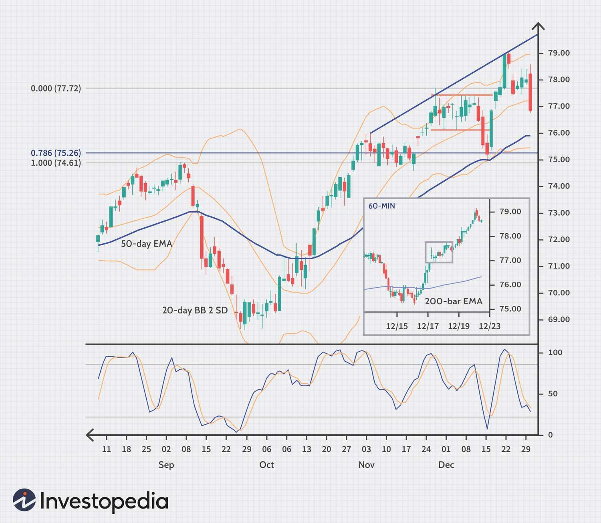

## Table of Contents

## What is a trading edge?

A trading edge is a method or strategy that gives a trader an advantage over others in the market. It's like having a secret tool that helps you make better decisions about when to buy or sell. This edge can come from understanding the market better, using special techniques, or having information that others don't have. The key is that it helps you make more money than you lose over time.

Having a trading edge is important because the markets can be unpredictable. Without an edge, it's like playing a game where everyone has the same chances. But with an edge, you're more likely to come out ahead. It's not about winning every time, but about winning more often than losing. This is what helps traders stay successful in the long run.

## Why is having a trading edge important?

Having a trading edge is important because it helps you make better choices when you're buying and selling things in the market. It's like having a special tool that makes you smarter than other people who are trading. This tool could be a way of understanding the market that others don't have, or it could be a special method you use to decide when to make a trade. When you have an edge, you're more likely to make money over time, even if you don't win every single trade.

Without a trading edge, it's harder to do well in the market. It's like trying to win a game where everyone has the same chances. You might get lucky sometimes, but over time, you're just as likely to lose as you are to win. That's why having an edge is so important. It gives you a better chance of coming out ahead in the long run, even if the market can be unpredictable.

## How can a beginner identify a trading edge?

A beginner can start identifying a trading edge by first learning as much as they can about the market. This means reading books, watching videos, and maybe even taking a course to understand how the market works. Once they have a good base of knowledge, they can start looking for patterns or trends that other people might not see. This could be something like noticing that certain stocks tend to go up at certain times of the year, or that the market reacts in a specific way to news events.

After identifying potential patterns, a beginner should test these ideas with a small amount of money or even with a practice account. This way, they can see if their ideas actually work without risking too much. It's important to keep track of wins and losses and see if the edge really makes them more money than they lose over time. If it does, then they might have found a trading edge that can help them succeed in the market.

Remember, finding a trading edge takes time and patience. It's not something that happens overnight. A beginner should be ready to learn from their mistakes and keep trying different strategies until they find one that works for them. The key is to keep learning and testing until they find that special advantage that helps them make better trading decisions.

## What are common types of trading edges?

One common type of trading edge is using technical analysis. This means looking at charts and graphs to find patterns that can help predict what the market will do next. Traders might look for things like moving averages, support and resistance levels, or chart patterns like head and shoulders. By understanding these patterns, they can make better guesses about when to buy or sell, which gives them an advantage over people who don't use this method.

Another type of trading edge is fundamental analysis. This involves studying the financial health and performance of companies or the overall economy. Traders using this method might look at things like earnings reports, economic indicators, or news events to make their decisions. By understanding the real value of a stock or the health of the economy, they can make smarter trades than people who don't pay attention to these details.

A third type of trading edge is based on market sentiment. This means understanding how other traders and investors feel about the market. Some traders use tools like sentiment indicators or social media analysis to gauge whether people are feeling positive or negative about the market. By knowing the general mood, they can make trades that go with or against the crowd, which can give them an edge in making profitable decisions.

## Can a trading edge be based on technical analysis?

Yes, a trading edge can definitely be based on technical analysis. Technical analysis is all about looking at charts and graphs to find patterns that can help predict what the market will do next. Traders who use this method might look for things like moving averages, support and resistance levels, or chart patterns like head and shoulders. By understanding these patterns, they can make better guesses about when to buy or sell. This gives them an advantage over people who don't use technical analysis because they can spot opportunities that others might miss.

For example, if a trader sees that a stock price is consistently bouncing off a certain level, they might use that as a signal to buy. Or if they see a pattern that usually leads to a price drop, they might decide to sell before it happens. By using technical analysis, traders can make more informed decisions, which helps them make more money than they lose over time. This is what makes technical analysis a powerful tool for finding a trading edge.

## How does fundamental analysis contribute to a trading edge?

Fundamental analysis helps traders find a trading edge by looking at the real value of a company or the overall economy. This means studying things like earnings reports, financial statements, and economic indicators. By understanding how well a company is doing or how the economy is performing, traders can make smarter decisions about which stocks to buy or sell. For example, if a company's earnings are growing and it's doing better than expected, a trader might decide to buy its stock because it could be worth more in the future.

Using fundamental analysis gives traders an advantage because they can spot opportunities that others might miss. If most people are just looking at charts and patterns, a trader who knows the fundamentals can see the bigger picture. They might buy a stock that's undervalued or sell one that's overvalued before the market catches on. This way, they can make more money over time by making trades based on solid information about a company's or the economy's health.

## What role does psychology play in maintaining a trading edge?

Psychology plays a big role in keeping a trading edge. It's all about how you think and feel when you're trading. If you let your emotions control you, you might make bad choices. For example, if you're scared and sell a stock too soon, you could miss out on making more money. Or if you're too excited and buy a stock without thinking, you could lose money. Staying calm and sticking to your plan helps you keep your trading edge because you make decisions based on what you know, not how you feel.

Another important part of psychology is discipline. Having a trading edge means you have a good plan, but you need to follow it. This can be hard when the market is going up and down. You might feel tempted to change your plan, but sticking with it is what keeps your edge. Also, being able to learn from your mistakes without getting too upset is key. If you can stay disciplined and keep learning, you'll be better at using your trading edge to make money over time.

## How can statistical edges be quantified in trading?

Statistical edges in trading can be quantified by looking at the numbers to see if a trading strategy works better than just guessing. Traders use things like the win rate, which is how often they make money on a trade, and the risk-reward ratio, which compares how much they could lose to how much they could win. If a trader wins more often than they lose and the wins are bigger than the losses, they have a statistical edge. They can also use something called the expectancy, which is a number that shows if a strategy will make money over time. If the expectancy is positive, it means the strategy has an edge.

Another way to quantify a statistical edge is by using backtesting. This means trying out a trading strategy on old market data to see how it would have done in the past. If the strategy makes more money than it loses over many trades, it suggests there's an edge. Traders can also use metrics like the Sharpe ratio, which measures how good the returns are compared to the risk taken. A high Sharpe ratio means the strategy has a good edge because it's making money without taking too much risk. By looking at these numbers, traders can figure out if their strategy gives them a statistical advantage in the market.

## What are the risks of relying on a single trading edge?

Relying on just one trading edge can be risky because the market changes all the time. What works today might not work tomorrow. If you only use one method, like looking at charts or studying company reports, you might miss out on other important information. If your one edge stops working, you could lose a lot of money because you don't have another way to make good trading decisions.

It's also important to think about how other people might be using the same edge. If everyone is using the same strategy, it can lose its advantage. This is called "crowding out." When too many people do the same thing, it can make the market move in ways that hurt your trades. Having more than one edge helps you stay ahead because you can switch strategies if one stops working or if the market changes.

## How can a trader develop multiple trading edges?

A trader can develop multiple trading edges by learning different ways to understand the market. This means they should not just stick to one method, like looking at charts or studying company reports. Instead, they can learn about other methods, like watching how people feel about the market or using computer programs to find patterns. By mixing these different ways of thinking, a trader can make better decisions because they see the market from many sides. For example, they might use charts to find a good time to buy a stock and then check the company's financial health to make sure it's a smart choice.

To build these different edges, a trader needs to keep learning and trying new things. They can read books, take classes, or join trading groups to learn from others. It's also important to test these new methods with a small amount of money or in a practice account. This way, they can see if the new edge really works without risking too much. Over time, by combining what they learn and what works best, a trader can create a strong set of edges that help them make more money and handle the ups and downs of the market.

## What advanced techniques can enhance a trading edge?

Advanced techniques like machine learning and artificial intelligence can really boost a trading edge. These tools can look at huge amounts of data and find patterns that humans might miss. For example, a computer program can study past market data to predict what might happen next. This can help traders make better guesses about when to buy or sell. Also, using algorithms can help traders make trades faster than they could on their own. This speed can give them an edge in the market, especially when things are moving quickly.

Another advanced technique is called quantitative analysis. This means using math and statistics to find trading opportunities. Traders who use this method can build models that help them understand how different things in the market are connected. For instance, they might use a model to see how news events affect stock prices. By understanding these connections, they can make smarter trades. Plus, using options and futures can also enhance a trading edge. These financial tools let traders bet on where the market is going without actually buying stocks, which can be a powerful way to make money if used correctly.

## How do market conditions affect the sustainability of a trading edge?

Market conditions can really change how well a trading edge works over time. When the market is calm and stable, a trading edge that depends on small changes in prices might do well. But if the market gets wild and starts moving a lot, that same edge might not work anymore. For example, a strategy that looks at chart patterns might make money when the market is steady, but if there's a big event like a financial crisis, those patterns could break down and the strategy might lose money.

Because markets are always changing, a trading edge that works today might not work tomorrow. This means traders need to keep an eye on what's happening in the market and be ready to change their strategies. If they stick to one edge without thinking about how the market is changing, they could end up losing money. That's why it's smart to have more than one trading edge and to keep learning new things to stay ahead in the market.

## What are the FAQs on Trading Edges in Algo Trading?

How long a trading edge lasts and how many edges are needed are common questions in algo trading. The duration of a trading edge is variable and depends largely on market conditions, technological advancements, and the actions of other market participants. An edge may last several months or years but could also be eroded quickly if it becomes widely recognized and exploited. Thus, monitoring the performance of a trading edge and adapting strategies as necessary is vital for sustained profitability.

Regarding the number of edges needed, having multiple edges is often recommended to diversify risk and increase the likelihood of consistent returns. Relying on a single edge can expose traders to significant risk if that edge ceases to be effective. Diversification across different types of edges—such as statistical, informational, and behavioral—can provide more robust performance.

When comparing the pursuit of a trading edge in [forex](/wiki/forex-system) versus stock markets, traders generally consider the characteristics and [liquidity](/wiki/liquidity-risk-premium) of these markets. Forex markets tend to be less volatile and more liquid than stock markets, which might require different strategies to identify and exploit edges. Forex trading often relies on macroeconomic indicators and geopolitical events, while stock trading might focus more on company-specific and sectoral information.

To quantitatively measure a trading edge, traders may use the EDGE ratio, a tool that quantifies the effectiveness of a strategy. The EDGE ratio can be defined as:

$$
\text{EDGE} = \frac{\text{Average Profit per Trade}}{\text{Average Loss per Trade}}
$$

An EDGE ratio greater than 1 indicates a favorable trading strategy, as it suggests that the average profit generated per trade exceeds the average loss. 

In practice, traders may write scripts or algorithms to backtest and calculate their EDGE ratio. Here is a simple Python example to calculate the EDGE ratio given a list of profits and losses:

```python
def calculate_edge_ratio(profits, losses):
    average_profit = sum(profits) / len(profits) if profits else 0
    average_loss = sum(losses) / len(losses) if losses else 0
    return average_profit / average_loss if average_loss != 0 else float('inf')

profits = [100, 150, 200, 80, 90]
losses = [50, 60, 70, 85, 95]

edge_ratio = calculate_edge_ratio(profits, losses)
print(f"The EDGE ratio is: {edge_ratio:.2f}")
```

Continuous evaluation and refinement of trading strategies are essential for maintaining effective trading edges in the dynamic environment of algorithmic trading.

## References & Further Reading

[1]: Bergstra, J., Bardenet, R., Bengio, Y., & Kégl, B. (2011). ["Algorithms for Hyper-Parameter Optimization."](https://papers.nips.cc/paper/4443-algorithms-for-hyper-parameter-optimization) Advances in Neural Information Processing Systems 24.

[2]: ["Advances in Financial Machine Learning"](https://www.amazon.com/Advances-Financial-Machine-Learning-Marcos/dp/1119482089) by Marcos Lopez de Prado

[3]: ["Evidence-Based Technical Analysis: Applying the Scientific Method and Statistical Inference to Trading Signals"](https://www.amazon.com/Evidence-Based-Technical-Analysis-Scientific-Statistical/dp/0470008741) by David Aronson

[4]: ["Machine Learning for Algorithmic Trading"](https://github.com/stefan-jansen/machine-learning-for-trading) by Stefan Jansen

[5]: ["Quantitative Trading: How to Build Your Own Algorithmic Trading Business"](https://books.google.com/books/about/Quantitative_Trading.html?id=j70yEAAAQBAJ) by Ernest P. Chan