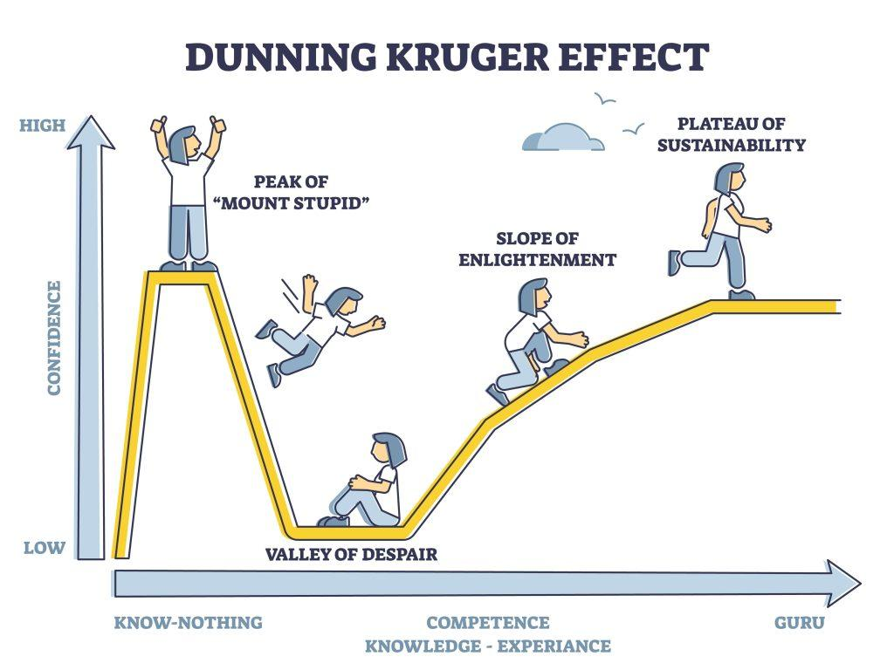

## Table of Contents

## What is the trading effect and why is it important?

The trading effect is a concept in finance that describes how buying and selling assets can influence their prices. When many people want to buy a certain stock, its price tends to go up because there are more buyers than sellers. On the other hand, if many people want to sell a stock, its price can go down because there are more sellers than buyers. This effect happens in all markets, not just stocks, including things like houses, cars, and even cryptocurrencies.

Understanding the trading effect is important because it helps people make better decisions about when to buy or sell things. If someone knows that a lot of people are buying a certain stock, they might decide to buy it too, hoping its price will keep going up. But if they see that many people are selling, they might wait for the price to drop before buying. Knowing about the trading effect can help people avoid losing money and maybe even make more money by timing their trades well.

## How does the trading effect influence financial markets?

The trading effect plays a big role in how financial markets work. When lots of people want to buy something, like a stock, its price goes up. This happens because there are more people wanting to buy than there are people wanting to sell. On the other hand, if lots of people want to sell a stock, its price goes down. This is because there are more sellers than buyers. This back-and-forth between buying and selling is what makes prices move in the market.

Understanding the trading effect is important for anyone who wants to invest in financial markets. If you know that many people are buying a certain stock, you might decide to buy it too, hoping its price will keep going up. But if you see that many people are selling, you might wait for the price to drop before buying. This knowledge can help you make better choices about when to buy or sell, which can help you avoid losing money and maybe even make more money.

## What are the basic principles of the trading effect for beginners?

The trading effect is all about how buying and selling can change the price of things. When a lot of people want to buy something, like a stock, its price goes up. This happens because there are more buyers than sellers. On the other hand, if a lot of people want to sell that stock, its price goes down. This is because there are more sellers than buyers. So, the trading effect is really about supply and demand - how much people want something versus how much of it is available.

Understanding the trading effect can help you make better choices when you're thinking about buying or selling things. If you see that a lot of people are buying a certain stock, you might want to buy it too, hoping its price will keep going up. But if you see that a lot of people are selling, you might want to wait for the price to drop before you buy. This can help you avoid losing money and maybe even make more money by timing your trades well. It's all about watching what other people are doing and deciding when it's the best time for you to act.

## Can you explain the difference between short-term and long-term trading effects?

Short-term trading effects are changes in price that happen quickly, often within a day or a few days. These changes can be caused by things like news events, company announcements, or just a lot of people buying or selling at the same time. For example, if a company says it made more money than people expected, its stock price might go up fast because a lot of people want to buy it right away. Short-term trading is like trying to catch a fast-moving train; you need to be quick and pay close attention to what's happening around you.

Long-term trading effects, on the other hand, are changes in price that happen over a longer time, like months or years. These changes are often influenced by bigger things like how well a company is doing overall, the health of the economy, or changes in technology. For example, if a company keeps making more money every year, its stock price might slowly go up over time because more people want to own it for the long run. Long-term trading is more like planting a seed and watching it grow; you need to be patient and think about the bigger picture.

## How do economic indicators affect the trading effect?

Economic indicators are like signs that tell us how the economy is doing. Things like unemployment rates, inflation, and how much people are spending can all affect the trading effect. When these indicators show that the economy is doing well, people might feel more confident and start buying more stocks, which can push prices up. On the other hand, if the indicators show that the economy is struggling, people might get worried and start selling their stocks, which can make prices go down.

For example, if the unemployment rate goes down, it means more people have jobs and are [earning](/wiki/earning-announcement) money. This can make people feel good about the future, so they might buy more stocks, causing prices to rise. But if inflation goes up a lot, it means things are getting more expensive, and people might worry about their money not going as far. This could make them sell their stocks, which would push prices down. So, economic indicators can really move the market by changing how people feel about buying and selling.

## What role do market sentiment and psychology play in the trading effect?

Market sentiment and psychology are really important when it comes to the trading effect. They're all about how people feel about the market and what they think might happen next. If people are feeling good and think the market will keep doing well, they're more likely to buy stocks. This can make stock prices go up because there are more buyers than sellers. On the other hand, if people are feeling worried or scared, they might start selling their stocks. This can make prices go down because there are more sellers than buyers.

These feelings can spread quickly and cause big changes in the market. For example, if a big news story comes out that makes people feel hopeful, a lot of people might start buying at the same time. This can lead to a quick jump in prices. But if something scary happens, like a big company going bankrupt, people might all start selling at once, causing prices to drop fast. So, understanding how people feel and what they're thinking can help you guess what might happen next in the market.

## How can traders use the trading effect to improve their strategies?

Traders can use the trading effect to make better choices by watching how other people are buying and selling. If they see a lot of people buying a certain stock, they might decide to buy it too, hoping the price will keep going up. But if they see a lot of people selling, they might wait for the price to drop before buying. This helps traders time their trades better and avoid losing money. They can use tools like stock charts and news reports to see what other people are doing and make decisions based on that.

Another way traders can use the trading effect is by understanding how short-term and long-term changes in the market work. For short-term trading, they need to pay attention to quick news and events that can make prices move fast. For long-term trading, they should look at bigger things like how well a company is doing over time or what's happening with the economy. By knowing the difference, traders can choose the right strategy for what they want to do. Whether they're looking to make a quick profit or invest for the future, understanding the trading effect can help them make smarter moves.

## What are some common mistakes traders make when considering the trading effect?

One common mistake traders make is jumping into trades too quickly without understanding the bigger picture. They might see a stock's price going up and think they need to buy it right away, but they don't look at why the price is going up or if it will keep going up. This can lead to buying at the wrong time and losing money when the price goes back down. It's important to look at things like economic indicators and market sentiment to get a better idea of what might happen next.

Another mistake is not paying attention to how feelings and news can change the market. Traders might not realize how much other people's fears or hopes can affect stock prices. For example, if a scary news story comes out, it can make a lot of people sell their stocks all at once, causing prices to drop fast. If traders don't think about how these feelings can move the market, they might be surprised by sudden changes and lose money. It's helpful to keep an eye on what people are thinking and feeling to make better trading choices.

## How does the trading effect vary across different asset classes like stocks, forex, and commodities?

The trading effect works a bit differently for different kinds of things you can buy and sell, like stocks, [forex](/wiki/forex-system), and commodities. Stocks are shares in companies, and their prices can go up and down based on how many people want to buy or sell them. If a lot of people want to buy a certain stock, its price goes up because there are more buyers than sellers. But if a lot of people want to sell, the price can go down. This can happen quickly because of news about the company or the economy. Forex, or foreign exchange, is about trading different currencies. The trading effect here can be influenced by things like interest rates or big news from a country. If a country's economy is doing well, people might want to buy its currency, making its value go up.

Commodities are things like gold, oil, or wheat. The trading effect for commodities can be different because their prices can be affected by things like weather or how much is being produced. For example, if there's a big storm that messes up oil production, the price of oil might go up because there's less of it available. But if a lot of farmers grow wheat one year, the price might go down because there's more of it to buy. So, while the basic idea of the trading effect is the same for all these things - more buyers push prices up, more sellers push them down - the reasons why people buy and sell can be different for each type of asset.

## What advanced techniques can be used to analyze the trading effect?

One advanced technique to analyze the trading effect is using technical analysis. This involves looking at charts and patterns to try to predict where prices might go next. Traders use tools like moving averages, which help smooth out price changes over time, and indicators like the Relative Strength Index (RSI), which can show if a stock is overbought or oversold. By studying these patterns and indicators, traders can get a better idea of when to buy or sell, based on what other people are doing in the market. It's like trying to read the market's mind by looking at what it's done before.

Another technique is using sentiment analysis, which looks at what people are saying and feeling about the market. This can be done by reading news articles, social media posts, and even using special software to see if people are feeling hopeful or worried about certain stocks or the market in general. If a lot of people are talking positively about a stock, it might be a sign that its price will go up because more people will want to buy it. On the other hand, if there's a lot of negative talk, it might mean the price will go down because more people will want to sell. By understanding these feelings, traders can make better guesses about what might happen next in the market.

## How do global events and geopolitical situations impact the trading effect?

Global events and geopolitical situations can have a big impact on the trading effect because they can change how people feel about the market. When something big happens, like a war or a big election, it can make people feel worried or hopeful about the future. If people are worried, they might start selling their stocks because they're scared about what might happen next. This can make stock prices go down because there are more sellers than buyers. But if people feel hopeful because of good news, they might start buying more, which can push prices up.

These events can also affect different kinds of things you can buy and sell, like stocks, currencies, and commodities, in different ways. For example, if there's a war in a country that produces a lot of oil, the price of oil might go up because people worry there won't be as much available. This can make the stocks of oil companies go up too, but it might make the value of that country's currency go down if people think its economy will be hurt. So, by keeping an eye on what's happening around the world, traders can get a better idea of how these events might change the trading effect and make smarter choices about when to buy or sell.

## What are the future trends and predictions regarding the trading effect in financial markets?

In the future, the trading effect in financial markets is likely to be influenced more by technology and data. With more people using computers and special software to trade, things can happen very fast. For example, if a lot of people start using the same computer program to buy and sell stocks, it can make prices move up and down quickly. Also, as more data becomes available, like what people are saying on social media or what big companies are doing, traders can use this information to make better guesses about where prices might go next. This means the trading effect could become more predictable, but also more complicated because there's so much information to look at.

Another trend we might see is more focus on how global events and feelings affect the trading effect. As the world gets more connected, what happens in one country can quickly affect markets everywhere. For example, if there's a big election or a natural disaster, it can make people around the world feel worried or hopeful, which can change how they buy and sell things. Traders will need to pay more attention to these global events and use tools like sentiment analysis to understand how people are feeling. This way, they can make better choices about when to buy or sell, even when the world is changing fast.

## References & Further Reading

[1]: Bergstra, J., Bardenet, R., Bengio, Y., & Kégl, B. (2011). ["Algorithms for Hyper-Parameter Optimization."](https://dl.acm.org/doi/10.5555/2986459.2986743) Advances in Neural Information Processing Systems 24.

[2]: ["Advances in Financial Machine Learning"](https://www.amazon.com/Advances-Financial-Machine-Learning-Marcos/dp/1119482089) by Marcos Lopez de Prado

[3]: ["Evidence-Based Technical Analysis: Applying the Scientific Method and Statistical Inference to Trading Signals"](https://www.amazon.com/Evidence-Based-Technical-Analysis-Scientific-Statistical/dp/0470008741) by David Aronson

[4]: ["Machine Learning for Algorithmic Trading"](https://github.com/stefan-jansen/machine-learning-for-trading) by Stefan Jansen

[5]: ["Quantitative Trading: How to Build Your Own Algorithmic Trading Business"](https://www.amazon.com/Quantitative-Trading-Build-Algorithmic-Business/dp/1119800064) by Ernest P. Chan