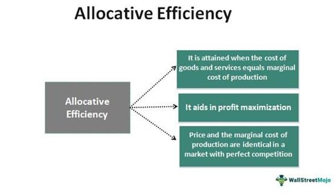

## Table of Contents

## What is trading efficiency and why is it important?

Trading efficiency is about how quickly and smoothly you can buy or sell things in a market. It looks at how fast your order gets done, how much it costs to make the trade, and how the price stays steady. When trading is efficient, you can get in and out of trades easily without the price moving too much against you.

This is important because it helps you save money and time. If trading is efficient, you won't lose much money on fees or because the price changes while you're trying to buy or sell. This makes the market more fair and helps everyone trust it more. Efficient trading also means more people will want to trade, which can make the market bigger and better for everyone.

## What are equivalent positions in trading?

Equivalent positions in trading are different ways to hold the same financial outcome. Imagine you want to bet on a stock going up. You could buy the stock directly, or you could buy a call option on that stock. Both positions would make you money if the stock price goes up, but they work in different ways. The stock gives you ownership, while the option gives you the right to buy the stock at a set price.

These positions are called equivalent because they lead to the same result, even though they use different methods. Traders use equivalent positions to manage risk, save money, or take advantage of different market conditions. For example, options might be cheaper than buying the stock outright, but they also have an expiration date, which adds another layer of strategy to consider. Understanding equivalent positions helps traders make smarter choices based on what they want to achieve and how much risk they're willing to take.

## How can equivalent positions improve trading efficiency?

Equivalent positions can make trading more efficient by giving traders different ways to get the same result. For example, instead of buying a stock, a trader might choose to buy a call option on that stock. Options can be cheaper and let you control more shares with less money. This means you can make trades faster and with less money tied up, which makes your trading more efficient. You can also switch between equivalent positions quickly to take advantage of changing market conditions without changing your overall strategy.

Using equivalent positions also helps traders manage risk better. If the market gets too risky, a trader might switch from owning a stock to using options or futures that give similar results but with less risk. This flexibility can save time because you don't need to rethink your whole plan; you just need to adjust your position. By managing risk more efficiently, you can trade more confidently and make decisions faster, which is a big part of trading efficiency.

## What are the basic types of financial instruments used in equivalent positions?

The basic types of financial instruments used in equivalent positions are stocks, options, and futures. Stocks are pieces of ownership in a company. When you buy a stock, you own a small part of that company and can make money if the stock price goes up. Options give you the right, but not the obligation, to buy or sell a stock at a set price before a certain date. There are two types of options: call options, which let you buy the stock, and put options, which let you sell it. Futures are agreements to buy or sell something at a set price on a future date. They are often used for things like commodities, but can also be used for stocks or indexes.

These instruments can be used to create equivalent positions because they can lead to the same financial outcome. For example, if you think a stock will go up, you could buy the stock directly, or you could buy a call option on that stock. Both positions would make you money if the stock price rises, but they work differently. The stock gives you ownership, while the option gives you the right to buy the stock at a set price. Futures can also be used to bet on the future price of a stock or index, giving you another way to achieve the same result without actually owning the stock. By understanding how these instruments work, traders can choose the best way to reach their financial goals.

## How do you calculate the value of equivalent positions?

Calculating the value of equivalent positions involves comparing the outcomes of different financial instruments that lead to the same result. For example, if you want to bet on a stock going up, you could buy the stock directly or buy a call option on that stock. To find out if these positions are truly equivalent, you need to look at their costs and potential profits. The value of the stock is simply its current price. For a call option, you need to consider the option's premium, which is the price you pay to buy the option, and the strike price, which is the price at which you can buy the stock if you choose to exercise the option. The potential profit from the option is the difference between the stock's market price and the strike price, minus the premium you paid.

To make a fair comparison, you also need to think about other factors like time and risk. Options have an expiration date, so their value changes over time. As the expiration date gets closer, the time value of the option decreases. This means you need to consider how long you plan to hold the position. Additionally, options and stocks have different levels of risk. Stocks give you ownership and can be held indefinitely, while options can expire worthless if the stock price doesn't move in your favor. By understanding these factors, you can calculate the value of equivalent positions and decide which one fits your trading goals and risk tolerance better.

## What are the risks associated with using equivalent positions?

Using equivalent positions can be risky because they all have different levels of risk. For example, if you buy a stock, you own it and can lose money if the stock price goes down. But if you buy an option, you could lose all the money you spent on the option if the stock price doesn't move in your favor before the option expires. This is called the risk of the option expiring worthless. Futures also have risks because they are agreements to buy or sell something at a set price in the future, and if the market moves against you, you could lose a lot of money.

Another risk is that equivalent positions can be hard to understand. Stocks are simple because you own a piece of a company. But options and futures are more complex because they involve rights and obligations that change over time. If you don't fully understand these instruments, you might make bad trading decisions. Also, equivalent positions can be affected by things like time decay for options, which means their value goes down as they get closer to expiring. This can make it harder to manage your trades and could lead to unexpected losses if you're not careful.

## Can you provide examples of equivalent positions in stocks and options?

Imagine you think the price of XYZ stock is going to go up. One way to bet on this is to buy 100 shares of XYZ stock. If the stock goes up by $1, you make $100. Another way is to buy a call option on XYZ stock with a strike price of $50. Let's say the option costs $2 per share, so for 100 shares, you pay $200. If the stock goes up to $52, you can use your option to buy the stock at $50 and then sell it at $52, making $200 minus the $200 you paid for the option, which means you break even. If the stock goes up to $60, you make $800 by exercising the option and selling at $60, minus the $200 you paid for the option, so you make $600. Both positions make money if the stock goes up, but they work differently.

Now let's say you think the price of ABC stock is going to go down. One way to bet on this is to sell short 100 shares of ABC stock. If the stock goes down by $1, you make $100. Another way is to buy a put option on ABC stock with a strike price of $50. Let's say the option costs $2 per share, so for 100 shares, you pay $200. If the stock goes down to $48, you can use your option to sell the stock at $50 and then buy it back at $48, making $200 minus the $200 you paid for the option, which means you break even. If the stock goes down to $40, you make $1000 by exercising the option and buying back at $40, minus the $200 you paid for the option, so you make $800. Both positions make money if the stock goes down, but they work differently.

## How do different market conditions affect the use of equivalent positions?

Different market conditions can change how traders use equivalent positions. When the market is calm and stable, traders might prefer to buy stocks directly because they are simpler and less risky. Stocks are easy to understand and don't have an expiration date like options do. But if the market starts to move a lot or becomes more unpredictable, traders might switch to using options or futures. These instruments can help manage risk better because they let you bet on the direction of the market without owning the stock outright. Options, for example, can limit how much money you lose if the market goes against you.

In a bullish market, where prices are going up, traders might use call options to take advantage of the rising prices. Call options can be cheaper than buying the stock and let you control more shares with less money. But if the market turns bearish and prices start to fall, traders might switch to put options to bet on the price going down. Put options can help you make money when the stock price drops, and they also limit your risk because the most you can lose is the money you paid for the option. By understanding how the market is behaving, traders can choose the best equivalent position to meet their goals and manage their risk.

## What advanced strategies can be employed with equivalent positions to enhance efficiency?

Traders can use advanced strategies like spreads and collars to make their trading more efficient. A spread involves buying and selling different options on the same stock at the same time. For example, you could buy a call option with a lower strike price and sell a call option with a higher strike price. This can help you make money if the stock price goes up, but it also limits how much you can lose if the stock doesn't move as expected. By using spreads, you can control more shares with less money and manage your risk better, which makes your trading more efficient.

Another strategy is using collars, which involve buying a stock, buying a put option to protect against the stock going down, and selling a call option to help pay for the put. This way, you can limit how much you can lose if the stock price drops, but you also give up some of the potential profit if the stock price goes up a lot. Collars are good for traders who want to protect their investments without spending too much money. By using these advanced strategies with equivalent positions, traders can make smarter choices and trade more efficiently, saving time and money.

## How do regulatory frameworks impact the use of equivalent positions in trading?

Regulatory frameworks can change how traders use equivalent positions. Rules set by groups like the Securities and Exchange Commission (SEC) or the Commodity Futures Trading Commission (CFTC) can affect what kinds of trades you can make and how much risk you can take. For example, some rules might limit how much you can trade in options or futures, or they might require you to have a certain amount of money in your account before you can trade. These rules are there to protect traders and keep the market fair, but they can also make it harder to use equivalent positions to your advantage.

Different countries have different rules, which can make things even more complicated if you trade in more than one place. For example, some countries might have stricter rules about using options or futures, while others might be more relaxed. Traders need to know these rules and follow them, or they could get in trouble. By understanding the regulatory environment, traders can choose the best equivalent positions that fit within the rules and still help them reach their trading goals.

## What are the technological tools available to manage and monitor equivalent positions?

Traders can use different computer programs to keep track of their equivalent positions. These programs, called trading platforms, show you all your trades in one place. They let you see how much money you're making or losing, and they can even tell you when it's a good time to buy or sell. Some popular trading platforms are thinkorswim by TD Ameritrade and Interactive Brokers' Trader Workstation. These platforms have charts and graphs that help you understand how your positions are doing. They can also send you alerts on your phone or computer if something important happens with your trades.

Another useful tool is risk management software. This kind of software helps you see how much risk you're taking with your equivalent positions. It can show you how different trades might affect each other and help you make smarter choices. For example, a program like Riskalyze can tell you how risky your overall portfolio is and suggest ways to make it safer. By using these technological tools, traders can keep an eye on their equivalent positions and make better decisions without spending too much time or effort.

## How can one measure the success of trading efficiency through equivalent positions?

To measure the success of trading efficiency through equivalent positions, you need to look at how well you're doing compared to your goals. One way to do this is by checking how much money you're making or losing. If you're using equivalent positions like stocks and options, you want to see if you're making more money with the options than you would with just the stocks. Another way is to see how quickly you can make trades. If using equivalent positions helps you buy and sell faster, that's a sign of good trading efficiency.

You can also measure success by looking at how much risk you're taking. Equivalent positions can help you manage risk better, so if you're losing less money when things go wrong, that's a good sign. Finally, think about how much time and effort you're spending. If using equivalent positions makes your trading easier and less time-consuming, then you're being more efficient. By looking at these things, you can tell if your use of equivalent positions is helping you trade better.

## What are Equivalent Positions in Trading?

Equivalent positions in trading are setups that appear distinct but offer identical risk-reward profiles. This concept is most prevalent in options trading, where diverse positions can replicate each other's payoff under specific conditions. Understanding equivalent positions allows traders to exploit pricing inefficiencies and enhance their profit margins by offering strategic versatility.

In options trading, equivalent positions often arise when different strategies yield the same payoff structure. A classic example is the equivalence between a covered call and a naked put. A covered call involves holding the underlying asset and selling a call option, while a naked put consists of selling a put option on the same underlying asset. These two strategies can be equivalent because they have similar payoff outcomes at expiration.

To illustrate this equivalence mathematically, consider the following:

1. **Covered Call:**
   - Position: Long 100 shares of stock + Short 1 call option
   - Payoff at expiration: 
$$
     \text{Covered Call Payoff} = 
     \begin{cases} 
     S_T - S_0 + C, & \text{if } S_T > K \\
     S_T - S_0, & \text{if } S_T \leq K 
     \end{cases}

$$
   where $S_T$ is the stock price at expiration, $S_0$ is the initial stock price, $K$ is the strike price of the call, and $C$ is the call premium received.

2. **Naked Put:**
   - Position: Short 1 put option
   - Payoff at expiration:
$$
     \text{Naked Put Payoff} = 
     \begin{cases} 
     P, & \text{if } S_T > K \\
     P - (K - S_T), & \text{if } S_T \leq K 
     \end{cases}

$$
   where $P$ is the put premium received.

Both payoffs result in the same net outcome for the investor if they are perfectly calibrated, explaining their equivalence.

By recognizing equivalent positions, traders can choose the strategy that best fits their market expectations, margin requirements, and transaction cost considerations. For example, opting for a naked put instead of a covered call might be more attractive if capital constraints are in place or if the trader expects the stock to remain above the strike price until expiration. This flexibility in strategy formulation is crucial for optimizing trading efficiency and profit potential.

## References & Further Reading

[1]: Bergstra, J., Bardenet, R., Bengio, Y., & Kégl, B. (2011). ["Algorithms for Hyper-Parameter Optimization."](https://dl.acm.org/doi/10.5555/2986459.2986743) Advances in Neural Information Processing Systems 24.

[2]: ["Advances in Financial Machine Learning"](https://www.amazon.com/Advances-Financial-Machine-Learning-Marcos/dp/1119482089) by Marcos Lopez de Prado

[3]: ["Evidence-Based Technical Analysis: Applying the Scientific Method and Statistical Inference to Trading Signals"](https://www.amazon.com/Evidence-Based-Technical-Analysis-Scientific-Statistical/dp/0470008741) by David Aronson

[4]: ["Machine Learning for Algorithmic Trading"](https://github.com/stefan-jansen/machine-learning-for-trading) by Stefan Jansen

[5]: ["Quantitative Trading: How to Build Your Own Algorithmic Trading Business"](https://www.amazon.com/Quantitative-Trading-Build-Algorithmic-Business/dp/1119800064) by Ernest P. Chan