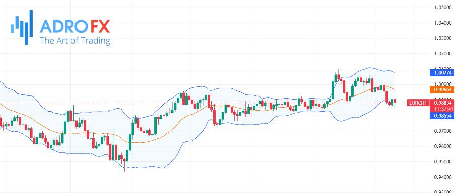

## Table of Contents

## What does 'trading flat' mean in the context of financial markets?

When people say a stock or market is 'trading flat,' it means the price of that stock or the overall market isn't going up or down much. It's staying pretty much the same over a period of time. This can happen for a lot of reasons, like when there's not much news or big events happening that would make people want to buy or sell more.

Sometimes, trading flat can be a sign that investors are unsure about what to do next. They might be waiting for more information before they decide to buy or sell. Other times, it might just mean that the market is taking a break after a lot of ups and downs. Either way, when a stock or market is trading flat, it's a good time to watch and see what happens next.

## How can you identify a flat trading market?

You can tell a market is trading flat when the prices of stocks or the whole market don't move up or down a lot. If you look at a chart, you'll see that the lines showing the price don't go up or down much. They kind of stay in the same place, like a flat line. This means that not many people are buying or selling, or they're doing it in a way that keeps the price steady.

Sometimes, you might see that the price moves a little bit up and down, but it always comes back to around the same place. This can go on for days, weeks, or even months. When you see this happening, it's a sign that the market is in a flat trading period. It's like the market is taking a break and waiting for something big to happen before it starts moving a lot again.

## What are the common causes of a market trading flat?

A market might trade flat because there's not much happening that makes people want to buy or sell. This could be because there's no big news or events that shake things up. For example, if everyone is waiting for a big company to announce its earnings or for a government to make an important decision, people might hold off on making big moves until they know more. So, the market just stays steady, not going up or down much.

Another reason could be that investors are feeling unsure or are taking a break. After a time of big ups and downs, people might want to take a step back and see what happens next. They might be trying to figure out if it's a good time to buy or sell, so they wait and watch. This waiting and watching can lead to a flat trading period where the market doesn't move much because everyone is kind of stuck, waiting for a sign to act.

## What are the key indicators used to confirm a flat trading period?

To confirm a flat trading period, one of the main things to look at is the price chart of the market or a specific stock. If the price line on the chart looks like it's not moving much and stays around the same level for a while, that's a good sign that the market is trading flat. You might see the price go up a little and then come back down to the same spot, or go down a bit and then come back up. This back-and-forth movement without much change in the overall level shows that the market is in a flat period.

Another indicator is the trading [volume](/wiki/volume-trading-strategy). If not many people are buying or selling, the market can stay flat. When you see that the number of trades happening each day is lower than usual, it means people are not making big moves. They might be waiting for something to happen before they decide to buy or sell more. So, low trading volume along with a steady price level can confirm that the market is indeed trading flat.

## How does trading flat affect different types of traders?

For day traders, a flat trading market can be tough. Day traders make money by buying and selling stocks quickly, often within the same day. When the market is flat, there's not much movement in prices, so it's hard for them to make profits. They might get bored or frustrated because they can't find good chances to trade. Some day traders might even decide to take a break and wait for the market to start moving again.

On the other hand, long-term investors might not mind a flat trading market as much. They buy stocks and hold onto them for a long time, so they're not as worried about small daily changes. A flat market can be a good time for them to do research and plan their next moves. They might even see it as a chance to buy stocks at steady prices without worrying about big ups and downs. For these investors, a flat market can be a time to relax and prepare for when the market starts moving again.

Swing traders, who hold onto stocks for a few days or weeks, might feel a bit stuck during a flat market. They look for medium-term trends to make money, but when the market is flat, those trends are hard to find. They might need to be more patient and wait for the right moment to trade. Or, they might decide to switch to trading different stocks or markets that are showing more movement.

## What strategies are effective for trading in a flat market?

When the market is flat, one good strategy is to trade within the range. This means you watch the price and see where it goes up to and where it goes down to. When the price gets close to the top of the range, you might sell, and when it gets close to the bottom, you might buy. This can help you make small profits even when the market isn't moving much. It's like playing a game where you buy low and sell high, but you do it over and over again within the same price range.

Another strategy is to use options. Options let you bet on whether the price will stay the same or move a little bit. You can buy options that pay off if the price stays within a certain range. This can be a good way to make money in a flat market because you're not counting on the price to go up or down a lot. Instead, you're betting that it will stay pretty much the same, which is what happens in a flat market.

A third strategy is to look for stocks that are not flat. Even when the overall market is not moving much, some stocks might still be going up or down. By focusing on these stocks, you can still find chances to make money. It's like finding a few lively fish in a calm pond. You just need to pay attention and be ready to switch to these stocks when you see them moving.

## Can you explain the role of volume in a flat trading environment?

In a flat trading environment, the volume of trades, or how many people are buying and selling, is a big clue about what's going on. When the market is flat, you often see that the volume is lower than usual. This means fewer people are making trades because they're not sure what to do next or they're waiting for something big to happen. When there's low volume, it's like the market is taking a nap, and not much is happening to push the prices up or down.

However, even in a flat market, if you see a sudden jump in volume, it might mean that something is about to change. A big increase in volume can show that more people are starting to trade again, maybe because they got some new information or they think the market is about to move. So, watching the volume can help you guess when the flat period might end and when it might be a good time to start trading again.

## How do economic events influence a market that is trading flat?

Economic events can shake up a market that's been trading flat. If there's big news like a change in interest rates, a new law, or a big company's earnings report, it can make people want to buy or sell more. When this happens, the market can start moving again. For example, if a company does better than expected, its stock price might go up, and that can get other stocks moving too. So, economic events can wake up a sleepy market and make it start trading more actively.

Sometimes, though, economic events can keep a market flat. If the news is not that exciting or if it's what everyone expected, people might still not want to make big moves. They might keep waiting for something bigger to happen. For instance, if a government report comes out and it's just what everyone thought it would be, the market might stay flat because there's no new reason for people to buy or sell more. So, economic events can either stir things up or keep things calm, depending on what the news is and how people react to it.

## What are the psychological impacts on traders during extended flat trading periods?

When the market stays flat for a long time, traders can start to feel bored and frustrated. Day traders, who like to buy and sell quickly, might get tired of waiting for the market to move. They might feel like they're not doing anything because there aren't many chances to make money. This can make them feel restless and unhappy with their trading.

On the other hand, long-term investors might feel more relaxed during a flat market. They don't worry as much about small changes in the market because they plan to keep their stocks for a long time. But even they can start to feel a bit unsure if the flat period goes on too long. They might start to wonder if they should do something different or if they're missing out on other chances. So, a long flat market can make traders feel different emotions, from boredom to relaxation to uncertainty.

## How can technical analysis be adapted for trading in flat markets?

In a flat market, technical analysis can still be useful, but you need to look at things a bit differently. One way is to focus on support and resistance levels. These are like the top and bottom of a box that the price stays in. When the price gets close to the top, or resistance, you might think about selling. When it gets close to the bottom, or support, you might think about buying. This way, you can make small trades within the flat range and still make some money.

Another way is to use indicators like the Bollinger Bands. These bands show how much the price is moving around. In a flat market, the bands will be close together, showing that the price isn't moving much. If you see the price start to move outside of these bands, it might mean the flat period is ending. So, you can use these bands to watch for when the market might start to move again and be ready to trade.

## What are some advanced techniques for profiting from flat market conditions?

One advanced technique for making money in a flat market is to use something called "mean reversion" strategies. This means you look for stocks that have moved away from their usual price and bet that they will go back to that price. For example, if a stock usually trades at $50 but it goes up to $55, you might sell it, thinking it will go back down to $50. If it goes down to $45, you might buy it, thinking it will go back up to $50. This can work well in a flat market because prices don't move much, so they often go back to where they were.

Another technique is to use options, but in a smart way. You can sell options that will only pay off if the price moves a lot, which is less likely in a flat market. This is called selling "straddles" or "strangles." By selling these options, you can make money if the price stays in the same range. It's like betting that the market will keep being boring, which can be a good bet when the market is flat. Just be careful because if the market does move a lot, you could lose money.

## How do institutional traders approach a market that is trading flat compared to retail traders?

Institutional traders, like big banks and investment firms, usually have more money and tools to work with than retail traders. When the market is flat, they might use this time to do a lot of research and plan their next moves. They can also use advanced strategies like selling options to make money while the market stays steady. Because they have more money, they can wait longer for the right time to trade. They might not mind the flat market as much because they can find ways to make money even when not much is happening.

Retail traders, who are regular people trading with their own money, often feel more pressure when the market is flat. They might get bored or frustrated because they can't find good chances to trade and make money. Some might try to trade within the flat range, buying low and selling high within the same price levels. But they don't have as much money or as many tools as institutional traders, so they might find it harder to make money in a flat market. They might also feel more unsure about what to do next and might decide to wait until the market starts moving again.

## What are Investment Strategies for Flat Markets?

In flat markets, where price movements are minimal and [volatility](/wiki/volatility-trading-strategies) is low, traditional investment strategies may not be as effective in generating substantial returns. To navigate such conditions, investors can explore several tailored strategies designed to maximize potential gains.

**1. Focusing on Individual Stock Picks:**

Rather than investing in broad market indices, which may show little movement in flat markets, investors could concentrate on individual stock selections. This approach involves identifying stocks that might outperform despite overall market stagnation. Fundamental analysis is crucial here, where investors examine company financials, management effectiveness, and competitive positioning to find stocks with intrinsic value and growth potential.

**2. Utilizing Options Like Covered Calls:**

Options strategies, particularly covered calls, can be beneficial for generating income in flat markets. A covered call strategy involves owning a stock or [ETF](/wiki/etf-trading-strategies) and selling call options on the same asset, providing a premium income. This strategy can be appealing in flat conditions as it allows investors to earn an income from premiums even if the asset price remains stable.

Mathematically, the profit from a covered call can be modeled as:

$$
\text{Profit} = (\text{Sale Price of Underlying} - \text{Purchase Price of Underlying}) + \text{Call Premium} - \text{Option Exercise Cost}
$$

Python code example to calculate potential outcomes for a covered call:
```python
def covered_call_profit(stock_price_at_purchase, call_premium, stock_sale_price=None, option_exercise_cost=0):
    if stock_sale_price is None:  # Option not exercised
        return call_premium - option_exercise_cost
    return (stock_sale_price - stock_price_at_purchase) + call_premium - option_exercise_cost

# Example usage
initial_stock_price = 50
premium_received = 2
sale_price = 55
exercise_cost = 1

profit = covered_call_profit(initial_stock_price, premium_received, sale_price, exercise_cost)
print(f"Profit from covered call: ${profit}")
```

**3. Bonds Trading Flat:**

In certain conditions, investors may prefer bonds that are trading flat. A bond trading flat means it does not pay accrued interest between interest payments, often due to issuer insolvency or payment concerns. While generally riskier, purchasing these bonds could allow strategic opportunities for investors anticipating issuer recovery or improvement in creditworthiness, resulting in price appreciation.

**4. Investing in Growth or Defensive Sectors:**

Investors could look towards specific sectors with the potential to outperform during flat market phases. Sectors focused on technological innovation, healthcare, or utilities often show resilience and potential for growth irrespective of broader market trends. Additionally, defensive stocks, such as those providing essential services or consumer goods, tend to maintain steady performance, offering stability and potential dividends during sluggish market periods.

By strategically adjusting their focus and leveraging financial instruments suited for low-volatility environments, investors can still identify and execute profitable opportunities in flat markets.

## References & Further Reading

[1]: Bergstra, J., Bardenet, R., Bengio, Y., & Kégl, B. (2011). ["Algorithms for Hyper-Parameter Optimization."](https://dl.acm.org/doi/10.5555/2986459.2986743) Advances in Neural Information Processing Systems 24.

[2]: ["Advances in Financial Machine Learning"](https://www.amazon.com/Advances-Financial-Machine-Learning-Marcos/dp/1119482089) by Marcos Lopez de Prado

[3]: ["Evidence-Based Technical Analysis: Applying the Scientific Method and Statistical Inference to Trading Signals"](https://www.amazon.com/Evidence-Based-Technical-Analysis-Scientific-Statistical/dp/0470008741) by David Aronson

[4]: ["Machine Learning for Algorithmic Trading"](https://github.com/stefan-jansen/machine-learning-for-trading) by Stefan Jansen

[5]: ["Quantitative Trading: How to Build Your Own Algorithmic Trading Business"](https://www.amazon.com/Quantitative-Trading-Build-Algorithmic-Business/dp/1119800064) by Ernest P. Chan