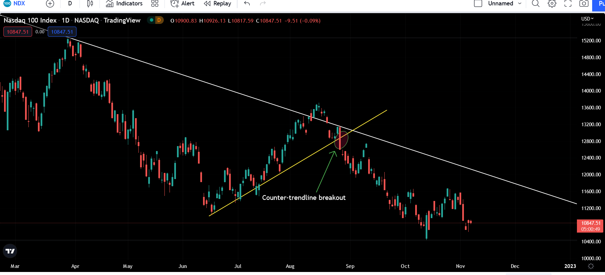

The financial markets are dynamic environments where prices fluctuate based on various economic, political, and psychological factors. However, there are occasions when these markets exhibit minimal price movement, resulting in what is known as a flat market. During such periods, traders and investors face distinct challenges and opportunities. A flat market is characterized by stagnant prices, with little to no upward or downward movement—a scenario that, while seemingly uneventful, can be strategically significant.

In flat markets, traditional investment approaches relying on significant price volatility may not yield expected returns. Instead, investors are encouraged to reassess their strategies, potentially focusing on individual stocks or bonds that hold intrinsic value or opting for defensive sectors that remain stable during economic uncertainty. Furthermore, algorithmic trading emerges as a pivotal tool, leveraging complex data analysis and pattern recognition to identify subtle market inefficiencies that may go unnoticed in manual trading.



Understanding flat markets is essential for informed decision-making. Traders and investors must grasp the nuances of these conditions, from flat stocks and bonds to the innovative application of algorithmic trading models. Such knowledge not only aids in navigating periods of stagnation but also enhances a trader’s ability to anticipate and respond to eventual market shifts. Whether one is a novice investor or a seasoned trader, mastering the intricacies of flat markets paves the way for more informed and effective trading strategies.

## Table of Contents

## Understanding Flat Market Trends

Flat markets signify a state where there is minimal fluctuation in the prices of financial instruments. This phenomenon is observable across various financial markets, such as stocks, bonds, and foreign exchange (forex). While volatility is often sought for trading opportunities, flat markets present their own set of dynamics that can be leveraged by astute investors and traders.

The occurrence of flat markets can be attributed to several factors. Investor indecision often plays a significant role; when market participants are uncertain about economic or geopolitical developments, trading activity may decrease, and prices stabilize. Additionally, periods of low economic activity can lead to fewer transactions and slower market movements as economic indicators and corporate earnings provide little impetus for price changes. Moreover, a balance between buying and selling pressures—where neither bulls nor bears dominate—can lead to a stagnation in price movements.

Despite the seeming lack of excitement, flat markets offer unique opportunities for traders and investors. The limited price movement can allow for strategic positioning without the risks associated with high volatility. Traders who specialize in algorithmic strategies may find these markets particularly conducive to exploiting inefficiencies and executing trades effectively without the noise of drastic price oscillations. Moreover, traditional strategies, which typically rely on trends, can be adapted to leverage the subtle nuances of a flat market environment.

In such market conditions, patience and a keen eye for micro-trends can be key. Opportunities may arise in the form of price consolidations or technical patterns that hint at forthcoming breakouts or shifts. As such, flat markets test a trader's ability to interpret signals, manage expectations, and deploy strategies that capitalize on these calmer periods.

## Investment Strategies for Flat Markets

In flat markets, where price movements are minimal and [volatility](/wiki/volatility-trading-strategies) is low, traditional investment strategies may not be as effective in generating substantial returns. To navigate such conditions, investors can explore several tailored strategies designed to maximize potential gains.

**1. Focusing on Individual Stock Picks:**

Rather than investing in broad market indices, which may show little movement in flat markets, investors could concentrate on individual stock selections. This approach involves identifying stocks that might outperform despite overall market stagnation. Fundamental analysis is crucial here, where investors examine company financials, management effectiveness, and competitive positioning to find stocks with intrinsic value and growth potential.

**2. Utilizing Options Like Covered Calls:**

Options strategies, particularly covered calls, can be beneficial for generating income in flat markets. A covered call strategy involves owning a stock or [ETF](/wiki/etf-trading-strategies) and selling call options on the same asset, providing a premium income. This strategy can be appealing in flat conditions as it allows investors to earn an income from premiums even if the asset price remains stable.

Mathematically, the profit from a covered call can be modeled as:

$$
\text{Profit} = (\text{Sale Price of Underlying} - \text{Purchase Price of Underlying}) + \text{Call Premium} - \text{Option Exercise Cost}
$$

Python code example to calculate potential outcomes for a covered call:
```python
def covered_call_profit(stock_price_at_purchase, call_premium, stock_sale_price=None, option_exercise_cost=0):
    if stock_sale_price is None:  # Option not exercised
        return call_premium - option_exercise_cost
    return (stock_sale_price - stock_price_at_purchase) + call_premium - option_exercise_cost

# Example usage
initial_stock_price = 50
premium_received = 2
sale_price = 55
exercise_cost = 1

profit = covered_call_profit(initial_stock_price, premium_received, sale_price, exercise_cost)
print(f"Profit from covered call: ${profit}")
```

**3. Bonds Trading Flat:**

In certain conditions, investors may prefer bonds that are trading flat. A bond trading flat means it does not pay accrued interest between interest payments, often due to issuer insolvency or payment concerns. While generally riskier, purchasing these bonds could allow strategic opportunities for investors anticipating issuer recovery or improvement in creditworthiness, resulting in price appreciation.

**4. Investing in Growth or Defensive Sectors:**

Investors could look towards specific sectors with the potential to outperform during flat market phases. Sectors focused on technological innovation, healthcare, or utilities often show resilience and potential for growth irrespective of broader market trends. Additionally, defensive stocks, such as those providing essential services or consumer goods, tend to maintain steady performance, offering stability and potential dividends during sluggish market periods.

By strategically adjusting their focus and leveraging financial instruments suited for low-volatility environments, investors can still identify and execute profitable opportunities in flat markets.

## Algorithmic Trading in Flat Markets

Algorithmic trading provides a distinct advantage in flat markets through its systematic approach to data analysis and pattern recognition. In conditions characterized by low volatility, algorithms can efficiently identify and capitalize on subtle market inefficiencies that might elude human traders.

Arbitrage strategies are fundamental within this context. These strategies involve simultaneously buying and selling related securities to profit from price discrepancies without assuming significant risk. For instance, in a flat stock market, an [arbitrage](/wiki/arbitrage) algorithm might exploit slight price differences between different exchanges or between related assets, such as stocks and their corresponding futures contracts. Although individual price deviations might be minimal, their cumulative effect can lead to substantial returns when executed at scale.

Statistical arbitrage enhances this approach by deploying complex statistical models to evaluate and predict price movements based on historical data correlations. This method often involves pairs trading where an algorithm simultaneously goes long on one stock and short on another, expecting their prices to converge over time. The low volatility of flat markets provides an ideal landscape for [statistical arbitrage](/wiki/statistical-arbitrage), as abrupt price shifts that could disrupt the models are less likely to occur.

Technical indicators form the backbone of algorithmic strategies in flat markets, facilitating the identification of repeatable patterns. Moving averages, Bollinger Bands, and the Relative Strength Index (RSI) are common tools used to generate buy or sell signals. For example, a simple moving average crossover strategy could involve buying a security when its short-term moving average crosses above a long-term average and selling when the opposite occurs.

Backtesting is crucial in developing effective algo trading strategies, allowing traders to simulate their strategies on historical data to evaluate performance before live deployment. By rigorously [backtesting](/wiki/backtesting) under flat market conditions, traders can refine their algorithms to optimize for profitability and minimize risk.

Through technical precision and a reliance on quantitative analysis, [algorithmic trading](/wiki/algorithmic-trading) enables market participants to unearth opportunities in flat markets that are largely insulated from high volatility—often resulting in a steady accumulation of gains over time.

## Key Algo Trading Strategies

Trend-following and mean reversion are widely-used algorithmic trading strategies that typically thrive in volatile market environments. These strategies may require adjustments when applied to flat markets due to reduced price movement and volatility. 

**Trend-Following**

Trend-following strategies capitalize on the [momentum](/wiki/momentum) of stock prices. In flat markets, the absence of clear price direction necessitates shorter time frames and possibly using alternative indicators to detect minor trends. For instance, traders might rely on moving averages with shorter windows to capture subtle price shifts.

**Mean Reversion**

Mean reversion strategies are based on the concept that asset prices tend to revert to their historical averages over time. In low-volatility environments, mean reversion strategies can benefit from smaller price fluctuations. Adjusting the "lookback period" for determining historical averages or employing tighter thresholds for entry and [exit](/wiki/exit-strategy) points can enhance these strategies' effectiveness.

**Breakout Strategies**

Breakout strategies involve identifying and capitalizing on securities that move beyond established resistance or support levels. In flat markets, the challenge lies in recognizing valid breakouts due to the muted price action. Traders often employ higher confirmation thresholds or integrate additional technical indicators, such as [volume](/wiki/volume-trading-strategy) spikes, to validate breakouts. Here is an example in Python that utilizes moving average strategies to detect breakouts:

```python
import pandas as pd
import numpy as np

def detect_breakout(data, short_window=20, long_window=50):
    data['short_ma'] = data['Close'].rolling(window=short_window, min_periods=1).mean()
    data['long_ma'] = data['Close'].rolling(window=long_window, min_periods=1).mean()

    # Generating breakout signals
    data['signal'] = 0
    data['signal'][short_window:] = np.where(data['short_ma'][short_window:] > data['long_ma'][short_window:], 1, 0)

    data['position'] = data['signal'].diff()

    return data

# Example usage
# df = pd.read_csv('market_data.csv')  # Load your data

# breakout_data = detect_breakout(df)
# breakout_points = breakout_data[breakout_data['position'] == 1]
```

**Market-Making Strategies**

Market-making strategies provide [liquidity](/wiki/liquidity-risk-premium) to markets by placing buy and sell orders simultaneously. In flat markets, limited price movements create the opportunity for traders to capitalize on the bid-ask spread repeatedly. The strategy efficiently captures gains from frequent, minor price movements instead of relying on larger trends. Traders employ algorithms capable of dynamically adjusting the bid and ask quotes to maintain competitiveness and profitability.

Conclusively, while flat markets impose particular challenges for traditional algorithmic strategies, adapting these strategies for reduced volatility offers substantial potential through disciplined approaches.

## Challenges and Considerations

Overfitting and data snooping are significant challenges in algorithmic trading, particularly in flat market conditions. Overfitting occurs when a trading model is tailored too closely to historical data, capturing noise instead of the underlying trend. This results in a model that performs poorly on new, unseen data. In flat markets, where price movements are minimal, the risk of overfitting is heightened because it's challenging to distinguish between genuine signals and random fluctuations. Data snooping amplifies this issue when excessive testing and tweaking of hypotheses lead to misleading signals that do not hold out-of-sample.

To mitigate these risks, traders must employ rigorous backtesting methodologies. Robust backtesting involves evaluating a trading strategy on a distinct dataset not used in the model development phase. Tools like walk-forward optimization and cross-validation can provide more reliable performance estimates. For example, in Python, backtesting can be approached as follows:

```python
from backtesting import Backtest, Strategy
from backtesting.lib import crossover
from backtesting.test import SMA, GOOG

class SmaCross(Strategy):
    n1 = 10
    n2 = 20

    def init(self):
        self.sma1 = self.I(SMA, self.data.Close, self.n1)
        self.sma2 = self.I(SMA, self.data.Close, self.n2)

    def next(self):
        if crossover(self.sma1, self.sma2):
            self.buy()
        elif crossover(self.sma2, self.sma1):
            self.sell()

bt = Backtest(GOOG, SmaCross, cash=10000, commission=.002)
stats = bt.run()
bt.plot()
```

This simple moving average crossover strategy encapsulates a method to avoid overfitting by keeping models interpretable and subsequently adjusting parameters based only on clear rules.

Transaction costs and slippage must also be carefully considered in flat markets. Since frequent trades are often necessary to capture small price movements, these costs can accumulate and severely reduce profitability. Slippage, the difference between the expected price and actual price, can further impact returns, especially in illiquid or stable markets where each price tick is significant.

Traders can counteract the adverse effects of transaction costs by optimizing execution methods—utilizing limit orders instead of market orders and selecting brokers with lower fees. By programming stop-loss orders and break-even points, traders can manage slippage risks proactively.

Lastly, algorithmic trading in flat markets demands adaptability. Markets can transition from flat to volatile due to economic news, policy changes, or market sentiment shifts. Traders should ensure their algorithms can adapt to these changes, possibly through [machine learning](/wiki/machine-learning) techniques that recalibrate trading strategies in real-time.

Overall, successful navigation of flat market conditions requires a balance of technological acumen and market awareness. By refining models, minimizing costs, and swiftly adapting to market changes, traders can maintain and potentially enhance profitability even in less dynamic environments.

## Conclusion

Flat markets shouldn't deter traders; with the right approach, they can be lucrative. Utilizing the strengths of algorithmic trading allows traders to gain an edge in spotting limited opportunities inherent in flat trends. Algorithmic strategies, which are grounded in data analysis and historical market patterns, offer a systematic way to exploit inefficiencies, even when volatility is low. For instance, market-making strategies can thrive in flat markets by capitalizing on the bid-ask spread, consistently providing liquidity and [earning](/wiki/earning-announcement) profits on small price differentials.

Continuous learning and the application of backtesting to refine these strategies become crucial in achieving success. Backtesting allows traders to simulate how a strategy would have performed in past markets, identifying potential weaknesses and making necessary adjustments without financial risk. This practice ensures that strategies remain robust and responsive to market conditions, whether they are flat or not.

Moreover, traders must remain vigilant about technological advancements and evolving market data to maintain competitiveness. Embracing advancements such as [artificial intelligence](/wiki/ai-artificial-intelligence), machine learning, and real-time data analytics can greatly enhance the efficiency and accuracy of trading algorithms. Keeping informed about these technologies and integrating them into trading practices can provide significant advantages. Overall, a proactive approach to education and technology adoption enables traders to not only survive but thrive in flat markets.

## References & Further Reading

[1]: Bergstra, J., Bardenet, R., Bengio, Y., & Kégl, B. (2011). ["Algorithms for Hyper-Parameter Optimization."](https://dl.acm.org/doi/10.5555/2986459.2986743) Advances in Neural Information Processing Systems 24.

[2]: ["Advances in Financial Machine Learning"](https://www.amazon.com/Advances-Financial-Machine-Learning-Marcos/dp/1119482089) by Marcos Lopez de Prado

[3]: ["Evidence-Based Technical Analysis: Applying the Scientific Method and Statistical Inference to Trading Signals"](https://www.amazon.com/Evidence-Based-Technical-Analysis-Scientific-Statistical/dp/0470008741) by David Aronson

[4]: ["Machine Learning for Algorithmic Trading"](https://github.com/stefan-jansen/machine-learning-for-trading) by Stefan Jansen

[5]: ["Quantitative Trading: How to Build Your Own Algorithmic Trading Business"](https://www.amazon.com/Quantitative-Trading-Build-Algorithmic-Business/dp/1119800064) by Ernest P. Chan