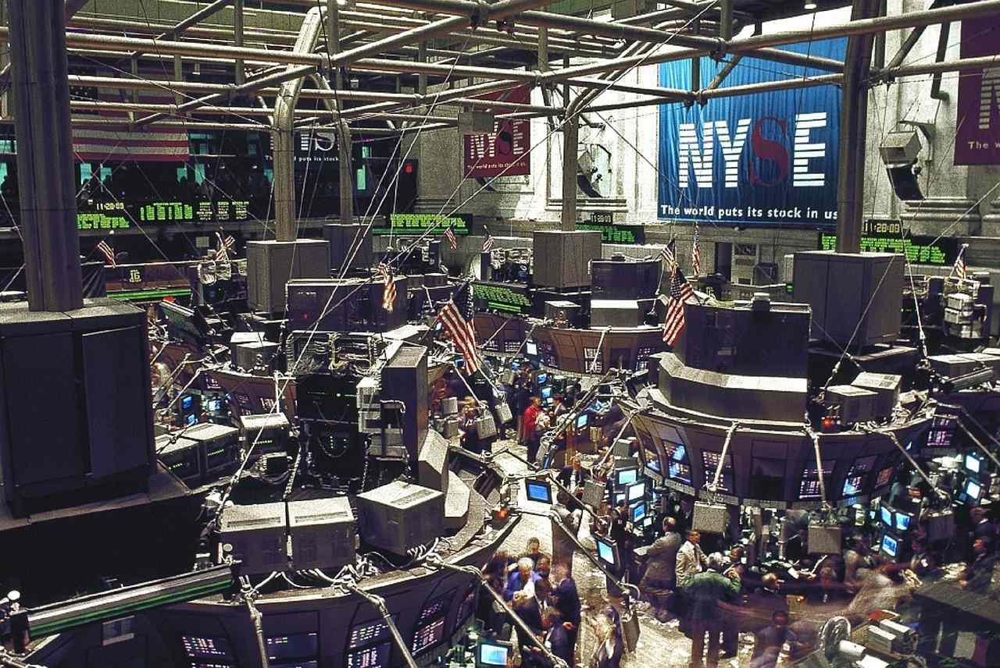

## Table of Contents

## What is a trading floor?

A trading floor is a large room where people buy and sell financial products like stocks, bonds, and commodities. It's usually very busy and noisy, with traders shouting and using hand signals to communicate their trades quickly. These floors are often found in stock exchanges, like the New York Stock Exchange, where traders work for different companies and make deals on behalf of their clients.

In the past, trading floors were the main places where all trading happened. Traders would meet face-to-face to negotiate prices and complete transactions. However, with the rise of technology, a lot of trading now happens electronically. This means that while trading floors still exist, many trades are done through computers and online platforms, making the process faster and more efficient.

## What are the main activities that occur on a trading floor?

On a trading floor, the main activity is buying and selling financial products like stocks, bonds, and commodities. Traders work for different companies and they shout and use hand signals to communicate quickly. They make deals on behalf of their clients, trying to buy low and sell high to make a profit. The atmosphere is usually very busy and noisy, with everyone trying to get the best deals as fast as possible.

Another important activity is monitoring market conditions. Traders keep an eye on news, economic reports, and other information that can affect prices. They use this information to decide when to buy or sell. Sometimes, they also talk to other traders to get more information or to make deals. This helps them stay ahead in the fast-paced world of trading.

Overall, the trading floor is a place where quick decisions are made, and where traders use their skills and knowledge to trade financial products efficiently. While a lot of trading now happens electronically, the trading floor remains an important place for face-to-face interactions and immediate market reactions.

## Who are the key players on a trading floor?

The key players on a trading floor are traders, brokers, and market makers. Traders are the people who buy and sell financial products like stocks and bonds. They work for different companies and try to make profits by buying low and selling high. Brokers help traders by finding buyers or sellers for the financial products. They act as middlemen and help make the trading process smoother. Market makers are important because they help keep the market running smoothly by always being ready to buy or sell certain financial products.

Another important group on the trading floor is the specialists. Specialists are responsible for specific stocks and help maintain order and fairness in trading. They match buy and sell orders and make sure that trades happen at the right prices. Floor brokers also play a key role. They work for brokerage firms and execute trades on behalf of their clients. They move around the trading floor, talking to other traders and specialists to get the best deals for their clients.

Overall, these key players work together to make the trading floor a busy and efficient place. Each person has a specific job that helps the whole market function well. While technology has changed how trading happens, these roles are still important for making sure that trading is fair and effective.

## How has technology impacted trading floors?

Technology has changed trading floors a lot. In the past, people had to be on the trading floor to buy and sell stocks. They would shout and use hand signals to make deals. Now, a lot of trading happens on computers. Traders can buy and sell stocks from anywhere using online platforms. This makes trading faster and easier. It also means that trading floors are not as busy as they used to be, because many traders can work from home or other places.

Even though technology has changed a lot, trading floors still exist. They are important for big trades and when people need to talk face-to-face. Technology helps make these talks better by giving traders more information quickly. For example, traders can use computers to see prices and news in real-time. This helps them make better decisions. So, while technology has made some parts of trading different, it has also made trading floors more useful in new ways.

## What is the difference between a physical trading floor and an electronic trading platform?

A physical trading floor is a big room where people come together to buy and sell things like stocks and bonds. It's a busy place where traders shout and use hand signals to make deals quickly. They work for different companies and try to make money by buying low and selling high. The atmosphere is lively and noisy, and it's important for big trades and face-to-face talks. People on the trading floor can see and talk to each other, which helps them make deals and share information quickly.

An electronic trading platform is a computer system that lets people buy and sell stocks and other financial products online. Traders can use these platforms from anywhere, like their home or office. It's faster and easier because everything happens on a computer. Traders can see prices and news in real-time, which helps them make quick decisions. While electronic platforms have made trading more efficient, they don't have the same lively atmosphere as a physical trading floor, and some big trades still happen on the floor.

Both physical trading floors and electronic trading platforms are important in today's world. Physical floors are good for big trades and when people need to talk face-to-face, while electronic platforms make trading faster and more convenient. Technology has changed how trading happens, but it hasn't replaced the need for physical trading floors completely.

## What are the typical hours of operation for a trading floor?

Trading floors usually open early in the morning and close in the late afternoon. In the United States, many trading floors start at 9:30 AM and end at 4:00 PM, Eastern Time. This is when the main stock markets like the New York Stock Exchange are open. During these hours, traders are very busy buying and selling stocks and other financial products.

Some trading floors also have special times called pre-market and after-hours trading. Pre-market trading can start as early as 4:00 AM, and after-hours trading can go until 8:00 PM. These times let traders buy and sell when the main market is closed. Even though the trading floor might not be as busy during these times, it's still an important part of the day for some traders.

## What kind of training is required to work on a trading floor?

To work on a trading floor, you need to learn a lot about finance and how markets work. Many people who work on trading floors have degrees in finance, economics, or business. They study things like how to analyze stocks, understand market trends, and make smart investment choices. Some traders also go to special schools or take courses to learn more about trading. These courses teach them how to use trading software, understand financial news, and make quick decisions.

Besides book learning, working on a trading floor also needs practice and experience. Many traders start by working as interns or junior traders to learn from people who have been doing it for a long time. They watch and learn how to handle the fast pace and loud environment of the trading floor. Over time, they get better at making trades and understanding the market. Good communication skills are also important because traders need to talk to each other quickly and clearly to make deals.

## How do trading floors manage risk?

Trading floors manage risk by using different strategies and tools. One way they do this is by setting limits on how much they can lose on a trade. This is called a stop-loss order. If a stock starts to lose too much money, the stop-loss order will sell it automatically to stop the loss from getting bigger. Traders also use something called diversification, which means they don't put all their money into one stock or one type of investment. By spreading their money around, they can lower the risk because if one investment does badly, the others might do well.

Another way trading floors manage risk is by using computers and software to watch the market closely. These tools can help traders see when the market is changing quickly or when there might be a problem. Traders can then make quick decisions to protect their money. They also talk to each other a lot on the trading floor, sharing information and advice. This helps everyone stay on top of what's happening and make better choices to manage risk.

## What are some common strategies used by traders on the floor?

Traders on the floor use different strategies to make money and manage risk. One common strategy is called "[day trading](/wiki/day-trading-spy)." Day traders buy and sell stocks within the same day, trying to make quick profits from small changes in stock prices. They watch the market closely and make many trades in a short time. Another strategy is "swing trading," where traders hold onto stocks for a few days or weeks. They try to catch bigger price moves and make more money from each trade.

Another strategy traders use is "[arbitrage](/wiki/arbitrage)." This means buying a stock in one place where it's cheaper and selling it in another place where it's more expensive. Traders can make money from the difference in prices. They also use "hedging" to protect their investments. Hedging means buying other investments that will go up if their main investment goes down. This helps them lower the risk of losing money. Overall, traders use these strategies to make the best use of the fast-paced and sometimes unpredictable environment of the trading floor.

## How do global events influence the activities on a trading floor?

Global events can have a big impact on what happens on a trading floor. When something important happens around the world, like a big election or a natural disaster, it can change how people feel about the economy. If people think the economy will do well, they might buy more stocks, making prices go up. But if they think things will get worse, they might sell their stocks, making prices go down. Traders watch these events closely because they need to decide quickly whether to buy or sell based on the news.

For example, if there's a war or a big economic report coming out, traders will be very busy. They will talk to each other a lot and use their computers to see how the market is reacting. If the news is good, they might start buying more, hoping to make money as prices rise. But if the news is bad, they might sell their stocks to avoid losing money. So, global events keep traders on their toes, always ready to make quick decisions to take advantage of or protect against changes in the market.

## What are the regulatory considerations for operating a trading floor?

Operating a trading floor comes with many rules that must be followed to make sure everything is fair and safe. These rules are set by groups like the Securities and Exchange Commission (SEC) in the United States. They make sure that trading is honest and that everyone has the same chance to make money. Trading floors have to keep good records of all their trades, follow rules about how they can talk to clients, and make sure they don't do anything that could cheat people. If they break these rules, they can get in big trouble, like having to pay fines or even going to court.

Another important part of running a trading floor is making sure that traders are trained and know the rules. This helps prevent mistakes and keeps the trading floor running smoothly. There are also rules about how much risk traders can take and how they have to report their trades. These rules help keep the market stable and protect investors. Overall, following these regulations is very important for keeping the trading floor a fair and trustworthy place to do business.

## How do trading floors adapt to market volatility and economic changes?

Trading floors adapt to market volatility and economic changes by staying very alert and ready to act quickly. When the market gets bumpy, traders use tools like stop-loss orders to limit their losses. They watch the news and economic reports closely to see what's happening and how it might affect the market. If they see something that could make prices go up or down, they might buy or sell stocks faster to take advantage of the change or to protect their money. They also talk to each other a lot on the trading floor, sharing what they know so everyone can make better decisions.

Another way trading floors adapt is by using different trading strategies. For example, if the market is going up and down a lot, traders might switch to day trading, where they buy and sell stocks within the same day to make quick profits. Or they might use hedging, which means buying other investments that will go up if their main investment goes down. This helps them lower the risk of losing money. By being flexible and using different strategies, trading floors can handle the ups and downs of the market and keep making money even when things are changing fast.

## What are the key strategies in algorithmic trading?

Algorithmic trading leverages computer algorithms to execute trades according to predefined criteria, aiming to exploit various market conditions efficiently. Among the most popular strategies are [trend following](/wiki/trend-following), arbitrage opportunities, mean reversion, and high-frequency trading. Each of these strategies offers unique advantages and potential risks, which are important for traders to consider when formulating their trading plans.

**Trend Following**

Trend following is a strategy that attempts to capture gains by analyzing an asset's [momentum](/wiki/momentum) in a particular direction. This strategy is based on the assumption that financial instruments that have been moving in a certain direction will continue to do so. The primary tools used in trend following include moving averages, trend lines, and momentum indicators. For instance, a simple moving average (SMA) strategy might involve buying a stock when its short-term SMA crosses above its long-term SMA, indicating an upward trend.

Python implementation of a basic moving average strategy might look like this:

```python
import pandas as pd

def moving_average_strategy(data, short_window=40, long_window=100):
    data['short_mavg'] = data['Close'].rolling(window=short_window, min_periods=1).mean()
    data['long_mavg'] = data['Close'].rolling(window=long_window, min_periods=1).mean()
    data['signal'] = 0
    data['signal'][short_window:] = \
        np.where(data['short_mavg'][short_window:] > data['long_mavg'][short_window:], 1, 0)
    data['positions'] = data['signal'].diff()

    return data

# Assuming 'data' is a pandas DataFrame with a datetime index and a 'Close' column for the closing prices
```

While trend following can be highly effective, it relies on stable market trends and may underperform during sideways or volatile markets.

**Arbitrage Opportunities**

Arbitrage involves exploiting price discrepancies of the same asset across different markets or in derivative forms. A typical arbitrage strategy could involve buying a commodity in one market where it's undervalued and simultaneously selling it in another market where it’s overvalued, locking in profit without risk from the asset's price movement.

A simple example is [statistical arbitrage](/wiki/statistical-arbitrage), where trading decisions are based on statistical analysis and the correlation between multiple securities. This strategy requires high computational power and extensive market data analysis to efficiently identify and execute opportunities before the market corrects the discrepancies.

**Mean Reversion**

The mean reversion strategy is based on the idea that asset prices tend to revert to their historical averages over time. When a stock's price significantly deviates from its average, traders might anticipate that the price will return to normal and thus place trades accordingly.

Mathematically, for a given stock price $P_t$, the mean-reversion model can be represented as:

$$
P_{t+1} = P_t + \theta (\mu - P_t) + \varepsilon_{t+1}
$$

where $\mu$ is the long-term mean price, $\theta$ is the speed of reversion, and $\varepsilon_{t+1}$ is a random error term. This formula suggests that price movement involves both a deterministic change and a stochastic change.

Implementing a mean-reversion strategy requires rigorous statistical analysis to determine the appropriate average and [volatility](/wiki/volatility-trading-strategies) levels, with potential risks if new trends emerge that redefine the historical averages.

**High-Frequency Trading (HFT)**

High-frequency trading ([HFT](/wiki/high-frequency-trading-strategies)) involves executing a large number of orders at extremely fast speeds using powerful computers and algorithms. HFT seeks to exploit small price imbalances and inefficiencies often available only for a short duration. This type of trading requires low latency in order execution and is typically performed by large institutional traders because of the significant infrastructure investment required.

The potential rewards of HFT include consistently capturing small spreads and reducing exposure time, but it also involves substantial risks. Technical failures, excessive market noise, and legal constraints are critical factors in managing an HFT strategy, with regulatory bodies closely scrutinizing these activities due to concerns over market stability.

In summary, [algorithmic trading](/wiki/algorithmic-trading) strategies, while offering substantial profit potential, require deep market understanding, sophisticated algorithms, and careful risk management. Each strategy capitalizes on specific market dynamics, necessitating traders to continuously adapt and refine their approaches based on evolving market conditions and technological advancements.

## References & Further Reading

[1]: Bergstra, J., Bardenet, R., Bengio, Y., & Kégl, B. (2011). ["Algorithms for Hyper-Parameter Optimization."](https://papers.nips.cc/paper/4443-algorithms-for-hyper-parameter-optimization) Advances in Neural Information Processing Systems 24.

[2]: ["Advances in Financial Machine Learning"](https://www.amazon.com/Advances-Financial-Machine-Learning-Marcos/dp/1119482089) by Marcos Lopez de Prado

[3]: ["Evidence-Based Technical Analysis: Applying the Scientific Method and Statistical Inference to Trading Signals"](https://www.amazon.com/Evidence-Based-Technical-Analysis-Scientific-Statistical/dp/0470008741) by David Aronson

[4]: ["Machine Learning for Algorithmic Trading"](https://github.com/PacktPublishing/Machine-Learning-for-Algorithmic-Trading-Second-Edition) by Stefan Jansen

[5]: ["Quantitative Trading: How to Build Your Own Algorithmic Trading Business"](https://www.amazon.com/Quantitative-Trading-Build-Algorithmic-Business/dp/1119800064) by Ernest P. Chan