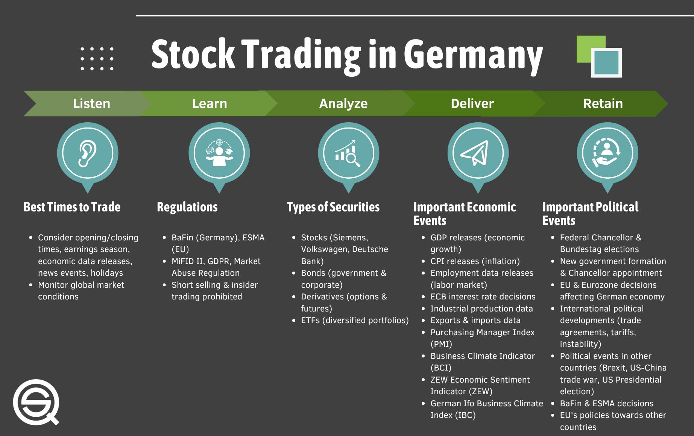

Day trading in Germany has seen significant growth, particularly with the advent of algorithmic trading, a process that utilizes computer-generated algorithms for placing trades at optimal times. These algorithms analyze multiple market variables at unprecedented speeds to identify lucrative trading opportunities, thus enhancing the efficiency and effectiveness of day trading operations.

Germany's economic strength provides a fertile environment for day traders. With its position as the largest economy in Europe, Germany offers a wide array of financial instruments that can be traded, ranging from major indices like the DAX 40 to shares of globally influential corporations headquartered in the country. This economic resilience and diversity contribute to the high volatility and liquidity of the markets, which are crucial for the success of day trading activities.

Central to Germany's trading infrastructure are the Frankfurt Stock Exchange and the Xetra electronic trading system. The Frankfurt Stock Exchange is one of the world's largest trading platforms and plays a pivotal role in the global financial ecosystem. Meanwhile, Xetra, renowned for its state-of-the-art technology, facilitates seamless electronic trading, offering traders immediate execution of trades with high liquidity. This integration of advanced technology and robust infrastructure provides German day traders with the tools necessary to stay competitive in fast-paced markets.

Through this article, a detailed exploration of day trading in Germany will be provided, with a particular focus on the evolving role and substantial impact of algorithmic trading. As this facet of trading continues to advance, understanding its implications is essential for traders aiming to leverage the full potential of Germany's dynamic markets.

## Table of Contents

## What is Day Trading?

Day trading refers to the practice of buying and selling financial instruments such as stocks, options, or futures within the same trading day, with the intent of profiting from short-term price movements. This form of trading is characterized by its fast-paced nature and reliance on real-time data analysis to make quick decisions. Traders typically utilize charts, technical indicators, and algorithms to determine entry and exit points.

In Germany, day trading presents lucrative opportunities, largely due to the significant volatility and liquidity in its financial markets. The DAX 40 index, comprising the largest publicly traded companies listed on the Frankfurt Stock Exchange, is especially appealing to day traders due to its active trading sessions and substantial price fluctuations. Moreover, Germany's trading infrastructure, particularly the Xetra electronic trading platform, ensures high-speed trade execution and availability of market data, which are critical components for successful day trading.

Success in [day trading](/wiki/day-trading-spy) requires not only capital and access to trading platforms but also a well-developed strategy and profound understanding of market dynamics. Traders must analyze market trends, economic indicators, and geopolitical events that can influence market behavior. A typical day trading strategy could involve technical analysis techniques, such as moving averages or the Relative Strength Index (RSI), to identify potential buy or sell signals.

An effective day trader in the German market needs to adapt quickly to changing conditions, utilize stop-loss orders to mitigate risks, and employ sound money management practices to preserve trading capital. Continuous education and adjustments to trading strategies are vital as market conditions evolve, helping traders to maintain a competitive edge.

## Algorithmic Trading and Its Role

Algorithmic trading, commonly known as algo trading, involves leveraging computer algorithms to automatically execute trading orders based on predefined criteria. These criteria encompass quantitative parameters such as timing, price, and [volume](/wiki/volume-trading-strategy) that align with strategic financial models. The adoption of [algorithmic trading](/wiki/algorithmic-trading) in Germany has accelerated due to its renowned efficiency and speed in executing trades, which are crucial in capitalizing on minute market fluctuations that are often imperceptible to human traders.

In Germany, algo trading is particularly valued for its ability to utilize complex mathematical models. These models often involve statistical [arbitrage](/wiki/arbitrage), where algorithms identify and exploit price discrepancies across markets or securities. For instance, an algorithm might be designed to execute a trade when a stock in Germany's DAX 40 index deviates from its historical correlation with another asset, potentially delivering profits as prices revert to their mean.

Institutional investors, including large banks, hedge funds, and investment firms, have increasingly integrated algorithmic strategies into their trading operations. This trend is driven by the desire to maximize efficiency and minimize human error. Many of these institutions use algorithms not just for high-frequency trading but also for managing extensive portfolios and facilitating trades that need execution at optimal times or prices.

The speed of algorithmic trading is particularly beneficial in a market characterized by high [liquidity](/wiki/liquidity-risk-premium) and trading volume, such as the Frankfurt Stock Exchange. Algorithms can process vast amounts of data and execute thousands of trades per second, significantly enhancing the trading volumes and liquidity. This capability allows institutions to manage large orders with minimal market impact, a critical [factor](/wiki/factor-investing) for maintaining advantageous pricing.

Algorithmic trading also supports diverse strategies, including market-making, where algorithms constantly quote buy and sell prices, ensuring sufficient liquidity in the market. Moreover, the adaptability of algorithms means they can be tweaked or reprogrammed to adjust to changing market conditions, offering a dynamic approach to trading that static human-led strategies cannot match.

As algorithmic trading continues to evolve, its role in Germany's financial markets is poised to grow, driven by advancements in technology and increasing market complexity. The adoption of [machine learning](/wiki/machine-learning) and [artificial intelligence](/wiki/ai-artificial-intelligence) in developing more sophisticated algorithms promises not only to enhance trading strategies but also to push the boundaries of market analysis and execution.

## Benefits of Day Trading in Germany

Germany's stable political landscape, coupled with a resilient economy, creates a conducive environment for day traders. This stability ensures that the market operates with minimal disruptions due to political uncertainties, providing an added layer of security for traders whose strategies rely on consistent market conditions. Additionally, the German economy is one of the largest in Europe, positioning it as a significant player in global markets. This prominence offers an extensive range of trading opportunities and enables access to substantial market liquidity, which is crucial for executing trades efficiently.

The German market is characterized by its size and diversity, presenting ample prospects for day traders. The Frankfurt Stock Exchange is the largest stock exchange in Germany and among the top ten in the world. It supports the Xetra trading system, which is renowned for its efficiency and responsible for facilitating a large volume of trades daily. The liquidity available in these markets allows day traders to enter and [exit](/wiki/exit-strategy) positions swiftly without noticeably impacting the stock prices, a key factor for those engaged in high-frequency trading.

Germany's regulatory environment is also conducive to day trading. The country has established trader-friendly regulations designed to protect investors while promoting healthy market activities. For instance, the Federal Financial Supervisory Authority (BaFin) implements regulations that ensure transparency and fairness in trading activities. Furthermore, Germany's adherence to the Markets in Financial Instruments Directive II (MiFID II) provides a harmonized regulatory framework across the European Union, ensuring that German markets maintain a level playing field with other European exchanges.

Investors in the German market gain access to some of Europe's largest and most influential companies. The DAX 40, Germany's premier stock market index, includes blue-chip companies that are pivotal to both the German and global economy. Companies like Volkswagen, Siemens, and Bayer not only add weight to the index but also present day traders with opportunities to trade on highly liquid stocks that are less prone to [volatility](/wiki/volatility-trading-strategies) spikes, thus aligning with various day trading strategies.

In summary, the stable economic and political framework of Germany, paired with a large and regulated market infrastructure, offers compelling benefits for day traders. These factors enable traders to implement strategies effectively in a secure environment while capitalizing on opportunities provided by some of the largest companies in Europe.

## Risks Involved in Day Trading

Day trading in Germany, like in other markets, presents numerous risks that traders must navigate to achieve profitability and maintain capital. A major risk inherent in day trading is market volatility. Price fluctuations in stocks and indices such as the DAX 40 can generate significant opportunities for profit, but they also pose the threat of rapid loss. Volatility can be influenced by economic indicators, company news, or geopolitical events, making prediction challenging and necessitating a robust market analysis.

Liquidity issues are another significant risk. While the Frankfurt Stock Exchange and the Xetra trading platform offer high liquidity for many assets, there are times when liquidity might decrease, leading to difficulties in entering or exiting positions at desired prices. This can result in slippage, where a trade is executed at a less favorable price than expected, potentially compounding losses.

Financial losses are inherent to day trading. This risk is amplified when using leverage, a common practice among traders looking to amplify returns. However, leverage also magnifies losses, and if not carefully managed, it can result in substantial financial drawdowns. Traders must be aware of their own risk tolerance and set appropriate leverage levels accordingly.

Regulatory and counterparty risks are also critical considerations. The Federal Financial Supervisory Authority (BaFin) regulates day trading activities to mitigate excessive risk-taking, particularly in leveraged positions. Compliance with these regulations is essential to avoid penalties and ensure market integrity. Counterparty risk, the possibility that the other party in a transaction may default, is a concern particularly in over-the-counter (OTC) markets, although it is somewhat mitigated in regulated exchanges.

To effectively manage these risks, traders should employ risk management strategies such as stop-loss orders and proper position sizing. A stop-loss order automatically sells a security when it reaches a certain price, thus limiting potential losses. Proper position sizing involves allocating a certain percentage of capital to each trade, managing exposure, and minimizing the impact of any single loss on the overall portfolio.

Implementing these strategies requires a disciplined approach and constant monitoring of market conditions. By adhering to risk management protocols, day traders in Germany can better navigate the volatile landscape and work towards sustainable trading practices.

## Popular Day Trading Strategies in Germany

Day trading in Germany involves a variety of strategies that cater to different market conditions and trader preferences. Among the most popular strategies are [scalping](/wiki/gamma-scalping), news-based trading, [trend following](/wiki/trend-following), and mean reversion. 

Scalping is a high-frequency trading strategy that focuses on making small profits from numerous trades executed over short time frames. Traders using this strategy aim to exploit bid-ask spreads and price gaps. Scalping benefits significantly from algorithmic trading, as algorithms can execute trades with speed and precision far beyond human capabilities.

News-based trading capitalizes on market movements triggered by news events such as economic reports, corporate announcements, or geopolitical developments. The German market, with its major indices and large multinational corporations, often reacts to both domestic and international news. Algorithmic trading strategies can enhance news-based trading by swiftly analyzing real-time news feeds and executing trades based on predefined criteria.

Trend following is a strategy that seeks to capitalize on long-term market movements, where traders enter positions aligned with the current trend. This strategy relies on technical analysis indicators like moving averages or the Relative Strength Index (RSI) to identify potential trends. Algorithmic trading systems can automate the process of monitoring these indicators, making timely adjustments to positions as trends emerge or dissipate.

Mean reversion strategy assumes that prices will eventually return to their historical averages. Traders using this approach identify overbought or oversold conditions through indicators such as Bollinger Bands or the RSI. Algorithms can help by continuously scanning the market for deviations from typical price ranges and executing trades when these deviations occur.

Algorithmic trading not only facilitates the execution of these strategies but also enhances their efficiency by allowing traders to backtest their strategies on historical data. This process ensures that strategies can be evaluated and optimized before being deployed in real-time trading. Additionally, the ability of algorithms to respond rapidly to market changes is crucial for the success of these strategies, as market conditions can shift unexpectedly.

In conclusion, the agility and speed offered by algorithmic trading significantly enhance traditional day trading strategies in Germany. Traders are able to implement robust strategies that can quickly adapt to market dynamics, thereby increasing the likelihood of success in the fast-paced world of day trading.

## Rules and Regulations for Day Trading

The regulatory framework for day trading in Germany is characterized by a robust oversight mechanism to ensure market stability and protect investors. The Federal Financial Supervisory Authority (BaFin) plays a pivotal role in this system as the principal regulator of financial activities, including day trading. BaFin's regulations aim to mitigate risks inherent in the financial markets, with specific guidelines applicable to day traders.

A fundamental aspect of these regulations includes limits on leverage. Leverage allows traders to control a larger position with a smaller amount of capital, potentially amplifying profits. However, it equally increases the risk of substantial losses, especially in volatile markets. To safeguard against these risks, BaFin imposes leverage limits. This regulatory measure helps maintain financial stability and protects traders from experiencing excessive losses that could arise from highly leveraged positions.

In addition to BaFin's national regulations, European-wide directives such as the Markets in Financial Instruments Directive II (MiFID II) also significantly influence trading practices in Germany. MiFID II, implemented in January 2018, enhances transparency across the European Union's financial markets. It establishes comprehensive standards for market participants and offers additional protection for investors. Compliance with MiFID II is essential for day traders, as it ensures they adhere to best execution practices, thereby enhancing their market participation experience.

Key components under MiFID II include enhanced reporting obligations, which mandate more detailed transaction reporting to improve market surveillance and transparency. Furthermore, MiFID II introduces stricter rules for algorithmic trading, a practice commonly used in day trading. These rules include requirements for testing algorithms to prevent market disruptions and the obligation to have effective risk controls and business continuity arrangements.

Understanding and adhering to these regulations is paramount for anyone engaging in day trading in Germany. Knowledge of the regulatory environment not only aids in legal compliance but also enhances the effectiveness and sustainability of trading operations in this dynamic market. By aligning trading strategies with regulatory requirements, traders can better manage risk and exploit the opportunities presented by the German financial markets.

## Conclusion

Day trading in Germany presents significant opportunities, especially when supported by algorithmic trading. Algo trading's precision and speed allow traders to capitalize on market movements and enhance their trading performance. However, it is crucial for traders to practice prudent risk management strategies. This includes setting stop-loss orders, utilizing proper position sizing, and diversifying portfolios to mitigate potential financial losses.

Adhering to regulations is another essential aspect of successful day trading. In Germany, the Federal Financial Supervisory Authority (BaFin) oversees trading activities to ensure market stability and participant protection. Compliance with regulations such as the Markets in Financial Instruments Directive II (MiFID II) not only enhances protection against major losses but also facilitates smoother market participation.

As technology continues to evolve, algorithmic trading is set to become an even more integral component of Germany's trading landscape. Developments in machine learning and artificial intelligence may further refine algorithmic strategies, making them more adaptable to changing market conditions. This technological advancement positions Germany as a promising domain for traders looking to leverage both traditional and innovative trading methods.

## References & Further Reading

[1]: Bergstra, J., Bardenet, R., Bengio, Y., & Kégl, B. (2011). ["Algorithms for Hyper-Parameter Optimization."](https://papers.nips.cc/paper/4443-algorithms-for-hyper-parameter-optimization) Advances in Neural Information Processing Systems 24.

[2]: ["Advances in Financial Machine Learning"](https://www.amazon.com/Advances-Financial-Machine-Learning-Marcos/dp/1119482089) by Marcos Lopez de Prado

[3]: ["Evidence-Based Technical Analysis: Applying the Scientific Method and Statistical Inference to Trading Signals"](https://www.amazon.com/Evidence-Based-Technical-Analysis-Scientific-Statistical/dp/0470008741) by David Aronson

[4]: ["Machine Learning for Algorithmic Trading"](https://github.com/PacktPublishing/Machine-Learning-for-Algorithmic-Trading-Second-Edition) by Stefan Jansen

[5]: ["Quantitative Trading: How to Build Your Own Algorithmic Trading Business"](https://books.google.com/books/about/Quantitative_Trading.html?id=j70yEAAAQBAJ) by Ernest P. Chan