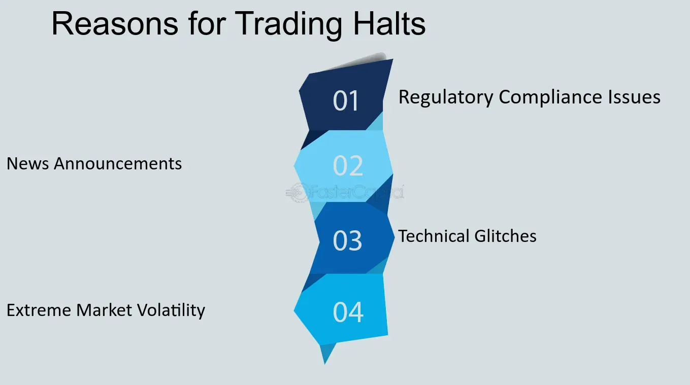

## Table of Contents

## What is a trading halt?

A trading halt is when a stock exchange stops trading a certain stock for a while. This can happen for different reasons, like if there is big news about the company or if the stock price is moving too much too fast. The halt gives everyone time to learn about the news and think about what it means for the stock.

Trading halts help keep the market fair and orderly. They stop people from making quick decisions without all the information. Once the halt is over, trading starts again, and people can buy and sell the stock with a better understanding of its value.

## Why do trading halts occur?

Trading halts happen for a few main reasons. One big reason is when there's important news about a company that could change how people see its stock. This news could be about earnings, mergers, or other big changes. When this happens, the stock exchange might stop trading to give everyone time to read and understand the news. This way, no one makes quick decisions without knowing all the facts.

Another reason for a trading halt is when a stock's price starts moving a lot very quickly. This can happen if there's a lot of buying or selling all of a sudden. The exchange might pause trading to calm things down and make sure the price isn't being pushed around unfairly. This helps keep the market stable and fair for everyone.

Sometimes, trading halts are also used to fix technical problems or to make sure all the information about a stock is correct. If there's a glitch in the trading system or if there's a need to correct some data, a halt can help prevent mistakes and keep the market running smoothly.

## Who has the authority to initiate a trading halt?

The stock exchange itself has the power to start a trading halt. They do this to keep the market fair and safe for everyone. If there's big news about a company or if the stock price is moving too fast, the exchange might decide to pause trading. This gives everyone time to learn about the news and think about what it means for the stock.

Sometimes, the company whose stock is being traded can also ask for a trading halt. They might do this if they are about to share important news and want to make sure everyone hears it at the same time. This helps stop some people from trading with information that others don't have yet.

## How long does a trading halt typically last?

A trading halt usually doesn't last very long. It can be anywhere from a few minutes to an hour, but it depends on why the halt happened. If it's because of big news about a company, the halt might last until everyone has had time to read and understand the news. This way, no one makes quick decisions without knowing all the facts.

If the halt is because the stock price is moving too fast, it might be shorter. The exchange might pause trading just long enough to calm things down and make sure the price isn't being pushed around unfairly. Once the reason for the halt is fixed, trading starts again, and people can buy and sell the stock with a better understanding of its value.

## What are the different types of trading halts?

There are a few different types of trading halts. One type is called a "news pending" halt. This happens when a company is about to share big news, like earnings or a merger. The stock exchange stops trading so everyone can learn about the news at the same time. This keeps things fair and stops some people from trading with information others don't have yet.

Another type is a "volatility halt." This happens when a stock's price starts moving a lot very quickly. The exchange might pause trading to calm things down and make sure the price isn't being pushed around unfairly. This helps keep the market stable and fair for everyone.

Sometimes, there are also "regulatory halts." These happen if there's a problem with the trading system or if the exchange needs to fix some data. A regulatory halt helps prevent mistakes and keeps the market running smoothly.

## Can trading halts affect the overall market?

Trading halts can affect the overall market, but usually, the impact is small and short-lived. When a big company's stock is halted, it might make people feel unsure about the market. They might start to worry about what the news means for other stocks too. But since trading halts are usually short, the market often goes back to normal quickly once trading starts again.

Sometimes, if a lot of stocks are halted at the same time, it can cause bigger problems. This might happen if there's a big event that affects many companies, like a natural disaster or a major economic change. In these cases, the market might be more affected because people are unsure about a lot of things at once. But even then, the stock exchange works to get trading going again as soon as possible to keep things running smoothly.

## What are the common reasons for a company-specific trading halt?

A company-specific trading halt usually happens when there's big news about the company. This news could be about their earnings, a merger, or some other important change. The stock exchange stops trading so everyone can learn about the news at the same time. This keeps things fair and stops some people from trading with information others don't have yet.

Another reason for a company-specific trading halt is if the stock's price starts moving a lot very quickly. The exchange might pause trading to calm things down and make sure the price isn't being pushed around unfairly. This helps keep the market stable and fair for everyone. Once the reason for the halt is fixed, trading starts again, and people can buy and sell the stock with a better understanding of its value.

## How do trading halts impact investors and traders?

Trading halts can be a bit frustrating for investors and traders because they can't buy or sell the stock during the halt. If someone was planning to make a trade based on new information, they have to wait until the halt is over. This can be annoying, especially if the stock price might change a lot because of the news. But, the halt is there to make sure everyone has the same information before trading starts again, which helps keep things fair.

On the other hand, trading halts can also protect investors and traders. If a stock's price is moving too fast, a halt can stop people from making quick decisions they might regret later. It gives everyone a chance to think about the new information and decide what to do next. This can help prevent big losses and keep the market stable. So, while trading halts might be a short-term hassle, they can be good for the market in the long run.

## What are the regulatory frameworks governing trading halts?

Trading halts are managed by rules set by stock exchanges and financial regulators. In the United States, the Securities and Exchange Commission (SEC) works with stock exchanges like the New York Stock Exchange (NYSE) and NASDAQ to make sure trading halts are used fairly. The rules say when a trading halt can happen, like when there's big news about a company or if the stock price is moving too fast. The goal is to keep the market fair and safe for everyone.

Different countries have their own rules about trading halts. In the UK, the Financial Conduct Authority (FCA) oversees trading halts on the London Stock Exchange. In Australia, the Australian Securities and Investments Commission (ASIC) works with the Australian Securities Exchange (ASX). These rules make sure that trading halts are used the right way and help keep the market running smoothly. Even though the details might be different in each country, the main idea is the same: to protect investors and keep the market fair.

## How do exchanges communicate trading halts to the public?

When a trading halt happens, stock exchanges make sure everyone knows about it quickly. They use their websites and special news services to tell people that trading has stopped for a certain stock. This way, investors and traders can see the halt right away and know they can't buy or sell that stock until the halt is over.

The exchanges also explain why the trading halt happened. They might say it's because of big news about the company or because the stock price was moving too fast. This helps people understand what's going on and why they need to wait before trading again. Once the halt is over, the exchange will let everyone know that trading has started again, so people can make their trades with all the new information.

## What are the mechanisms used to resume trading after a halt?

When a trading halt is over, the stock exchange makes sure everyone knows that trading can start again. They use their website and special news services to tell people that the halt is finished. This way, investors and traders can see that they can now buy and sell the stock again. The exchange also makes sure that the reason for the halt, like big news or a fast-moving price, has been sorted out so that trading can happen fairly.

Once the halt is lifted, trading usually starts again at the next scheduled time. This could be right away if it's during normal trading hours, or it might be at the start of the next trading day if the halt happened near the end of a session. The exchange works to make sure everything is ready so that trading can go smoothly and everyone has the same information before they start buying and selling again.

## How do trading halts differ across various global financial markets?

Trading halts can be different in various global financial markets because each country has its own rules and ways of doing things. In the United States, the Securities and Exchange Commission (SEC) works with stock exchanges like the New York Stock Exchange (NYSE) and NASDAQ to decide when a trading halt should happen. They might stop trading if there's big news about a company or if the stock price is moving too fast. The goal is to keep the market fair and safe for everyone. In the UK, the Financial Conduct Authority (FCA) oversees trading halts on the London Stock Exchange, and they have their own set of rules to make sure trading halts are used the right way.

In Australia, the Australian Securities and Investments Commission (ASIC) works with the Australian Securities Exchange (ASX) to manage trading halts. They might pause trading for reasons similar to those in the US and UK, but the details of how and when they do it can be different. For example, the length of a trading halt might vary from one country to another, and the way they communicate the halt to the public can also be different. Even though the basic idea of a trading halt is the same everywhere—to protect investors and keep the market fair—the specific rules and practices can change from one market to another.

## References & Further Reading

[1]: [SEC's Trading Suspension Information](https://www.sec.gov/enforcement-litigation/trading-suspensions)

[2]: Zheng, Z., Moulton, L. T., & Sougiannis, T. (2012). ["The Market Reaction to Trading Halts."](https://link.springer.com/article/10.1023/A:1020269801226) Journal of Business Research.

[3]: Kirilenko, A., Kyle, A. S., Samadi, M., & Tuzun, T. (2017). ["The Flash Crash: High-Frequency Trading in an Electronic Market."](https://onlinelibrary.wiley.com/doi/abs/10.1111/jofi.12498) The Review of Economic Studies.

[4]: Aldridge, I. (2013). [High-Frequency Trading: A Practical Guide to Algorithmic Strategies and Trading Systems](https://www.amazon.com/High-Frequency-Trading-Practical-Algorithmic-Strategies/dp/1118343506). Wiley.

[5]: Hendershott, T., & Moulton, P. C. (2011). ["Automation, Speed, and Stock Market Quality: The NYSE's Hybrid."](https://www.sciencedirect.com/science/article/pii/S138641811100005X) Journal of Financial Markets.