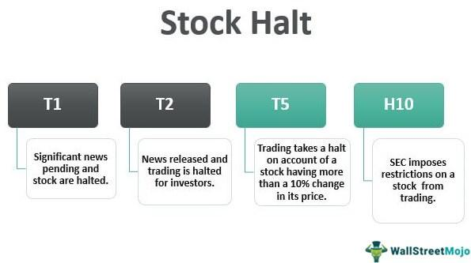

Trading suspensions and halts are essential tools in maintaining the stability and integrity of the stock market. They are mechanisms designed to protect investors and preserve market order by temporarily pausing trading activities under specific circumstances. These circumstances can include regulatory concerns where compliance issues arise, large and potentially destabilizing price movements, or the need for disseminating crucial information to market participants.

In an increasingly digital era, the rapid evolution of algorithmic trading has highlighted the significance of these trading pauses. With algorithmic trading relying heavily on speed, efficiency, and real-time data, any interruptions in trading can have meaningful impacts. These mechanisms serve as a necessary check to prevent disorderly trading and to ensure that all market participants have the opportunity to react to new information equitably.



This article will discuss the various types of trading suspensions and halts, explore the factors that trigger them, and consider their implications for traders and the broader market. Understanding these pauses is increasingly important as algorithmic trading continues to grow in prominence, ensuring markets remain fair, orderly, and transparent.

## Table of Contents

## What is a Trading Halt?

A trading halt is an interruption of trading activity for a specific security. This interruption is temporary and occurs across multiple exchanges where the security is traded. Trading halts are implemented for several reasons, one of which is pending news announcements that could significantly affect the security's price. For example, if a company has an announcement that could lead to substantial market activity, such as a merger or an earnings report, trading may be halted to allow investors time to absorb the information and make informed decisions. 

Another cause for a trading halt is order imbalances, where the [volume](/wiki/volume-trading-strategy) of buy and sell orders are disproportionately skewed. This can lead to price volatility, as the imbalance may cause sharp movements in a security's price. By halting trading, the market is provided with a brief period to recalibrate, allowing for a more orderly and fair trading environment. 

Significant price volatility is also a common reason for initiating a trading halt. Sudden, large fluctuations in a security's price can occur due to various factors, including macroeconomic news or unexpected corporate developments. Trading halts allow market participants to pause and digest the new information, reducing the probability of rash trading decisions that could exacerbate volatility.

Regulatory bodies, such as the U.S. Securities and Exchange Commission (SEC), possess the authority to enforce trading halts. These organizations ensure that the halts serve their primary purpose: maintaining a fair and orderly market. Through these mechanisms, traders are granted crucial time to process new information, ultimately fostering a more transparent and reliable trading environment.

## Types of Trading Halts

Trading halts can be categorized into three main types, which include regulatory halts, non-regulatory halts, and market-wide circuit breaker halts. Each type of halt serves a distinct purpose and is applied under different circumstances to maintain order and stability in the financial markets.

**Regulatory Halts**: These halts are initiated when there are concerns regarding a security's adherence to listing standards, set by regulatory bodies such as the Securities and Exchange Commission (SEC). Instances triggering regulatory halts include discrepancies in a company's public filings, violations of regulatory requirements, or when new material information is about to be disclosed that could significantly impact the security's price. By pausing trading, exchanges ensure that all market participants have access to essential information simultaneously, thereby promoting fairness.

**Non-Regulatory Halts**: While regulatory halts focus on compliance issues, non-regulatory halts typically address technical and operational market conditions. These halts are often implemented in response to significant imbalances between buy and sell orders that could lead to extreme volatility. The halt provides an opportunity for order liquidity to stabilize, allowing the market to resume trading under more orderly conditions. This intervention helps prevent abrupt swings in a security's price and protects investors from unforeseen risks.

**Market-Wide Circuit Breaker Halts**: These halts are designed to curtail panic selling during periods of significant market downturns. Circuit breakers are triggered when major stock indices, such as the S&P 500, experience a sharp decline in value, measured as a percentage drop within a single trading session. The objective of circuit-breaker halts is to provide a cooling-off period, allowing traders to assess market conditions before resuming their activities. The thresholds for these halts are predefined, ensuring that the suspension is systematic and automatic during market stress. The introduction of circuit breakers followed the market crash of 1987, with the purpose of instilling confidence and reducing volatility during turbulent times.

## Difference Between Trading Halts and Suspensions

Trading halts and suspensions are regulatory mechanisms with distinct characteristics used to maintain market integrity. A trading halt temporarily stops trading for a specific security, allowing time for dissemination and digestion of significant information, such as corporate announcements or major order imbalances. These interruptions are generally short-term and can occur across multiple exchanges simultaneously.

In contrast, trading suspensions are more prolonged, lasting up to 10 days or more, as decided by the U.S. Securities and Exchange Commission (SEC). Suspensions are typically enforced when there are significant compliance issues with a publicly traded company. Common reasons for suspensions include delinquent financial filings, potential fraud, or questionable business practices, where the SEC has concerns about the adequacy and accuracy of public information concerning the security.

The key difference between halts and suspensions lies in their duration and underlying causes. Halts are implemented quickly in response to anticipated immediate market disruptions, frequently due to information dissemination or [volatility](/wiki/volatility-trading-strategies) management. On the other hand, suspensions address broader compliance-related issues that potentially threaten market transparency and investor protection.

Both trading halts and suspensions serve to protect investors by ensuring fair and orderly market conditions. However, they are applied under different circumstances and for varying durations, reflecting the nature and severity of the issues at hand.

## The Impact of Trading Halts on Algorithmic Trading

Algorithmic trading leverages the speed and efficiency of computers to execute trades that are typically beyond the capability of manual trading. However, trading halts—temporary stoppages that pause trading for certain securities—can present significant challenges to these automated systems. These interruptions require algorithms to be robustly programmed to handle unexpected pauses and to adjust trading strategies dynamically.

When a trading halt occurs, algorithms must quickly recognize and respond to these changes to prevent making erroneous trades when the market resumes. This necessitates sophisticated programming in the algorithms to detect halt signals promptly. In Python, for instance, developers might incorporate event-driven architecture that listens for specific messages indicating a trading halt. When detected, the system can pause trading activities, estimate potential impacts, and adjust parameters, ensuring the stability of trading operations upon resumption. Here's a simple example:

```python
def watch_for_halt(exchange_data):
    # Simulate receiving real-time data from an exchange
    if exchange_data.get('halt_status') == 'halted':
        handle_halt()

def handle_halt():
    print("Trading halted. Adjusting trading strategy...")
    # Additional logic to recalibrate models or adjust trading strategy

# Simulate exchange data
exchange_data = {'halt_status': 'halted'}
watch_for_halt(exchange_data)
```

Moreover, trading halts can offer unique opportunities for algorithmic traders. These breaks allow investors to recalibrate their models in light of new information that often emerges during a halt. Traders are afforded time to analyze the circumstances surrounding the halt, such as news events or regulatory announcements, which may yield vital insights. By incorporating this new data, algorithmic models can be refined to better predict market reactions post-halt. This process not only enhances the algorithm's accuracy but also its resilience against future disruptions.

Algorithmic traders also benefit from using historical data analysis during halts to anticipate price movements and develop strategies for different scenarios when trading resumes. Advanced [machine learning](/wiki/machine-learning) models can be employed to simulate various market conditions and predict outcomes for use when normal trading activity continues.

Despite the challenges posed by trading halts, they ultimately provide a structured pause that can safeguard against hasty decisions and market instability. Algorithmic trading systems, when properly designed, can use these halts to gain a competitive edge by recalibrating strategies and preparing for post-halt market dynamics.

## Conclusion

Trading halts and suspensions are essential tools for safeguarding the stability and integrity of financial markets. By temporarily pausing trading activities, these mechanisms provide the opportunity for investors to assess important information and adjust their strategies accordingly. Such measures not only help to prevent erratic price movements but also protect investors from potential adverse effects caused by market anomalies.

With the continued expansion of [algorithmic trading](/wiki/algorithmic-trading), understanding the nuances of trading halts and suspensions becomes increasingly critical for market participants. Algorithmic traders, who rely heavily on speed and automated decision-making, must account for these market mechanisms in their strategies to avoid unintended consequences. By integrating logic to recognize and respond to trading halts, algorithms can better adapt to abrupt changes and mitigate risks associated with halted trading activity.

While trading halts may momentarily disrupt trading workflows, they ultimately promote a more equitable and transparent market environment. They ensure that all participants operate on a level playing field, having access to the same information at the same time. This aligns with the broader objective of market fairness, which is central to the health and functionality of the financial ecosystem.

In conclusion, trading halts and suspensions are indispensable elements within the financial markets that safeguard investors and uphold market integrity. As trading systems grow increasingly sophisticated through technological advancements, particularly in algorithmic trading, the importance of these regulatory mechanisms will continue to be paramount.

## References & Further Reading

[1]: [SEC's Trading Suspension Information](https://www.sec.gov/enforcement-litigation/trading-suspensions)

[2]: Zheng, Z., Moulton, L. T., & Sougiannis, T. (2012). ["The Market Reaction to Trading Halts."](https://link.springer.com/article/10.1023/A:1020269801226) Journal of Business Research.

[3]: Kirilenko, A., Kyle, A. S., Samadi, M., & Tuzun, T. (2017). ["The Flash Crash: High-Frequency Trading in an Electronic Market."](https://onlinelibrary.wiley.com/doi/abs/10.1111/jofi.12498) The Review of Economic Studies.

[4]: Aldridge, I. (2013). [High-Frequency Trading: A Practical Guide to Algorithmic Strategies and Trading Systems](https://www.amazon.com/High-Frequency-Trading-Practical-Algorithmic-Strategies/dp/1118343506). Wiley.

[5]: Hendershott, T., & Moulton, P. C. (2011). ["Automation, Speed, and Stock Market Quality: The NYSE's Hybrid."](https://www.sciencedirect.com/science/article/pii/S138641811100005X) Journal of Financial Markets.