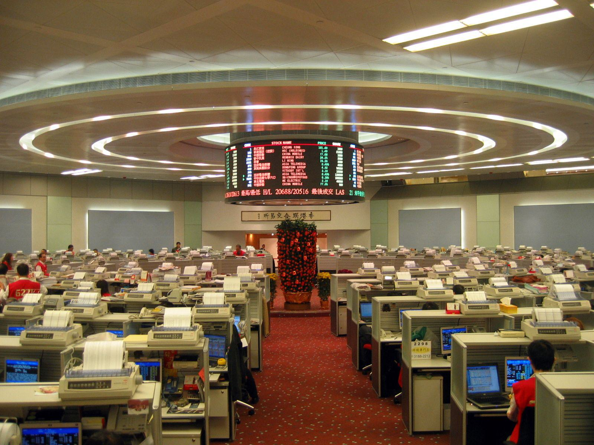

The Hong Kong Stock Exchange (HKEX) is one of the largest and most influential financial markets globally, playing a pivotal role in the international exchange of capital. With its strategic location and status as a gateway to China, HKEX serves as a vital hub for connecting Asian economies with investors across the globe. Its diverse offerings, including stocks, derivatives, and commodities, attract a wide range of participants, from individual investors to multinational corporations.

Stock trading and investment in HKEX are popular due to the exchange's robust infrastructure and regulatory environment. Investors engage in various trading strategies, from short-term day trading to long-term value investing, leveraging the exchange's dynamic market environment to achieve their financial goals. The appeal of HKEX is heightened by its ability to offer both local and global investors access to some of Asia's most prominent companies, particularly Chinese firms, which are increasingly seeking international capital.

Algorithmic trading, or algo trading, has emerged as a transformative force in stock exchanges worldwide, including HKEX. This form of trading uses complex algorithms to execute orders at speeds and frequencies that are beyond human capacity. The rise of algo trading is attributed to advancements in technology and the increased availability of data, enabling traders to capitalize on market inefficiencies with precision and speed. Algorithmic trading reduces transaction costs and minimizes human errors, making it an attractive option for both institutional and retail investors.

The purpose of this article is to explore the convergence of stock trading, investment, and algorithmic trading within the Hong Kong market. With its cutting-edge technology and regulatory advancements, HKEX offers fertile ground for the growth of algorithmic trading. This method is gaining traction among investors and traders in Hong Kong due to its potential to provide a competitive edge in a fluid and fast-paced market environment. As HKEX continues to evolve, understanding the role of algo trading will be crucial for investors seeking to navigate and capitalize on opportunities in this significant financial market.

## Table of Contents

## Understanding the Hong Kong Stock Exchange

The Hong Kong Stock Exchange (HKEX) has a rich history and has established itself as a pivotal platform in the global financial market. Officially established in 1891, HKEX has evolved through numerous phases, adapting to changes in both local and international economic landscapes. Initially founded as the Association of Stockbrokers in Hong Kong, it went through a series of mergers, the most significant being in 1947 when it became the Hong Kong Stock Exchange. This evolution has been pivotal in facilitating economic growth and financial restructuring in the region.

As of today, HKEX is known for its diverse range of offerings, serving as a critical hub for global investors interested in Asian markets. It provides a variety of securities, including equities, derivatives, fixed income, and currency products. Notably, HKEX has facilitated cross-border trade via initiatives like Stock Connect, which links it with mainland China's Shanghai and Shenzhen Stock Exchanges. This has significantly increased global investors' access to Chinese A-shares, while simultaneously providing Chinese investors access to Hong Kong's market.

The Exchange operates under a well-defined regulatory framework aimed at ensuring market integrity and investor protection. Under the oversight of the Securities and Futures Commission (SFC) of Hong Kong, HKEX adheres to stringent regulations designed to maintain a fair and orderly marketplace. These regulations include measures for listing eligibility, disclosure obligations, and trading practices aimed at protecting investors. Furthermore, the Investor Compensation Fund provides an additional layer of protection, ensuring that investors are adequately safeguarded against any potential market disruptions or defaults.

HKEX also acts as a gateway bridging the Asian market with global investors. Located strategically in the financial center of Hong Kong, it benefits from a robust legal system, a conducive international business environment, and a multicultural workforce, all of which contribute to its role as a global financial hub. The Exchange's ability to connect diverse markets is crucial, given the significant international interest in Asian economies and the trend towards market globalization.

In conclusion, the Hong Kong Stock Exchange's historical foundation, key features, role in connecting markets, and robust regulatory framework position it as a central player in global finance, attracting investors and traders worldwide.

## Basics of Stock Trading and Investment

Stock trading involves buying and selling securities with the aim of making a profit from price fluctuations. It can take various forms, with each catering to a different trading style and risk appetite. Day trading, for instance, involves buying and selling stocks within the same trading day, capitalizing on small price movements. Swing trading, on the other hand, focuses on capturing price trends over several days to weeks. These strategies demand an acute understanding of market signals and a high level of risk tolerance.

Investment strategies in stock markets are varied, ranging from growth investing, where investors focus on companies expected to grow at an above-average rate, to value investing, which involves [picking](/wiki/asset-class-picking) stocks that appear undervalued. Another strategy is income investing, aimed at creating a steady income stream through dividends. Diversification, asset allocation, and risk management form the core tenets of successful investment strategies, allowing investors to optimize returns while mitigating risks.

Several factors influence stock market prices and subsequent trading decisions. Economic indicators such as GDP growth rates, employment data, and inflation can affect investor sentiment and stock valuations. Company-specific news, including earnings reports, product launches, and changes in management, also play significant roles. Additionally, global events, political stability, and changes in regulations can lead to fluctuations in stock prices.

The Hong Kong market presents unique challenges and opportunities for stock trading. As a hub for Chinese companies listing overseas, it offers a gateway for international investors to access China’s burgeoning economy. However, this also means that geopolitical tensions and regulations specific to China can pose risks. The market's high [liquidity](/wiki/liquidity-risk-premium) and [volatility](/wiki/volatility-trading-strategies) can provide numerous trading opportunities, but they require traders to manage risk effectively. Furthermore, the time zone advantage allows traders to act on information from Western markets before the Asian trading day begins.

Overall, understanding different trading forms, investment strategies, and market dynamics is crucial for navigating the stock trading landscape, particularly in a complex market like Hong Kong.

## The Rise of Algorithmic Trading

Algorithmic trading, also known as algo trading, refers to the use of computer programs and systems to execute trades in financial markets based on pre-defined criteria. This automated process leverages mathematical models and algorithms to analyze data and make trading decisions at speeds and frequencies that are impossible for humans. Typically, algorithms are designed to identify trends, execute trades, and manage portfolios automatically, minimizing the need for human intervention.

One of the primary advantages of [algorithmic trading](/wiki/algorithmic-trading) over traditional manual trading methods is the significant increase in speed and efficiency. Algorithms can process large volumes of data and execute trades within milliseconds, capitalizing on market opportunities that may only exist for brief moments. This speed reduces the likelihood of pricing errors and limits the impact of human emotions on trading decisions, potentially increasing profitability.

Algorithmic trading also allows for [backtesting](/wiki/backtesting), where traders can test their strategies against historical data to evaluate their effectiveness before deploying them in live markets. This process aids in refining trading strategies and improving their robustness.

Various types of algorithms are used in trading, each serving specific purposes. Some common types include:
1. **Market-Making Algorithms**: These are designed to provide liquidity to the market by placing both buy and sell limit orders. They profit from the bid-ask spread.

2. **Arbitrage Algorithms**: These exploit price differentials of the same asset across different markets or forms. For example, if a stock is priced differently on two exchanges, an arbitrage algorithm can buy it from the cheaper and sell on the pricier one.

3. **Trend-Following Algorithms**: These identify and capitalize on upward or downward trends in asset prices over time. Simple moving averages (SMA) and exponential moving averages (EMA) are commonly used indicators in trend-following strategies.

4. **Mean Reversion Algorithms**: Based on the principle that asset prices tend to revert to their historical averages over time, mean reversion strategies look for opportunities when prices deviate significantly from their average.

The growth of algorithmic trading has been significantly driven by advancements in technology and the increased availability of data. The development of high-frequency trading ([HFT](/wiki/high-frequency-trading-strategies)) systems, which rely on ultra-low latency technologies, demonstrates how technological innovations enable traders to act on data-driven insights faster than ever before.

Additionally, the vast increase in data availability has facilitated more sophisticated algorithmic models. Market data, economic indicators, and even social media sentiment analyses are now inputs for developing trading strategies. Machine learning and [artificial intelligence](/wiki/ai-artificial-intelligence) further enhance the capabilities of algo trading systems by enabling them to learn from historical patterns and adapt to new market conditions without explicit programming.

As technology continues to evolve and data becomes more abundant, the influence of algorithmic trading in financial markets is set to expand further, reshaping the landscape of global trading practices.

## Algo Trading in the Hong Kong Stock Exchange

Algorithmic trading, often referred to as algo trading, has become an integral component of the Hong Kong Stock Exchange (HKEX) due to its efficiency and precision. In recent years, HKEX has actively embraced technological advancements to facilitate algo trading, which involves using computer algorithms to execute trades at much higher speeds than traditional manual trading methods. This approach leverages complex mathematical models and decision rules to determine the timing, price, and quantity of stock orders. 

### Implementation of Algo Trading in HKEX

The implementation of algorithmic trading in HKEX has been supported by substantial technological infrastructure and enhanced connectivity with global markets. HKEX offers a conducive environment for algorithmic traders with its high-speed trading platforms and access to vast market data. Traders employ complex algorithms to analyze these data streams for patterns and [arbitrage](/wiki/arbitrage) opportunities, executing trades in fractions of a second, often without human intervention.

### Regulations and Guidelines in Hong Kong

The adoption of algo trading in HKEX is governed by comprehensive regulations to ensure market integrity and protect investors. The Securities and Futures Commission (SFC) of Hong Kong oversees the regulatory framework, which mandates that all algo traders and brokers comply with specific requirements. These include risk management protocols, system resilience, and the capability to suspend trading algorithms if they behave unexpectedly. Compliance with these regulations helps mitigate risks associated with high-frequency trading (HFT) and ensures a fair trading environment.

### Popular Algo Trading Strategies in HKEX

Several algorithmic trading strategies have gained popularity in the HKEX due to their effectiveness in the fast-paced trading environment:

1. **Market Making**: This strategy involves placing both buy and sell orders to capture the bid-ask spread. Market makers provide liquidity to the market and earn profits from the spread.

2. **Statistical Arbitrage**: Traders exploit pricing inefficiencies between correlated financial instruments. This strategy relies on mean-reversion principles and sophisticated statistical models.

3. **Momentum Trading**: Algorithms identify stocks that are trending strongly in one direction, executing trades in anticipation of continued momentum.

4. **Arbitrage**: Traders leverage inter-exchange arbitrage opportunities by simultaneously buying and selling similar securities on different exchanges to benefit from price discrepancies.

### Case Studies of Successful Algo Trading

Numerous case studies illustrate the successful implementation of algorithmic trading in the Hong Kong market. For instance, some trading firms have reported substantial profits through the use of [statistical arbitrage](/wiki/statistical-arbitrage) strategies, where algorithms exploit temporary mispricings in the market. Another example includes high-frequency trading firms that utilize network optimization techniques to minimize latency, thereby gaining a competitive edge in executing trades ahead of others.

In conclusion, algorithmic trading at the Hong Kong Stock Exchange has become an indispensable trading approach, thanks to technology-driven infrastructure and robust regulatory oversight. This transformation not only boosts market liquidity and efficiency but also poses new challenges and opportunities for traders and regulators alike.

## Benefits and Risks of Algo Trading in HKEX

Algorithmic trading, commonly known as algo trading, has gained prominence on the Hong Kong Stock Exchange (HKEX) due to its ability to enhance trading efficiency and execution. The benefits of algo trading for investors in HKEX are multifaceted. Primarily, algo trading facilitates high-speed transactions, executing orders in milliseconds which manual trading systems cannot achieve. This speed advantage allows traders to capitalize on short-lived market inefficiencies and price discrepancies, ensuring better trade execution and cost-efficiency.

Furthermore, algo trading reduces human error in trading decisions. Algorithms operate on predefined parameters and are devoid of psychological biases, unlike human traders who might make impulsive decisions based on emotions such as fear or greed. This increases the reliability of the execution process. Algo trading also enables the execution of complex strategies that involve large volumes of transactions. By breaking down large orders into smaller, manageable chunks, algorithms can minimize market impact and avoid drastic price movements.

Despite its advantages, algo trading in HKEX is not devoid of risks. One significant challenge is the inherent risk associated with technological reliance. System failures, coding errors, or unforeseen algorithmic behaviors can lead to substantial financial losses. Flash crashes, temporary market declines caused by high-frequency trading algorithms, are illustrative of such risks. Additionally, algo trading can lead to increased market volatility. The rapid execution and large [volume](/wiki/volume-trading-strategy) of trades can create price swings, adversely affecting market stability.

Investors managing risks associated with algorithmic strategies typically employ rigorous testing and validation processes. Backtesting, which involves testing an algorithm on historical data, is a common practice to ensure its effectiveness and robustness under different market conditions. Another risk management strategy is diversification, wherein traders use multiple algorithms or spread investments across various assets to mitigate risks. Trade monitoring systems are employed to provide real-time oversight, allowing traders to intervene if unexpected behaviors occur.

The future of algo trading on HKEX looks promising, driven by advancements in artificial intelligence and [machine learning](/wiki/machine-learning). These technologies can enhance traditional algorithms by incorporating predictive analytics, adaptively learning from new data, and modifying strategies in real-time. Such developments could lead to more sophisticated trading systems that can efficiently interpret and respond to complex market dynamics. However, the increasing sophistication of algo trading will likely provoke enhanced regulatory scrutiny to safeguard market integrity and protect investors.

As the algorithmic trading landscape evolves, investors in HKEX must weigh the benefits against the risks to make informed decisions. Continuous advancements in data analytics and computational technology will play a critical role in shaping the future dynamics of algo trading on the Hong Kong Stock Exchange.

## Conclusion

The Hong Kong Stock Exchange (HKEX) holds a vital position in the global stock trading landscape, serving as a crucial gateway for international investors seeking to engage with Asian markets. Its strategic location and robust infrastructure have cemented its status as a leading financial hub. Over the years, HKEX has continually adapted to the dynamic nature of global finance, integrating cutting-edge technologies such as algorithmic trading (algo trading) to enhance market efficiency and competitiveness.

Algo trading has become an integral component of the trading ecosystem in Hong Kong, revolutionizing traditional methods by enabling faster and more precise trade execution. This technological advancement has led to improved market liquidity and reduced transaction costs, benefiting both institutional and retail investors. By leveraging sophisticated algorithms and vast sets of data, traders can exploit market inefficiencies and optimize their portfolios with greater efficacy.

As the HKEX continues to evolve, the adoption of algo trading is expected to grow, driven by advancements in artificial intelligence and machine learning. These innovations are likely to further refine trading algorithms and enhance decision-making processes, potentially leading to more sophisticated trading strategies and improved risk management.

However, investors must remain cognizant of the possible challenges associated with algo trading, particularly concerning market volatility and the risk of systemic disruptions. It is crucial for traders and investors to conduct thorough due diligence and implement robust risk management frameworks to mitigate these potential pitfalls.

Looking forward, the future of investment practices on the Hong Kong Stock Exchange appears promising, with algo trading set to play an increasingly prominent role. Investors are encouraged to embrace the opportunities presented by this technology while remaining vigilant about its inherent risks. By balancing innovation with caution, traders can better navigate the complexities of the modern financial landscape, enhancing their potential for success in the HKEX.

## Additional Resources and Further Reading

### Additional Resources and Further Reading

For those interested in deepening their understanding of algorithmic trading and stock market investments, the following resources can serve as valuable starting points:

1. **Recommended Books**:
   - **"Algorithmic Trading: Winning Strategies and Their Rationale" by Ernest P. Chan**: This book provides practical insights into the development and deployment of algorithmic trading strategies.
   - **"Quantitative Trading: How to Build Your Own Algorithmic Trading Business" by Ernie Chan**: Focuses on the practical aspects of starting an algorithmic trading business with detailed examples and case studies.
   - **"High-Frequency Trading: A Practical Guide to Algorithmic Strategies and Trading Systems" by Irene Aldridge**: Offers a comprehensive overview of high-frequency trading systems and the strategies underlying them.

2. **Online Resources**:
   - [Investopedia's Guide to Algorithmic Trading](https://www.investopedia.com/algorithmic-trading-4427784): A reliable source for understanding the basics and complexities of algo trading.
   - [Khan Academy's Finance & Capital Markets](https://www.khanacademy.org/college-careers-more/finance-capital-markets): Although not specifically focused on algo trading, this resource covers the broader financial market concepts which are foundational to trading strategies.
   - GitHub repositories and open-source platforms like QuantConnect and Alpaca offer coding resources and strategy examples for aspiring developers of algorithmic trading systems.

3. **Official Websites**:
   - The [Hong Kong Stock Exchange (HKEX) official website](https://www.hkex.com.hk) provides up-to-date information on listings, regulations, and trading guides.
   - The [Securities and Futures Commission (SFC) of Hong Kong](https://www.sfc.hk) offers guidance on compliance and regulatory standards in place for trading activities, including algorithmic trading.

4. **Courses and Workshops**:
   - **Coursera and edX**: Platforms like these offer courses such as "Financial Engineering and Risk Management" and "Machine Learning for Trading". They include modules on algorithmic trading strategies and quantitative finance.
   - **"Algorithmic Trading and Finance Models with Python, R, and Stata" on Udemy**: Provides hands-on experiences with coding trading algorithms using popular programming languages.
   - **Local seminars and workshops at financial institutions in Hong Kong**: These can offer networking opportunities and insights from industry professionals.

For those pursuing a deeper, structured learning path, enrolling in certified courses such as the Chartered Financial Analyst (CFA) program or a specialized [course](/wiki/best-algorithmic-trading-courses) in financial engineering from notable institutions can also be beneficial.

## References & Further Reading

[1]: Chan, E. (2009). ["Quantitative Trading: How to Build Your Own Algorithmic Trading Business"](https://github.com/ftvision/quant_trading_echan_book). John Wiley & Sons.

[2]: Chan, E. (2013). ["Algorithmic Trading: Winning Strategies and Their Rationale"](https://github.com/ftvision/quant_trading_echan_book). Wiley.

[3]: Aldridge, I. (2013). ["High-Frequency Trading: A Practical Guide to Algorithmic Strategies and Trading Systems"](https://www.wiley.com/en-us/High-Frequency+Trading%3A+A+Practical+Guide+to+Algorithmic+Strategies+and+Trading+Systems%2C+2nd+Edition-p-9781118343500). Wiley.

[4]: Lopez de Prado, M. (2018). ["Advances in Financial Machine Learning"](https://www.amazon.com/Advances-Financial-Machine-Learning-Marcos/dp/1119482089). Wiley.

[5]: Aronson, D. R. (2006). ["Evidence-Based Technical Analysis: Applying the Scientific Method and Statistical Inference to Trading Signals"](https://www.amazon.com/Evidence-Based-Technical-Analysis-Scientific-Statistical/dp/0470008741). Wiley.

[6]: Jansen, S. (2018). ["Machine Learning for Algorithmic Trading"](https://github.com/stefan-jansen/machine-learning-for-trading). Packt Publishing.

[7]: [Investopedia's Guide to Algorithmic Trading](https://www.investopedia.com/articles/active-trading/101014/basics-algorithmic-trading-concepts-and-examples.asp).

[8]: Hong Kong Exchanges and Clearing Limited (HKEX). ["HKEX Official Website"](https://www.hkex.com.hk/?sc_lang=en).

[9]: Securities and Futures Commission (SFC) of Hong Kong. ["SFC Official Website"](https://www.sfc.hk/en/Regulatory-functions/Intermediaries/Licensing/Register-of-licensed-persons-and-registered-institutions).