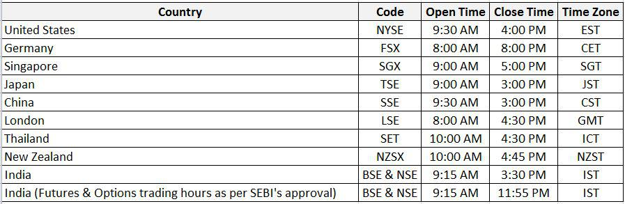

Understanding the trading hours of global stock markets is vital for investors and traders seeking to enhance their decision-making processes. The stock market is not a 24-hour affair; rather, each market operates within specific hours that reflect its geographical location and timezone. These trading hours not only define when the market is open for buying and selling but also significantly impact investor strategies and algorithmic trading behavior. By surveying and understanding the trading schedules of major stock markets, one can identify opportunities that arise around market openings and closings and leverage these periods strategically.

This article focuses on the trading hours of important stock exchanges worldwide, providing insights into how these schedules can influence trading volumes and market volatility. Additionally, we'll explore how variations in trading hours affect algorithmic trading systems, which have become a staple in the modern trading environment due to their ability to execute trades at high speed and frequency. The information presented aims to equip investors with the necessary knowledge to navigate different time zones effectively and make informed trading decisions. Understanding these dynamics is crucial for optimizing investment strategies across various markets, ensuring better alignment with global economic movements and events.

## Table of Contents

## Understanding Stock Exchange Hours

Stock exchange hours refer to the specific periods during which stock markets operate, and they play a crucial role in determining trading activity. The trading hours vary significantly across different regions and countries, reflecting the geographical and economic diversity of the global financial landscape. This variation is pivotal for investors who aim to strategically manage their investments by capitalizing on market openings and closings.

The opening and closing times of a stock exchange are often correlated with increased trading volumes and volatility. During these periods, the influx of orders and market participants can lead to sharp price movements, making these times particularly interesting for traders looking to exploit short-term opportunities. The volume of trade is a key metric during these hours, as it often signifies increased liquidity and the potential for more robust price discovery.

To further illustrate, consider the typical trading day on a major stock exchange. At the opening bell, the market often experiences a surge in trading activity as overnight news is digested and investors react accordingly. Similarly, in the period leading up to the closing bell, traders finalize their positions, often leading to another spike in trading volumes.

In addition to the regular trading hours, stock markets also offer pre-market and after-hours trading sessions, which take place outside of the standard trading times. Pre-market trading occurs before the official market opens, while after-hours trading takes place after the market has closed. These sessions are facilitated through electronic communication networks (ECNs) that allow trades to be executed even when the primary exchanges are not operational. This extended trading can be advantageous for investors who need to react to news events released outside of standard market hours.

However, pre-market and after-hours trading come with their own set of challenges, including lower [liquidity](/wiki/liquidity-risk-premium) and higher [volatility](/wiki/volatility-trading-strategies), as fewer participants mean that prices can be more easily influenced by smaller trades. Moreover, lack of participation by institutional investors and fewer market makers can contributing to wider bid-ask spreads during these sessions.

In summary, understanding stock exchange hours is essential for investors aiming to effectively navigate the complexities of global markets. By recognizing the impact of these hours on trading volumes and volatility, investors can make informed decisions and optimize their trading strategies. Additionally, grasping the concept of pre-market and after-hours trading further enhances an investor's ability to respond to market dynamics in a timely manner.

## Major Global Stock Markets and Their Trading Times

The global stock markets operate across a spectrum of trading times, defined by the geographic locations of their exchanges. Understanding these times is essential for traders aiming to maximize their strategies in line with regional market movements.

Starting with the New York Stock Exchange (NYSE) and NASDAQ, these represent major financial hubs in the United States, operating from 9:30 AM to 4:00 PM Eastern Standard Time (EST), Monday through Friday. Both exchanges facilitate pre-market and after-hours trading, extending from 4:00 AM to 9:30 AM EST and from 4:00 PM to 8:00 PM EST. This flexibility allows traders to react to after-hours news and events, potentially influencing opening prices.

In Europe, the London Stock Exchange (LSE) operates from 8:00 AM to 4:30 PM Greenwich Mean Time (GMT). The LSE is one of the largest exchanges in Europe and serves as a significant node in the global financial network. Euronext, operating across various major cities including Paris, Amsterdam, and Brussels, maintains trading hours from 9:00 AM to 5:30 PM Central European Time (CET). The time difference between the openings and closings of U.S. and European markets can create opportunities for [arbitrage](/wiki/arbitrage) and cross-market trading.

Asian markets offer their own unique schedules. The Tokyo Stock Exchange (TSE), Japan's largest, operates from 9:00 AM to 11:30 AM and then from 12:30 PM to 3:00 PM Japan Standard Time (JST). The segmented trading reflects the traditional lunch break in Japan. In China, the Shanghai Stock Exchange runs from 9:30 AM to 11:30 AM, and from 1:00 PM to 3:00 PM China Standard Time (CST). The timing is similar to Japan’s, aligning with regional business practices and cultural norms.

Emerging markets present an array of trading times influenced by their geographic location and economic policies. For instance, the Bombay Stock Exchange in India operates from 9:15 AM to 3:30 PM Indian Standard Time (IST). As emerging markets grow, understanding their trading hours becomes vital for traders looking to capitalize on international developments and local economic shifts.

Aligning trading strategies with these schedules requires considering the overlap and gaps between different markets. For example, the overlap between European and U.S. markets generally increases trading volumes and volatility, offering potentials for increased market activity. In contrast, the gap between Asian and U.S. market hours provides a strategic pause for traders to recalibrate their strategies based on the latest market developments.

By examining the trading times of these global stock markets, traders can develop informed strategies that align with regional market dynamics, enhancing their capacity to make timely and strategic trading decisions.

## Algorithmic Trading and Market Hours

Algorithmic trading leverages automated systems to execute trades at high speeds, capitalizing on the ability to process information and execute decisions more quickly than human traders. The effectiveness of [algorithmic trading](/wiki/algorithmic-trading) is significantly influenced by stock market trading hours, as they dictate when and how these systems can operate optimally.

Trading times are essential for algorithms because they determine the [volume](/wiki/volume-trading-strategy) of trading activity. Market openings and closings, typically characterized by increased volatility and liquidity, provide profitable opportunities for algorithmic strategies. Algorithms are programmed to exploit these periods by identifying patterns and executing trades based on historical data and real-time analysis. For instance, a common algorithmic strategy involves placing orders within the first and last 30 minutes of the trading day to capitalize on heightened market activity.

Different exchanges have distinct trading hours, necessitating the adaptation of algorithmic systems to varied timeframes. For instance, algorithms trading on the New York Stock Exchange (NYSE) must adjust to its 9:30 AM to 4:00 PM Eastern Time schedule, while those operating on the Tokyo Stock Exchange adhere to 9:00 AM to 3:00 PM Japan Standard Time. Sophisticated algorithms are designed to switch between these markets seamlessly, maximizing opportunities around the clock.

Algorithmic trading strategies must also manage the inherent fluctuations that occur during market openings and closings. To mitigate risks associated with volatility during these periods, algorithms may employ mean reversion or [momentum](/wiki/momentum) trading strategies. Mean reversion strategies assume that prices will revert to a mean over time, thus buying stocks that have decreased in price and selling those that have increased. Momentum strategies, on the other hand, capitalize on trends, continuing to buy assets with rising prices and selling those with declining prices.

Understanding how trading hours affect algorithmic performance can enhance decision-making for tech-savvy investors. By aligning trading algorithms with market hours, investors can optimize execution, reduce costs, and increase the probability of favorable outcomes. This knowledge allows for building algorithms that are not only time-aware but also adaptive to market dynamics, providing a significant advantage in competitive financial markets.

## Benefits of Knowing Global Trading Times

Understanding global trading times provides a significant advantage for investors and traders, particularly in international markets. The knowledge of these hours facilitates strategic trading by allowing investors to capture arbitrage opportunities that arise due to time zone differences. Arbitrage involves the simultaneous buying and selling of an asset in different markets to exploit price differences, a concept crucial when markets in different time zones overlap.

For instance, traders can purchase a stock in one market where the trading day is ending and sell it in another where the market is just opening, capitalizing on differing price valuations. This requires precise timing and understanding of when each market is active, underscoring the importance of being aware of global stock exchange hours.

Moreover, knowledge of trading times is indispensable for tracking global economic events and their immediate impact on markets. Economic data releases, geopolitical developments, or other significant occurrences can influence market behavior instantly. Being attuned to different time zones allows investors to respond promptly to these events, making informed decisions that align with the current market sentiment.

Managing portfolio risk is another critical aspect where understanding of global trading times becomes vital. By knowing when each market operates, investors can diversify their portfolios across various global markets, minimizing risk exposure during downturns in specific regions. This diversification is a key strategy in risk management, helping to optimize returns while mitigating potential losses.

Additionally, the integration of global market insights facilitates strategic and informed investment choices. Investors can leverage data and trends from multiple markets, leading to a more comprehensive understanding of global financial landscapes. This holistic approach enables investors to identify macroeconomic trends and investment opportunities that might not be apparent when focusing solely on a single market.

Overall, awareness of global trading times not only opens up international trading avenues but also enhances strategic decision-making, risk management, and profit optimization. This knowledge empowers traders and investors to make well-informed, strategic decisions that maximize their investment potential in a complex, interlinked global market environment.

## Challenges and Considerations

While global trading hours offer investors numerous opportunities, they also present specific challenges that require careful consideration. One such challenge is staying informed about multiple markets, which becomes increasingly complex as the number of regions involved grows. Each market has its own set of trading hours, local news, and economic events that can affect global stock prices. Investors need to track these elements diligently to make timely and informed trading decisions.

Market overlaps occur when two or more stock exchanges operate simultaneously, a scenario often observed between major financial hubs like London and New York. These overlaps can lead to increased volatility due to the convergence of trading activity from different markets. Higher volatility can present both risks and opportunities; it may lead to rapid price movements that can either capitalize on shifts or result in losses if not managed correctly. For example, the period when both the London Stock Exchange and the New York Stock Exchange are open is notorious for sudden market swings as liquidity and volume increase.

Another [factor](/wiki/factor-investing) adding complexity to trading hours is the influence of daylight saving time (DST) adjustments. These adjustments mean that the trading hours for certain markets shift, necessitating constant awareness and recalibration from investors who trade across time zones. For instance, the difference in hours between the U.S. and European markets changes twice a year, which can affect the timing of market overlaps and influence trading strategies. Traders and investors must be vigilant, monitoring announcements and adjusting their systems to account for these changes each season.

Handling these challenges requires robust trading strategies that incorporate a deep understanding of international markets and economic indicators. Investors must develop a comprehensive approach that takes into account local market dynamics and global interconnections. Advanced algorithmic trading systems often incorporate real-time data analytics to adapt to these complexities, providing an advantage in swiftly responding to increased volatility and time adjustments.

In summary, proper consideration of these challenges can significantly enhance an investor's resilience and adaptability in global trading endeavors. By staying informed and strategically managing market overlaps and DST effects, traders can navigate the complexities of global markets more effectively, maximizing their potential for successful outcomes.

## Conclusion

Understanding stock exchange hours and their impact on trading is essential for modern investors. Global stock markets operate across various time zones, creating opportunities and challenges for traders worldwide. By leveraging knowledge of market hours, traders can optimize their strategies to capitalize on periods of high liquidity and volatility, thus enhancing their potential for profit. The synchronization of trading activities with these time windows allows for more effective execution of trades, reducing slippage and increasing the likelihood of favorable outcomes.

Algorithmic trading, which employs automated systems to buy and sell stocks at exceptionally high speeds, gains a significant advantage when aligned with market hours. These algorithms can be programmed to respond instantaneously to market events during opening and closing times when volatility tends to spike. By integrating these programmed responses with a deep understanding of market times, traders can benefit from precision in trade execution, optimizing returns while managing risks more effectively.

Staying informed about global trading times is crucial for making strategic and timely decisions. Traders who understand the nuances of international market hours can more accurately predict market movements and adjust their portfolios accordingly. This awareness facilitates the ability to track economic news and events across different regions, enabling investors to anticipate and respond to shifts in market sentiment with agility.

This comprehensive guide empowers traders to navigate the global stock market landscape effectively. By understanding the intricate dynamics of stock exchange hours, investors are better equipped to devise robust trading strategies that align with their financial goals. Whether harnessing the power of algorithmic tools or simply timing trades according to market schedules, informed investors can achieve a competitive edge in the ever-evolving world of global finance.

## References & Further Reading

[1]: [New York Stock Exchange Trading Hours](https://www.nyse.com/markets/hours-calendars?icid=AECPLTB1&lid=SGENCBGCICATLForeignExchange) - NYSE official website provides up-to-date information on trading hours and schedules.

[2]: [London Stock Exchange Trading Hours](https://www.tradinghours.com/exchanges/lse/trading-hours) - LSE official page detailing trading times and related services.

[3]: [Tokyo Stock Exchange Hours](https://www.tradinghours.com/markets/jpx/hours) - Japan Exchange Group website, offering insights into trading hours for the Tokyo Stock Exchange.

[4]: J.P. Morgan Asset Management. ["A guide to the markets."](https://am.jpmorgan.com/us/en/asset-management/adv/insights/market-insights/guide-to-the-markets/) - Comprehensive guide that includes information about global market hours and their implications.

[5]: Harris, L. (2003). ["Trading & Exchanges: Market Microstructure for Practitioners."](https://academic.oup.com/book/52292) Oxford University Press. - This book provides an understanding of the intricacies of trading exchanges.

[6]: Aldridge, I. (2013). ["High-frequency trading: A practical guide to algorithmic strategies and trading systems."](https://www.ahmetbeyefendi.com/wp-content/uploads/2020/07/High-Frequency-Trading-Irene-Aldridge.pdf) Wiley. - Discusses the intersection of trading hours and algorithmic trading strategies.

[7]: [Shanghai Stock Exchange Trading Hours](https://www.tradinghours.com/markets/sse/hours) - Official website with information about the trading hours and market characteristics.