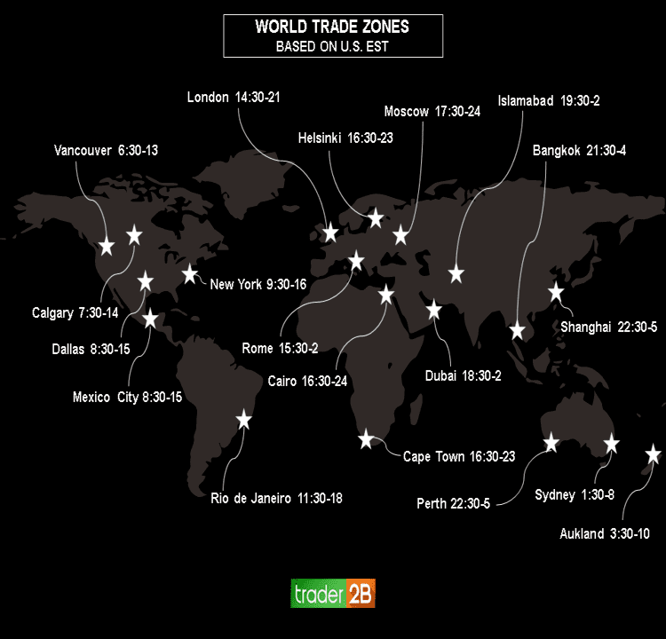

## Table of Contents

## What are stock exchanges and why are their trading hours important?

Stock exchanges are places where people buy and sell shares of companies. These shares represent a piece of ownership in a company. The most famous stock exchanges are the New York Stock Exchange and the NASDAQ. When someone buys a share, they hope the company will do well and the share's value will go up. If the company does not do well, the share's value can go down. Stock exchanges help companies get money to grow by selling shares to the public.

The trading hours of stock exchanges are important because they set the times when people can buy and sell shares. For example, the New York Stock Exchange is open from 9:30 AM to 4:00 PM Eastern Time, Monday through Friday. These hours are important because they help create a regular schedule for trading. This schedule helps everyone know when they can trade and makes the market more organized. If trading happened all the time, it would be hard to keep track of prices and make good decisions.

## What are the standard trading hours for the New York Stock Exchange (NYSE)?

The New York Stock Exchange, or NYSE, has standard trading hours from 9:30 AM to 4:00 PM Eastern Time. These hours are when people can buy and sell stocks on the exchange. The NYSE is open for trading from Monday to Friday, but it is closed on weekends and most holidays.

These trading hours are important because they help everyone know when they can trade. If trading happened all the time, it would be hard to keep track of prices and make good decisions. Having set hours makes the market more organized and helps people plan their trading activities.

## How do the trading hours of the NASDAQ compare to those of the NYSE?

The trading hours for the NASDAQ are the same as those for the New York Stock Exchange (NYSE). Both exchanges are open from 9:30 AM to 4:00 PM Eastern Time, Monday through Friday. This means that people can buy and sell stocks on the NASDAQ during the same times they can on the NYSE.

Having the same trading hours helps keep things simple for people who trade on both exchanges. It makes it easier to plan when to buy and sell stocks because the times are the same. If the hours were different, it could be confusing and harder to manage trading activities.

## What are the trading hours for the London Stock Exchange (LSE)?

The London Stock Exchange, or LSE, has trading hours from 8:00 AM to 4:30 PM local time, which is Greenwich Mean Time (GMT). These hours are when people can buy and sell stocks on the LSE. The exchange is open for trading from Monday to Friday, but it is closed on weekends and most holidays.

These trading hours are important because they help everyone know when they can trade. If trading happened all the time, it would be hard to keep track of prices and make good decisions. Having set hours makes the market more organized and helps people plan their trading activities.

## Can you explain the trading hours of the Tokyo Stock Exchange (TSE)?

The Tokyo Stock Exchange, or TSE, has trading hours from 9:00 AM to 3:00 PM local time, which is Japan Standard Time (JST). These are the times when people can buy and sell stocks on the TSE. The exchange is open for trading from Monday to Friday, but it is closed on weekends and most holidays.

These trading hours are important because they help everyone know when they can trade. If trading happened all the time, it would be hard to keep track of prices and make good decisions. Having set hours makes the market more organized and helps people plan their trading activities.

## What are the operating hours of the Shanghai Stock Exchange (SSE)?

The Shanghai Stock Exchange, or SSE, is open for trading from 9:30 AM to 3:00 PM local time, which is China Standard Time (CST). These are the hours when people can buy and sell stocks on the SSE. The exchange operates from Monday to Friday, but it is closed on weekends and most holidays.

These trading hours are important because they help everyone know when they can trade. If trading happened all the time, it would be hard to keep track of prices and make good decisions. Having set hours makes the market more organized and helps people plan their trading activities.

## How do the trading hours of the Hong Kong Stock Exchange (HKEX) work?

The Hong Kong Stock Exchange, or HKEX, is open for trading from 9:30 AM to 4:00 PM local time, which is Hong Kong Time (HKT). These are the hours when people can buy and sell stocks on the HKEX. The exchange is open from Monday to Friday, but it is closed on weekends and most holidays.

These trading hours are important because they help everyone know when they can trade. If trading happened all the time, it would be hard to keep track of prices and make good decisions. Having set hours makes the market more organized and helps people plan their trading activities.

## What are the trading hours for the Frankfurt Stock Exchange (FSE)?

The Frankfurt Stock Exchange, or FSE, is open for trading from 8:00 AM to 10:00 PM local time, which is Central European Time (CET). These are the hours when people can buy and sell stocks on the FSE. The exchange is open from Monday to Friday, but it is closed on weekends and most holidays.

These trading hours are important because they help everyone know when they can trade. If trading happened all the time, it would be hard to keep track of prices and make good decisions. Having set hours makes the market more organized and helps people plan their trading activities.

## How do pre-market and after-hours trading sessions affect global trading?

Pre-market and after-hours trading sessions let people buy and sell stocks before and after the regular trading hours of a stock exchange. For example, the New York Stock Exchange has pre-market trading from 4:00 AM to 9:30 AM and after-hours trading from 4:00 PM to 8:00 PM Eastern Time. These sessions are important because they let people react to news and events that happen outside of regular trading hours. If a company announces something big after the market closes, traders can still buy or sell the stock right away instead of waiting until the next day.

These extended trading sessions can affect global trading because they help connect different markets around the world. For example, news from Asia can affect the U.S. markets, and traders in the U.S. can respond to that news during pre-market trading. This means that events in one part of the world can have a quick impact on markets in other parts. It makes the global market more connected and can lead to more trading and more chances for people to make money or lose money based on what's happening around the world.

## What impact do time zone differences have on trading across major stock exchanges?

Time zone differences can make trading across major stock exchanges tricky. When it's daytime in one part of the world, it might be nighttime in another. This means that when the New York Stock Exchange is open, the Tokyo Stock Exchange is already closed. Traders need to think about these time differences when they want to buy or sell stocks in different countries. If they miss the trading hours of one exchange, they might have to wait until the next day to make their trades.

These time zone differences can also affect how news and events impact the markets. For example, if something big happens in Asia after their markets close, traders in the U.S. can still react to it during pre-market trading. This can cause the prices of stocks to change before the regular trading hours start. It makes the global market more connected, but it can also make things more complicated for traders who need to keep track of what's happening in different parts of the world at different times.

## How do holidays and special events influence the trading hours of major stock exchanges?

Holidays and special events can change the trading hours of major stock exchanges. When a holiday comes up, the stock exchange might close for the whole day or have shorter trading hours. For example, the New York Stock Exchange is closed on holidays like Christmas and Thanksgiving. This means that people can't buy or sell stocks on those days. Special events, like big elections or important news announcements, might also make the exchange close early or open late. This is to make sure that everyone has time to understand the news before they start trading.

These changes can affect how people trade around the world. If a big stock exchange like the NYSE is closed for a holiday, traders in other countries might have to wait until it opens again to make their trades. This can make the markets less active on those days. Also, if a special event happens, like a big election, traders might want to wait and see what happens before they buy or sell stocks. This can make the markets more unpredictable and can change how people plan their trading activities.

## What strategies should traders use to manage trading across different time zones and exchange schedules?

Traders need to plan carefully when they want to trade across different time zones and exchange schedules. They should know when each stock exchange is open and closed. For example, if they want to trade on the Tokyo Stock Exchange and the New York Stock Exchange, they need to remember that Tokyo is ahead of New York by 13 hours. This means that when it's morning in Tokyo, it's still night in New York. Traders can use tools like world clocks or trading software that show the time in different places to help them keep track.

Another good strategy is to use pre-market and after-hours trading sessions. These sessions let traders buy and sell stocks before and after the regular trading hours. This can be helpful if something important happens after the market closes in one place but before it opens in another. For example, if there's big news from Asia after their markets close, traders in the U.S. can still react to it during pre-market trading. This way, they don't have to wait until the next day to make their trades. By using these strategies, traders can manage their activities better and take advantage of opportunities in different markets around the world.

## References & Further Reading

[1]: [New York Stock Exchange Trading Hours](https://www.nyse.com/markets/hours-calendars?icid=AECPLTB1&lid=SGENCBGCICATLForeignExchange) - NYSE official website provides up-to-date information on trading hours and schedules.

[2]: [London Stock Exchange Trading Hours](https://www.tradinghours.com/exchanges/lse/trading-hours) - LSE official page detailing trading times and related services.

[3]: [Tokyo Stock Exchange Hours](https://www.tradinghours.com/markets/jpx/hours) - Japan Exchange Group website, offering insights into trading hours for the Tokyo Stock Exchange.

[4]: J.P. Morgan Asset Management. ["A guide to the markets."](https://am.jpmorgan.com/us/en/asset-management/adv/insights/market-insights/guide-to-the-markets/) - Comprehensive guide that includes information about global market hours and their implications.

[5]: Harris, L. (2003). ["Trading & Exchanges: Market Microstructure for Practitioners."](https://academic.oup.com/book/52292) Oxford University Press. - This book provides an understanding of the intricacies of trading exchanges.

[6]: Aldridge, I. (2013). ["High-frequency trading: A practical guide to algorithmic strategies and trading systems."](https://www.ahmetbeyefendi.com/wp-content/uploads/2020/07/High-Frequency-Trading-Irene-Aldridge.pdf) Wiley. - Discusses the intersection of trading hours and algorithmic trading strategies.

[7]: [Shanghai Stock Exchange Trading Hours](https://www.tradinghours.com/markets/sse/hours) - Official website with information about the trading hours and market characteristics.