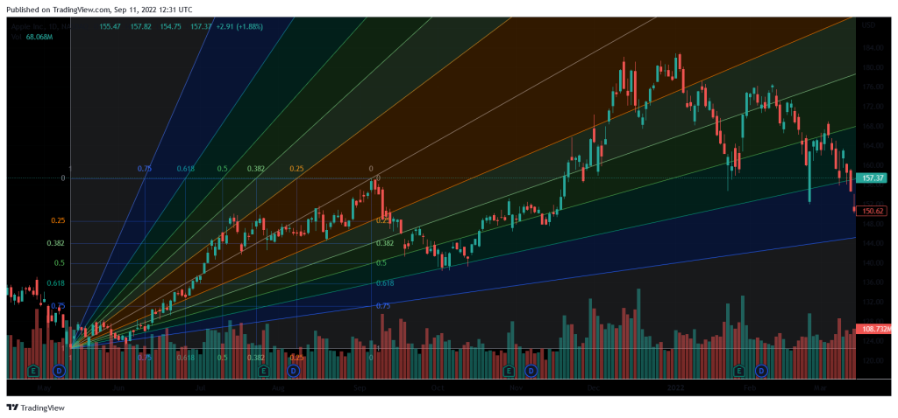

## Table of Contents

## What is trading and why do people engage in it?

Trading is when people buy and sell things to make money. It can be anything from stocks and bonds to goods like food or clothes. People trade because they want to earn more money than they started with. They might buy something cheap and sell it for a higher price, or they might buy a stock hoping its value will go up so they can sell it later for a profit.

People engage in trading for many reasons. Some do it to make a living, while others see it as a way to grow their savings. Trading can be exciting because it involves making decisions and taking risks. If people make good choices, they can earn a lot of money. However, trading can also be risky because if the value of what they bought goes down, they could lose money. Despite the risks, many people find trading a worthwhile activity because of the potential rewards.

## What are the basic types of trading (e.g., day trading, swing trading)?

There are several basic types of trading that people use to try and make money. Day trading is when someone buys and sells stocks or other things within the same day. They don't keep what they buy overnight. Day traders want to make quick profits from small changes in prices during the day. Swing trading is different because it involves holding onto stocks or other items for a few days or weeks. Swing traders look for bigger price changes over a longer time than day traders.

Another type of trading is position trading, where people hold onto their investments for months or even years. Position traders are looking for long-term trends and big changes in value. They are less worried about short-term ups and downs. Scalping is another type of trading where people make lots of small trades to earn tiny profits from very small price changes. Scalpers might trade many times in a single day, but each trade is quick and the profit is small. Each type of trading has its own risks and rewards, and people choose the one that fits their goals and how much risk they are willing to take.

## How can beginners start trading with minimal risk?

Beginners can start trading with minimal risk by first learning as much as they can about trading. They should read [books](/wiki/algo-trading-books), watch videos, and maybe even take a [course](/wiki/best-algorithmic-trading-courses) to understand how trading works. It's important to know the basics of the stock market, how to read charts, and what different types of trading mean. Once they feel comfortable with the knowledge, they can start with a practice account, often called a demo account. This lets them trade with fake money so they can practice without losing real money. This way, they can try out different strategies and see what works without any risk.

After practicing, beginners should start with a small amount of real money. They should only use money they can afford to lose, because even with practice, there's always a chance they could lose it. It's a good idea to start with a simple strategy, like buying and holding onto stocks for a longer time, rather than trying to make quick trades. This approach, called position trading, is less risky than [day trading](/wiki/day-trading-spy) or [scalping](/wiki/gamma-scalping). By starting small and keeping things simple, beginners can slowly learn and grow their skills without taking on too much risk.

## What are the essential tools and platforms for trading?

For trading, you need a few essential tools and platforms. A trading platform is like a website or app where you can buy and sell stocks or other things. Some popular ones are Robinhood, E*TRADE, and TD Ameritrade. These platforms let you see prices, make trades, and keep track of your money. Another important tool is a charting software, like TradingView or MetaTrader, which helps you see how prices have changed over time. This can help you decide when to buy or sell.

Another tool that can be helpful is a stock screener. This is a tool that helps you find stocks that meet certain rules you set, like price or how much the stock has gone up or down. Some trading platforms have their own screeners, or you can use ones like Finviz or Yahoo Finance. Lastly, a good news source is important because news can affect stock prices. Websites like Bloomberg or Reuters can keep you updated on what's happening in the world that might change the value of your investments.

## How do fundamental and technical analysis differ, and when should each be used?

Fundamental analysis and technical analysis are two different ways to look at stocks and decide if you should buy or sell them. Fundamental analysis is about looking at the real value of a company. You look at things like how much money the company makes, how much it owes, and how it's growing. You might also look at the economy and what's happening in the world that could affect the company. This type of analysis is good for long-term investing because it helps you understand if a company is a good investment over time.

Technical analysis is different because it's all about looking at charts and numbers. You look at how the price of a stock has moved in the past and try to guess where it might go next. You might use things like moving averages or other patterns on a chart to help you decide. This type of analysis is often used for shorter-term trading, like day trading or swing trading, because it's about trying to predict quick changes in price. Both types of analysis can be useful, but they're used in different ways depending on what you're trying to do with your trading.

## What are common trading strategies for beginners?

For beginners, one common trading strategy is called "buy and hold." This means you buy a stock and keep it for a long time, like months or years. You pick stocks of companies you think will do well over time. This strategy is good for beginners because it's simple and doesn't need you to watch the market all the time. You just need to do some research to find good companies and then wait for them to grow.

Another strategy beginners might use is "dollar-cost averaging." This means you put a little bit of money into the stock market regularly, like every month. Instead of trying to guess the best time to buy, you spread out your buying over time. This can help you avoid buying all your stocks at a high price. It's a good way to start investing without needing to know a lot about the market.

A third strategy is "following the trend." This means you look at which way the stock price is moving and try to buy when it's going up and sell when it's going down. You can use charts to see these trends. This strategy can be a bit riskier, but it's simple enough for beginners to try. It's important to remember that no strategy is perfect, and you should always be ready to learn and adjust as you go.

## How can traders manage risk and protect their investments?

Traders can manage risk and protect their investments by using something called a "stop-loss order." This is a tool that automatically sells a stock if its price drops to a certain level. It helps limit how much money you can lose on a trade. Another way to manage risk is by not putting all your money into one stock. This is called "diversification." By spreading your money across different stocks or types of investments, you reduce the chance that one bad stock will hurt your whole portfolio. It's like not putting all your eggs in one basket.

Another important way to protect your investments is by doing your homework. This means researching the companies you're thinking about investing in and understanding the market. The more you know, the better decisions you can make. Also, it's a good idea to only invest money you can afford to lose. This way, if things don't go as planned, you won't be in a bad spot financially. By using these strategies, traders can feel more confident and keep their investments safer.

## What psychological factors affect trading decisions and how can they be managed?

Psychological factors can really affect how people make trading decisions. One big [factor](/wiki/factor-investing) is fear. When the market goes down, people might get scared and sell their stocks too soon, even if it's not a good time. Another factor is greed. Sometimes, people see their stocks going up and they want to keep making more money, so they don't sell when they should. This can lead to big losses if the market turns around. Emotions like fear and greed can make people do things that aren't smart, and it's important to try to control them.

To manage these psychological factors, traders can use a few strategies. One way is to have a clear plan before they start trading. This means deciding ahead of time when to buy and sell, and sticking to that plan no matter what their emotions are telling them. Another way is to take breaks from trading. If you're feeling too emotional, it's okay to step away for a bit and come back when you're calmer. It can also help to talk to other traders or a mentor who can give you advice and help you stay on track. By using these strategies, traders can make better decisions and not let their emotions get the best of them.

## How do advanced traders use leverage and margin trading?

Advanced traders use leverage and margin trading to try to make more money from their trades. Leverage is like borrowing money to buy more stocks than you could with just your own money. For example, if you have $1,000 and use 2:1 leverage, you can buy $2,000 worth of stocks. This can make your profits bigger if the stock price goes up, but it also makes your losses bigger if the price goes down. Margin trading is when you borrow money from your broker to buy stocks. You have to pay interest on the borrowed money, but it lets you trade with more money than you have in your account.

Using leverage and margin can be risky, so advanced traders need to be careful. They use these tools because they think they can make more money, but they also know they could lose more. To manage the risk, they might set strict rules for themselves, like only using a certain amount of leverage or always having a stop-loss order in place. They also keep a close eye on their trades and are ready to act quickly if things start to go wrong. By being smart and careful, advanced traders can use leverage and margin to try to boost their profits while keeping the risks under control.

## What are the latest trends and technologies impacting trading?

One of the latest trends in trading is the use of [artificial intelligence](/wiki/ai-artificial-intelligence) (AI) and [machine learning](/wiki/machine-learning). These technologies help traders make better decisions by analyzing huge amounts of data quickly. AI can look at news, social media, and market data to find patterns that humans might miss. This can help traders predict what might happen next in the market. Many trading platforms now use AI to give traders suggestions or even make trades automatically. This makes trading faster and can help traders make more money, but it also means they need to understand how AI works to use it well.

Another big trend is the rise of mobile trading apps. More and more people are using their phones to buy and sell stocks. These apps make it easy to trade from anywhere, at any time. They often have simple designs and tools that help beginners get started. Some apps even let you trade things like cryptocurrencies, which are digital money that's becoming more popular. Mobile trading has made it easier for more people to start trading, but it's important for them to learn about the risks and not just trade because it's easy.

A third trend is the growth of social trading. This is when traders share their strategies and trades with others online. Platforms like eToro let you see what other traders are doing and even copy their trades. This can be helpful for beginners who want to learn from more experienced traders. Social trading makes the trading community more connected, but it's important to be careful and not just follow others without understanding why they're making certain trades.

## How can traders develop and test their own trading algorithms?

Traders can develop their own trading algorithms by first learning how to code. They can use programming languages like Python, which is popular for trading because it's easy to learn and has lots of tools for working with data. Once they know how to code, traders can start writing their own algorithms. These algorithms are like sets of rules that tell the computer when to buy or sell stocks. Traders might use data from the past to see how their algorithm would have worked before, and then they can make changes to make it better. They can also use online platforms like Quantopian or MetaTrader to help them write and test their algorithms.

After writing their algorithm, traders need to test it to see if it works well. They can do this by using something called [backtesting](/wiki/backtesting), which means running the algorithm on old data to see how it would have done in the past. This helps traders see if their algorithm makes good decisions. They can also use something called forward testing, where they run the algorithm in real-time but with fake money. This lets them see how it works in the current market without risking real money. By testing their algorithms carefully, traders can find out what works and what doesn't, and then they can make their algorithms better before using them with real money.

## What are the regulatory considerations and compliance issues in trading?

When people trade, they need to follow rules set by governments and other groups. These rules are called regulations, and they are there to make sure trading is fair and safe. In the United States, the main group that makes these rules is the Securities and Exchange Commission (SEC). The SEC makes sure that companies tell the truth about their stocks and that traders don't do things like insider trading, which is using secret information to make money. Traders also need to follow rules from the Financial Industry Regulatory Authority (FINRA), which checks that brokers and dealers are doing things the right way. If traders don't follow these rules, they can get in big trouble, like having to pay fines or even going to jail.

Another important part of trading is compliance, which means making sure you follow all the rules. Traders need to keep good records of their trades and report them correctly. They also need to know about rules that might be different in other countries if they trade there. For example, the European Union has its own rules called MiFID II, which are about making sure markets are fair and transparent. To stay compliant, traders often use special software that helps them keep track of everything and make sure they're following the rules. By understanding and following these regulations and compliance issues, traders can avoid problems and trade safely and fairly.

## References & Further Reading

[1]: Bergstra, J., Bardenet, R., Bengio, Y., & Kégl, B. (2011). ["Algorithms for Hyper-Parameter Optimization."](https://dl.acm.org/doi/10.5555/2986459.2986743) Advances in Neural Information Processing Systems 24.

[2]: ["Advances in Financial Machine Learning"](https://www.amazon.com/Advances-Financial-Machine-Learning-Marcos/dp/1119482089) by Marcos Lopez de Prado

[3]: ["Evidence-Based Technical Analysis: Applying the Scientific Method and Statistical Inference to Trading Signals"](https://www.amazon.com/Evidence-Based-Technical-Analysis-Scientific-Statistical/dp/0470008741) by David Aronson

[4]: ["Machine Learning for Algorithmic Trading"](https://github.com/stefan-jansen/machine-learning-for-trading) by Stefan Jansen

[5]: ["Quantitative Trading: How to Build Your Own Algorithmic Trading Business"](https://books.google.com/books/about/Quantitative_Trading.html?id=j70yEAAAQBAJ) by Ernest P. Chan