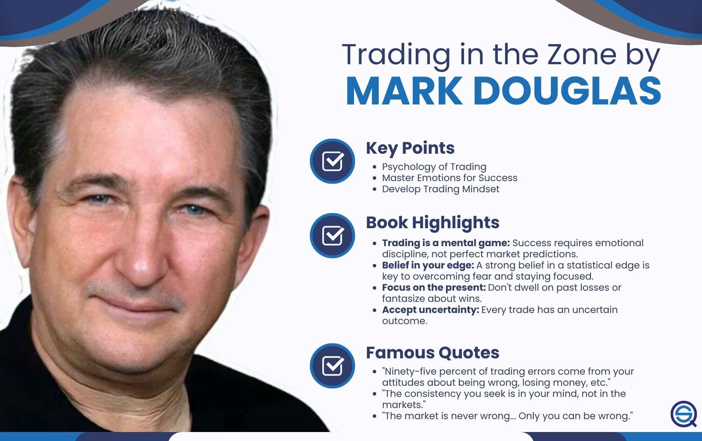

The world of trading involves more than just numbers and strategies; it is deeply tied to the mindset of the individual engaged in the activity. Mark Douglas's "Trading in the Zone" is a cornerstone text for traders seeking to enhance their psychological approach to the market. The book emphasizes the critical role of mental discipline and emotional management in achieving consistent trading success. This article examines the relevance of Douglas’s insights within the context of algorithmic trading, where decisions are largely driven by both quantitative analysis and psychological understanding.

Algorithmic trading involves the development of algorithms that can execute trades at high speed and frequency, making decisions based on pre-established criteria and extensive data analysis. However, the efficacy of these algorithms can be significantly influenced by psychological factors, much as human trading decisions can be. This is where Douglas's work becomes particularly relevant: his principles can be applied not just to human traders but also to the development and refinement of trading algorithms. By understanding the psychological barriers that traders face as outlined in "Trading in the Zone," those who design and implement trading algorithms can enhance the performance and reliability of their systems.



Douglas stresses that trading errors often arise from mental missteps rather than from inadequacies in data analysis or market understanding. This premise holds true in algorithmic trading as well. Algorithms, although devoid of direct emotional input, are nonetheless designed by humans and are reflections of human logic and assumptions. An appreciation of the psychological dimensions of trading can lead to more robust algorithmic strategies, which are better equipped to handle unexpected market conditions and the often irrational behavior of market participants.

Recognizing these psychological barriers allows traders to refine their approaches, creating more adaptive and effective trading strategies. By incorporating the principles from "Trading in the Zone," algorithmic traders can work towards building systems that not only process data efficiently but also anticipate and counteract potential cognitive biases. This aligns with a broader understanding, championed by Douglas, that successful trading, even in algorithmic contexts, is as much about mastering one's own mindset as it is about mastering the markets.

## Table of Contents

## The Core Concepts of 'Trading in the Zone'

Mark Douglas's "Trading in the Zone" is a cornerstone in understanding trading psychology, emphasizing the pivotal role of psychological discipline and cognitive awareness in trading success. One of the core concepts presented in the book is the mastery of emotions. Traders often encounter emotional challenges such as fear and greed, which can hinder their decision-making process. Douglas stresses the need for traders to recognize and control these emotions to avoid reactive and impulsive trades that often lead to losses.

Confidence is another essential element that Douglas addresses. He emphasizes the importance of building confidence through disciplined practice and experience. Confidence allows traders to execute their strategies without hesitation and fear, and it usually stems from consistent and repetitive practice. However, it is crucial for this confidence to be grounded in reality, supported by sound strategies and analysis rather than overconfidence or hubris.

Consistency in execution is highlighted as a critical [factor](/wiki/factor-investing) in achieving long-term trading success. Douglas suggests that consistent performance is a function of adhering to a well-defined trading plan and exercising discipline. This requires setting clear rules and parameters for entry and [exit](/wiki/exit-strategy), risk management, and performance evaluation, thereby minimizing the influence of emotions on trading outcomes.

Douglas argues that a significant proportion of trading errors are attributable to mindset issues rather than analytical deficiencies. Psychological barriers such as cognitive biases, impatience, and lack of discipline can undermine trading strategies, regardless of their analytical soundness. Addressing these barriers with a disciplined psyche can significantly improve trading performance.

A probabilistic mindset is central to Douglas's philosophy, where acceptance and understanding of market uncertainties are encouraged. Markets are inherently uncertain, and acknowledging this allows traders to adopt a probabilistic approach rather than seeking certainty. Douglas suggests that traders should view trades as individual occurrences within a broader statistical framework, accepting that outcomes are not entirely predictable. This probabilistic mindset helps traders to focus on process over results, understanding that losing trades are an inevitable part of the broader statistical probability.

By integrating these core concepts into their mindset, traders can enhance their psychological resilience. The principles articulated by Douglas transcend specific market conditions and trading techniques, providing a psychological foundation that supports rational and structured decision-making in trading.

## Integrating Trading Psychology in Algorithmic Trading

Algorithmic trading depends fundamentally on data analysis and logical constructs. Nonetheless, incorporating principles from trading psychology can significantly augment its efficacy. Mark Douglas, in "Trading in the Zone," offers insights that can be instrumental in crafting algorithms sensitive to market psychology.

One primary advantage of integrating psychological insights into algorithms is the enhancement of decision-making processes. Markets are often subject to volatile events that can induce stress. During such times, human traders are susceptible to emotional biases, potentially leading to irrational decisions. By embedding psychological considerations into trading algorithms, these systems can be made more robust to stress. For example, algorithms can be designed to recognize patterns of market panic and adjust strategies accordingly, thus optimizing performance during both stable and tumultuous periods.

Douglas's teachings emphasize the importance of acknowledging emotional biases and the unpredictability of market conditions. In [algorithmic trading](/wiki/algorithmic-trading), this translates to developing systems that not only react to quantitative data but also incorporate qualitative assessments of trader behavior. For instance, an algorithm might factor in historical data showing how markets react differently depending on prevailing investor sentiment, employing sentiment analysis to interpret social media or news data to gauge current trader attitudes.

Successful algorithms must go beyond simple market trend analysis. They should anticipate possible trader behaviors predicated on psychological factors. This can involve employing techniques such as [machine learning](/wiki/machine-learning) algorithms to predict how traders might react to specific stimuli, allowing the trading system to pre-emptively adjust its strategies. Such an approach might involve a multi-layered [neural network](/wiki/neural-network) trained on a dataset that includes both historical market data and sentiment indicators.

```python
from sklearn.model_selection import train_test_split
from sklearn.ensemble import RandomForestRegressor
import numpy as np
import pandas as pd

# Sample code for training an algorithmic model with psychological insights

# Load and prepare the data
market_data = pd.read_csv('market_data.csv')
sentiment_data = pd.read_csv('sentiment_data.csv')
combined_data = pd.merge(market_data, sentiment_data, on='date')

X = combined_data.drop(['target'], axis=1)
y = combined_data['target']

# Split the data
X_train, X_test, y_train, y_test = train_test_split(X, y, test_size=0.2, random_state=42)

# Build a predictive model
model = RandomForestRegressor(n_estimators=100, random_state=42)

# Train the model
model.fit(X_train, y_train)

# Evaluate model performance
accuracy = model.score(X_test, y_test)
print(f'Model Accuracy: {accuracy * 100:.2f}%')
```

By accounting for psychological factors such as fear, greed, and market sentiment, algorithmic trading can be refined to address the full spectrum of influences shaping market dynamics. Ultimately, the integration of trading psychology into algorithmic systems serves to align these systems closer with real-world trading environments, fostering more effective and reliable trading strategies.

## The Role of 'Trading in the Zone' in Backtesting Strategies

Backtesting is a critical component in algorithmic trading, serving as a method to evaluate the performance of trading strategies by applying them to historical data. In this context, Mark Douglas’s "Trading in the Zone" provides valuable principles related to discipline and mindset that can be applied to enhance the objectivity and effectiveness of [backtesting](/wiki/backtesting) procedures.

One significant consideration in backtesting is the risk of biases that can distort results, such as overfitting or selective time selection. Overfitting occurs when a trading strategy is excessively tailored to historical data, capturing random noise rather than genuine market patterns. This tailoring can lead to strategies that perform well during backtesting but fail in live trading. Douglas’s emphasis on maintaining a disciplined psyche encourages traders to be vigilant against these biases, promoting strategies that generalize well to unseen data.

To address overfitting, traders can use techniques such as k-fold cross-validation, which involves dividing the historical data into k subsets and ensuring that the algorithm is validated against these different subsets to test its robustness:

```python
from sklearn.model_selection import TimeSeriesSplit
from sklearn.metrics import accuracy_score #(example metric)

# Example function to perform cross-validation
def cross_validate_strategy(strategy_func, data, k=5):
    tscv = TimeSeriesSplit(n_splits=k)
    scores = []
    for train_index, test_index in tscv.split(data):
        train_data, test_data = data[train_index], data[test_index]
        model = strategy_func(train_data)
        predictions = model.predict(test_data)
        score = accuracy_score(test_data['target'], predictions)
        scores.append(score)
    return scores

# Place-holder for actual trading strategy function
def example_strategy(train_data):
    # Implement algorithm using training data
    pass
```

The psychological concepts articulated by Douglas also encourage traders to remain objective during the analysis phase of backtesting. Embracing a probabilistic mindset enables traders to interpret results without falling into emotional traps such as confirmation bias. This objective stance is crucial for making informed adjustments to strategies based on logical reasoning rather than emotional reactions.

Moreover, the themes from "Trading in the Zone" can guide how traders respond to backtesting outcomes. Instead of being swayed by the emotional highs of a successful backtest or the lows of an underperforming one, traders are encouraged to adopt a methodical approach to evaluate the validity of their strategies. This approach involves asking whether the results align with the underlying market logic or are merely a product of specific historical conditions. Thus, traders learn to recalibrate their strategies based on unbiased data analysis and logical deductions.

Ultimately, the integration of Douglas’s insights into backtesting processes helps ensure that the development of trading algorithms is built on a solid foundation of discipline and psychological awareness, leading to more robust and reliable trading strategies.

## Practical Tips from 'Trading in the Zone' for Algo Traders

Adopting a mindset of continuous learning and discipline is pivotal for algo traders, as emphasized by Mark Douglas in "Trading in the Zone." In algorithmic trading, where market dynamics and technology continuously evolve, remaining adaptive is crucial. This involves regularly updating oneself with the latest market trends, technological advancements, and psychological insights that could affect trading outcomes. Discipline ensures that this learning is effectively integrated and consistently applied, reinforcing the robustness of trading strategies.

Creating algorithms that integrate both market data and psychological indicators enhances decision-making processes. Traders can benefit by encoding psychological factors such as fear, greed, and overconfidence into their algorithms. For instance, incorporating sentiment analysis from social media or news sources can provide insights into market sentiment, allowing algorithms to adjust strategies more accurately. Algorithms designed this way extend beyond mere numerical analysis, enabling a more holistic view that captures both empirical and psychological elements affecting market behavior.

Frequent review and adjustment of algorithms are essential to maintain alignment with market realities rather than rigid theoretical models. Market conditions are fluid, so strategies that once worked may become obsolete, necessitating periodic reassessment. This reassessment should be guided by data-driven insights and be free from emotional biases. Tools such as machine learning can automate parts of this process, facilitating the identification of patterns and trends that may call for strategy modifications.

The probabilistic mindset advocated by Douglas can be instrumental in setting realistic expectations for algorithmic strategy outcomes. Unlike deterministic strategies, which presume specific outcomes, probabilistic strategies account for uncertainties inherent in trading. This involves leveraging statistical techniques to estimate potential risks and rewards accurately. For example, confidence intervals and value-at-risk models can be employed to gauge the likelihood of achieving specific returns under varying market conditions. Adopting this mindset aligns with the stochastic nature of financial markets, helping traders make informed decisions based on probabilities rather than certainties.

By integrating these principles, algo traders can enhance their strategies, striking a balance between analytical rigor and psychological acumen. The culmination of disciplined learning, psychological integration, adaptive strategy refinement, and probabilistic thinking fosters a resilient trading approach, potentially leading to improved performance in complex trading environments.

## Conclusion

Mark Douglas's 'Trading in the Zone' offers timeless insights into trading psychology that are incredibly relevant for algo traders. The book investigates into the psychological underpinnings of trading, emphasizing the impact mindset has on trading outcomes. By understanding and integrating these psychological principles, traders can significantly enhance their algorithmic strategies. Algorithmic trading, while primarily data-driven, benefits immensely from the incorporation of psychological insights. Douglas's work underscores the importance of a stable and disciplined trading psyche, which is vital for making informed and unbiased decisions.

Algo traders, by marrying discipline and psychology with their data-driven approaches, can navigate trading environments more effectively. This alignment helps in mitigating emotional biases and ensures that trading strategies are not only analytical but also resilient to market stresses. Through the application of Douglas's teachings, traders can create more robust algorithms capable of handling fluctuations and unpredictability in the market.

'Trading in the Zone' serves as a crucial reminder that at the heart of successful trading, even in quantitative domains, lies a well-conditioned mindset. It is a compelling testament to the fact that trading is not solely about numbers; it is a psychological endeavor where the trader’s mindset plays a pivotal role in achieving success. Embracing this holistic approach to trading leads to better outcomes, reinforcing the essential synergy between psychological awareness and technical analysis in algorithmic trading.

## References & Further Reading

[1]: Douglas, M. (2000). ["Trading in the Zone: Master the Market with Confidence, Discipline, and a Winning Attitude."](https://www.amazon.com/Trading-Zone-Confidence-Discipline-Attitude/dp/0735201447) Prentice Hall Press.

[2]: Jansen, S. (2018). ["Machine Learning for Algorithmic Trading"](https://github.com/stefan-jansen/machine-learning-for-trading). Packt Publishing.

[3]: Lopez de Prado, M. (2018). ["Advances in Financial Machine Learning"](https://www.amazon.com/Advances-Financial-Machine-Learning-Marcos/dp/1119482089). Wiley.

[4]: Chan, E. P. (2009). ["Quantitative Trading: How to Build Your Own Algorithmic Trading Business"](https://github.com/ftvision/quant_trading_echan_book). Wiley.

[5]: Aronson, D. (2006). ["Evidence-Based Technical Analysis: Applying the Scientific Method and Statistical Inference to Trading Signals"](https://www.wiley.com/en-us/Evidence+Based+Technical+Analysis%3A+Applying+the+Scientific+Method+and+Statistical+Inference+to+Trading+Signals-p-9780470008744). Wiley.