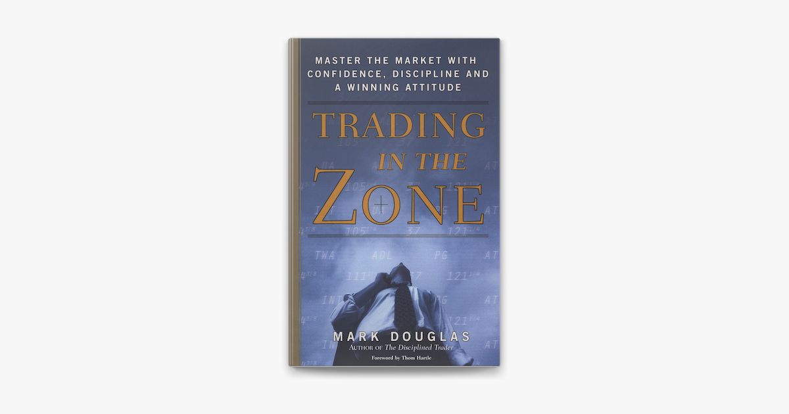

## Table of Contents

## What is 'Trading in the Zone' and who is its author?

'Trading in the Zone' is a book about trading in the stock market. It helps people learn how to trade better by focusing on their mindset and emotions. The book teaches traders how to stay calm and make good decisions even when the market is going up and down a lot.

The author of 'Trading in the Zone' is Mark Douglas. He is an expert in trading psychology. Mark Douglas wrote this book to help traders understand that their biggest challenge is often their own emotions, not the market itself. His ideas have helped many traders improve their skills and be more successful.

## What are the main principles of 'Trading in the Zone'?

The main principles of 'Trading in the Zone' focus on the importance of a trader's mindset. Mark Douglas emphasizes that successful trading is not just about knowing the market but about managing your emotions. He teaches that traders need to accept the uncertainty of the market and not let fear or greed control their decisions. By understanding and controlling their emotions, traders can make better choices and stick to their trading plans.

Another key principle is the idea of thinking in probabilities. Douglas explains that traders should see each trade as part of a larger series of trades, where the goal is to be profitable over time, not with every single trade. This mindset helps traders avoid the emotional rollercoaster of winning and losing and instead focus on following their strategy consistently. By accepting that losses are a normal part of trading, traders can stay calm and continue to make rational decisions.

Lastly, Douglas stresses the importance of discipline and consistency. He believes that traders must follow their trading rules strictly, no matter what the market does. This discipline helps traders avoid impulsive decisions driven by emotions. By staying disciplined and consistent, traders can improve their chances of long-term success in the market.

## How does 'Trading in the Zone' define the concept of a trading mindset?

In 'Trading in the Zone,' Mark Douglas defines a trading mindset as a way of thinking that helps traders stay calm and focused, no matter what the market does. He says that a good trading mindset means accepting that the market is always uncertain. Instead of trying to predict the market, traders should focus on managing their own emotions. This means not letting fear or greed control their decisions. By staying calm and sticking to their trading plan, traders can make better choices and be more successful.

Douglas also explains that a trading mindset involves thinking in probabilities. This means seeing each trade as just one part of many trades. The goal is to be profitable over time, not with every single trade. By understanding that losses are normal, traders can avoid getting too upset when they lose money. This helps them stay disciplined and keep following their strategy, even when things get tough. A good trading mindset is all about staying consistent and not letting emotions get in the way of making smart decisions.

## What role does psychology play in trading according to 'Trading in the Zone'?

In 'Trading in the Zone,' Mark Douglas explains that psychology is very important in trading. He says that the biggest challenge for traders is not the market itself, but their own emotions. Fear and greed can make traders do things they shouldn't, like selling too soon or holding onto a losing trade for too long. By understanding and controlling these emotions, traders can make better decisions and stick to their trading plans.

Douglas teaches that traders need to accept that the market is always uncertain. Instead of trying to predict what will happen, traders should focus on managing their feelings. This means not letting fear or greed control their actions. By staying calm and thinking about each trade as part of a bigger picture, traders can avoid making impulsive decisions. This helps them stay disciplined and consistent, which is key to being successful in trading over time.

## Can you explain the 'Five Fundamental Truths' from 'Trading in the Zone'?

In 'Trading in the Zone,' Mark Douglas talks about the 'Five Fundamental Truths' to help traders understand the market better. The first truth is that anything can happen in the market. This means the market can go up, down, or stay the same at any time. The second truth is that you don't need to know what will happen next to make money. Instead, you should focus on following your trading plan. The third truth is that there's a random distribution of wins and losses. This means that even if you do everything right, you might still lose sometimes, and that's okay.

The fourth truth is that an edge is just a statistical advantage. It means that if you follow your plan, you'll win more often than you lose over time. The fifth truth is that you can't control the market, but you can control yourself. This means managing your emotions and sticking to your plan, no matter what the market does. By understanding these truths, traders can stay calm and make better decisions, which helps them be more successful in the long run.

## What are the 'Seven Steps to Consistency' as described in 'Trading in the Zone'?

In 'Trading in the Zone,' Mark Douglas explains the 'Seven Steps to Consistency' to help traders become more successful. The first step is to understand that the market is always uncertain. Traders need to accept this and not try to predict what will happen next. The second step is to think in probabilities. This means seeing each trade as part of a bigger picture and understanding that you won't win every time, but you can be profitable over time. The third step is to focus on following your trading plan, not on the outcome of each trade. This helps you stay disciplined and avoid making impulsive decisions based on emotions.

The fourth step is to accept the risk of every trade. This means understanding that losses are a normal part of trading and not letting them upset you. The fifth step is to develop a strong belief in your edge, which is your statistical advantage in the market. This belief helps you stick to your plan even when things get tough. The sixth step is to stay focused on the present moment. This means not worrying about past losses or future gains, but concentrating on what you need to do right now. The final step is to keep learning and improving. By constantly working on your skills and mindset, you can become a more consistent and successful trader.

## How does 'Trading in the Zone' suggest traders manage their emotions?

In 'Trading in the Zone,' Mark Douglas explains that managing emotions is key to successful trading. He says traders need to accept that the market is always uncertain. Instead of trying to predict what will happen, traders should focus on staying calm and sticking to their plan. This means not letting fear or greed control their decisions. When traders feel scared, they might sell too soon or not take good trades. When they feel greedy, they might hold onto losing trades hoping they will turn around. By understanding these emotions, traders can learn to control them and make better choices.

Douglas also teaches that thinking in probabilities helps manage emotions. This means seeing each trade as part of a bigger picture, where the goal is to be profitable over time, not with every single trade. When traders accept that losses are normal, they don't get too upset when they lose money. This helps them stay disciplined and keep following their strategy, even when things get tough. By focusing on the present moment and not worrying about past losses or future gains, traders can stay calm and make rational decisions. This way, they can avoid the emotional rollercoaster that often comes with trading.

## What techniques does 'Trading in the Zone' recommend for achieving peak performance in trading?

In 'Trading in the Zone,' Mark Douglas suggests that to achieve peak performance in trading, traders need to focus on their mindset and emotions. He says that the key is to accept the uncertainty of the market and not let fear or greed control your decisions. By understanding that the market can do anything at any time, traders can stay calm and stick to their trading plan. This means not getting too excited when you win or too upset when you lose. Instead, you should see each trade as part of a bigger picture and focus on being profitable over time, not with every single trade.

Another important technique Douglas recommends is thinking in probabilities. This means understanding that you won't win every trade, but if you follow your plan, you'll win more often than you lose over time. By accepting that losses are normal, traders can avoid the emotional rollercoaster that comes with trading. Douglas also stresses the importance of staying disciplined and consistent. This means following your trading rules no matter what the market does. By staying focused on the present moment and not worrying about past losses or future gains, traders can make better decisions and achieve peak performance in their trading.

## How can a trader apply the concepts from 'Trading in the Zone' to develop a personal trading plan?

To develop a personal trading plan using the concepts from 'Trading in the Zone,' a trader should start by accepting that the market is always uncertain. This means not trying to predict what will happen next but instead focusing on following a well-thought-out plan. The plan should include clear rules for entering and exiting trades, as well as guidelines for managing risk. By understanding that you don't need to know what will happen next to make money, you can focus on sticking to your plan and not letting fear or greed control your decisions. This helps you stay calm and make better choices, even when the market is moving a lot.

Another important part of the plan is to think in probabilities. This means seeing each trade as part of a bigger picture and understanding that you won't win every time, but you can be profitable over time if you follow your plan. Your trading plan should include a strategy that gives you an edge, or a statistical advantage, in the market. By accepting that losses are normal and focusing on following your plan consistently, you can avoid getting too upset when you lose money. This helps you stay disciplined and keep working towards your long-term goals. By applying these concepts, you can develop a personal trading plan that helps you achieve peak performance in trading.

## What are some common mistakes that 'Trading in the Zone' warns traders about?

'Trading in the Zone' warns traders about the mistake of trying to predict the market. Mark Douglas says that the market is always uncertain, and trying to guess what will happen next can lead to bad decisions. Instead of focusing on predictions, traders should stick to their trading plan. When traders let fear or greed control their actions, they might sell too soon or hold onto losing trades hoping they will turn around. By understanding that the market can do anything at any time, traders can avoid these mistakes and make better choices.

Another common mistake Douglas warns about is not thinking in probabilities. Many traders get too upset when they lose money because they expect to win every time. Douglas explains that traders should see each trade as part of a bigger picture and focus on being profitable over time, not with every single trade. By accepting that losses are normal, traders can stay disciplined and keep following their strategy, even when things get tough. This helps them avoid the emotional rollercoaster that often comes with trading and stick to their plan more consistently.

## How does 'Trading in the Zone' address the concept of risk management?

'Trading in the Zone' explains that risk management is very important for traders. Mark Douglas says that traders should accept the risk of every trade. This means understanding that losses are a normal part of trading and not letting them upset you. Instead of trying to avoid losses, traders should focus on managing their risk. This can be done by setting clear rules for how much money to risk on each trade and sticking to those rules no matter what the market does.

Douglas teaches that thinking in probabilities helps with risk management. This means seeing each trade as part of a bigger picture and understanding that you won't win every time, but if you follow your plan, you'll win more often than you lose over time. By accepting that losses are normal, traders can avoid getting too upset when they lose money. This helps them stay disciplined and keep following their strategy, even when things get tough. By focusing on the present moment and not worrying about past losses or future gains, traders can manage their risk better and make smarter decisions.

## What advanced strategies does 'Trading in the Zone' offer for experienced traders looking to refine their skills?

'Trading in the Zone' offers advanced strategies for experienced traders by focusing on the importance of a strong belief in their edge. Mark Douglas explains that an edge is a statistical advantage in the market, and traders need to trust in this edge to refine their skills. This means understanding that even if you do everything right, you might still lose sometimes, but over time, following your strategy will lead to success. Experienced traders should work on strengthening their belief in their edge by reviewing their past trades, analyzing what worked and what didn't, and adjusting their plan accordingly. This helps them stay disciplined and consistent, which is key to improving their trading performance.

Another advanced strategy Douglas suggests is staying focused on the present moment. Experienced traders often worry about past losses or future gains, which can cloud their judgment. By concentrating on what they need to do right now, traders can make better decisions and manage their emotions more effectively. This involves not letting fear or greed control their actions and sticking to their trading plan no matter what the market does. By practicing mindfulness and staying in the present, traders can refine their skills and achieve peak performance in their trading.

## References & Further Reading

[1]: Douglas, M. (2000). ["Trading in the Zone: Master the Market with Confidence, Discipline, and a Winning Attitude."](https://www.amazon.com/Trading-Zone-Confidence-Discipline-Attitude/dp/0735201447) Prentice Hall Press.

[2]: Jansen, S. (2018). ["Machine Learning for Algorithmic Trading"](https://github.com/stefan-jansen/machine-learning-for-trading). Packt Publishing.

[3]: Lopez de Prado, M. (2018). ["Advances in Financial Machine Learning"](https://www.amazon.com/Advances-Financial-Machine-Learning-Marcos/dp/1119482089). Wiley.

[4]: Chan, E. P. (2009). ["Quantitative Trading: How to Build Your Own Algorithmic Trading Business"](https://github.com/ftvision/quant_trading_echan_book). Wiley.

[5]: Aronson, D. (2006). ["Evidence-Based Technical Analysis: Applying the Scientific Method and Statistical Inference to Trading Signals"](https://www.wiley.com/en-us/Evidence+Based+Technical+Analysis%3A+Applying+the+Scientific+Method+and+Statistical+Inference+to+Trading+Signals-p-9780470008744). Wiley.