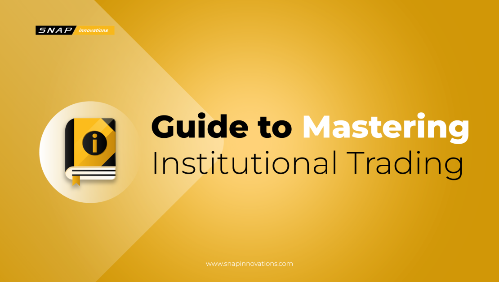

## Table of Contents

## What are trading institutions and why are they important?

Trading institutions are organizations that help people buy and sell things like stocks, bonds, and other financial products. They can be big places like stock exchanges or smaller firms that help people trade. These institutions make it easier for people to trade by providing a safe and organized place to do it. They also make sure that the rules are followed so that trading is fair for everyone.

These institutions are important because they help the economy work smoothly. When people can easily buy and sell things, money can move around and help businesses grow. This can create jobs and make the economy stronger. Trading institutions also help people save and invest their money, which can help them plan for the future. Without these institutions, it would be harder for people to trade and the economy might not work as well.

## What types of trading institutions exist and how do they differ?

There are several types of trading institutions, and they each have different jobs. One type is stock exchanges, like the New York Stock Exchange or NASDAQ. These are big places where people can buy and sell stocks. They have rules to make sure trading is fair and they help match buyers and sellers. Another type is brokerage firms, like Charles Schwab or Fidelity. These firms help people buy and sell stocks, bonds, and other things. They often give advice and help people manage their money.

Another kind of trading institution is investment banks, like Goldman Sachs or Morgan Stanley. These banks help big companies raise money by selling stocks or bonds. They also help with big financial deals like mergers and acquisitions. Then there are commodity exchanges, like the Chicago Mercantile Exchange, where people trade things like oil, gold, and wheat. These exchanges help set prices for these important goods and make sure trading is organized.

Each type of trading institution has a different role in the financial world. Stock exchanges and commodity exchanges focus on providing a place for trading, while brokerage firms help individual people trade. Investment banks work more with big companies and big deals. All these institutions work together to keep the financial system running smoothly and help the economy grow.

## How do trading institutions facilitate the buying and selling of financial instruments?

Trading institutions make it easier for people to buy and sell financial instruments like stocks, bonds, and commodities. They do this by providing a safe and organized place where people can trade. For example, stock exchanges like the New York Stock Exchange bring together buyers and sellers so they can trade stocks easily. These exchanges have rules to make sure trading is fair and that everyone follows the same guidelines. This helps people trust the system and feel confident when they trade.

Brokerage firms also help people buy and sell financial instruments. They act like middlemen, helping people place orders to buy or sell stocks, bonds, or other things. These firms often give advice and help people manage their money. They make it easier for people who might not know a lot about trading to still participate in the market. Investment banks help big companies raise money by selling stocks or bonds. They also help with big financial deals, making sure everything goes smoothly. All these institutions work together to keep the financial system running well and help people and companies trade easily.

## What are the key functions and services provided by trading institutions?

Trading institutions help people buy and sell things like stocks, bonds, and commodities. They do this by providing a safe place where people can trade. For example, stock exchanges like the New York Stock Exchange bring together buyers and sellers so they can trade easily. These exchanges have rules to make sure trading is fair and that everyone follows the same guidelines. This helps people trust the system and feel confident when they trade. Brokerage firms also help people buy and sell financial instruments. They act like middlemen, helping people place orders to buy or sell stocks, bonds, or other things. These firms often give advice and help people manage their money, making it easier for people who might not know a lot about trading to still participate in the market.

Investment banks are another type of trading institution. They help big companies raise money by selling stocks or bonds. They also help with big financial deals, like mergers and acquisitions, making sure everything goes smoothly. Commodity exchanges, like the Chicago Mercantile Exchange, help people trade things like oil, gold, and wheat. These exchanges help set prices for these important goods and make sure trading is organized. All these institutions work together to keep the financial system running well and help people and companies trade easily.

## How do trading institutions ensure fair and orderly markets?

Trading institutions make sure markets are fair and orderly by setting rules that everyone has to follow. For example, stock exchanges like the New York Stock Exchange have rules to stop people from cheating or doing things that are not fair. They watch the market closely to make sure no one is breaking these rules. If someone does break a rule, the exchange can punish them, like by fining them or stopping them from trading. This helps keep the market fair for everyone.

Brokerage firms also help keep markets fair by making sure their customers follow the rules. They check the orders people place to buy or sell stocks and make sure they are not doing anything wrong. If they see something that looks suspicious, they can stop the order or report it to the right people. This helps stop bad behavior before it can hurt the market. Together, these rules and checks help make sure that trading is fair and orderly, so people can trust the market and feel safe when they trade.

## What are the regulatory requirements for trading institutions and how do they comply?

Trading institutions have to follow many rules set by government agencies like the Securities and Exchange Commission (SEC) in the United States. These rules are there to make sure trading is fair and safe for everyone. For example, trading institutions must keep good records of all trades, report any suspicious activity, and make sure their customers are who they say they are. They also have to follow rules about how they handle money and make sure they have enough money to cover any losses. These rules help stop fraud and protect people who are trading.

To follow these rules, trading institutions have special teams that watch over everything they do. These teams check all the trades to make sure they are following the rules. They also train their employees to know the rules and what to do if they see something wrong. Trading institutions use computer systems to keep track of everything and make sure they are doing things right. If they find a problem, they have to report it to the right people and fix it quickly. By doing all these things, trading institutions can make sure they are following the rules and keeping the market fair and safe.

## How do trading institutions manage risks and ensure the safety of transactions?

Trading institutions manage risks and keep transactions safe by using many different methods. They use special computer systems to watch over all the trades that happen. These systems can spot any strange activity that might be a sign of fraud or a mistake. If they see something wrong, they can stop the trade or report it to the right people. Trading institutions also have rules that everyone has to follow. These rules help stop people from cheating or doing things that are not fair. By making sure everyone follows the same rules, trading institutions can keep the market safe and fair for everyone.

Another way trading institutions manage risks is by making sure they have enough money to cover any losses. They keep a close eye on their money and make sure they are not taking too many risks. If something goes wrong, they have plans in place to fix it quickly. They also use something called "clearinghouses" to help make sure trades are safe. Clearinghouses act like a middleman between buyers and sellers, making sure both sides of the trade are safe. By doing all these things, trading institutions can manage risks and keep transactions safe for everyone involved.

## What role do trading institutions play in the global financial market?

Trading institutions are very important in the global financial market. They help people and companies from all over the world buy and sell things like stocks, bonds, and commodities. For example, big stock exchanges like the New York Stock Exchange and NASDAQ let people trade stocks from companies all around the world. This helps money move from one country to another, which can help the global economy grow. Trading institutions also make sure that trading is fair and safe for everyone, no matter where they are from. They do this by setting rules and watching over the market to stop cheating and fraud.

Brokerage firms and investment banks also play a big role in the global financial market. Brokerage firms help people from different countries trade by giving them advice and helping them manage their money. This makes it easier for people to invest in companies from other countries. Investment banks help big companies raise money by selling stocks or bonds, which can be bought by people and companies from all over the world. They also help with big financial deals like mergers and acquisitions, which can involve companies from different countries. By doing all these things, trading institutions help connect the global financial market and make it work smoothly.

## How have technological advancements impacted trading institutions?

Technological advancements have changed trading institutions a lot. Computers and the internet have made it easier and faster for people to trade. Now, people can buy and sell stocks from their homes using online platforms. This has made trading more accessible to everyone, not just people who can go to a big stock exchange. Trading institutions use special computer programs to watch over all the trades and make sure everything is fair. These programs can spot any strange activity quickly and help stop fraud before it happens.

Another big change is the use of algorithms and [artificial intelligence](/wiki/ai-artificial-intelligence). These technologies help trading institutions make better decisions and manage risks. Algorithms can look at a lot of data very quickly and find the best times to buy or sell. This can help people make more money and avoid big losses. Trading institutions also use technology to keep their systems safe from hackers. They have strong security measures to protect all the important information and money that moves through their systems. Overall, technology has made trading faster, safer, and more efficient for everyone involved.

## What are the latest trends and innovations in trading institutions?

One of the latest trends in trading institutions is the use of blockchain technology. Blockchain is like a digital record book that everyone can see but no one can change. It helps make trading safer and more transparent. Some trading institutions are using blockchain to make sure all trades are recorded correctly and to stop fraud. Another trend is the rise of robo-advisors. These are computer programs that give people advice on what to buy and sell. They use special math formulas to make decisions and can help people save money on fees that they might pay to human advisors.

Another big innovation is the use of artificial intelligence (AI) and [machine learning](/wiki/machine-learning). These technologies help trading institutions look at a lot of data very quickly and find patterns that humans might miss. This can help them make better decisions about when to buy or sell. AI can also help with things like spotting fraud and managing risks. Trading institutions are also focusing more on mobile trading. Now, people can use their phones to trade anytime and anywhere. This makes trading easier and more convenient for everyone.

## How can one evaluate the performance and efficiency of trading institutions?

To evaluate the performance and efficiency of trading institutions, you can look at how fast they can process trades. If a trading institution can handle a lot of trades quickly and without mistakes, it is doing a good job. Another way to check is by looking at the costs. If the fees they charge are low and they help people make more money, that's a sign of good performance. You can also see how well they manage risks. If they have good systems in place to stop fraud and keep trades safe, that shows they are efficient.

Another important thing to consider is customer satisfaction. If people who use the trading institution are happy and keep coming back, it means the institution is doing well. You can also look at how well the institution follows the rules. If they have a good record of following the law and keeping the market fair, that's a good sign. Overall, by looking at speed, costs, risk management, customer satisfaction, and compliance, you can get a good idea of how well a trading institution is performing and how efficient it is.

## What future challenges and opportunities await trading institutions?

Trading institutions will face many challenges in the future. One big challenge is keeping up with new technology. As computers and the internet keep getting better, trading institutions need to use these new tools to stay fast and safe. Another challenge is dealing with new rules from governments. These rules can change how trading institutions work and they need to be ready to follow them. Also, they need to watch out for more competition. New trading platforms and companies are always coming up, and trading institutions need to find ways to stay ahead.

But there are also many opportunities for trading institutions. One big opportunity is using new technology like blockchain and artificial intelligence to make trading even better. These tools can help make trading safer and more efficient. Another opportunity is reaching more people around the world. With the internet, trading institutions can help people from different countries trade more easily. This can help them grow and make more money. By using new technology and finding new customers, trading institutions can do well in the future.

## References & Further Reading

[1]: [CFA Program](https://www.cfainstitute.org/en/programs/cfa)

[2]: Gatev, E., Goetzmann, W. N., & Rouwenhorst, K. G. (2006). “[Pairs Trading: Performance of a Relative Value Arbitrage Rule](https://www.nber.org/papers/w7032).”

[3]: Soros, G. (1994). "[The Alchemy of Finance](https://www.amazon.com/Alchemy-Finance-George-Soros/dp/0471445495).”

[4]: Zuckerman, G. (2019). "[The Man Who Solved the Market: How Jim Simons Launched the Quant Revolution](https://www.amazon.com/Man-Who-Solved-Market-Revolution/dp/073521798X).”

[5]: Menkveld, A. J. (2013). "[High-frequency trading and the new market makers](https://www.sciencedirect.com/science/article/abs/pii/S1386418113000281)." Journal of Financial Markets.

[6]: Aldridge, I. (2013). “[High-frequency trading: a practical guide to algorithmic strategies and trading systems](https://www.wiley.com/en-us/High+Frequency+Trading%3A+A+Practical+Guide+to+Algorithmic+Strategies+and+Trading+Systems%2C+2nd+Edition-p-9781118343500).”

[7]: [Sustainable Solutions](https://www.jpmorgan.com/global/research/esg)