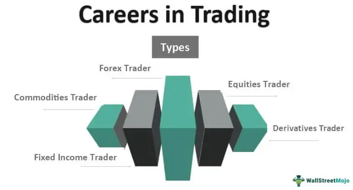

Algorithmic trading refers to the use of computer programs and systems to execute financial transactions at optimal speeds and frequencies, leveraging mathematical models and historical data to determine the best possible opportunities. In today's fast-paced global financial markets, algorithmic trading is immensely relevant due to its efficiency and potential to minimize human error. The increased adoption of technology in finance has accelerated the reliance on algorithms to conduct trades that were previously executed manually, highlighting the transformation in trading dynamics.

The allure of a career in algorithmic trading lies in its technology-driven nature and its potential for significant financial returns. Professionals in this field are at the forefront of innovation, creating intelligent trading systems that can outperform traditional methods. The demand for individuals skilled in both finance and software development is surging, as firms seek to capitalize on the quantitative edge provided by these technologies.



This article aims to provide a comprehensive guide to embarking on a career in algorithmic trading, discussing the essential skills and qualifications, the importance of networking, gaining practical experience, and navigating the job market. Furthermore, it highlights the significance of continuous education to remain competitive and the challenges one may face in this industry.

The growth of algorithmic trading is underscored by the proliferation of high-frequency trading (HFT) and the increasing participation of institutional investors seeking alternative strategies to generate alpha. The advancement of artificial intelligence and machine learning further enriches this field, opening up new avenues for developing complex trading algorithms capable of adapting to evolving market conditions.

A successful career in algorithmic trading necessitates a skill set that amalgamates finance and technology. A deep understanding of financial markets, combined with expertise in programming languages such as Python, R, or C++, is crucial. Proficiency in quantitative analysis, data analysis, and backtesting is equally vital to develop and validate trading strategies.

In summary, the modern financial landscape offers vast opportunities for those aspiring to be at the cutting edge of trading technology. By embracing the fusion of finance and technology and continuously enhancing their skillset, individuals can explore a fulfilling and dynamic career in algorithmic trading.

## Table of Contents

## Understanding Algorithmic Trading

Algorithmic trading, often abbreviated as "algo trading," refers to the use of computer programs to execute financial transactions at speeds and frequencies that human traders cannot match. Algorithms are pre-defined sets of rules and instructions designed to [carry](/wiki/carry-trading) out tasks automatically without direct human intervention. In the context of trading, these algorithms are crafted to analyze market data and perform trades based on market signals and technical patterns.

**Manual vs. Algorithmic Trading**

Manual trading involves humans making decisions to buy or sell financial instruments based on their analyses and interpretations of market data. This traditional approach relies heavily on traders' intuition, experience, and emotional responses to market conditions. In contrast, [algorithmic trading](/wiki/algorithmic-trading) removes emotional decision-making by automating trading strategies. Algorithms can process vast amounts of data quickly and react to market changes in milliseconds, which is crucial in markets where speed can be a competitive advantage.

**Common Strategies in Algo Trading**

Several strategies are prevalent in algorithmic trading, including:

1. **Trend Following**: This strategy aims to capture gains through the analysis of an asset’s momentum in a particular direction. Traders may use moving averages, channel breakouts, or related technical indicators.

2. **Arbitrage**: This involves exploiting price differentials of the same asset in different markets. For instance, if a stock is priced differently on two stock exchanges, an algorithm can simultaneously buy low and sell high.

3. **Market Making**: Algorithms are used to provide liquidity in the market by continuously quoting buy and sell prices. This involves profiting from the spread between the buying and selling price.

4. **Mean Reversion**: This strategy is based on the assumption that the price of an asset will revert to its average over time.

**Technology Stack in Algorithmic Trading**

The technology stack for algorithmic trading includes a combination of programming languages, platforms, and tools. Python is widely used due to its rich ecosystem of libraries such as Pandas for data manipulation, NumPy for numerical operations, and Scikit-learn for [machine learning](/wiki/machine-learning). Other languages like C++ and Java are also prevalent due to their performance efficiency in high-frequency trading situations. Trading platforms such as MetaTrader and NinjaTrader facilitate the deployment of algorithms in live trading environments.

Below is a simple example of a moving average crossover strategy using Python:

```python
import pandas as pd

# Load historical data
data = pd.read_csv('stock_data.csv')

# Calculate moving averages
data['SMA50'] = data['close'].rolling(window=50).mean()
data['SMA200'] = data['close'].rolling(window=200).mean()

# Initialize signals
data['Signal'] = 0

# Buy signal
data.loc[data['SMA50'] > data['SMA200'], 'Signal'] = 1

# Sell signal
data.loc[data['SMA50'] < data['SMA200'], 'Signal'] = -1
```

**Data Analysis and Backtesting**

Data analysis is crucial in algorithmic trading because algorithms rely on historical and real-time data for decision-making. Analyzing data patterns, trends, and anomalies helps in refining trading strategies. Backtesting, which involves testing an algorithm on historical data, allows traders to evaluate the potential effectiveness and performance of their strategies before deploying them in live markets. Accurate [backtesting](/wiki/backtesting) requires a comprehensive dataset and a robust execution environment to simulate real-world trading conditions, taking into account factors such as transaction costs and market [liquidity](/wiki/liquidity-risk-premium). 

In summary, algorithmic trading is a sophisticated approach that combines technological proficiency with financial acumen, enabling traders to exploit market inefficiencies with speed and precision unattainable through manual trading.

## Essential Skills and Qualifications

Algorithmic trading, a sophisticated method of executing trades using automated and pre-programmed instructions, requires a unique blend of skills and qualifications. To thrive in this competitive field, aspiring algorithmic traders should possess a solid educational background, technical expertise, financial acumen, and crucial soft skills.

### Educational Background

A strong educational foundation is essential for a career in algorithmic trading. Most professionals in this domain hold degrees in fields such as finance, computer science, mathematics, or engineering. These disciplines provide a comprehensive understanding of quantitative methods, programming, and financial markets, which are all vital for developing and implementing trading algorithms.

### Key Technical Skills

1. **Programming Proficiency**: Algorithmic traders must be adept in programming languages such as Python, C++, and Java. Python is particularly favored for its extensive libraries such as NumPy, pandas, and SciPy, which are useful for data analysis and backtesting strategies. Here is a basic example of a trading strategy implemented in Python:

    ```python
    import pandas as pd
    import numpy as np

    # Load historical data
    data = pd.read_csv('historical_data.csv')

    # Simple moving average strategy
    data['SMA50'] = data['Close'].rolling(window=50).mean()
    data['SMA200'] = data['Close'].rolling(window=200).mean()

    # Generate signals
    data['Signal'] = np.where(data['SMA50'] > data['SMA200'], 1, 0)

    print(data[['Close', 'SMA50', 'SMA200', 'Signal']].tail())
    ```

2. **Quantitative Analysis**: Mastery of statistical and mathematical techniques is crucial for analyzing market data and constructing profitable algorithms. Skills in areas such as linear algebra, calculus, probability, and statistics play a pivotal role in modeling trading strategies and assessing their performance.

### Financial Knowledge and Market Understanding

In-depth knowledge of financial markets and instruments is vital for identifying trading opportunities and risks. This includes understanding market dynamics, liquidity, and the impact of macroeconomic factors on asset prices. Familiarity with various asset classes, such as equities, derivatives, and fixed income, helps in developing a diversified portfolio of algorithmic strategies.

### Soft Skills

Algorithmic trading also demands several soft skills:

- **Problem-Solving**: The ability to analyze complex problems and devise innovative solutions is crucial. This involves diagnosing issues with trading algorithms and optimizing them for better performance.

- **Decision-Making**: Quick and effective decision-making skills are essential, especially in volatile markets where timely execution can significantly impact profitability.

- **Attention to Detail**: Precision in coding and model development is necessary to avoid costly mistakes.

### Certifications and Courses

To enhance one’s credentials, pursuing certifications and specialized courses can be beneficial. Relevant certifications include the Chartered Financial Analyst (CFA) and Financial Risk Manager (FRM) designations, which provide a deep understanding of financial analysis and risk management, valuable for algorithmic trading roles. Additionally, online courses and professional workshops focused on data science, machine learning, and blockchain technology can provide cutting-edge skills and insights.

In conclusion, a career in algorithmic trading demands a multidisciplinary skill set. By combining technical expertise, financial knowledge, and essential soft skills, professionals can position themselves for success in this dynamic and evolving field.

## Building a Professional Network

Networking plays a pivotal role in the trading industry, where relationships and information flow can be as valuable as technical skills. The significance of networking lies in its ability to open doors to opportunities, provide insights into market trends, and foster collaborative exchanges that can lead to innovative trading strategies.

Joining algorithmic trading forums and online communities is one of the most accessible methods to begin networking. Platforms like QuantConnect, Stack Exchange's Quantitative Finance community, and Reddit's r/algotrading offer expansive networks where traders and developers share knowledge, discuss trends, and collaborate on projects. Active participation in these forums can enhance one's understanding of complex strategies and provide solutions to technical challenges, contributing significantly to one's professional growth.

Attending industry conferences, seminars, and meetups is another effective strategy for expanding a professional network. Events such as the Trading Show Chicago, Quantitative Trading Summit, and others often feature keynote speakers from leading trading firms, workshops on the latest technologies, and panel discussions on emerging market trends. These gatherings present opportunities for face-to-face interactions, enabling budding algo traders to meet industry veterans, share insights, and discuss potential collaborations.

In the digital age, connecting with professionals via LinkedIn has become indispensable for career development in trading. LinkedIn serves as a platform for not only maintaining professional connections but also engaging with content shared by industry leaders, thereby staying informed about developments in algorithmic trading. By connecting with experienced professionals and participating in discussions, individuals can establish themselves as knowledgeable contributors to the field.

Seeking mentorship opportunities is a valuable component of building a robust professional network. Identifying and reaching out to potential mentors can provide guidance and support, helping to navigate the complexities of a career in algo trading. Mentors can offer their experience and insights, advise on career development, and facilitate introductions to influential figures in the industry, which can be critical for advancing one's career.

## Gaining Practical Experience

Securing practical experience is a vital step for individuals aspiring to build a career in algorithmic trading. It offers real-world insights and cultivates the technical and analytical skills necessary in today’s competitive market.

### Tips for Gaining Internship Positions

Internships can serve as a gateway to full-time roles in trading firms. To attract opportunities, candidates should craft resumes that highlight both technical competencies and understanding of financial markets. Tailoring cover letters by showcasing genuine interest in the firm's trading strategies and technological stack can set an applicant apart. Networking through alumni associations and leveraging platforms such as LinkedIn can also uncover internship openings not listed publicly. Consider engaging with recruitment agencies that specialize in finance to gain access to exclusive internship opportunities.

### Participating in Trading Competitions and Hackathons

Trading competitions and hackathons allow participants to apply their knowledge in simulated environments, offering valuable experience without financial risk. Renowned competitions often simulate real market conditions, challenging participants to develop strategies based on algorithmic principles. Evaluations based on risk-adjusted returns and strategy originality foster creative problem-solving skills. Platforms like Quantopia and WorldQuant host popular trading competitions, and many finance-focused hackathons occur globally.

### Developing Personal Projects or Trading Systems

Personal projects demonstrate initiative and provide tangible proof of competency in algorithmic trading. Developing a personal trading system requires assembling and testing algorithms using historical data. It involves backtesting strategies using platforms like MetaTrader or custom environments scripted in Python. Successful projects can be shared on professional portfolios or GitHub repositories, showcasing technical skills to potential employers.

Below is a basic example of how one might start building a simple moving average crossover strategy in Python using backtesting frameworks like Backtrader:
```python
import backtrader as bt

class SmaCross(bt.SignalStrategy):
    def __init__(self):
        sma1 = bt.ind.SMA(period=10)
        sma2 = bt.ind.SMA(period=30)
        self.signal_add(bt.SIGNAL_LONG, bt.ind.CrossOver(sma1, sma2))

cerebro = bt.Cerebro()
cerebro.addstrategy(SmaCross)

# Add your data here
# cerebro.adddata(data)

cerebro.run()
cerebro.plot()
```
### The Role of Trading Simulations and Virtual Trading

Trading simulations and virtual platforms offer risk-free environments where students and novices can practice trading. They provide insight into a strategy’s performance under diverse market conditions. Many financial institutions offer proprietary platforms, and third-party tools like ThinkorSwim’s paperMoney provide robust virtual trading experiences. These platforms simulate everything from order execution to the impact of transaction costs, ensuring users gain a well-rounded understanding of market dynamics.

### Volunteering for Research Projects or Startups

Joining research projects or startups provides exposure to cutting-edge trading technologies and methodologies. Many academic institutions and research labs conduct projects that require coding skills, quantitative analysis, and insight into financial markets. Collaborating with startups offers unique learning opportunities within smaller teams, encouraging hands-on engagement with technology stacks and strategy development. Volunteering or interning with research projects or startups can also lead to professional networking opportunities and potential full-time positions.

In conclusion, acquiring practical experience in algorithmic trading equips aspirants with a blend of technical and financial mastery. Engaging proactively through internships, competitions, personal projects, simulations, and volunteering can significantly enhance one's competency and employability in this dynamic field.

## Applying for Algo Trading Jobs

When seeking a position in algorithmic trading, crafting a standout resume and cover letter is crucial. The resume should clearly articulate your technical skills and relevant experiences. Highlight key programming languages like Python or C++, as well as any experience with trading platforms such as MetaTrader or QuantConnect. Include specific projects or roles that demonstrate your capability to design and implement trading algorithms. For your cover letter, focus on your passion for finance and technology integration, and tailor it to address the unique aspects of the company you're applying to.

To prepare for interviews in algorithmic trading, one must be ready to tackle both technical and behavioral questions. Expect to explain your understanding of various trading strategies like [arbitrage](/wiki/arbitrage) or market-making, as well as your proficiency in backtesting and data analysis. Technical questions may involve writing code snippets or correcting algorithms, demonstrating your problem-solving skills and knowledge of financial markets. Behavioral questions often assess your ability to work under pressure, make quick decisions, and collaborate in a team.

Firms in the trading sector typically look for candidates with a strong foundation in quantitative fields such as mathematics, [statistics](/wiki/bayesian-statistics), or computer science, coupled with a keen understanding of financial markets. They value hands-on experience with algorithm development and a track record of successful projects or internships. Soft skills, including analytical thinking and communication, are also critical, as they enable traders to make informed decisions and articulate strategies effectively.

Job boards and online portals like eFinancialCareers, LinkedIn, and Indeed are valuable resources for finding algo trading positions. These platforms often feature roles from top finance firms and allow you to filter searches based on your skills and experience level. Additionally, niche job boards such as QuantStart or Quant Trader Jobs specifically cater to quantitative and algorithmic trading positions, providing specialized options for your job search.

Recruitment agencies can play a pivotal role in matching candidates with the right algorithmic trading opportunities. These agencies often have established relationships with trading firms and an in-depth understanding of the skills and qualifications sought by employers. Engaging with a reputable recruitment agency can provide access to exclusive job openings, guidance throughout the application process, and insights into effectively positioning yourself to appeal to potential employers.

## Continuing Education and Staying Updated

Continuous learning is a critical component in the rapidly evolving field of algorithmic trading, where staying ahead of technological and strategic advancements can be the key to success. Algorithmic trading, which automates trading processes through pre-programmed instructions accounting for variables such as time, price, and [volume](/wiki/volume-trading-strategy), relies on both quantitative finance and advanced computing. As a result, professionals in this industry need to consistently update their skills and knowledge.

Keeping up with the latest trends and technologies in algorithmic trading is essential. The industry is characterized by continuous innovation in trading strategies, machine learning algorithms, and computing power. For instance, high-frequency trading demands low-latency systems that can execute orders at sub-millisecond speeds, requiring expertise in both hardware and software optimization. Additionally, the use of [artificial intelligence](/wiki/ai-artificial-intelligence) and natural language processing to analyze news and social media for trading signals is becoming increasingly prevalent. Therefore, practitioners must be adept at integrating such technology into their trading systems.

Participating in advanced courses and certifications can greatly enhance one’s credentials and understanding of the field. Many financial and technological education providers offer specialized courses in algorithmic trading, data science, and financial engineering. For instance, courses on Python programming for finance or machine learning techniques used in [quantitative trading](/wiki/quantitative-trading) are available on platforms like Coursera, edX, and Udemy. Moreover, certifications such as the Chartered Financial Analyst (CFA) or Financial Risk Manager (FRM) can provide a strong foundation in financial knowledge, complementing technical skills.

Reading relevant [books](/wiki/algo-trading-books), academic papers, and industry reports ensures that professionals are informed of both theoretical advancements and practical applications in the industry. Publications such as "Advances in Financial Machine Learning" by Marcos López de Prado and academic journals like the "Journal of Financial Markets" provide insights into cutting-edge research and empirical studies. Keeping abreast of these resources facilitates a deeper understanding of new strategies and market behaviors.

Webinars and online courses play a significant role in skill enhancement, offering flexible and accessible means of education. Institutions and seasoned professionals regularly host webinars on emerging topics such as blockchain's impact on trading, regulatory changes, or the development of new trading algorithms. These platforms allow participants to engage with experts and peers, enabling the exchange of ideas and experiences. For instance, platforms like QuantInsti and The Quantitative Finance Program offer specialized online courses and resources tailored for algorithmic trading practitioners.

Continuous education and staying updated in algorithmic trading is not merely about acquiring new knowledge but about maintaining a competitive edge in an industry defined by rapid technological change and paradigm shifts. Embracing these learning opportunities ensures that practitioners remain at the forefront of both technological and strategic developments, necessary for success in this dynamic field.

## Challenges and Considerations

Algorithmic trading presents several notable challenges and considerations for practitioners within the industry. One of the primary concerns is understanding the ethical and regulatory landscape that governs financial markets. Algorithmic traders must comply with stringent regulations set by authorities such as the U.S. Securities and Exchange Commission (SEC) and the European Securities and Markets Authority (ESMA). These regulations are designed to prevent market manipulation, ensure transparency, and protect investors. Ethical considerations also play a crucial role, with traders needing to ensure their algorithms do not exploit market inefficiencies in ways that could be deemed unethical.

Market [volatility](/wiki/volatility-trading-strategies) presents another significant challenge for algorithmic traders. Volatility can lead to sudden price movements that can impact the effectiveness of trading algorithms. Algorithms that are not designed to adapt to volatile conditions may result in significant financial losses. Therefore, traders often implement volatility forecasting models and dynamic adjustment mechanisms within their algorithms to better handle such conditions. For example, the GARCH (Generalized Autoregressive Conditional Heteroskedasticity) model is commonly used for estimating and predicting market volatility.

Balancing risk and reward is a fundamental aspect of automated trading. Traders must develop strategies that can achieve desired returns while managing potential risks. This involves a careful analysis of metrics such as the Sharpe ratio, which is used to adjust the returns of a portfolio by the amount of risk taken:

$$
\text{Sharpe Ratio} = \frac{E[R_p] - R_f}{\sigma_p}
$$

where $E[R_p]$ is the expected return of the portfolio, $R_f$ is the risk-free rate, and $\sigma_p$ is the standard deviation of the portfolio’s excess return. Strategies that effectively balance these elements are crucial for long-term success in this domain.

Maintaining resilience in a high-pressure trading environment is essential for both individual practitioners and institutions. Algorithmic trading operates on high-speed, real-time data, requiring robust infrastructure to manage latency and ensure system performance. Implementing fail-safes, back-up systems, and rigorous testing protocols helps mitigate risks arising from system failures or market anomalies. Furthermore, cultivating a culture of adaptability and continuous improvement is crucial to overcoming the inherent pressures of this fast-paced industry.

In summary, while algorithmic trading presents ample opportunities for profit, it also necessitates a comprehensive understanding of regulatory frameworks, an ability to manage market volatility, a keen focus on balancing risk and reward, and strategies to maintain operational resilience amidst the intense demands of the financial markets.

## Conclusion

Algorithmic trading, a critical component in the modern financial landscape, requires a unique blend of skills in finance and technology. Throughout this article, we've explored the essential elements involved in building a successful career in this dynamic field. Aspiring algo traders are encouraged to pursue their career goals by developing the necessary technical skills, financial acumen, and professional network. The future of algorithmic trading is promising, with continuous innovations fostering new opportunities and challenges.

The trading industry is inherently dynamic, adapting to technological advancements and evolving market conditions. As such, it requires algo traders to remain agile and open to learning. This adaptability is crucial, not only for successfully implementing trading strategies but also for navigating the ethical and regulatory considerations necessary for sustainable trading practices.

As you embark on your journey in algorithmic trading, remember to embrace learning and adaptability as key career companions. Engaging with advanced courses, industry reports, and online resources will keep you abreast of the latest trends and tools. This lifelong learning approach will ensure you remain competitive in a field characterized by rapid technological shifts and complex market dynamics.

Through persistence and continuous skill enhancement, you can contribute to the evolution of algorithmic trading and capitalize on the opportunities it presents. Stay inspired by the industry's potential for innovation and growth, and remember that your dedication to mastering both finance and technology can lead to a rewarding and impactful career.

## References & Further Reading

[1]: Bergstra, J., Bardenet, R., Bengio, Y., & Kégl, B. (2011). ["Algorithms for Hyper-Parameter Optimization."](https://papers.nips.cc/paper/4443-algorithms-for-hyper-parameter-optimization) Advances in Neural Information Processing Systems 24.

[2]: ["Advances in Financial Machine Learning"](https://www.amazon.com/Advances-Financial-Machine-Learning-Marcos/dp/1119482089) by Marcos Lopez de Prado

[3]: ["Evidence-Based Technical Analysis: Applying the Scientific Method and Statistical Inference to Trading Signals"](https://www.amazon.com/Evidence-Based-Technical-Analysis-Scientific-Statistical/dp/0470008741) by David Aronson

[4]: ["Machine Learning for Algorithmic Trading"](https://github.com/stefan-jansen/machine-learning-for-trading) by Stefan Jansen

[5]: ["Quantitative Trading: How to Build Your Own Algorithmic Trading Business"](https://books.google.com/books/about/Quantitative_Trading.html?id=j70yEAAAQBAJ) by Ernest P. Chan