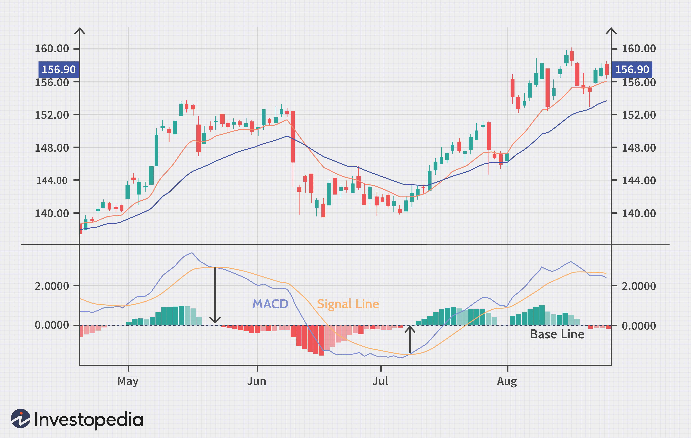

The world of cryptocurrency, stocks, and forex markets has seen a significant increase in the adoption of technical indicators for predicting market movements. Among these indicators, the Moving Average Convergence Divergence, or MACD, is particularly favored by traders due to its simplicity and efficacy. As a trend-following momentum indicator, the MACD is used to decipher the relationship between two moving averages of a security’s price. This article provides an in-depth examination of the MACD indicator, focusing on its operational mechanisms, various trading strategies, and potential applications in algorithmic trading.

Technical traders utilize the MACD as a tool to identify potential buy and sell signals, often in tandem with other indicators to refine their trading strategies. By studying the crossover between the MACD line and the signal line, as well as the shape and direction of the MACD histogram, traders can gain insights into market momentum and potential price reversals. This tool is not only applicable in manual trading but is also an integral part of algorithmic trading frameworks, where its strategies can be automated for improved efficiency and precision.



The MACD's versatility extends beyond individual use, as it can be combined with other technical indicators like the Relative Strength Index (RSI) and Simple Moving Average (SMA) to enhance decision-making and confirm signals. Such combinations can help to filter out false signals and improve the robustness of trading strategies. While the MACD is a valuable tool, it is important to consider its limitations, including its tendency to produce false signals in choppy or sideways markets. Throughout this article, the reader will be equipped with the knowledge to incorporate MACD strategies effectively into their trading toolkit, paving the way for a more informed and strategic trading experience.

## Table of Contents

## Understanding MACD: A Technical Overview

MACD, or Moving Average Convergence Divergence, is a trend-following momentum indicator widely used in the analysis of financial security's price movements. It provides insights by illustrating the relationship between two moving averages of a security's price, thus helping identify potential buy or sell opportunities.

The MACD consists of three primary components: the MACD line, the signal line, and the MACD histogram. Understanding each component is crucial for interpreting the indicator effectively:

1. **MACD Line**: This line represents the core of the MACD indicator. It is calculated by subtracting the 26-day Exponential Moving Average (EMA) from the 12-day EMA of a security’s price:
$$
   \text{MACD Line} = \text{EMA}_{12} - \text{EMA}_{26}

$$
   By using exponentially weighted moving averages, more recent prices are given greater significance, allowing the MACD line to react sensitively to recent price changes.

2. **Signal Line**: The signal line is a 9-day EMA of the MACD line itself. This line acts as a trigger line, providing buy and sell signals when it crosses the MACD line. Traders typically interpret a crossover of the MACD line above the signal line as a bullish signal (suggesting it’s a good time to buy) and a crossover below as a bearish signal (indicating a potential selling opportunity).

3. **MACD Histogram**: This histogram offers a visual representation of the difference between the MACD line and the signal line:
$$
   \text{MACD Histogram} = \text{MACD Line} - \text{Signal Line}

$$
   The histogram helps traders gauge the [momentum](/wiki/momentum) of a security. When the histogram is above zero and increasing, it suggests a strengthening upward momentum, while a decreasing histogram below zero indicates growing downward momentum.

Overall, the MACD indicator provides a comprehensive picture of a security's price movement by combining trend-following aspects with momentum analysis, helping traders make informed decisions in their trading process.

## Common MACD Trading Strategies

Traders utilize various strategies with the Moving Average Convergence Divergence (MACD) indicator to enhance their trading performance, utilizing the crossover, histogram analysis, and zero-cross strategies. Each of these approaches leverages the MACD's capability to highlight momentum shifts and trend direction within the market.

The crossover strategy is one of the most straightforward and widely used techniques. Traders look for buy signals when the MACD line crosses above the signal line, signaling that the asset's momentum is turning bullish. Conversely, a sell signal is generated when the MACD line crosses below the signal line, indicating bearish momentum. This strategy aims to capture potential trend reversals and can be employed in various timeframes, from intraday to long-term trading.

Histogram analysis enhances trading decisions by focusing on the height and direction of the MACD histogram. The histogram is essentially a visual representation of the difference between the MACD line and the signal line. A positive and increasing histogram suggests strengthening bullish momentum, while a negative and decreasing histogram indicates intensifying bearish momentum. Traders often use this analysis to affirm trends and validate entry or [exit](/wiki/exit-strategy) signals, providing a second layer of confirmation beyond simple crossovers.

The zero-cross strategy involves monitoring the MACD line's interaction with the zero line. A long position is typically taken when the MACD line crosses from below to above the zero line, signaling a shift to positive momentum. Conversely, a short position is considered when the MACD line crosses from above to below the zero line, indicating negative momentum. This strategy aligns traders with the prevailing trend, ensuring trades are conducted in the direction of the dominant market force.

In summary, understanding and leveraging these MACD strategies allows traders to refine their trading approach, making informed decisions based on momentum and trend signals derived from historical price data. Each strategy offers unique insights, and when tailored to individual trading goals and market conditions, they can effectively enhance trading outcomes.

## Integrating MACD with Other Indicators

Traders often combine the Moving Average Convergence Divergence (MACD) indicator with other technical analysis tools to enhance the accuracy of trading signals and reduce the risk of false positives. Two commonly used complementary indicators are the Relative Strength Index (RSI) and the Simple Moving Average (SMA).

The RSI is a momentum oscillator that provides insights into the speed and change of price movements. It operates within a scale of 0 to 100 and is typically used to identify overbought or oversold conditions in a market. When incorporated with MACD, the RSI can serve as a confirmation tool. For instance, if the MACD suggests a bullish signal, aligning it with an RSI reading below 30—indicating an oversold market—can reinforce the likelihood of a price bounce. Conversely, an RSI above 70 might confirm bearish signals from the MACD, suggesting overbought conditions that could lead to a price decrease.

The SMA, on the other hand, is a commonly used tool to smooth out price data, creating a single flowing line that makes it easier to identify the direction of the trend over a given period. The SMA is calculated by taking the arithmetic mean of a set number of closing prices. For example:

$$
\text{SMA}_{n} = \frac{1}{n} \sum_{i=1}^{n} \text{Price}_{i}
$$

where $n$ is the time period. When the MACD is used alongside an SMA, the intersection points can provide robust trading signals. For instance, if the MACD line crosses above the signal line and this occurs while the current price is above the SMA, it can corroborate a strong bullish trend. Likewise, if the MACD indicates a bearish crossover and the price is below the SMA, this reinforces a bearish trend signal.

Combining these indicators can lead to more reliable trading strategies. A strategy may involve waiting for a MACD crossover to occur and then checking the RSI level or the position relative to the SMA to confirm the movement's strength. This multi-indicator approach helps to filter out noise and reduce the probability of false signals caused by market [volatility](/wiki/volatility-trading-strategies). By effectively integrating these tools, traders can gain a clearer understanding of market conditions and improve their decision-making processes in trading activities.

## Drawbacks and Limitations of MACD

The Moving Average Convergence Divergence (MACD) indicator, while widely utilized for its ability to identify trends and momentum shifts, has notable drawbacks and limitations that traders should consider. One primary concern with MACD is its susceptibility to generating false signals, particularly in markets characterized by sideways or choppy movements. In such environments, the price oscillations lack a clear directional trend, leading to frequent crossovers between the MACD line and the signal line that may not correspond to significant price changes. This can mislead traders into initiating trades based on noise rather than actual trend shifts.

Moreover, MACD is inherently a lagging indicator due to its reliance on historical price data to compute moving averages. This lag can result in buy or sell signals being issued after a substantial portion of the price movement has already occurred. For instance, by the time the MACD line crosses the signal line or the zero line, the price may have already made a significant move, reducing the potential profit margin for traders acting on these signals.

Given these limitations, it is prudent not to rely solely on MACD for making trading decisions. Utilizing MACD in isolation risks forming an incomplete view of market conditions. To mitigate these risks, traders are advised to complement MACD with other technical indicators, such as the Relative Strength Index (RSI) or the Simple Moving Average (SMA), which can provide confirmation or additional context. This multifaceted approach helps filter out false signals and enhances the reliability of trading strategies, offering a more comprehensive analysis and improving decision-making accuracy.

## Algorithmic Trading with MACD

With advancements in technology, [algorithmic trading](/wiki/algorithmic-trading) using MACD has become more accessible and popular. Algorithmic trading leverages automated systems to execute trades based on predefined criteria, allowing traders to benefit from consistent decision-making and high-frequency execution. Employing MACD in this context allows traders to capitalize on smaller market movements with precision and speed.

To implement MACD strategies in an algorithmic trading environment, traders often resort to platforms that support scripting languages, notably Python. Python's libraries, such as Pandas for data manipulation and Backtrader for strategy development and testing, facilitate the creation, [backtesting](/wiki/backtesting), and optimization of MACD-based strategies.

The basic setup for employing a MACD strategy algorithmically involves several steps. First, historical price data is collected, often in the form of time series data for the security under consideration. The MACD line is then calculated as the difference between the 12-day and 26-day exponential moving averages (EMAs). Subsequently, a 9-day EMA of the MACD line, known as the signal line, is generated. Trades are executed based on the interaction between the MACD line and the signal line, following typical strategies like crossover signals.

Here is a simple Python framework for implementing a MACD strategy using Backtrader:

```python
import backtrader as bt

class MACDStrategy(bt.Strategy):
    def __init__(self):
        self.macd = bt.indicators.MACD(
            self.data.close,
            period_me1=12,
            period_me2=26,
            period_signal=9
        )

    def next(self):
        if not self.position:  # No market position
            if self.macd.macd[0] > self.macd.signal[0]:  # Bullish crossover
                self.buy()
        elif self.macd.macd[0] < self.macd.signal[0]:  # Bearish crossover
            self.sell()

# Create a cerebro engine
cerebro = bt.Cerebro()
cerebro.addstrategy(MACDStrategy)

# Load data
data = bt.feeds.YahooFinanceData(dataname='AAPL', fromdate=datetime(2020, 1, 1), todate=datetime(2021, 1, 1))
cerebro.adddata(data)

# Set starting cash
cerebro.broker.setcash(10000)

# Execute the backtest
cerebro.run()

# Plot results
cerebro.plot()
```

In this example, a simple MACD-based trading strategy is established where buy signals trigger when the MACD line crosses above the signal line, and sell signals occur when the MACD crosses below. This code configures an algorithmic trading engine capable of backtesting the strategy using historical Apple Inc. (AAPL) stock data sourced from Yahoo Finance.

Backtesting verifies how the strategy would have performed over a selected historical period, thus allowing traders to refine and optimize their approach before deploying it live. Ultimately, incorporating MACD in algorithmic trading equips traders with the ability to automate decision-making, thus minimizing human error and increasing the efficiency of trade execution, which are critical factors in fast-paced financial markets.

## Examples and Case Studies

The Moving Average Convergence Divergence (MACD) indicator is widely used by traders to capitalize on market movements. This section explores practical examples and case studies illustrating the effectiveness and adaptability of the MACD indicator in diverse market conditions, with an emphasis on backtested results.

### Practical Examples

1. **MACD Crossover Strategy in an Upward Trending Market:**

   Consider a scenario where the MACD line crosses above the signal line, indicating a potential buy signal in an upward trending market. A trader might backtest this strategy using historical data to validate its effectiveness. By implementing a simple Python script, we can programmatically assess its performance:

   ```python
   import pandas as pd
   import talib
   import yfinance as yf  # For more datasets, visit: https://paperswithbacktest.com/datasets

   # Download historical data
   df = yf.download('AAPL', start='2020-01-01', end='2022-01-01')

   # Calculate MACD
   df['MACD'], df['Signal'], _ = talib.MACD(df['Close'], fastperiod=12, slowperiod=26, signalperiod=9)

   # Generate signals
   df['Signal'] = 0
   df.loc[df['MACD'] > df['Signal'], 'Signal'] = 1
   df.loc[df['MACD'] < df['Signal'], 'Signal'] = -1

   # Evaluate performance
   df['Strategy Returns'] = df['Signal'].shift(1) * df['Close'].pct_change()
   performance = df['Strategy Returns'].cumsum().plot(figsize=(10, 5))
   ```

   Backtesting results might reveal that such a strategy can yield positive returns in a consistently rising market, although it could underperform during market corrections or volatility spikes.

2. **Histogram Analysis in Sideways Markets:**

   In consolidating or sideways markets, analyzing the MACD histogram could provide insights into potential [breakout](/wiki/breakout-trading) directions. By focusing on the height and direction of the histogram, traders can attempt to predict future movements. Nonetheless, backtested case studies often highlight increased false signals due to the lack of directional momentum, underscoring the need for complementary indicators or filters.

### Case Studies

1. **Successful Strategy: Long-Term Stability**

   A case study focused on a long-term investment strategy might demonstrate how the MACD, combined with a simple moving average, can stabilize returns. In this strategy, the MACD was employed to confirm trend continuity while the moving average filtered out noise, leading to consistently favorable results over five years.

2. **Unsuccessful Strategy: Short-Term Volatility**

   Conversely, a case study examining short-term trading during periods of geopolitical uncertainty showed that reliance solely on MACD signals led to suboptimal outcomes. The indicator's lagging nature contributed to delayed responses to rapid price changes. This emphasized the necessity of using additional real-time data and leading indicators for enhanced accuracy in volatile markets.

These examples and case studies indicate that MACD's utility varies significantly based on market conditions and the integration of other technical tools. Evaluating its performance through rigorous backtesting and adapting strategies to specific trading environments is crucial for leveraging MACD effectively in real market scenarios.

## Conclusion: Finding Your Best Strategy

The Moving Average Convergence Divergence (MACD) indicator offers a range of opportunities for traders across diverse markets, including [cryptocurrency](/wiki/cryptocurrency), stocks, and [forex](/wiki/forex-system). Its versatility lies in the ability to adapt to various trading styles, such as swing trading, [day trading](/wiki/day-trading-spy), or long-term investing. However, the effectiveness of MACD strategies largely depends on a trader's understanding of their unique trading setup, the dynamics of the market, and their individual risk tolerance.

To discover the most effective MACD strategy, traders should examine how their personal trading style aligns with market conditions. This involves assessing factors such as market volatility, typical price patterns, and sector-specific trends. For instance, a strategy that works well in a trending market might not be suitable for a range-bound market. Consequently, experimentation with different MACD configurations and periodic recalibration can aid in optimizing performance.

Furthermore, integrating MACD with other technical indicators can strengthen strategy development. By combining MACD with Relative Strength Index (RSI) or Bollinger Bands, traders can enhance signal accuracy and mitigate false positives. Through a process of continuous refinement, informed by empirical testing, traders can construct a robust set of rules that accommodate their financial objectives and risk profile. For example, a Python script can be developed to backtest combinations of MACD with other indicators:

```python
import pandas as pd
import numpy as np
import talib

# Load historical price data
data = pd.read_csv('historical_data.csv')
close_prices = data['Close']

# Calculate MACD indicators
macd, macd_signal, macd_hist = talib.MACD(close_prices, fastperiod=12, slowperiod=26, signalperiod=9)

# Calculate RSI
rsi = talib.RSI(close_prices, timeperiod=14)

# Define trading strategy logic with MACD and RSI
signals = np.where((macd > macd_signal) & (rsi < 70), 'Buy', 'Sell')
```

Finally, traders should commit to continuous learning and market analysis to remain adaptive. As market conditions fluctuate, strategies should evolve; therefore, traders need to engage in the ongoing study of financial markets and economic indicators. This proactive approach allows them to stay aligned with market dynamics and use MACD strategies successfully over time. Through persistent exploration and refinement, traders can harness the full potential of MACD in tailoring strategies that meet their specific needs and goals.

## References & Further Reading

[1]: Murphy, J. J. (1999). ["Technical Analysis of the Financial Markets: A Comprehensive Guide to Trading Methods and Applications"](https://archive.org/details/technicalanalysi0000murp). New York Institute of Finance.

[2]: Pring, M. J. (2002). ["Technical Analysis Explained: The Successful Investor's Guide to Spotting Investment Trends and Turning Points"](https://www.amazon.com/Technical-Analysis-Explained-Fifth-Successful/dp/0071825177). McGraw-Hill Education.

[3]: Appel, G. (2005). ["Technical Analysis: Power Tools for Active Investors"](https://www.amazon.com/Technical-Analysis-Power-Active-Investors/dp/0132930048). Prentice Hall Press.

[4]: Brown, C. A. (2006). ["Technical Analysis for the Trading Professional"](https://www.amazon.com/Technical-Analysis-Trading-Professional-Second/dp/007175914X). McGraw-Hill Education.

[5]: Chan, E. (2009). ["Quantitative Trading: How to Build Your Own Algorithmic Trading Business"](https://github.com/ftvision/quant_trading_echan_book). Wiley Trading.

[6]: Kirkpatrick, C. D., & Dahlquist, J. R. (2010). ["Technical Analysis: The Complete Resource for Financial Market Technicians"](https://ptgmedia.pearsoncmg.com/images/9780134137049/samplepages/9780134137049.pdf). FT Press.

[7]: Jansen, S. (2020). ["Machine Learning for Algorithmic Trading, 2nd Edition: Predictive models to extract signals from market and alternative data for systematic trading strategies with Python"](https://www.vitalsource.com/products/machine-learning-for-algorithmic-trading-stefan-jansen-v9781839216787). Packt Publishing.