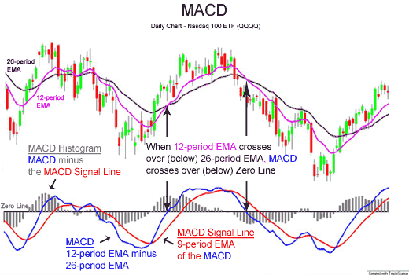

## Table of Contents

## What is the MACD indicator and how does it work?

The MACD, or Moving Average Convergence Divergence, is a popular technical analysis tool used by traders to predict price movements in the stock market. It helps traders understand the momentum and possible trend changes in a stock's price. The MACD is calculated using two moving averages of a stock's price: a faster one (usually 12 periods) and a slower one (usually 26 periods). The difference between these two moving averages creates the MACD line. Another line, called the signal line, is then created by taking a moving average of the MACD line (usually 9 periods).

The MACD works by comparing the MACD line with the signal line. When the MACD line crosses above the signal line, it's seen as a bullish signal, suggesting that it might be a good time to buy the stock. On the other hand, when the MACD line crosses below the signal line, it's seen as a bearish signal, suggesting that it might be a good time to sell the stock. Traders also look at a histogram, which shows the difference between the MACD line and the signal line. If the histogram bars are increasing, it means the momentum is getting stronger. If they're decreasing, it means the momentum is weakening. By watching these signals, traders can make better decisions about when to buy or sell a stock.

## How do you calculate the MACD line and signal line?

To calculate the MACD line, you first need to find two moving averages of the stock's price. One is a fast moving average, usually calculated over 12 days, and the other is a slow moving average, usually calculated over 26 days. A moving average is just the average price of the stock over a certain number of days. Once you have these two moving averages, you subtract the slow moving average from the fast moving average. The result is the MACD line. This line shows the difference between the short-term and long-term trends in the stock's price.

To calculate the signal line, you take the MACD line and find its moving average, usually over 9 days. This means you add up the values of the MACD line for the last 9 days and divide by 9. The signal line is smoother than the MACD line because it's an average of the MACD line. Traders watch the signal line to see when it crosses the MACD line. If the MACD line goes above the signal line, it might be a good time to buy the stock. If it goes below, it might be a good time to sell.

## What does the MACD histogram represent?

The MACD histogram shows the difference between the MACD line and the signal line. It looks like a bar chart where the bars can be positive or negative. If the MACD line is above the signal line, the histogram bars are positive and go above the zero line. If the MACD line is below the signal line, the histogram bars are negative and go below the zero line.

Traders use the MACD histogram to see the strength of the trend. If the histogram bars are getting taller, it means the trend is getting stronger. If the bars are getting shorter, it means the trend is getting weaker. When the histogram bars cross the zero line, it's a sign that the MACD line and the signal line have crossed each other. This can be a signal to buy or sell the stock, depending on which direction the bars are going.

## How can beginners use the MACD to identify basic buy and sell signals?

Beginners can use the MACD to spot basic buy and sell signals by watching when the MACD line crosses the signal line. If the MACD line moves above the signal line, it's a sign that the stock's price might go up. This is called a bullish signal, and it could be a good time to buy the stock. On the other hand, if the MACD line moves below the signal line, it's a sign that the stock's price might go down. This is called a bearish signal, and it could be a good time to sell the stock.

Another way beginners can use the MACD is by looking at the MACD histogram. The histogram shows bars that go above or below a zero line. If the bars are getting taller and moving above the zero line, it means the stock's price is gaining strength and might keep going up. If the bars are getting shorter and moving below the zero line, it means the stock's price is losing strength and might keep going down. By watching these signals, beginners can make simple decisions about when to buy or sell a stock.

## What are common MACD trading strategies for beginners?

One common MACD trading strategy for beginners is to watch for crossovers. When the MACD line crosses above the signal line, it's a sign to buy the stock. This is called a bullish crossover. When the MACD line crosses below the signal line, it's a sign to sell the stock. This is called a bearish crossover. By watching for these crossovers, beginners can make simple decisions about when to buy or sell.

Another strategy is to use the MACD histogram. The histogram shows bars that go above or below a zero line. If the bars are getting taller and moving above the zero line, it means the stock's price is getting stronger. This could be a good time to buy. If the bars are getting shorter and moving below the zero line, it means the stock's price is getting weaker. This could be a good time to sell. By watching the histogram, beginners can see when the trend is getting stronger or weaker.

A third strategy is to look for divergence between the stock's price and the MACD line. If the stock's price is going up but the MACD line is going down, it's called bearish divergence. This could be a sign that the stock's price might start to go down soon. If the stock's price is going down but the MACD line is going up, it's called bullish divergence. This could be a sign that the stock's price might start to go up soon. By watching for these divergences, beginners can get early warnings about possible changes in the stock's price.

## How does divergence between price and MACD indicate potential reversals?

Divergence between the stock's price and the MACD line can be a sign that the stock's price might change direction soon. If the stock's price is going up but the MACD line is going down, this is called bearish divergence. It means the upward trend in the stock's price might be losing strength, and the price might start to go down soon. By watching for bearish divergence, traders can get an early warning that it might be a good time to sell the stock.

On the other hand, if the stock's price is going down but the MACD line is going up, this is called bullish divergence. It means the downward trend in the stock's price might be losing strength, and the price might start to go up soon. By watching for bullish divergence, traders can get an early warning that it might be a good time to buy the stock. Divergence is a useful tool for beginners because it helps them see when the stock's price might be about to change direction.

## What are the limitations and potential pitfalls of using the MACD?

One limitation of using the MACD is that it can give false signals. Sometimes, the MACD line might cross the signal line and suggest that you should buy or sell a stock, but the stock's price doesn't move in the way you expected. This can happen because the MACD is based on past price data, and it can't predict the future perfectly. Another problem is that the MACD can be slow to react to big changes in the stock's price. If the stock's price suddenly jumps up or down a lot, the MACD might take a while to catch up, which can make you miss out on good trading opportunities.

Another potential pitfall is that the MACD works best in markets that have clear trends. If the stock's price is moving up and down a lot without a clear direction, the MACD can be hard to read and might not give you useful signals. It's also important to remember that the MACD is just one tool among many that traders use. Relying on the MACD alone without looking at other indicators or market conditions can lead to bad trading decisions. So, it's a good idea to use the MACD along with other tools and to always do your own research before making a trade.

## How can the MACD be combined with other technical indicators for more robust analysis?

Combining the MACD with other technical indicators can help traders make more informed decisions. One common way is to use the MACD along with the Relative Strength Index (RSI). The RSI measures how fast the stock's price is moving and if it's overbought or oversold. If the MACD shows a bullish signal and the RSI is below 70, it might be a good time to buy. If the MACD shows a bearish signal and the RSI is above 30, it might be a good time to sell. By looking at both indicators, traders can get a better sense of whether the stock's price is likely to go up or down.

Another useful combination is the MACD and moving averages. Moving averages smooth out the stock's price over time and help show the overall trend. If the MACD shows a bullish crossover and the stock's price is above its 50-day moving average, it could be a strong buy signal. If the MACD shows a bearish crossover and the stock's price is below its 50-day moving average, it could be a strong sell signal. Using the MACD with moving averages can help traders confirm the trend and make more confident trading decisions.

## What are advanced MACD trading strategies used by experienced traders?

Experienced traders often use a strategy called the zero-line crossover with the MACD. They watch for when the MACD line crosses the zero line. If the MACD line moves from below to above the zero line, it's a strong bullish signal, meaning the stock's price might start going up. If the MACD line moves from above to below the zero line, it's a strong bearish signal, meaning the stock's price might start going down. This can be a good way to spot big changes in the stock's price. Experienced traders also pay attention to the MACD histogram. If the histogram bars are getting taller and moving above the zero line, it means the bullish trend is getting stronger. If the bars are getting shorter and moving below the zero line, it means the bearish trend is getting stronger.

Another advanced strategy is using MACD divergence to spot potential reversals. If the stock's price is going up but the MACD line is going down, it's called bearish divergence. This can be an early warning that the stock's price might start to go down soon. If the stock's price is going down but the MACD line is going up, it's called bullish divergence. This can be an early warning that the stock's price might start to go up soon. Experienced traders use these divergences to get ahead of the market and make trades before the price changes. By combining these strategies with other indicators like the RSI or moving averages, experienced traders can make more accurate predictions about the stock's price.

## How does the choice of MACD settings affect its performance and what are optimal settings for different market conditions?

The choice of MACD settings can change how well it works in different market conditions. The standard settings for the MACD are a 12-day fast moving average, a 26-day slow moving average, and a 9-day signal line. These settings are good for most markets because they balance between being quick to spot trends and avoiding too many false signals. But if the market is moving fast, traders might use shorter periods like a 5-day fast moving average and a 10-day slow moving average to catch trends faster. In a slow-moving market, longer periods like a 20-day fast moving average and a 50-day slow moving average can help avoid false signals and show clearer trends.

For different market conditions, the optimal settings can be different. In a trending market, where the stock's price is clearly going up or down, shorter settings like a 12-day fast and a 26-day slow moving average can help traders catch the trend early. In a sideways market, where the stock's price is moving up and down without a clear direction, longer settings like a 20-day fast and a 50-day slow moving average can help filter out the noise and give more reliable signals. Traders often try different settings to see what works best for the market they are trading in. By adjusting the MACD settings, traders can make the indicator more useful for their specific needs.

## How can the MACD be used in different time frames and for different trading styles (e.g., day trading vs. swing trading)?

The MACD can be used in different time frames to help traders make decisions based on how long they plan to hold their trades. For day traders, who buy and sell stocks within the same day, using the MACD on shorter time frames like 5-minute or 15-minute charts can be helpful. Day traders look for quick signals to enter and [exit](/wiki/exit-strategy) trades, so they might use the standard MACD settings or even shorter ones like a 5-day fast moving average and a 10-day slow moving average to catch fast-moving trends. By watching the MACD line cross the signal line on these short time frames, day traders can spot opportunities to make quick profits.

For swing traders, who hold their trades for a few days or weeks, using the MACD on longer time frames like daily or weekly charts can be more useful. Swing traders are looking for bigger trends that last longer, so they might use the standard MACD settings or longer ones like a 20-day fast moving average and a 50-day slow moving average to avoid false signals and focus on the bigger picture. By watching the MACD line cross the signal line on these longer time frames, swing traders can find good entry and exit points for their trades and take advantage of larger price movements.

## What are some real-world examples of successful MACD trading, and what lessons can be learned from them?

One real-world example of successful MACD trading happened in early 2020 with the stock of Tesla. As Tesla's stock price started to climb, the MACD line crossed above the signal line on the daily chart, giving a clear bullish signal. Traders who bought Tesla stock after seeing this signal could have made good profits as the stock continued to rise. This example shows how important it is to watch for MACD crossovers on longer time frames like daily charts, especially in a trending market. It also teaches us that using the MACD can help spot big trends early and make smart trading decisions.

Another example is from the [forex](/wiki/forex-system) market, where a trader used the MACD to trade the EUR/USD currency pair. In this case, the trader noticed a bearish divergence between the price of the EUR/USD and the MACD line on a 4-hour chart. Even though the price was going up, the MACD line was going down, suggesting that the upward trend might be losing strength. The trader sold the EUR/USD based on this signal and made a profit when the price started to fall. This example shows how watching for divergence can give early warnings about possible price changes. It teaches us that combining the MACD with other indicators, like watching for divergences, can lead to successful trades in different markets.

## What is the technical overview of understanding MACD?

MACD, or Moving Average Convergence Divergence, is a trend-following momentum indicator widely used in the analysis of financial security's price movements. It provides insights by illustrating the relationship between two moving averages of a security's price, thus helping identify potential buy or sell opportunities.

The MACD consists of three primary components: the MACD line, the signal line, and the MACD histogram. Understanding each component is crucial for interpreting the indicator effectively:

1. **MACD Line**: This line represents the core of the MACD indicator. It is calculated by subtracting the 26-day Exponential Moving Average (EMA) from the 12-day EMA of a security’s price:
$$
   \text{MACD Line} = \text{EMA}_{12} - \text{EMA}_{26}

$$
   By using exponentially weighted moving averages, more recent prices are given greater significance, allowing the MACD line to react sensitively to recent price changes.

2. **Signal Line**: The signal line is a 9-day EMA of the MACD line itself. This line acts as a trigger line, providing buy and sell signals when it crosses the MACD line. Traders typically interpret a crossover of the MACD line above the signal line as a bullish signal (suggesting it’s a good time to buy) and a crossover below as a bearish signal (indicating a potential selling opportunity).

3. **MACD Histogram**: This histogram offers a visual representation of the difference between the MACD line and the signal line:
$$
   \text{MACD Histogram} = \text{MACD Line} - \text{Signal Line}

$$
   The histogram helps traders gauge the [momentum](/wiki/momentum) of a security. When the histogram is above zero and increasing, it suggests a strengthening upward momentum, while a decreasing histogram below zero indicates growing downward momentum.

Overall, the MACD indicator provides a comprehensive picture of a security's price movement by combining trend-following aspects with momentum analysis, helping traders make informed decisions in their trading process.

## How can MACD be integrated with other indicators?

Traders often combine the Moving Average Convergence Divergence (MACD) indicator with other technical analysis tools to enhance the accuracy of trading signals and reduce the risk of false positives. Two commonly used complementary indicators are the Relative Strength Index (RSI) and the Simple Moving Average (SMA).

The RSI is a momentum oscillator that provides insights into the speed and change of price movements. It operates within a scale of 0 to 100 and is typically used to identify overbought or oversold conditions in a market. When incorporated with MACD, the RSI can serve as a confirmation tool. For instance, if the MACD suggests a bullish signal, aligning it with an RSI reading below 30—indicating an oversold market—can reinforce the likelihood of a price bounce. Conversely, an RSI above 70 might confirm bearish signals from the MACD, suggesting overbought conditions that could lead to a price decrease.

The SMA, on the other hand, is a commonly used tool to smooth out price data, creating a single flowing line that makes it easier to identify the direction of the trend over a given period. The SMA is calculated by taking the arithmetic mean of a set number of closing prices. For example:

$$
\text{SMA}_{n} = \frac{1}{n} \sum_{i=1}^{n} \text{Price}_{i}
$$

where $n$ is the time period. When the MACD is used alongside an SMA, the intersection points can provide robust trading signals. For instance, if the MACD line crosses above the signal line and this occurs while the current price is above the SMA, it can corroborate a strong bullish trend. Likewise, if the MACD indicates a bearish crossover and the price is below the SMA, this reinforces a bearish trend signal.

Combining these indicators can lead to more reliable trading strategies. A strategy may involve waiting for a MACD crossover to occur and then checking the RSI level or the position relative to the SMA to confirm the movement's strength. This multi-indicator approach helps to filter out noise and reduce the probability of false signals caused by market [volatility](/wiki/volatility-trading-strategies). By effectively integrating these tools, traders can gain a clearer understanding of market conditions and improve their decision-making processes in trading activities.

## References & Further Reading

[1]: Murphy, J. J. (1999). ["Technical Analysis of the Financial Markets: A Comprehensive Guide to Trading Methods and Applications"](https://archive.org/details/technicalanalysi0000murp). New York Institute of Finance.

[2]: Pring, M. J. (2002). ["Technical Analysis Explained: The Successful Investor's Guide to Spotting Investment Trends and Turning Points"](https://www.amazon.com/Technical-Analysis-Explained-Fifth-Successful/dp/0071825177). McGraw-Hill Education.

[3]: Appel, G. (2005). ["Technical Analysis: Power Tools for Active Investors"](https://www.amazon.com/Technical-Analysis-Power-Active-Investors/dp/0132930048). Prentice Hall Press.

[4]: Brown, C. A. (2006). ["Technical Analysis for the Trading Professional"](https://www.amazon.com/Technical-Analysis-Trading-Professional-Second/dp/007175914X). McGraw-Hill Education.

[5]: Chan, E. (2009). ["Quantitative Trading: How to Build Your Own Algorithmic Trading Business"](https://github.com/ftvision/quant_trading_echan_book). Wiley Trading.

[6]: Kirkpatrick, C. D., & Dahlquist, J. R. (2010). ["Technical Analysis: The Complete Resource for Financial Market Technicians"](https://ptgmedia.pearsoncmg.com/images/9780134137049/samplepages/9780134137049.pdf). FT Press.

[7]: Jansen, S. (2020). ["Machine Learning for Algorithmic Trading, 2nd Edition: Predictive models to extract signals from market and alternative data for systematic trading strategies with Python"](https://www.vitalsource.com/products/machine-learning-for-algorithmic-trading-stefan-jansen-v9781839216787). Packt Publishing.