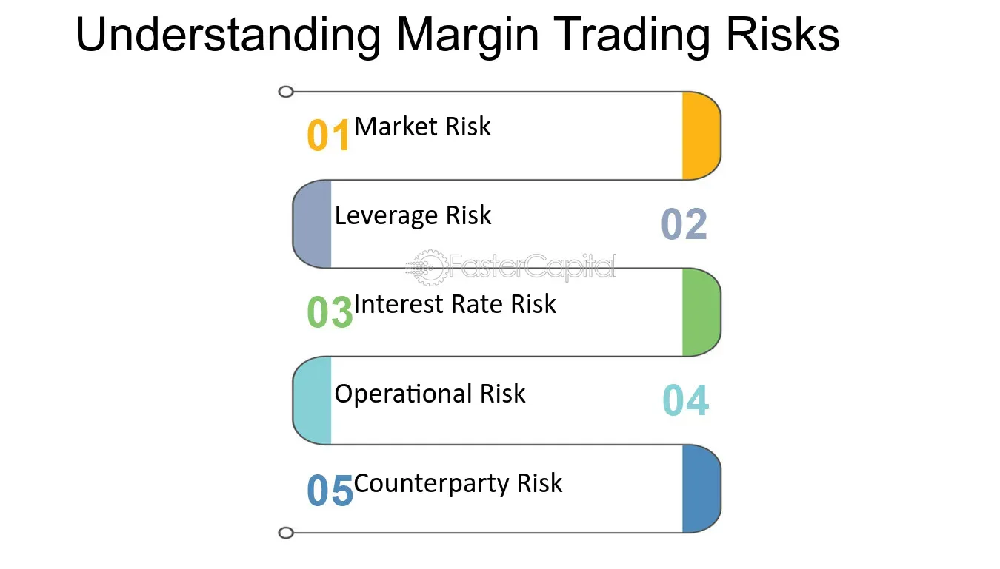

## Table of Contents

## What is trading margin excess?

Trading margin excess is the extra money you have in your trading account beyond what you need to keep your trades open. When you trade on margin, you borrow money from your broker to buy more stocks or other assets than you could with just your own money. The broker requires you to keep a certain amount of money in your account as a safety net, called the margin requirement. Any money you have above this requirement is your trading margin excess.

Having a trading margin excess is good because it gives you flexibility. You can use this extra money to open new trades, or it can act as a buffer if the value of your investments goes down. If your investments lose value and your account balance drops below the margin requirement, you'll get a margin call, and you'll need to add more money or sell some of your investments. So, keeping a healthy trading margin excess can help you avoid margin calls and manage your trades more safely.

## How is trading margin excess calculated?

Trading margin excess is calculated by subtracting the margin requirement from your account's current equity. Your account's equity is the total value of your investments plus any cash you have in the account. The margin requirement is the minimum amount of money you need to keep in your account to keep your trades open. If your account's equity is higher than the margin requirement, the difference is your trading margin excess.

For example, if you have $10,000 in your account and the margin requirement for your trades is $7,000, your trading margin excess would be $3,000. This $3,000 is the extra money you have that you can use to open new trades or as a cushion if the value of your investments drops. Keeping a positive trading margin excess is important because it helps you avoid margin calls, where you would need to add more money or sell investments to meet the margin requirement.

## Why is trading margin excess important for traders?

Trading margin excess is important for traders because it gives them extra money to use in their trading account. When you trade on margin, you borrow money to buy more stocks or other things than you could with just your own money. The broker needs you to keep some money in your account as a safety net, called the margin requirement. Any money you have above this requirement is your trading margin excess. This extra money lets you open new trades without needing to add more cash to your account.

Having a good amount of trading margin excess also helps you avoid something called a margin call. A margin call happens when the value of your investments goes down and your account balance drops below the margin requirement. If this happens, you'll need to quickly add more money or sell some of your investments. By keeping a healthy trading margin excess, you have a buffer that can protect you if your investments lose value. This makes your trading safer and gives you more peace of mind.

## What are the benefits of having a high trading margin excess?

Having a high trading margin excess gives you more freedom when you trade. It means you have extra money in your account that you can use to buy more stocks or other things without needing to add more cash. This can help you take advantage of new trading opportunities quickly, without having to wait or miss out because you need more money.

A high trading margin excess also acts like a safety net. If the value of your investments goes down, this extra money can keep your account from falling below the margin requirement. This helps you avoid a margin call, where you'd need to add more money fast or sell your investments at a bad time. So, having a lot of trading margin excess can make your trading safer and give you more peace of mind.

## How does trading margin excess affect trading strategies?

Having a high trading margin excess gives traders more room to try different trading strategies. When you have extra money in your account, you can take bigger risks or explore new opportunities without worrying about needing more cash right away. For example, you might decide to buy more stocks or try a new trading approach that you wouldn't have tried if you were worried about your account balance getting too low.

A high trading margin excess also helps traders feel more secure when using strategies that involve holding onto investments for a longer time. If the value of your investments goes down, the extra money in your account can act as a cushion, keeping you from getting a margin call. This means you can stick with your strategy and wait for the right time to sell, rather than being forced to sell at a bad time because your account balance is too low.

## What are the risks associated with low trading margin excess?

Having a low trading margin excess can be risky because it means you have less extra money in your account. If the value of your investments goes down, you might quickly fall below the margin requirement. When this happens, you get a margin call, and you'll need to add more money fast or sell your investments at a bad time. This can make you lose money and feel stressed because you have to act quickly.

Also, with a low trading margin excess, you can't take advantage of new trading opportunities as easily. If you see a good chance to buy more stocks or try a new trading idea, you might not have enough extra money to do it without adding more cash to your account. This can make you miss out on good trades and limit your options, making your trading less flexible and more challenging.

## How can traders increase their trading margin excess?

Traders can increase their trading margin excess by adding more money to their account. This is the simplest way to do it. When you put more cash into your account, your total equity goes up, and if it's more than the margin requirement, your trading margin excess goes up too. Another way is to sell some of your investments that aren't doing well. If you sell stocks that have lost value, you can use the money from the sale to boost your account balance and increase your trading margin excess.

Another way to increase trading margin excess is by choosing trades that need less margin. Some stocks or other things you can buy might need less money to keep them in your account. If you switch to these, your margin requirement goes down, and your trading margin excess goes up. Also, if your investments start doing better and their value goes up, your account equity goes up too. This can also help increase your trading margin excess without you having to do anything extra.

## Can trading margin excess be negative, and what does that mean?

Yes, trading margin excess can be negative. This happens when the money in your account, called your equity, is less than the margin requirement. The margin requirement is the minimum amount of money you need to keep in your account to keep your trades open. If your investments lose value and your account balance drops below this requirement, your trading margin excess becomes negative.

Having a negative trading margin excess means you're in a risky situation. It's called a margin call, and you need to act fast. You have to add more money to your account or sell some of your investments to bring your account balance back above the margin requirement. If you don't do this quickly, your broker might sell your investments for you, which could make you lose more money.

## How do different financial markets handle trading margin excess?

Different financial markets handle trading margin excess in ways that suit their own rules and needs. In the stock market, trading margin excess is very important. Brokers watch your account closely to make sure you have enough money to cover your trades. If your investments lose value and your account balance drops below the margin requirement, you get a margin call. You have to add more money or sell some stocks quickly. This keeps the market stable and protects both you and the broker from big losses.

In the futures market, trading margin excess works a bit differently. Futures contracts are agreements to buy or sell something at a set price in the future. Because these can be risky, the margin requirements are often higher. If the value of your futures contracts changes a lot, you might need to add more money to your account right away to keep your trades open. This helps manage the high risk in futures trading and keeps the market running smoothly.

In the [forex](/wiki/forex-system) market, where people trade different currencies, trading margin excess is also key. Forex trading can be very fast and change a lot, so brokers need to make sure you have enough money in your account. If the value of the currencies you're trading moves against you, your account balance can drop quickly. If it goes below the margin requirement, you'll get a margin call and need to add more money or close your trades. This helps keep the forex market stable and protects everyone involved.

## What regulatory considerations should traders be aware of regarding trading margin excess?

Traders need to know that different countries have different rules about trading on margin. In the United States, the Financial Industry Regulatory Authority (FINRA) and the Securities and Exchange Commission (SEC) set rules about how much money you need to keep in your account when you trade on margin. They make sure brokers tell you about the risks and have to give you time to add more money if you get a margin call. This helps keep trading safe and fair for everyone.

In other places, like Europe, the European Securities and Markets Authority (ESMA) has its own rules. They might limit how much you can borrow to trade and make sure you understand the risks. These rules can change how much trading margin excess you need and what happens if your account balance drops too low. Knowing these rules can help traders stay out of trouble and trade more safely.

## How does trading margin excess influence margin calls?

Trading margin excess is the extra money you have in your account after meeting the margin requirement. If you have a lot of trading margin excess, it acts like a cushion. If the value of your investments goes down, this extra money can help keep your account balance above the margin requirement. This means you're less likely to get a margin call, which is when your broker tells you to add more money or sell some of your investments because your account balance is too low.

On the other hand, if your trading margin excess is low or becomes negative, you're at a higher risk of getting a margin call. When your account's equity falls below the margin requirement, you need to act fast to add more money or sell some investments. If you don't, your broker might sell your investments for you, which could make you lose more money. So, keeping a healthy trading margin excess helps you avoid margin calls and manage your trades more safely.

## What advanced strategies can traders use to optimize their trading margin excess?

Traders can use a strategy called "margin optimization" to make the most out of their trading margin excess. This means they carefully choose which investments to buy and sell to keep their account balance high enough to avoid margin calls but low enough to use their money efficiently. For example, they might focus on stocks that have lower margin requirements or use options trading, which can sometimes need less money upfront. By doing this, traders can keep more trading margin excess, giving them more room to take advantage of new opportunities without adding more cash.

Another advanced strategy is "dynamic margin management." This involves keeping an eye on the market and adjusting their trades based on how the value of their investments changes. If the market is doing well, traders might use their extra money to buy more stocks or other things. But if the market starts to drop, they can quickly sell some investments to boost their trading margin excess and avoid a margin call. By being flexible and ready to change their plans, traders can use their trading margin excess to protect themselves and make the most of their trading.

## What is Excess Margin?

Excess margin refers to the additional equity present in a margin account that exceeds the required minimum margin. This additional equity acts as a buffer against possible margin calls, which are demands from brokers to deposit additional funds when an account's equity falls below a certain level, during market downturns. Maintaining an adequate level of excess margin is important as it can prevent the forced liquidation of positions at unfavorable prices, thereby allowing traders to sustain their positions through volatile market conditions.

### Calculation of Excess Margin

Excess margin can be mathematically represented as:

$$
\text{Excess Margin} = \text{Equity in the Margin Account} - \text{Required Margin}
$$

Where:
- **Equity in the Margin Account** is the current value of the trader's account, including cash and the market value of securities.
- **Required Margin** is the minimum amount required by brokers, determined by regulations or the broker's policies, that must be maintained in the account to keep positions open.

### Significance of Excess Margin

Having a robust excess margin is crucial for several reasons:

1. **Cushion Against Market Volatility**: During volatile market conditions, asset prices can fluctuate significantly. Excess margin provides a safety net, allowing traders to withstand these fluctuations without the immediate need to add funds or liquidate positions.

2. **Prevention of Forced Liquidation**: In the absence of sufficient excess margin, brokers may initiate the sale of assets in an account to bring the equity back over the required margin threshold. Such forced liquidations often occur at unfavorable prices, potentially resulting in substantial losses for the trader.

3. **Flexibility in Trading**: With a healthy level of excess margin, traders have more flexibility to capitalize on new market opportunities without immediate concerns of margin calls or account restrictions.

4. **Sustainability of Positions**: By maintaining a buffer through excess margin, traders can hold positions over longer periods, allowing them to adopt a more strategic approach to trading rather than responding reactively to short-term market movements.

In conclusion, excess margin serves as an essential component for traders aiming to maintain stability and sustainability in their trading activities amidst the inherently volatile nature of financial markets. It empowers traders to navigate market dynamics while minimizing the risks of enforced liquidations and unforeseen financial setbacks.

## References & Further Reading

[1]: Bernstein, J. (1995). ["Trader's Guide to Financial Markets and Technical Analysis"](https://books.google.com/books/about/Trader_s_Guide_to_Financial_Markets_and.html?id=XLRFDwAAQBAJ). McGraw Hill.

[2]: ["Margin Trading for Beginners"](https://www.schwab.com/learn/story/starter-guide-to-margin-trading) by Investopedia

[3]: Robert Kissell. (2013). ["The Science of Algorithmic Trading and Portfolio Management"](https://www.sciencedirect.com/book/9780124016897/the-science-of-algorithmic-trading-and-portfolio-management). Academic Press.

[4]: ["Risk Management in Trading"](https://www.investopedia.com/articles/trading/09/risk-management.asp) by Cboe Options Exchange

[5]: Hull, J. C. (2017). ["Risk Management and Financial Institutions"](https://www.amazon.com/Management-Financial-Institutions-Wiley-Finance/dp/1119932483). Wiley Finance.