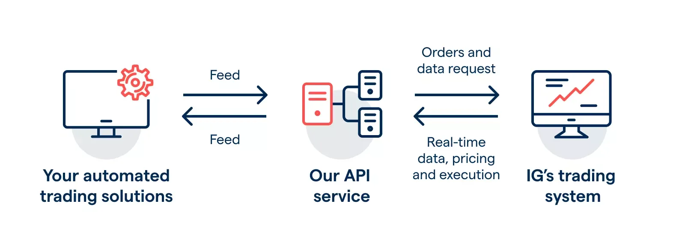

## Table of Contents

## What is an API and how does it relate to trading markets?

An API, or Application Programming Interface, is like a set of rules that lets different computer programs talk to each other. It's a way for one piece of software to ask another piece of software to do something, like getting information or making a change. Think of it as a translator that helps different programs understand each other, even if they were made by different people.

In trading markets, APIs are really useful because they let traders and investors connect their own software to the trading platforms. For example, someone might use an API to automatically get the latest stock prices, place buy or sell orders, or even analyze market trends without having to do everything by hand. This makes trading faster and more efficient, helping people make better decisions based on real-time data.

## What are the basic steps to start using APIs for trading?

To start using APIs for trading, you first need to choose a trading platform that offers an API. Popular platforms like Binance, Coinbase, and Interactive Brokers have APIs that you can use. Once you've picked a platform, you'll need to sign up for an account and get your API keys. These keys are like special passwords that let your software talk to the trading platform securely. Make sure to keep your API keys safe and never share them with anyone.

After you have your API keys, you'll need to learn how to use the API. Most platforms provide documentation that explains how to send requests and get responses. You might need to learn a bit of programming, like using Python or JavaScript, to write code that interacts with the API. Start with simple tasks, like fetching the current price of a stock or cryptocurrency. Once you're comfortable, you can move on to more complex tasks like placing orders or analyzing market data.

Using APIs for trading can be powerful, but it's important to be careful. Always test your code in a safe environment before using it with real money. Also, be aware of the risks involved in trading, as markets can be unpredictable. By taking these steps and learning as you go, you can start using APIs to enhance your trading strategies and make more informed decisions.

## Which popular APIs are used for accessing trading markets?

Some popular APIs for accessing trading markets include those from Binance, Coinbase, and Interactive Brokers. Binance's API is widely used in the cryptocurrency world because it lets you trade many different cryptocurrencies. It's easy to use and has a lot of features, like getting real-time prices and placing orders. Coinbase's API is also popular for crypto trading, especially for people in the United States. It's known for being user-friendly and secure. Interactive Brokers' API is great for trading stocks, options, and futures. It's used by many professional traders because it's powerful and can handle a lot of different types of trades.

These APIs are important because they let you connect your own software to the trading platforms. This means you can write programs to automatically get the latest market data, place trades, and even analyze trends without having to do everything by hand. For example, you could use the Binance API to check the price of Bitcoin every minute and buy it if the price drops below a certain level. Or you could use the Interactive Brokers API to automatically sell a stock if it reaches a certain price. By using these APIs, you can make your trading faster and more efficient, helping you make better decisions based on real-time data.

## How do you authenticate and secure API connections for trading?

To authenticate and secure API connections for trading, you need to use API keys. These are special codes that you get from the trading platform when you sign up. You use these keys to prove that it's really you trying to connect to the platform. It's like a secret password that only you know. When you send a request to the trading platform, you include your API key so the platform knows it's coming from you. It's really important to keep your API keys safe and never share them with anyone, because if someone else gets your keys, they could use them to access your account and make trades without your permission.

Another way to secure your API connections is by using something called HTTPS. This is a secure way of sending information over the internet. When you use HTTPS, the information you send to the trading platform is encrypted, which means it's turned into a secret code that only the trading platform can understand. This makes it much harder for anyone to steal your information or mess with your trades. Most trading platforms use HTTPS automatically, but it's good to check and make sure. By using API keys and HTTPS, you can keep your trading connections safe and secure.

## What are the common data formats used in trading APIs?

The most common data formats used in trading APIs are JSON and XML. JSON, which stands for JavaScript Object Notation, is really popular because it's easy to read and write. It looks a lot like a simple list or dictionary, which makes it easy for both people and computers to understand. When you use a trading API, you'll often see the data coming back in JSON format, showing things like stock prices, trading volumes, and order details in a clear and organized way.

XML, or eXtensible Markup Language, is another format you might see. It's a bit more complicated than JSON but can be useful for more detailed data structures. XML uses tags to organize information, kind of like how HTML works for web pages. While it's not as common as JSON in trading APIs, some platforms still use it, especially for more complex data exchanges. Both JSON and XML help make sure that the data you get from trading APIs is structured and easy to work with.

## How can beginners use APIs to retrieve real-time market data?

Beginners can start using APIs to get real-time market data by first choosing a trading platform that offers an API, like Binance or Coinbase. Once you sign up for an account, you'll get API keys, which are like special passwords that let your software talk to the platform securely. You'll need to keep these keys safe and never share them with anyone. Next, you'll need to learn a bit of programming, like using Python or JavaScript, to write code that interacts with the API. Most platforms have documentation that explains how to send requests and get responses, so start by reading that and trying out simple tasks, like fetching the current price of a stock or cryptocurrency.

Once you're comfortable with the basics, you can use the API to automatically get real-time market data. For example, you could write a program that checks the price of Bitcoin every minute and sends you an alert if the price changes a lot. This can help you stay updated on market trends without having to check the platform all the time. Remember to always test your code in a safe environment before using it with real money, and be aware of the risks involved in trading, as markets can be unpredictable. By taking these steps, you can start using APIs to enhance your trading strategies and make more informed decisions based on real-time data.

## What are the key considerations for managing API rate limits and costs?

When using APIs for trading, it's important to think about rate limits and costs. Rate limits are rules set by the trading platform that say how many times you can use the API in a certain time, like every minute or every day. If you go over these limits, the platform might stop your requests or even block your account. To manage this, you can write your code to slow down and wait a bit between requests. This way, you stay under the limit and keep getting the data you need. Also, some platforms charge you based on how much you use the API, so keeping an eye on your usage can help you save money.

Another thing to consider is how to make the most out of the API without going over the limits or spending too much. You can do this by only asking for the data you really need and not making extra requests. For example, if you only need the price of a stock every hour, don't ask for it every minute. Also, some platforms let you get a lot of data in one request instead of many small ones, which can be cheaper and faster. By being smart about how you use the API, you can get the information you need without hitting the rate limits or running up big costs.

## How can intermediate users automate trading strategies using APIs?

Intermediate users can automate trading strategies using APIs by writing code that interacts with the trading platform. They can use the API to get real-time market data, like stock prices and trading volumes, and then use this data to make decisions about when to buy or sell. For example, they might write a program that checks the price of a stock every few minutes and automatically places a buy order if the price drops below a certain level. This way, they don't have to watch the market all the time and can still take advantage of good trading opportunities.

To do this, intermediate users need to be careful about managing API rate limits and costs. They should write their code to make requests at a pace that stays under the platform's limits, so they don't get blocked. They can also save money by only asking for the data they really need and not making extra requests. By being smart about how they use the API, intermediate users can automate their trading strategies effectively and make more informed decisions based on real-time data.

## What advanced techniques can be used to analyze market data obtained through APIs?

Intermediate users can use advanced techniques like machine learning and data visualization to analyze market data obtained through APIs. Machine learning can help them predict future price movements by training models on historical data. For example, they might use algorithms like regression or neural networks to find patterns in stock prices and trading volumes. This can help them make better trading decisions by understanding how the market might behave in the future. They can also use tools like Python's scikit-learn or TensorFlow to build and train these models.

Another advanced technique is data visualization, which helps users see trends and patterns in the data more easily. By using libraries like Matplotlib or Plotly in Python, intermediate users can create charts and graphs that show how stock prices change over time or how different stocks are related to each other. This visual approach can make it easier to spot opportunities or risks in the market. For example, they might create a candlestick chart to see the daily price movements of a stock or a heatmap to understand the correlation between different assets.

By combining machine learning and data visualization, intermediate users can gain deeper insights into market data. They can use these insights to develop more sophisticated trading strategies that take advantage of the patterns and trends they discover. This can lead to better performance in their trading activities, as they're able to make more informed decisions based on a thorough analysis of the data they get from APIs.

## How do experts handle high-frequency trading with APIs?

Experts in high-frequency trading use APIs to quickly buy and sell stocks or other assets. They write special computer programs that can send many orders to the trading platform in a very short time. These programs use the API to get real-time data about prices and trading volumes, and then make decisions based on that data. The goal is to make small profits from tiny changes in the market, but they do it so often that these small profits add up to a lot of money. To do this well, experts need to be very careful about how fast their programs can send and receive data, because even a tiny delay can make a big difference in high-frequency trading.

To handle high-frequency trading with APIs, experts also need to manage the rate limits set by the trading platform. They write their code to make sure it doesn't send too many requests too quickly, which could get their account blocked. They also use special techniques to make their programs as fast as possible, like using the right kind of computer hardware and writing their code in a way that takes advantage of the API's features. By doing all of this, experts can use APIs to trade at a very high speed and make the most out of the opportunities in the market.

## What are the best practices for integrating multiple APIs in a trading system?

When you want to use more than one API in your trading system, it's important to make sure they all work well together. First, you need to understand how each API works and what kind of data it gives you. Some APIs might give you real-time prices, while others might give you historical data or let you place orders. You should plan how to use each API so they help each other. For example, you might use one API to get the latest stock prices and another API to place trades based on those prices. It's also a good idea to write your code in a way that makes it easy to add or change APIs later on, so your system can grow and improve over time.

Another important thing is to manage the rate limits and costs of each API carefully. Each API has its own rules about how often you can use it, and if you go over these limits, you might get blocked. You should write your code to make sure it doesn't send too many requests too quickly. Also, some APIs might charge you based on how much you use them, so you need to keep an eye on your usage to avoid spending too much money. By being smart about how you use multiple APIs, you can get the information you need without hitting the rate limits or running up big costs.

## How can one ensure compliance with regulations when using trading APIs?

When using trading APIs, it's important to follow the rules set by financial regulators to make sure you're trading legally. These rules can be different depending on where you live and what you're trading. For example, in the United States, the Securities and Exchange Commission (SEC) has rules about how you can trade stocks and other securities. To stay compliant, you need to know these rules and make sure your trading system follows them. This might mean keeping good records of your trades, not using inside information, and making sure your trading doesn't harm the market.

One way to ensure compliance is by using APIs that are designed to follow these rules. Many trading platforms have built-in features that help you stay within the law, like limits on how much you can trade or tools to report your trades. It's also a good idea to talk to a lawyer or a compliance expert who knows about trading regulations. They can help you set up your system so it follows the rules and stays out of trouble. By being careful and using the right tools, you can use trading APIs safely and legally.

## References & Further Reading

[1]: Bergstra, J., Bardenet, R., Bengio, Y., & Kégl, B. (2011). ["Algorithms for Hyper-Parameter Optimization."](https://papers.nips.cc/paper/4443-algorithms-for-hyper-parameter-optimization) Advances in Neural Information Processing Systems 24.

[2]: ["Advances in Financial Machine Learning"](https://www.amazon.com/Advances-Financial-Machine-Learning-Marcos/dp/1119482089) by Marcos Lopez de Prado

[3]: ["Evidence-Based Technical Analysis: Applying the Scientific Method and Statistical Inference to Trading Signals"](https://www.amazon.com/Evidence-Based-Technical-Analysis-Scientific-Statistical/dp/0470008741) by David Aronson

[4]: ["Machine Learning for Algorithmic Trading"](https://github.com/stefan-jansen/machine-learning-for-trading) by Stefan Jansen

[5]: ["Quantitative Trading: How to Build Your Own Algorithmic Trading Business"](https://books.google.com/books/about/Quantitative_Trading.html?id=j70yEAAAQBAJ) by Ernest P. Chan