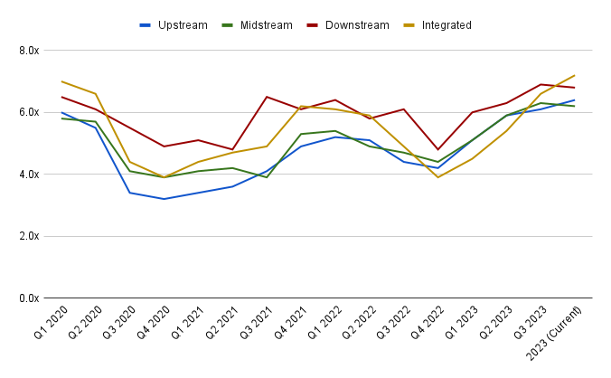

## Table of Contents

## What are trading multiples and why are they used in valuation?

Trading multiples are financial ratios that investors use to compare the value of different companies. They are calculated by dividing a company's market value by a specific financial metric, like earnings or sales. Common examples include the price-to-earnings (P/E) ratio and the enterprise value-to-EBITDA ratio. These multiples help investors see how much they are paying for a company's earnings or revenue compared to other companies in the same industry.

Trading multiples are used in valuation because they provide a quick and easy way to assess whether a company is overvalued or undervalued. By comparing a company's multiples to those of its peers, investors can get a sense of how the market views the company's future growth and profitability. For example, if a company has a lower P/E ratio than its competitors, it might be seen as a bargain, suggesting that its stock price could rise in the future. This method is especially useful for investors who want to make quick comparisons across many companies without diving deep into each company's financial statements.

## How do trading multiples specifically apply to the oil and gas industry?

In the oil and gas industry, trading multiples help investors compare the value of different companies that explore, produce, or refine oil and gas. A common multiple used is the enterprise value-to-EBITDA ratio. This ratio compares a company's total value (including debt and minus cash) to its earnings before interest, taxes, depreciation, and amortization. This is useful because the oil and gas business can have a lot of debt and big investments in things like drilling equipment, which this ratio helps to account for. By looking at this ratio, investors can see if a company is priced fairly compared to others in the industry.

Another important multiple in the oil and gas sector is the price-to-cash flow ratio. This multiple looks at a company's market value compared to the cash it generates. This is helpful because the oil and gas industry can have big ups and downs due to changes in oil prices. By focusing on cash flow, investors get a clearer picture of how well a company can handle these ups and downs. Using these multiples, investors can quickly decide if a company is a good buy or if it's overpriced, helping them make smarter investment choices in the often volatile oil and gas market.

## What are the most common trading multiples used in oil and gas valuation?

In the oil and gas industry, one of the most common trading multiples used is the enterprise value-to-EBITDA ratio. This multiple helps investors see how much they are paying for a company's earnings, taking into account the company's debt and cash. It's useful because oil and gas companies often have a lot of debt and big investments in things like drilling rigs. By using this ratio, investors can compare different companies and see if one is a better deal than another.

Another widely used multiple in the oil and gas sector is the price-to-cash flow ratio. This ratio compares a company's market value to the cash it generates. It's helpful because the oil and gas industry can be very up and down due to changes in oil prices. By focusing on cash flow, investors can get a better idea of how well a company can handle these changes. Using these multiples, investors can quickly decide if a company is priced right or if it's too expensive, helping them make smarter choices in the often unpredictable oil and gas market.

## How is the Price to Earnings (P/E) ratio calculated and used in oil and gas?

The Price to Earnings (P/E) ratio is calculated by dividing a company's stock price by its earnings per share. For example, if a company's stock is trading at $50 and its earnings per share are $5, the P/E ratio would be 10. This ratio tells investors how much they are paying for each dollar of the company's earnings. In the oil and gas industry, the P/E ratio can help investors see if a company is a good deal compared to others in the same business.

In the oil and gas sector, the P/E ratio is useful but can be tricky because earnings can go up and down a lot due to changes in oil prices. If oil prices are high, a company's earnings might look good, making its P/E ratio lower and seem like a bargain. But if oil prices drop, earnings can fall, making the P/E ratio higher and the stock look more expensive. So, investors need to be careful and look at other things like the company's debt and how much cash it's making to get a full picture of its value.

## What is the Enterprise Value to EBITDA multiple and its relevance in oil and gas?

The Enterprise Value to EBITDA multiple is a way to figure out how much a company is worth compared to its earnings. You get it by dividing the total value of the company, including its debt and minus its cash, by its earnings before interest, taxes, depreciation, and amortization (EBITDA). In simple terms, it tells investors how many years it would take for the company to pay back its total value from its earnings, without worrying about how it's financed or how it's paying off its equipment.

In the oil and gas industry, this multiple is really helpful because these companies often have a lot of debt and big investments in things like drilling rigs. By using the Enterprise Value to EBITDA multiple, investors can see if one oil and gas company is a better deal than another, even if they have different amounts of debt. This way, they can compare apples to apples and make better choices about where to put their money in this often up-and-down industry.

## How do reserve-based multiples like EV/boe work in oil and gas valuation?

Reserve-based multiples like EV/boe are used in the oil and gas industry to figure out how much a company is worth based on its oil and gas reserves. EV/boe stands for Enterprise Value per barrel of oil equivalent. This multiple is calculated by taking the total value of the company (including its debt and minus its cash) and dividing it by the total amount of oil and gas it has in the ground, measured in barrels of oil equivalent. This helps investors see how much they are paying for each barrel of oil the company owns.

In the oil and gas business, using EV/boe can be really helpful because it gives investors a way to compare different companies based on their reserves. Since oil and gas companies can have very different amounts of debt and different ways of making money, looking at their reserves can give a clearer picture of their value. By using this multiple, investors can decide if a company's stock is a good buy or if it's too expensive, helping them make smarter choices in the often unpredictable oil and gas market.

## What factors influence the choice of trading multiples in oil and gas?

Choosing the right trading multiples in the oil and gas industry depends on a few key things. One big factor is what part of the oil and gas business the company is in. For example, companies that explore and produce oil might be better compared using multiples like EV/boe, which looks at the value of their oil reserves. On the other hand, companies that refine oil or sell gas might be better compared using multiples like EV/EBITDA, which looks at their earnings and how much debt they have.

Another important thing to think about is how stable the company's earnings are. The oil and gas industry can be very up and down because of changes in oil prices. So, multiples like price-to-cash flow can be useful because they show how much cash a company is making, which can be a better sign of how well it's doing than just looking at its earnings. By picking the right multiple, investors can get a clearer picture of a company's value and make better choices about where to put their money.

## How do you compare trading multiples across different oil and gas companies?

When you want to compare trading multiples across different oil and gas companies, you need to pick the right multiples that make sense for the kind of business they're in. For companies that drill for oil and gas, a good multiple to use might be EV/boe, which looks at how much the company is worth for each barrel of oil it has in the ground. This helps you see if one company's reserves are a better deal than another's. On the other hand, for companies that refine oil or sell gas, you might want to use EV/EBITDA. This multiple shows how much you're paying for the company's earnings, taking into account its debt and cash. By choosing the right multiple, you can compare companies fairly and see which ones might be a better buy.

Another thing to think about is how stable a company's earnings are. The oil and gas business can be really up and down because oil prices change a lot. So, using a multiple like price-to-cash flow can be helpful because it shows how much cash a company is making, which can be a better sign of how well it's doing than just looking at its earnings. When you compare different companies, you should look at these multiples and see how they stack up against each other. If one company has a lower multiple than another, it might mean it's a better deal. But you also need to think about other things like how much debt the company has and what the future looks like for oil prices.

## What are the limitations and potential pitfalls of using trading multiples in oil and gas valuation?

Using trading multiples in oil and gas valuation has some big problems. One big issue is that these multiples can be affected a lot by changes in oil prices. When oil prices go up, a company's earnings can look really good, making its multiples seem low and like a good deal. But if oil prices drop, the same company's earnings can fall, making its multiples look high and the stock seem expensive. This can trick investors into thinking a company is a better or worse deal than it really is. Also, different companies in the oil and gas business can have very different amounts of debt, and multiples like EV/EBITDA try to take this into account, but it's still hard to compare companies fairly.

Another problem is that trading multiples don't tell the whole story about a company. They just give a quick snapshot and don't show things like how good the company's management is, what its future plans are, or how well it can handle changes in the market. For example, a company might have a low multiple because it's struggling and not because it's a good deal. Investors need to look at more than just multiples to really understand if a company is worth buying. They should also think about things like the company's cash flow, how much debt it has, and what the future might hold for oil and gas prices.

## How can trading multiples be adjusted for cyclicality in the oil and gas sector?

Trading multiples in the oil and gas sector can be tricky because the industry goes through big ups and downs, mostly because of changes in oil prices. To deal with this, investors can use something called "normalized" earnings. This means they look at a company's earnings over several years, not just one year, to smooth out the ups and downs. By doing this, they can get a better idea of what the company's earnings might be like in the future, even if oil prices change a lot. This helps them see if a company's trading multiple is really a good deal or not.

Another way to adjust for cyclicality is to look at multiples that focus on cash flow instead of just earnings. The oil and gas business can have big swings in earnings, but cash flow can be a better sign of how well a company is doing. Using multiples like price-to-cash flow can help investors see how much money a company is making, no matter what's happening with oil prices. This way, they can compare different companies more fairly and make better choices about where to invest their money in the oil and gas sector.

## What advanced techniques can be used to refine trading multiples analysis in oil and gas?

To make trading multiples analysis better in the oil and gas industry, investors can use something called "peer group analysis." This means they compare a company's multiples not just to the whole industry, but to a smaller group of similar companies. For example, they might compare an oil exploration company to other oil exploration companies, not to companies that refine oil or sell gas. This helps them see if a company is a good deal compared to its closest competitors. They can also use "sector-specific adjustments," which means they change the multiples to fit the special things about the oil and gas business. For example, they might look at how much debt a company has or how much it's spending on new projects, and adjust the multiples to take these things into account.

Another advanced technique is to use "regression analysis." This is a fancy way of saying they look at how different things like oil prices, interest rates, or the company's size affect its multiples. By doing this, they can see which things matter most and make better guesses about what the company's multiples might be in the future. They can also use "Monte Carlo simulations," which is a way of running lots of different scenarios to see how changes in oil prices or other things might affect a company's multiples. This helps them understand the risks and make smarter choices about where to invest their money in the often unpredictable oil and gas market.

## How do macroeconomic factors affect trading multiples in the oil and gas industry?

Macroeconomic factors can have a big impact on trading multiples in the oil and gas industry. Things like oil prices, interest rates, and the overall health of the economy can change how much investors are willing to pay for a company's earnings or reserves. For example, when oil prices go up, oil and gas companies' earnings usually go up too, which can make their trading multiples look lower and seem like a good deal. But if oil prices drop, earnings can fall, making the multiples look higher and the stock seem more expensive. Interest rates also play a role because they affect how much it costs companies to borrow money, which can change their profits and their multiples.

Another important macroeconomic factor is the overall health of the economy. When the economy is doing well, people and businesses use more energy, which can push up oil and gas prices and make companies in this industry look more valuable. But if the economy slows down, demand for energy can drop, which can hurt oil and gas companies' earnings and their trading multiples. By keeping an eye on these big economic factors, investors can get a better idea of whether a company's trading multiples are a good deal or not, helping them make smarter choices about where to put their money in the often up-and-down oil and gas market.

## What is the understanding of trading multiples in oil and gas valuation?

Trading multiples in the oil and gas industry are essential metrics that shed light on a company's market standing and financial condition. These metrics allow industry analysts to evaluate and compare different companies effectively, considering the sector's unique operational and financial characteristics. The most commonly employed trading multiples in this sector are Enterprise Value to Earnings Before Interest, Taxes, Depreciation, and Amortization (EV/EBITDA), Enterprise Value to Barrels of Oil Equivalent Per Day (EV/BOEPD), and Enterprise Value to Proven and Probable Reserves (EV/2P).

**EV/EBITDA** is a critical metric for gauging a company’s earnings performance. It offers a direct comparison by measuring a company's enterprise value relative to its operating earnings, excluding non-cash items. This is particularly useful for assessing companies on an operational basis, independent of their capital structure, tax rates, and non-cash accounting charges. The formula for EV/EBITDA is:

$$
\text{EV/EBITDA} = \frac{\text{Enterprise Value}}{\text{EBITDA}}
$$

where **Enterprise Value (EV)** is the sum of market capitalization, debt, and minority interest, minus cash and cash equivalents.

**EV/BOEPD** helps analysts evaluate production efficiency and the potential future revenue obtained from ongoing operations. By relating a company’s enterprise value to its daily oil equivalent production, this metric provides insight into how efficiently a company converts its assets into cash flow. Analysts can use EV/BOEPD to compare companies based on their operational productivity.

**EV/2P** simplifies the comparison of a company's market value with its proven and probable reserves, thereby reflecting its potential growth and reserve sustainability. This metric is crucial for understanding a company's long-term production capabilities and its capacity to replenish and sustain its resource base over time. The formula for EV/2P is:

$$
\text{EV/2P} = \frac{\text{Enterprise Value}}{\text{Proven and Probable Reserves}}
$$

Each of these metrics plays a pivotal role in understanding not only a company's current market position but also its future prospects in terms of growth and sustainability. A comprehensive grasp of these trading multiples empowers analysts and investors to better forecast market trends and pinpoint attractive investment opportunities in the oil and gas sector. By expanding the understanding of these metrics, stakeholders can enhance their capability to navigate the complexities of a volatile market and optimize their investment strategies accordingly.

## What are the key valuation metrics explained?

EV/EBITDA (Enterprise Value to Earnings Before Interest, Taxes, Depreciation, and Amortization) is a commonly employed multiple in financial analysis, serving as a key indicator of a company's enterprise value relative to its operational profitability. This metric is particularly useful in comparing the capital structures of companies within the oil and gas sector, as it eliminates the effects of accounting decisions related to non-cash items such as depreciation and amortization. The formula for calculating EV/EBITDA is:

$$

\text{EV/EBITDA} = \frac{\text{Enterprise Value (EV)}}{\text{EBITDA}}
$$

Where Enterprise Value is calculated as the market capitalization plus total debt, minus cash and cash equivalents.

Another critical metric used is EV/Barrels of Oil Equivalent Per Day (BOE/D), which assesses production efficiency by measuring how much a company is valued per unit of production. This metric provides insights into the potential revenue generation from current operations and is expressed as:

$$

\text{EV/BOE/D} = \frac{\text{Enterprise Value (EV)}}{\text{Barrels of Oil Equivalent Per Day (BOE/D)}}
$$

This ratio helps investors understand how efficiently a company can convert its production capacity into revenue, offering insight into operational scalability and viability.

EV/2P, or Enterprise Value to Proven and Probable Reserves, simplifies the comparison between a company's market value and its proven and probable reserves. Reserves are categorized into "proven and probable" to reflect not just existing resources but also those with a higher likelihood of economic extraction. This metric is fundamental in gauging a company's ability to sustain growth over the long term. It is calculated as follows:

$$

\text{EV/2P} = \frac{\text{Enterprise Value (EV)}}{\text{Proven and Probable Reserves (2P)}}
$$

Analyzing these metrics offers a comprehensive view of a company's financial health, facilitating an assessment of its operational efficiency, resource management, and market positioning. Each metric provides unique insights that assist investors in evaluating stability and potential for future earnings in the oil and gas industry. The use of these multiples is crucial for crafting informed investment strategies within a highly volatile market environment, helping investors mitigate risk and optimize returns.

## References & Further Reading

[1]: Damodaran, A. (2012). ["Investment Valuation: Tools and Techniques for Determining the Value of Any Asset."](https://books.google.com/books/about/Investment_Valuation.html?id=5SRHAAAAQBAJ) John Wiley & Sons.

[2]: Fabozzi, F. J., & Markowitz, H. M. (2011). ["Equity Valuation and Portfolio Management"](https://onlinelibrary.wiley.com/doi/book/10.1002/9781118267028) John Wiley & Sons.

[3]: Aldridge, I. (2009). ["High-Frequency Trading: A Practical Guide to Algorithmic Strategies and Trading Systems."](https://www.amazon.com/High-Frequency-Trading-Practical-Algorithmic-Strategies/dp/1118343506) John Wiley & Sons.

[4]: Pirrong, C. (2009). ["Commodity Price Dynamics: A Structural Approach."](https://api.pageplace.de/preview/DT0400.9781139180337_A23866725/preview-9781139180337_A23866725.pdf) Cambridge University Press.

[5]: Narang, R. K. (2009). ["Inside the Black Box: A Simple Guide to Quantitative and High-Frequency Trading."](https://onlinelibrary.wiley.com/doi/book/10.1002/9781118267738) John Wiley & Sons.