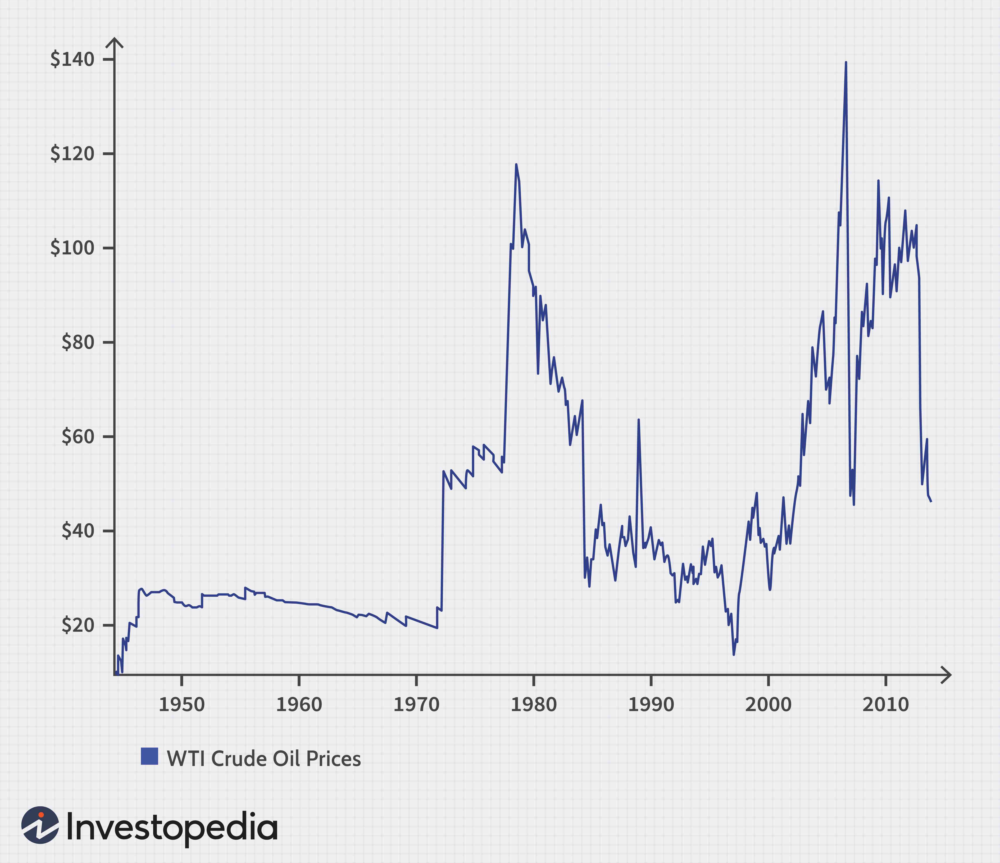

In today's dynamic financial landscape, the intertwining of finance, trading multiples, oil and gas valuation, and algorithmic trading presents substantial growth opportunities for investors and analysts. The oil and gas sector is a cornerstone of the global economy, necessitating precise financial metrics for accurate company performance assessments. Valuation in this sector typically involves the use of specific trading multiples that accommodate the industry's intricacies, such as Enterprise Value (EV) metrics which account for both operational capabilities and asset valuations.

Moreover, algorithmic trading, commonly referred to as algo trading, is a continuing force of transformation within the financial industry. It utilizes technology to execute trades at speeds and scales beyond human capabilities, relying on algorithms that integrate complex mathematical models and real-time data analysis. The oil and gas market, known for its volatility and constant evolution, benefits significantly from the precision and agility provided by algorithmic trading systems. These systems not only enhance efficiency in decision-making but also help mitigate risks inherent in commodity markets.



This article explores the confluence of these financial elements, providing insights into the methodologies that guide investment strategies specifically tailored for the oil and gas sector. For investors and stakeholders, a firm grasp of these concepts is critical. The sector's volatile nature and the complexity of its market dynamics necessitate a comprehensive understanding of how financial metrics and advanced trading technologies can be leveraged for strategic investing. As the financial market continues to evolve, integrating these tools effectively promises robust investment outcomes and sustainable growth trajectories.

## Table of Contents

## Understanding Trading Multiples in Oil and Gas Valuation

Trading multiples in the oil and gas industry are essential metrics that shed light on a company's market standing and financial condition. These metrics allow industry analysts to evaluate and compare different companies effectively, considering the sector's unique operational and financial characteristics. The most commonly employed trading multiples in this sector are Enterprise Value to Earnings Before Interest, Taxes, Depreciation, and Amortization (EV/EBITDA), Enterprise Value to Barrels of Oil Equivalent Per Day (EV/BOEPD), and Enterprise Value to Proven and Probable Reserves (EV/2P).

**EV/EBITDA** is a critical metric for gauging a company’s earnings performance. It offers a direct comparison by measuring a company's enterprise value relative to its operating earnings, excluding non-cash items. This is particularly useful for assessing companies on an operational basis, independent of their capital structure, tax rates, and non-cash accounting charges. The formula for EV/EBITDA is:

$$
\text{EV/EBITDA} = \frac{\text{Enterprise Value}}{\text{EBITDA}}
$$

where **Enterprise Value (EV)** is the sum of market capitalization, debt, and minority interest, minus cash and cash equivalents.

**EV/BOEPD** helps analysts evaluate production efficiency and the potential future revenue obtained from ongoing operations. By relating a company’s enterprise value to its daily oil equivalent production, this metric provides insight into how efficiently a company converts its assets into cash flow. Analysts can use EV/BOEPD to compare companies based on their operational productivity.

**EV/2P** simplifies the comparison of a company's market value with its proven and probable reserves, thereby reflecting its potential growth and reserve sustainability. This metric is crucial for understanding a company's long-term production capabilities and its capacity to replenish and sustain its resource base over time. The formula for EV/2P is:

$$
\text{EV/2P} = \frac{\text{Enterprise Value}}{\text{Proven and Probable Reserves}}
$$

Each of these metrics plays a pivotal role in understanding not only a company's current market position but also its future prospects in terms of growth and sustainability. A comprehensive grasp of these trading multiples empowers analysts and investors to better forecast market trends and pinpoint attractive investment opportunities in the oil and gas sector. By expanding the understanding of these metrics, stakeholders can enhance their capability to navigate the complexities of a volatile market and optimize their investment strategies accordingly.

## The Role of Algorithmic Trading in Financial Markets

Algorithmic trading represents a paradigm shift in how financial transactions are executed, leveraging automated and pre-programmed instructions to perform trades at velocities and frequencies unattainable by human traders. This automation is particularly advantageous in sectors characterized by [volatility](/wiki/volatility-trading-strategies), such as oil and gas, where rapid market movements require swift decision-making to capitalize on opportunities or mitigate risks.

Key to the effectiveness of [algorithmic trading](/wiki/algorithmic-trading) is its reliance on complex mathematical models that process both historical and real-time data. These models employ sophisticated algorithms to identify patterns, trends, and anomalies that might signal a trading opportunity. For example, using statistical [arbitrage](/wiki/arbitrage) models, algorithms can exploit small price inefficiencies across different markets or financial instruments. In Python, frameworks such as pandas and NumPy are frequently utilized to handle vast datasets efficiently, applying advanced statistical methods to distill actionable insights.

```python
import pandas as pd
import numpy as np

# Example of calculating moving averages as a simple trading signal
def calculate_moving_average(data, window_size):
    return data.rolling(window=window_size).mean()

# Load historical oil prices
oil_prices = pd.DataFrame({
    'Date': pd.date_range(start='1/1/2020', periods=100),
    'Price': np.random.random(100) * 100
})

# Calculate 20-day and 50-day moving averages
oil_prices['20_MA'] = calculate_moving_average(oil_prices['Price'], 20)
oil_prices['50_MA'] = calculate_moving_average(oil_prices['Price'], 50)

# Example trading rule: Buy when 20-day MA crosses above 50-day MA
buy_signals = (oil_prices['20_MA'] > oil_prices['50_MA']) & (oil_prices['20_MA'].shift(1) <= oil_prices['50_MA'].shift(1))
```

The incorporation of such algorithms in oil and gas investments allows for enhanced accuracy in predictions and a reduction of risks intrinsic to highly volatile commodity markets. By assimilating a broad range of financial indicators, algorithms make instantaneous decisions, pivotal for managing portfolios effectively and ensuring optimized performance.

Moreover, as oil prices and market conditions fluctuate due to geopolitical tensions, supply chain disruptions, or demand shifts, algorithmic trading stands as a crucial tool to maintain a competitive edge. Its ability to execute and settle trades swiftly empowers investors to respond expeditiously to market dynamics, aligning investment strategies with real-time market conditions.

This agile adaptation to market shifts stems from algo trading's reliance on high-frequency trading ([HFT](/wiki/high-frequency-trading-strategies)) techniques, which necessitate minimal latency in execution. While the computational power required is significant, the returns in terms of precision and speed provide a decisive advantage in volatile sectors such as oil and gas.

In conclusion, the effectiveness of algorithmic trading in financial markets, particularly within the oil and gas industry, lies in its capacity to utilize data-driven strategies to navigate complex market landscapes efficiently. As the industry evolves, integrating advanced algorithmic solutions remains imperative for investors seeking optimal results in a challenging economic environment.

## Key Valuation Metrics Explained

EV/EBITDA (Enterprise Value to Earnings Before Interest, Taxes, Depreciation, and Amortization) is a commonly employed multiple in financial analysis, serving as a key indicator of a company's enterprise value relative to its operational profitability. This metric is particularly useful in comparing the capital structures of companies within the oil and gas sector, as it eliminates the effects of accounting decisions related to non-cash items such as depreciation and amortization. The formula for calculating EV/EBITDA is:

$$

\text{EV/EBITDA} = \frac{\text{Enterprise Value (EV)}}{\text{EBITDA}}
$$

Where Enterprise Value is calculated as the market capitalization plus total debt, minus cash and cash equivalents.

Another critical metric used is EV/Barrels of Oil Equivalent Per Day (BOE/D), which assesses production efficiency by measuring how much a company is valued per unit of production. This metric provides insights into the potential revenue generation from current operations and is expressed as:

$$

\text{EV/BOE/D} = \frac{\text{Enterprise Value (EV)}}{\text{Barrels of Oil Equivalent Per Day (BOE/D)}}
$$

This ratio helps investors understand how efficiently a company can convert its production capacity into revenue, offering insight into operational scalability and viability.

EV/2P, or Enterprise Value to Proven and Probable Reserves, simplifies the comparison between a company's market value and its proven and probable reserves. Reserves are categorized into "proven and probable" to reflect not just existing resources but also those with a higher likelihood of economic extraction. This metric is fundamental in gauging a company's ability to sustain growth over the long term. It is calculated as follows:

$$

\text{EV/2P} = \frac{\text{Enterprise Value (EV)}}{\text{Proven and Probable Reserves (2P)}}
$$

Analyzing these metrics offers a comprehensive view of a company's financial health, facilitating an assessment of its operational efficiency, resource management, and market positioning. Each metric provides unique insights that assist investors in evaluating stability and potential for future earnings in the oil and gas industry. The use of these multiples is crucial for crafting informed investment strategies within a highly volatile market environment, helping investors mitigate risk and optimize returns.

## The Interplay Between Commodity Prices and Financial Valuation

Commodity prices are a critical [factor](/wiki/factor-investing) that affect the financial valuation of oil and gas companies due to their direct impact on cash flow and profitability. These prices influence key trading multiples such as EV/EBITDA (Enterprise Value/Earnings Before Interest, Taxes, Depreciation, and Amortization), which are pivotal for determining a company's market position.

When commodity prices are high, oil and gas companies typically experience enhanced valuations due to increased revenue streams. This upward movement is particularly evident in the EV/EBITDA multiple, which reflects higher earnings potential relative to the enterprise value. Conversely, when commodity prices fall, companies face financial challenges such as reduced revenues and potentially lower profitability, which can adversely affect their valuations.

To effectively navigate these fluctuations, investors must understand the intricate relationship between commodity price trends and valuation metrics. This understanding allows for the anticipation of market directions and proactive adjustment of investment strategies. For instance, during periods of falling prices, investors may look to companies with strong balance sheets and efficient cost structures that can withstand market pressures.

The capital-intensive nature of the oil and gas industry means that any significant change in commodity prices can have broad implications for company operations. These changes can impact funding capabilities and growth opportunities, including exploration and production activities. Therefore, strategic planning that incorporates economic indicators such as commodity price forecasts and trends is crucial for capitalizing on investment potential in the sector.

In summary, a comprehensive understanding of how commodity prices interplay with financial valuation metrics is essential for making informed investment decisions in the oil and gas industry. Investors who analyze these dynamics effectively can better position themselves for favorable outcomes in this volatile market environment.

## Conclusion

The integration of financial trading multiples, oil and gas valuation, and algorithmic trading provides a multifaceted strategy for managing the complexities inherent in the financial market. This approach enhances the accuracy and efficiency of investment decisions, particularly in a sector characterized by significant volatility and intricate dynamics. By adopting advanced valuation techniques alongside algorithmic models, investors can refine their decision-making processes, allowing them to swiftly react to market shifts and leverage opportunities for growth.

Algorithmic trading, with its ability to process vast quantities of data in real-time, complements valuation methodologies, such as EV/EBITDA and EV/Barrels of Oil Equivalent Per Day, by offering predictive insights and optimizing trading strategies. This synthesis of technology and finance enables market participants to mitigate risks and capitalize on market trends that might otherwise go unnoticed.

The need to remain informed about emerging tools and techniques is vital for investors aiming to achieve desirable outcomes. As the financial landscape continues to evolve, adaptability in utilizing these methodologies will be a determinant of success, facilitating investment strategies that are both innovative and resilient.

Furthermore, ongoing research and understanding of these integrated approaches will not only contribute to growth within the oil and gas industry but also ensure that investment strategies remain robust amidst uncertain economic conditions. By embracing these complexities, investors can drive sustainable growth and maintain a competitive edge in a rapidly changing market environment.

## References & Further Reading

[1]: Damodaran, A. (2012). ["Investment Valuation: Tools and Techniques for Determining the Value of Any Asset."](https://books.google.com/books/about/Investment_Valuation.html?id=5SRHAAAAQBAJ) John Wiley & Sons.

[2]: Fabozzi, F. J., & Markowitz, H. M. (2011). ["Equity Valuation and Portfolio Management"](https://onlinelibrary.wiley.com/doi/book/10.1002/9781118267028) John Wiley & Sons.

[3]: Aldridge, I. (2009). ["High-Frequency Trading: A Practical Guide to Algorithmic Strategies and Trading Systems."](https://www.amazon.com/High-Frequency-Trading-Practical-Algorithmic-Strategies/dp/1118343506) John Wiley & Sons.

[4]: Pirrong, C. (2009). ["Commodity Price Dynamics: A Structural Approach."](https://api.pageplace.de/preview/DT0400.9781139180337_A23866725/preview-9781139180337_A23866725.pdf) Cambridge University Press.

[5]: Narang, R. K. (2009). ["Inside the Black Box: A Simple Guide to Quantitative and High-Frequency Trading."](https://onlinelibrary.wiley.com/doi/book/10.1002/9781118267738) John Wiley & Sons.